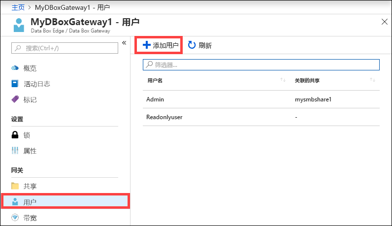
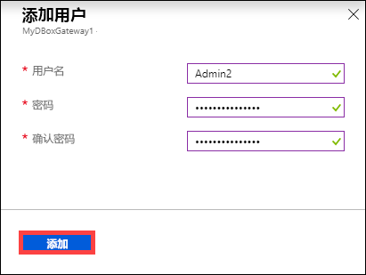
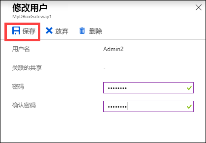
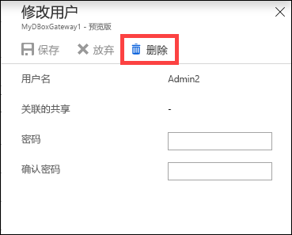
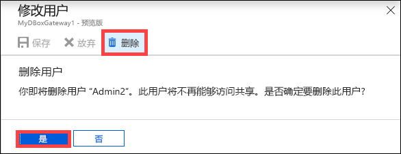
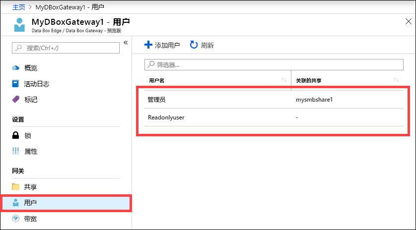

# 使用 Azure 门户管理 Azure Data Box Gateway 上的用户

本文介绍如何在 Azure Data Box Gateway 中管理用户。 可以通过 Azure 门户或本地 Web UI 管理 Azure Data Box Gateway。 使用 Azure 门户来添加、修改或删除用户。 

在本文中，学习如何：

> [!div class="checklist"]
> * 添加用户
> * 修改用户
> * 删除用户

## 关于用户

用户可以是只读的，也可以是全权的。 顾名思义，只读用户只能查看共享数据。 全权用户可以读取共享数据、向这些共享写入数据，以及修改或删除共享数据。

 - **全权用户** - 拥有完全访问权限的本地用户。
 - **只读用户** - 拥有只读访问权限的本地用户。 这些用户与允许只读操作的共享相关联。

在创建共享期间创建用户时，首先会定义用户权限。 当前不支持修改共享级权限。

## 添加用户

在 Azure 门户中执行以下步骤可以添加用户。

1. 在 Azure 门户中，转到自己的 Data Box Gateway 资源，然后导航到“概述”。**** 单击命令栏上的“+ 添加用户”****。

    

2. 指定要添加的用户的用户名和密码。 确认密码，然后单击“添加”。****

    

    > [!IMPORTANT] 
    > 以下用户由系统保留，不应使用：Administrator、EdgeUser、EdgeSupport、HcsSetupUser、WDAGUtilityAccount、CLIUSR、DefaultAccount、Guest。  

3. 用户创建过程开始和完成后，你会收到通知。 创建用户后，在命令栏中单击“刷新”可查看更新的用户列表。****

## 修改用户

创建用户后，可以更改与该用户关联的密码。 在用户列表中选择并单击该用户。 提供并确认新密码。 保存更改。
 

## 删除用户

在 Azure 门户中执行以下步骤可以删除用户。

1. 在用户列表中选择并单击该用户，然后单击“删除”。****  

   

2. 出现提示时，确认删除。 

   

用户列表将会更新，以反映该用户已删除。

## 后续步骤

- 了解如何[管理带宽](data-box-gateway-manage-bandwidth-schedules.md)。
