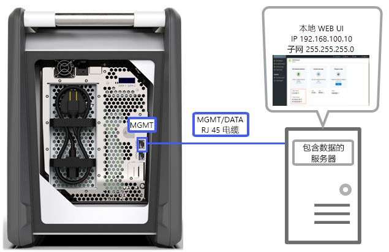
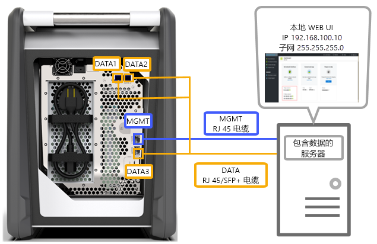
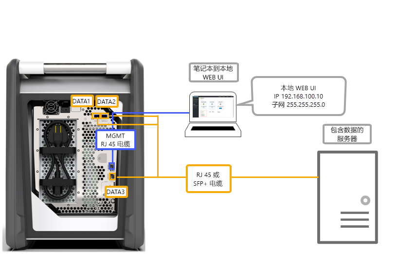
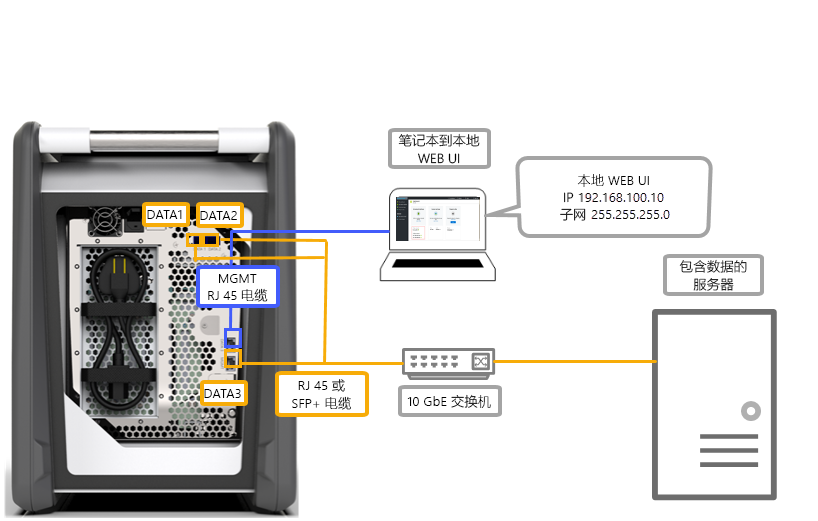
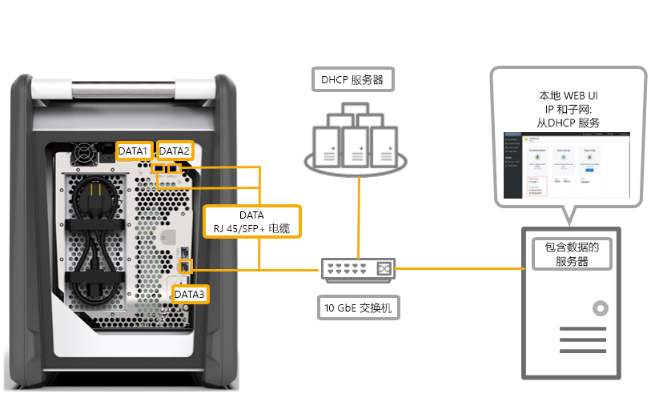

# Azure Data Box 的布线选项

本文介绍用于数据传输的 Azure Data Box 布线的各种方式。

## 通过 MGMT 端口进行传输

此选项是 Data Box 的绝对最低配置。 只能配置用于管理和数据的 MGMT 端口。

在开始之前，请确保：

- 用于 MGMT 的 RJ45 以太网电缆。
- 运行[支持的 OS](data-box-system-requirements.md#supported-operating-systems-for-clients) 的数据源。

若要为设备布线，请执行以下步骤。

1. 使用 RJ45 电缆将 MGMT 端口连接到存储数据的服务器。

    

2. 在服务器上，请完成以下设置：

    - 将“IP 地址”设置为 192.168.100.5
    - 将“子网”设置为 255.255.255.0

3. 通过 192.168.100.10 访问设备的本地 Web UI。 在 Azure 门户中使用解锁密码登录并解锁 Data Box。

## 使用静态 IP 通过 DATA 端口进行传输

可以为 Data Box 配置两个端口：一个用于管理流量的 MGMT 端口，一个用于数据的数据端口。 数据端口可以是 DATA 1、DATA 2 或 DATA 3。

如果只配置一个数据端口，强烈建议使用 10-GbE 端口，例如 DATA 1 或 DATA 2。 1-GbE 端口会显著增加数据传输的时间。

在开始之前，请确保：

- 用于 MGMT 的 RJ45 以太网电缆。
- 对于每个要连接的 10-GbE 数据端口，请使用 10-GbE SFP+ 双绞线铜缆。
- 一个或多个运行[支持的 OS](data-box-system-requirements.md#supported-operating-systems-for-clients) 的数据源。

### 选项 1 - 通过服务器进行的初始设置

若要为设备布线，请执行以下步骤。

1. 使用从服务器直接连接到 MGMT 端口的 RJ45 以太网电缆进行配置。
2. 使用用于 DATA 3 的 RJ45 或 SFP+ 电缆将 DATA 1 或 DATA 2 连接到充当数据源的服务器。 建议使用 10-GbE DATA 1 或 DATA 2 端口以确保良好的性能。
3. 在服务器上，请完成以下设置：

    - 将“IP 地址”设置为 192.168.100.5
    - 将“子网”设置为 255.255.255.0

    

3. 通过 192.168.100.10 访问设备的本地 Web UI。 在 Azure 门户中使用解锁密码登录并解锁 Data Box。
4. 为已配置的数据端口分配静态 IP。

### 选项 2 - 通过单独的计算机进行的初始设置

若要为设备布线，请执行以下步骤。

1. 使用从服务器直接连接到 MGMT 端口的 RJ45 以太网电缆进行配置。
2. 使用用于 DATA 3 的 RJ45 或 SFP+ 电缆将 DATA 1 或 DATA 2 连接到服务器。 建议使用 10-GbE DATA 1 或 DATA 2 端口以确保良好的性能。 数据端口通过 10-GbE 交换机连接到包含数据的服务器。
3. 配置所用笔记本的以太网适配器，以便通过以下设置连接到设备：

    - **IP 地址** 192.168.100.5
    - **子网** 255.255.255.0。

    

3. 通过 192.168.100.10 访问设备的本地 Web UI。 在 Azure 门户中使用解锁密码登录并解锁 Data Box。
4. 标识 DHCP 服务器分配的 IP 地址。

## 使用交换机和静态 IP 通过 DATA 端口进行传输 

请将此配置用于跨 1 GbE 和 10 GbE 网络的多个数据源。

在开始之前，请确保：

- 用于 MGMT 的 RJ45 以太网电缆。
- 对于每个要连接的 10-GbE 数据端口，请使用 10-GbE SFP+ 双绞线铜缆。
- 一个或多个运行[支持的 OS](data-box-system-requirements.md#supported-operating-systems-for-clients) 的数据源。 这些数据源可以位于不同的网络（例如 1 GbE 或 10-GbE 网络）中。

若要为设备布线，请执行以下步骤。

1. 使用从服务器直接连接到 MGMT 端口的 RJ45 以太网电缆进行配置。
2. 使用用于 DATA 3 的 RJ45 或 SFP+ 电缆将 DATA 1 或 DATA 2 连接到服务器。 建议使用 10-GbE DATA 1 或 DATA 2 端口以确保良好的性能。
3. 配置所用笔记本的以太网适配器，以便通过以下设置连接到设备：

    - **IP 地址** 192.168.100.5
    - **子网** 255.255.255.0。

    

3. 通过 192.168.100.10 访问设备的本地 Web UI。 在 Azure 门户中使用解锁密码登录并解锁 Data Box。
4. 为已配置的数据端口分配静态 IP。

## 在 DHCP 环境中通过 DATA 端口进行传输

如果设备位于 DHCP 环境中，请使用此配置。

在开始之前，请确保：

- 如果希望连接 DATA 1，则必须有 RJ45 电缆。
- 对于每个要连接的 10-GbE 数据端口，请使用 10-GbE SFP+ 双绞线铜缆。
- 一个或多个运行[支持的 OS](data-box-system-requirements.md#supported-operating-systems-for-clients) 的数据源。 这些数据源可以位于不同的网络（例如 1 GbE 或 10-GbE 网络）中。

若要为设备布线，请执行以下步骤。

1. 使用 RJ45 或 SFP+ 电缆通过交换机（其中的 DHCP 服务器可供访问）连接到服务器。

    
2. 使用 DHCP 服务器或 DNS 服务器标识 IP 地址。
3. 在同一网络的服务器中，使用 DHCP 服务器分配的 IP 地址访问设备的本地 Web UI。 在 Azure 门户中使用解锁密码登录并解锁 Data Box。

## 后续步骤

- 完成设备布线以后，请访问[将数据复制到 Azure Data Box](data-box-deploy-copy-data.md)。
