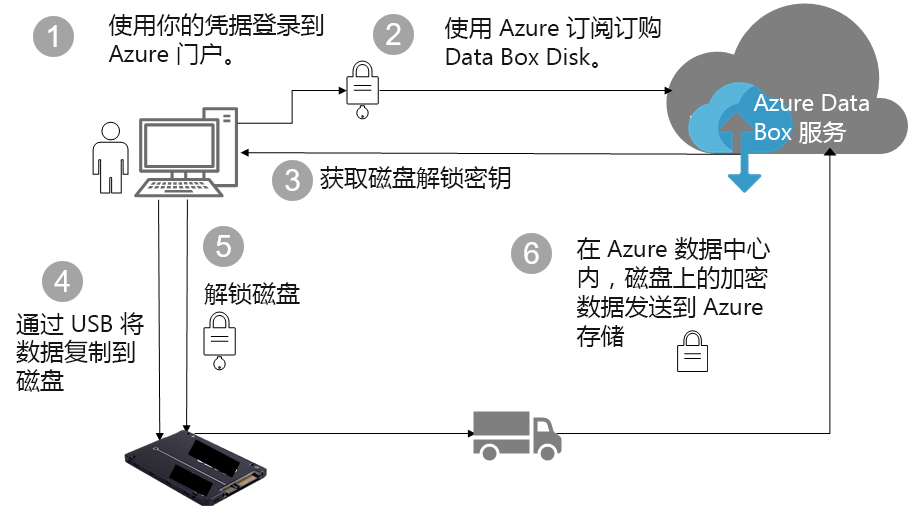

# Azure Data Box 磁盘安全性和数据保护（预览版）

本文介绍帮助保护每个 Data Box 解决方案组件及其存储的数据的 Azure Data Box 磁盘安全功能。 

> [!IMPORTANT]
> Data Box 磁盘以预览版提供。 在部署此解决方案之前，请查看 [Azure 预览版服务的条款](https://azure.microsoft.com/support/legal/preview-supplemental-terms/)。

## 通过组件运行的数据流

Microsoft Azure Data Box 解决方案由四个彼此交互的主要组件构成：

- **Azure 中托管的 Azure Data Box 服务** – 用于创建磁盘订单、配置磁盘，然后跟踪订单完成状态的管理服务。
- **Data Box 磁盘** – 寄送给你的，用于将本地数据导入 Azure 的物理磁盘。 
- **连接到磁盘的客户端/主机** – 基础结构中的客户端，它们通过 USB 连接到 Data Box 磁盘，并包含需要保护的数据。
- **云存储** – Azure 云中存储数据的位置。 这通常是链接到所创建的 Azure Data Box 资源的存储帐户。

下图指示了通过 Azure Data Box 磁盘解决方案运行的从本地到 Azure 的数据流。

## 安全功能

Data Box 磁盘确保只有经过授权的实体能够查看、修改或删除你的数据，为数据保护提供安全的解决方案。 此解决方案的安全功能适用于该磁盘，以及用于确保磁盘中存储的数据安全性的关联服务。 

### Data Box 磁盘保护

Data Box 磁盘受以下功能的保护：

- 始终对磁盘进行 BitLocker AES-128 位加密。
- 磁盘安全更新功能。
- 寄送的磁盘处于锁定状态，只能通过 Data Box 磁盘解锁工具解锁。 Data Box 磁盘服务门户中提供了解锁工具。

### Data Box 磁盘数据保护

流入和流出 Data Box 磁盘的数据受以下功能的保护：

- 始终对数据进行 BitLocker 加密。 
- 将数据上传到 Azure 后，从磁盘中安全擦除数据。 数据擦除根据 NIST 800-88r1 标准进行。

### Data Box 服务保护

Data Box 服务受以下功能的保护。

- 访问 Data Box 磁盘服务要求组织具备包含 Data Box 磁盘在内的 Azure 订阅。 订阅决定可以在 Azure 门户中访问的功能。
- 由于 Data Box 服务在 Azure 中托管，因此受 Azure 安全功能的保护。 有关 Microsoft Azure 提供的安全功能的详细信息，请转到 [Microsoft Azure 信任中心](https://www.microsoft.com/TrustCenter/Security/default.aspx)。 
- Data Box 磁盘在服务中存储用于解锁磁盘的磁盘支持密钥。 
- Data box 磁盘服务在服务中存储订单详细信息和状态。 删除订单会删除这些信息。 

## 管理个人数据

[!INCLUDE [GDPR-related guidance](../../includes/gdpr-intro-sentence.md)]

Azure Data Box 磁盘在服务中收集并显示以下关键实例中的个人信息：

- **通知设置** - 创建订单时，需在通知设置下配置用户的电子邮件地址。 此信息可由管理员查看。 当作业进入终止状态或者删除订单时，服务会删除此信息。

- **订单详细信息** – 创建订单后，用户的寄送地址、电子邮件和联系信息将存储在 Azure 门户中。 保存的信息包括：

    - 联系人姓名
    - 电话号码
    - 电子邮件
    - 街道地址
    - 城市
    - 邮政编码
    - 省/直辖市/自治区
    - 国家/地区/省/区域
    - 驱动器 ID
    - 承运商帐号
    - 运输跟踪号

    作业完成或者删除订单时，Data Box 服务会删除订单详细信息。

- **寄送地址** – 下单后，Data Box 服务会向 UPS 或 DHL 等第三方承运人提供寄送地址。 

有关详细信息，请在[信任中心](https://www.microsoft.com/trustcenter)查看 Microsoft 隐私策略。

## 后续步骤

- 查看 [Data Box 磁盘要求](data-box-disk-system-requirements.md)。
- 了解 [Data Box 磁盘限制](data-box-disk-limits.md)。
- 在 Azure 门户中快速部署 [Azure Data Box 磁盘](data-box-disk-quickstart-portal.md)。
