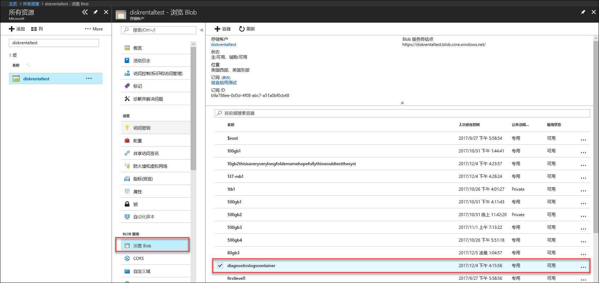
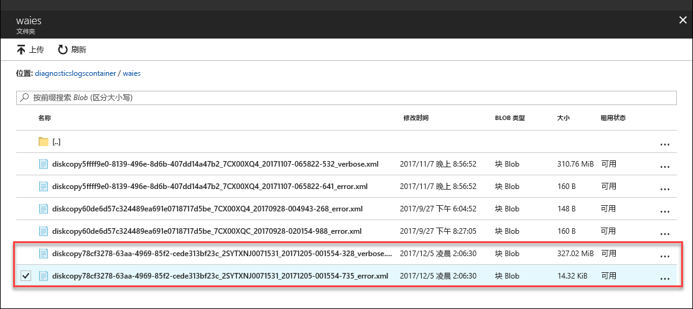

# 排查 Azure Data Box 磁盘（预览版）中的问题

本文适用于运行预览版的 Microsoft Azure Data Box。 本文介绍了可对 Data Box 和 Data Box 磁盘执行的一些复杂工作流与管理任务。 

可以通过 Azure 门户管理 Data Box 磁盘。 本文重点介绍可以使用 Azure 门户执行的任务。 使用 Azure 门户可以管理订单、管理设备，以及跟踪订单在从头到尾的处理过程中的状态。

本文包括以下教程：

- 下载诊断日志
- 查询活动日志

> [!IMPORTANT]
> Data Box 以预览版提供。 在部署此解决方案之前，请查看 [Azure 预览版服务的条款](https://azure.microsoft.com/support/legal/preview-supplemental-terms/)。

## 下载诊断日志

如果在复制数据的过程中出现任何错误，门户会显示诊断日志所在的文件夹的路径。 

诊断日志可以是：
- 错误日志
- 详细日志  

若要导航到复制日志的路径，请转到与 Data Box 订单关联的存储帐户。 

1.  转到“常规”>“订单详细信息”，记下与订单关联的存储帐户。
 

2.  转到“所有资源”，搜索在上一步骤中识别的存储帐户。 选择并单击该存储帐户。

    

3.  转到“Blob 服务”>“浏览 Blob”，查找对应于该存储帐户的 Blob。 转到“diagnosticslogcontainer”>“waies”。 

    

    应会看到数据复制活动的错误日志和详细日志。 选择并单击每个文件，然后下载本地副本。

## 查询活动日志

使用活动日志可在故障排除时查找错误，或者监视组织内用户对资源的修改。 通过活动日志，可以确定：

- 对订阅中的资源执行了什么操作。
- 谁启动了该操作。 
- 操作何时发生。
- 操作状态。
- 其他可能有助于调查操作的属性值。

活动日志包含针对资源执行的所有写入操作（例如 PUT、POST、DELETE），但不包含读取操作（例如 GET）。 

活动日志将保留 90 天。 可以查询任何日期范围，只要开始日期不早于过去 90 天。 此外，还可以根据 Insights 中的某个内置查询进行筛选。 例如，单击某个错误，然后选择并单击特定的失败以了解根本原因。

## Data Box 磁盘解锁工具错误

| 错误消息/工具行为      | 建议                                                                                               |
|-------------------------------------------------------------------------------------------------------------------------------------|------------------------------------------------------------------------------------------------------|
| 无  Data Box 磁盘解锁工具崩溃。                                                                            | 未安装 Bitlocker。 确保运行 Data Box 磁盘解锁工具的主机上已安装 BitLocker。                                                                            |
| 当前的 .NET Framework 不受支持。 支持的版本为 4.5 和以上。  工具退出并显示一条消息。  | 未安装 .NET 4.5。 在运行 Data Box 磁盘解锁工具的主机上安装 .NET 4.5 或更高版本。                                                                            |
| 无法解锁或验证任何卷。 请联系 Microsoft 支持。    工具无法解锁或验证任何已锁定的驱动器。 | 工具无法解锁任何已使用提供的支持密钥锁定的驱动器。 联系 Microsoft 支持部门了解后续步骤。                                                |
| 已解锁并验证以下卷。  卷驱动器号: E: 无法使用以下支持密钥解锁任何卷: werwerqomnf、qwerwerqwdfda   工具解锁了一些驱动器，并列出了成功和失败的驱动器号。| 部分成功。 使用提供的支持密钥无法解锁某些驱动器。 联系 Microsoft 支持部门了解后续步骤。 |
| 找不到锁定的卷。 验证从 Microsoft 收到的磁盘是否已正确连接并处于锁定状态。          | 工具找不到任何已锁定的驱动器。 驱动器已解锁，或检测不到。 确保驱动器已连接并已锁定。                                                           |
| 严重错误: 参数无效 参数名称: invalid_arg 用法: DataBoxDiskUnlock /PassKeys:<passkey_list_separated_by_semicolon>  示例: DataBoxDiskUnlock /PassKeys:passkey1;passkey2;passkey3 示例: DataBoxDiskUnlock /SystemCheck 示例: DataBoxDiskUnlock /Help  /PassKeys:       从 Azure DataBox 磁盘订单中获取此支持密钥。 该支持密钥用于解锁磁盘。 /Help:           此选项提供有关 cmdlet 用法和示例的帮助。 /SystemCheck:    此选项检查你的系统是否满足运行该工具的要求。  按任意键退出。 | 输入了无效的参数。 只允许参数 /SystemCheck、/PassKey 和 /Help。                                                                            |
## 后续步骤

- 了解如何[通过 Azure 门户管理 Data Box 磁盘](data-box-portal-ui-admin.md)。
