# <a name="use-the-local-web-ui-to-administer-your-data-box"></a>使用本地 Web UI 管理 Data Box

本文介绍可在 Data Box 上执行的一些配置和管理任务。 可以通过 Azure 门户 UI 和设备的本地 Web UI 管理 Data Box。 本文重点介绍可使用本地 Web UI 执行的任务。

Data Box 的本地 Web UI 用于设备的初始配置。 还可以使用本地 Web UI 关闭或重启 Data Box、运行诊断测试、更新软件、查看副本日志以及生成供 Microsoft 支持部门使用的日志包。

本文包括以下教程：

- 生成支持包
- 关闭或重启设备
- 查看设备的可用容量
- 跳过校验和验证 

## <a name="generate-support-package"></a>生成支持包

如果遇到任何设备问题，可通过系统日志创建支持包。 Microsoft 支持部门使用此包来解决此问题。 要生成支持包，请执行以下步骤：

1. 在本地 Web UI 中，转到“联系支持部门”并单击“创建支持包”。

    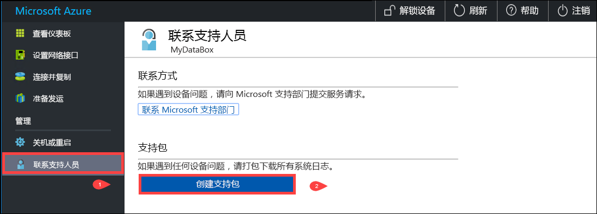

2. 将收集到一个支持包。 此操作需要几分钟才能完成。

    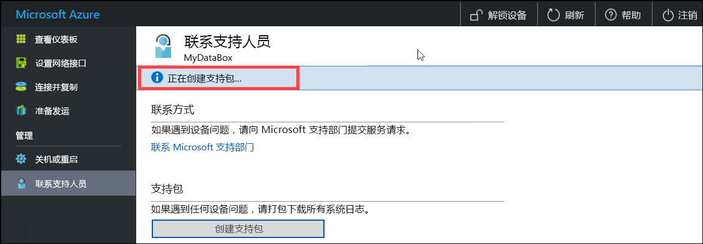

3. 支持包创建完成后，单击“下载支持包”。 

    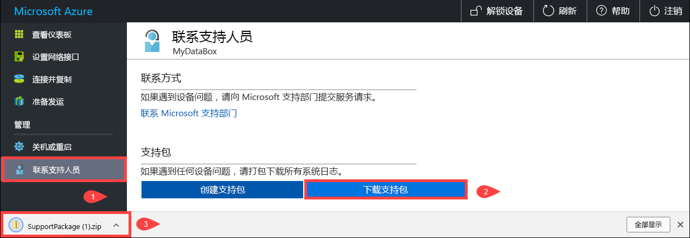

4. 浏览并选择下载位置。 打开文件夹以查看内容。

    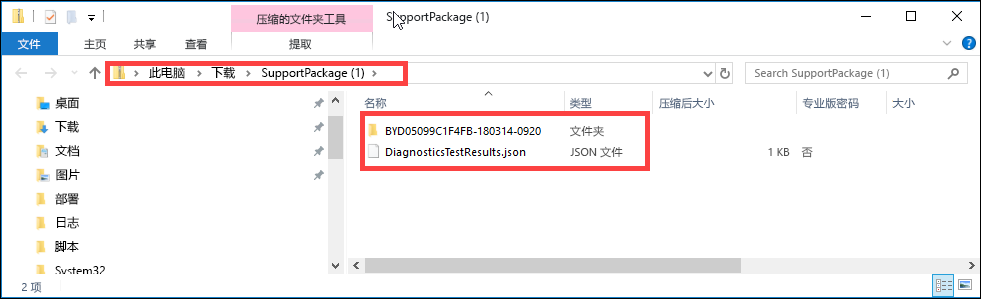


## <a name="shut-down-or-restart-your-device"></a>关闭或重启设备

可使用本地 Web UI 关闭或重启 Data Box。 在重启之前，建议使共享依次在主机和设备上脱机。 这能在最大程度上减少发生数据损坏的可能性。 关闭设备时，请确保当前未执行数据复制。

要关闭 Data Box，请执行以下步骤。

1. 在本地 Web UI 中，转到“关闭或重启”。
2. 单击“关闭”。

    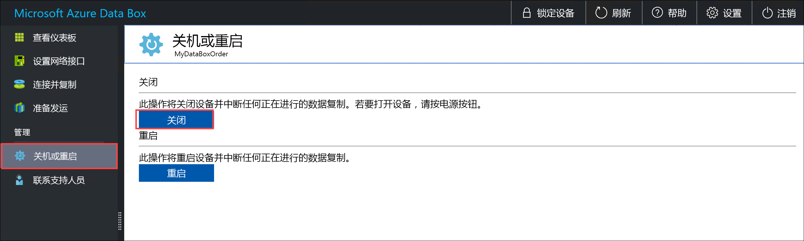

3. 出现确认提示时，单击“确定”以继续。

    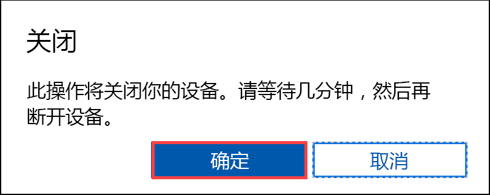

关闭设备后，使用前面板上的电源按钮打开设备。

要重启 Data Box，请执行以下步骤。

1. 在本地 Web UI 中，转到“关闭或重启”。
2. 请单击“重启”。

    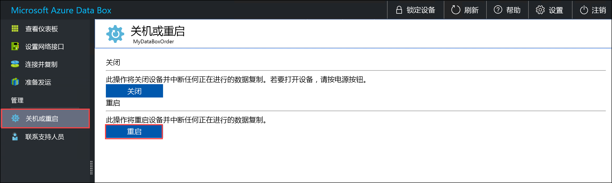

3. 出现确认提示时，单击“确定”以继续。

   设备将关闭并重启。

## <a name="download-bom-or-manifest-files"></a>下载 BOM 或清单文件

物料清单 (BOM) 或清单文件包含要复制到 Data Box 的文件列表。 这些文件是在准备要寄送的 Data Box 时生成的。

在开始之前，请确保 Data Box 已完成“准备寄送”步骤。 遵循以下步骤下载 BOM 或清单文件：

1. 转到 Data Box 的本地 Web UI。 可以看到，Data Box 已完成“准备寄送”步骤。 设备准备完成后，设备状态将显示为“已准备好寄送”。

    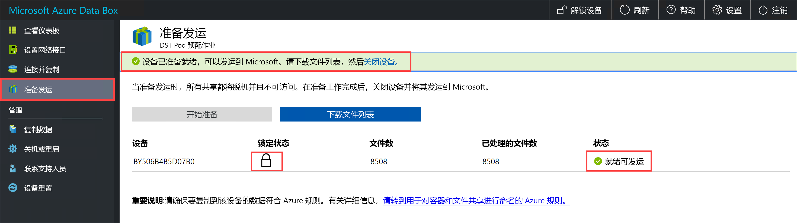

2. 单击“下载文件列表”，以下载在 Data Box 上复制的文件列表。

    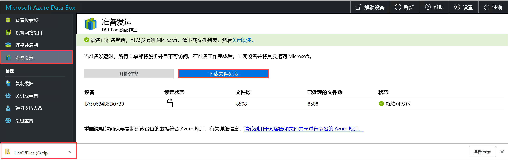

3. 在文件资源管理器中可以看到，已根据用于连接到设备的协议和使用的 Azure 存储类型，生成了单独的文件列表。

    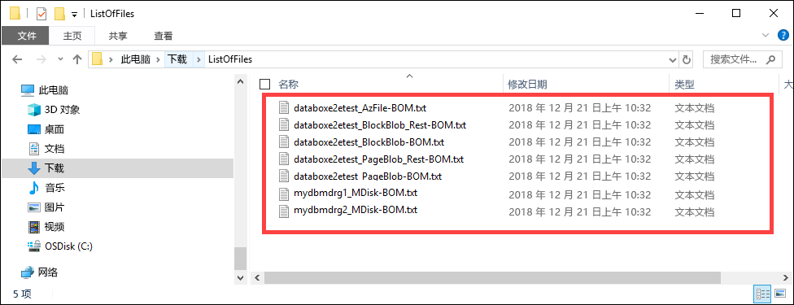

   下表将文件名映射到 Azure 存储类型和使用的连接协议。

    |文件名  |Azure 存储类型  |使用的连接协议 |
    |---------|---------|---------|
    |databoxe2etest_BlockBlob.txt     |块 Blob         |SMB/NFS         |
    |databoxe2etest_PageBlob.txt     |页 Blob         |SMB/NFS         |
    |databoxe2etest_AzFile-BOM.txt    |Azure 文件         |SMB/NFS         |
    |databoxe2etest_PageBlock_Rest-BOM.txt     |页 Blob         |REST        |
    |databoxe2etest_BlockBlock_Rest-BOM.txt    |块 Blob         |REST         |

将 Data Box 寄回到 Azure 数据中心后，使用此列表来验证已上传到 Azure 存储帐户的文件。 示例清单文件如下所示。

```xml
<file size="52689" crc64="0x95a62e3f2095181e">\databox\media\data-box-deploy-copy-data\prepare-to-ship2.png</file>
<file size="22117" crc64="0x9b160c2c43ab6869">\databox\media\data-box-deploy-copy-data\connect-shares-file-explorer2.png</file>
<file size="57159" crc64="0x1caa82004e0053a4">\databox\media\data-box-deploy-copy-data\verify-used-space-dashboard.png</file>
<file size="24777" crc64="0x3e0db0cd1ad438e0">\databox\media\data-box-deploy-copy-data\prepare-to-ship5.png</file>
<file size="162006" crc64="0x9ceacb612ecb59d6">\databox\media\data-box-cable-options\cabling-dhcp-data-only.png</file>
<file size="155066" crc64="0x051a08d36980f5bc">\databox\media\data-box-cable-options\cabling-2-port-setup.png</file>
<file size="150399" crc64="0x66c5894ff328c0b1">\databox\media\data-box-cable-options\cabling-with-switch-static-ip.png</file>
<file size="158082" crc64="0xbd4b4c5103a783ea">\databox\media\data-box-cable-options\cabling-mgmt-only.png</file>
<file size="148456" crc64="0xa461ad24c8e4344a">\databox\media\data-box-cable-options\cabling-with-static-ip.png</file>
<file size="40417" crc64="0x637f59dd10d032b3">\databox\media\data-box-portal-admin\delete-order1.png</file>
<file size="33704" crc64="0x388546569ea9a29f">\databox\media\data-box-portal-admin\clone-order1.png</file>
<file size="5757" crc64="0x9979df75ee9be91e">\databox\media\data-box-safety\japan.png</file>
<file size="998" crc64="0xc10c5a1863c5f88f">\databox\media\data-box-safety\overload_tip_hazard_icon.png</file>
<file size="5870" crc64="0x4aec2377bb16136d">\databox\media\data-box-safety\south-korea.png</file>
<file size="16572" crc64="0x05b13500a1385a87">\databox\media\data-box-safety\taiwan.png</file>
<file size="999" crc64="0x3f3f1c5c596a4920">\databox\media\data-box-safety\warning_icon.png</file>
<file size="1054" crc64="0x24911140d7487311">\databox\media\data-box-safety\read_safety_and_health_information_icon.png</file>
<file size="1258" crc64="0xc00a2d5480f4fcec">\databox\media\data-box-safety\heavy_weight_hazard_icon.png</file>
<file size="1672" crc64="0x4ae5cfa67c0e895a">\databox\media\data-box-safety\no_user_serviceable_parts_icon.png</file>
<file size="3577" crc64="0x99e3d9df341b62eb">\databox\media\data-box-safety\battery_disposal_icon.png</file>
<file size="993" crc64="0x5a1a78a399840a17">\databox\media\data-box-safety\tip_hazard_icon.png</file>
<file size="1028" crc64="0xffe332400278f013">\databox\media\data-box-safety\electrical_shock_hazard_icon.png</file>
<file size="58699" crc64="0x2c411d5202c78a95">\databox\media\data-box-deploy-ordered\data-box-ordered.png</file>
<file size="46816" crc64="0x31e48aa9ca76bd05">\databox\media\data-box-deploy-ordered\search-azure-data-box1.png</file>
<file size="24160" crc64="0x978fc0c6e0c4c16d">\databox\media\data-box-deploy-ordered\select-data-box-option1.png</file>
<file size="115954" crc64="0x0b42449312086227">\databox\media\data-box-disk-deploy-copy-data\data-box-disk-validation-tool-output.png</file>
<file size="6093" crc64="0xadb61d0d7c6d4deb">\databox\data-box-cable-options.md</file>
<file size="6499" crc64="0x080add29add367d9">\databox\data-box-deploy-copy-data-via-nfs.md</file>
<file size="11089" crc64="0xc3ce6b13a4fe3001">\databox\data-box-deploy-copy-data-via-rest.md</file>
<file size="9126" crc64="0x820856b5a54321ad">\databox\data-box-overview.md</file>
<file size="10963" crc64="0x5e9a14f9f4784fd8">\databox\data-box-safety.md</file>
<file size="5941" crc64="0x8631d62fbc038760">\databox\data-box-security.md</file>
<file size="12536" crc64="0x8c8ff93e73d665ec">\databox\data-box-system-requirements-rest.md</file>
<file size="3220" crc64="0x7257a263c434839a">\databox\data-box-system-requirements.md</file>
<file size="2823" crc64="0x63db1ada6fcdc672">\databox\index.yml</file>
<file size="4364" crc64="0x62b5710f58f00b8b">\databox\data-box-local-web-ui-admin.md</file>
<file size="3603" crc64="0x7e34c25d5606693f">\databox\TOC.yml</file>
```

此文件包含已在 Data Box 上复制的所有文件的列表。 在此文件中，*crc64* 值与针对相应文件生成的校验和相关。

## <a name="view-available-capacity-of-the-device"></a>查看设备的可用容量

可使用设备仪表板查看设备的可用和已用容量。 

1. 在本地 web UI 中，转到“查看仪表板”。
2. “连接和复制”下显示设备上的可用和已用空间。

    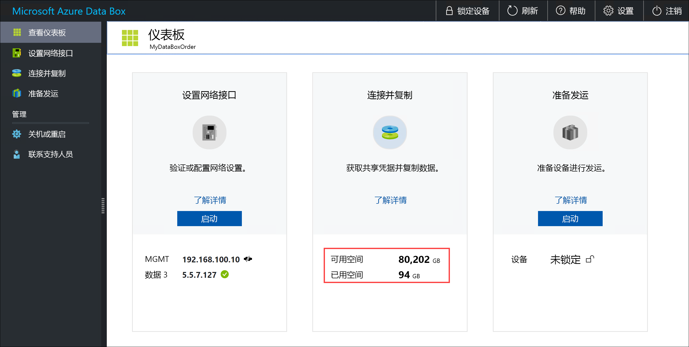


## <a name="skip-checksum-validation"></a>跳过校验和验证

准备寄送时，默认会生成数据的校验和。 在某些罕见的情况下，根据所用的数据类型（小型文件），性能可能较慢。 在这种情况，则可以跳过校验和。 

我们强烈建议仅在性能受到严重影响的情况下禁用校验和。

1. 在设备本地 Web UI 的右上角，转到“设置”。

    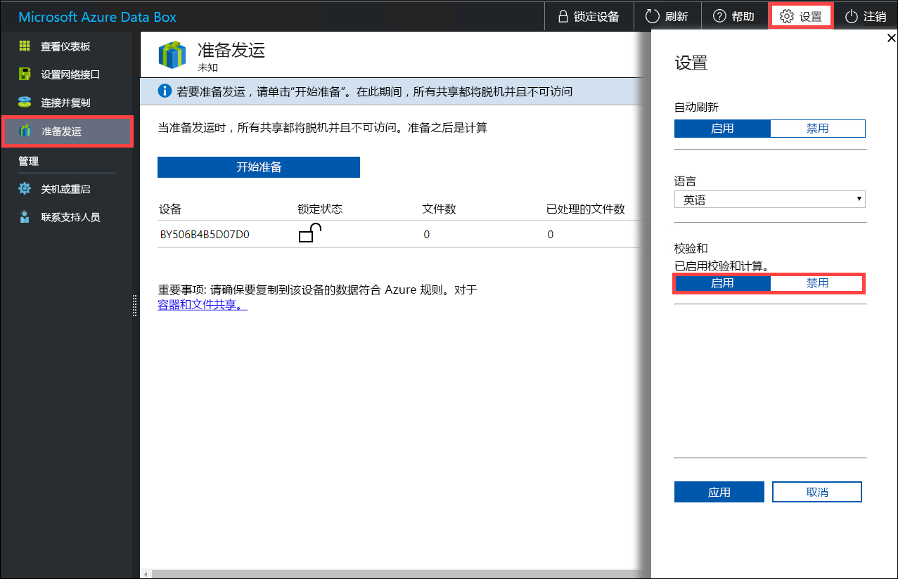

2. 禁用校验和验证
3. 单击“应用”。

## <a name="next-steps"></a>后续步骤

- 了解如何[通过 Azure 门户管理 Data Box](data-box-portal-admin.md)。

