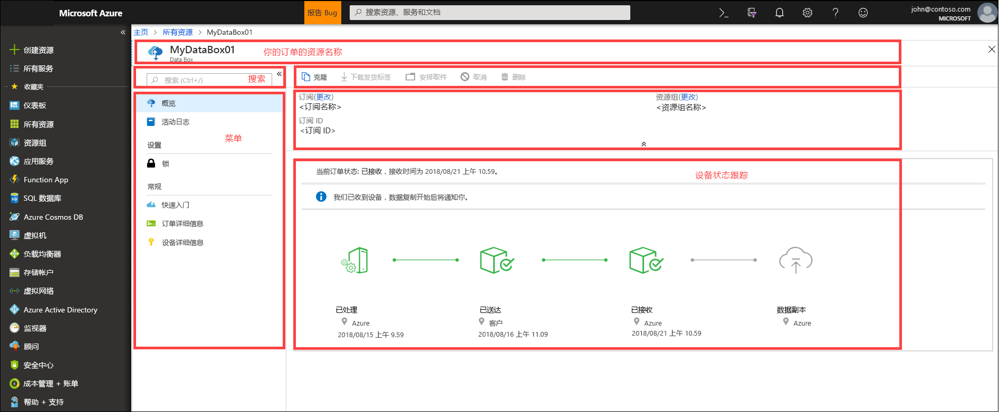
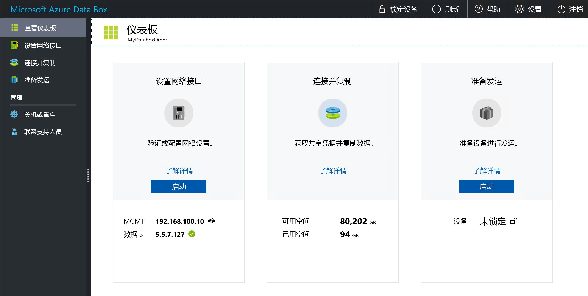

# 什么是 Azure Data Box？

使用 Microsoft Azure Data Box 云解决方案可以通过快速、经济、可靠的方式将 TB 量级的数据发送到 Azure。 通过向你发送专有的 Data Box 存储设备来加速安全数据传输。 每个存储设备的最大可用存储容量为 80 TB，并通过区域运营商传送到数据中心。 该设备具有坚固的外壳，可在运输过程中保护数据。

可通过 Azure 门户订购 Data Box 设备。 收到设备后，可使用本地 Web UI 进行快速设置。 将数据从服务器复制到设备，然后将设备发回 Azure。 在 Azure 数据中心内，数据将从设备自动上传到 Azure。 通过 Azure 门户中的 Data Box 服务对整个过程进行端到端跟踪。

## 用例

Data Box 非常适合在在无网络连接到有限网络连接的情况下传输大于 40 TB 的数据。 数据移动的方式可以是一次性的、定期的，或者先执行批量数据传输，再定期传输。 以下是 Data Box 可用于数据传输的各种方案。

 - **一次性迁移** - 需要将大量本地数据移到 Azure 时。 
     - 将媒体库从脱机磁带移动到 Azure 以创建联机媒体库。
     - 将 VM 场、SQL server 和应用程序迁移到 Azure
     - 将历史数据移至 Azure，以便使用 HDInsight 进行深入分析和报告

 - **初始批量传输** - 需要先使用 Data Box（种子）执行初始批量传输，然后通过网络执行增量传输时。 
     - 例如，备份解决方案合作伙伴（如 Commvault 和 Data Box）用于将初始大型历史备份移至 Azure。 完成后，增量数据将通过网络传输到 Azure 存储。

- **定期上传** - 定期生成大量数据，并需要将这些数据移到 Azure 时。 例如，能源勘探领域生成有关钻井平台和风力发电农场的视频内容。      

## 优点

Data Box 旨在几乎不影响网络的情况下将大量数据移至 Azure。 该解决方案具有以下优点：

- **速度** - Data Box 使用 1 Gbps 或 10 Gbps 网络接口将多达 80 TB 的数据移至 Azure。

- **安全** - Data Box 为设备、数据和服务提供内置安全保护。
  - 该设备具有坚固的外壳，通过防破坏螺钉和防破坏贴纸固定。 
  - 设备上的数据始终使用 AES 256 位加密进行保护。
  - 只能使用 Azure 门户中提供的密钥解锁设备。
  - 服务受 Azure 安全功能的保护。
  - 将数据上传到 Azure 后，会根据 NIST 800-88r1 标准完全擦除设备上的磁盘数据。
    
    有关详细信息，请参阅 [Azure Data Box 安全性和数据保护](data-box-security.md)。

## 功能和规格

此版本中的 Data Box 设备具有以下功能。

| 规范                                          | 说明              |
|---------------------------------------------------------|--------------------------|
| 重量                                                  | < 22.68 千克                |
| 维度                                              | 设备 - 宽度：309.0 毫米 高度：430.4 毫米 深度：502.0 毫米 |            
| 机架空间                                              | 放在机架侧面时为 7 U（不能安装在机架上）|
| 所需的电缆                                         | 1 根电源线（附送）   2 根 RJ45 电缆   2 根 SFP+ Twinax 铜缆线|
| 存储容量                                        | 100 TB 设备在进行 RAID 5 保护后有 80 TB 的可用容量|
| 功率分级                                            | 电源设备的概率为 700 瓦。   通常情况下，设备为 375 瓦。|
| 网络接口                                      | 2 个 1 GbE 接口 - MGMT 和 DATA 3。   MGMT - 适用于管理，用户不可配置，用于初始设置   DATA3 - 适用于数据，用户可配置，且默认为动态   MGMT 和 DATA 3 也可作为 10 GbE 接口使用   2 个 10 GbE 接口 - DATA 1 和 DATA 2   两者都用于数据，可以配置为动态（默认）或静态 |
| 数据传输介质                                     | RJ45、SFP+ 铜缆 10 GbE 以太网  |
| 安全性                                                | 坚固耐用的设备外壳，带防破坏定制螺钉   防破坏贴纸放置在设备的底部|
| 数据传输率                                      | 每天多达 80 TB 的数据，通过 10 GbE 的网络接口传输        |
| 管理                                              | 本地 Web UI - 一次性初始设置和配置   Azure 门户 - 日常设备管理        |

## Data Box 组件

Data Box 包括以下组件：

* **Data Box 设备** - 提供主存储、管理与云存储通信的物理设备，并有助于确保存储在设备上的所有数据的安全性和机密性。 Data Box 设备的可用存储容量为 80 TB。 

    

    
* **Data Box 设备** - Azure 门户的扩展，使用该扩展可以通过 Web 界面（可从不同的地理位置访问该界面）管理 Data Box 设备。 使用 Data Box 服务执行的 Data Box 设备的日常管理。 服务任务包括如何创建和管理订单、查看和管理警报以及管理共享。  

    

    有关详细信息，请转到[使用 Data Box 服务管理 Data Box 设备](data-box-portal-ui-admin.md)。

* **本地 Web 用户界面** - 基于 Web 的UI，用于配置设备，以便它可以连接到本地网络，并向 Data Box 服务注册该设备。 此外还可以使用本地 Web UI 关闭和重启 Data Box 设备、查看复制日志，并联系 Microsoft 支持部门以提交服务请求。

    

    有关使用基于 Web 的 UI 的详细信息，请转到[使用基于 Web 的 UI 管理 Data Box](data-box-portal-ui-admin.md)。

## 工作流

典型的流包括以下步骤：

1. **订购** - 在 Azure 门户中创建订单，提供发货信息和数据的目标 Azure 存储帐户。 如果设备可用，则 Azure 会准备，然后寄送设备并随附发货跟踪 ID。

2. **接收** - 交付设备后，使用指定的电缆为设备连接网络和电源。 打开并连接到设备。 在要从中复制数据的主机上配置设备网络并装载共享。

3. **数据复制** - 将数据复制到 Data Box 共享。

4. **返回** - 准备、关闭并将设备发回 Azure 数据中心。

5. **上传** - 将设备中的数据自动复制到 Azure。 根据美国国家标准和技术协会 (NIST) 的准则安全擦除设备磁盘数据。

在整个过程中，你会收到有关所有状态更改的电子邮件通知。 有关详细流的详细信息，请转到[在 Azure 门户中部署 Data Box](data-box-deploy-ordered.md)。

## 上市区域

Data Box 可以根据部署服务的区域、设备的发货国家/地区以及传输数据的目标 Azure 存储帐户传输数据。 

- **服务可用性** - 有关区域可用性的信息，请转到 [Azure 可用产品（按区域）](https://azure.microsoft.com/global-infrastructure/services/?products=databox&regions=all)。 Data Box 也可以部署在 Azure 政府云中。 有关详细信息，请参阅[什么是 Azure 政府？](https://docs.microsoft.com/azure/azure-government/documentation-government-welcome)。

- **目标存储帐户** - 存储数据的存储帐户可在服务可用的所有 Azure 区域中获得。  

## 后续步骤

- 请查看 [Data Box 系统要求](data-box-system-requirements.md)。
- 了解 [Data Box 限制](data-box-limits.md)。
- 在 Azure 门户中快速部署 [Azure Data Box](data-box-quickstart-portal.md)。

