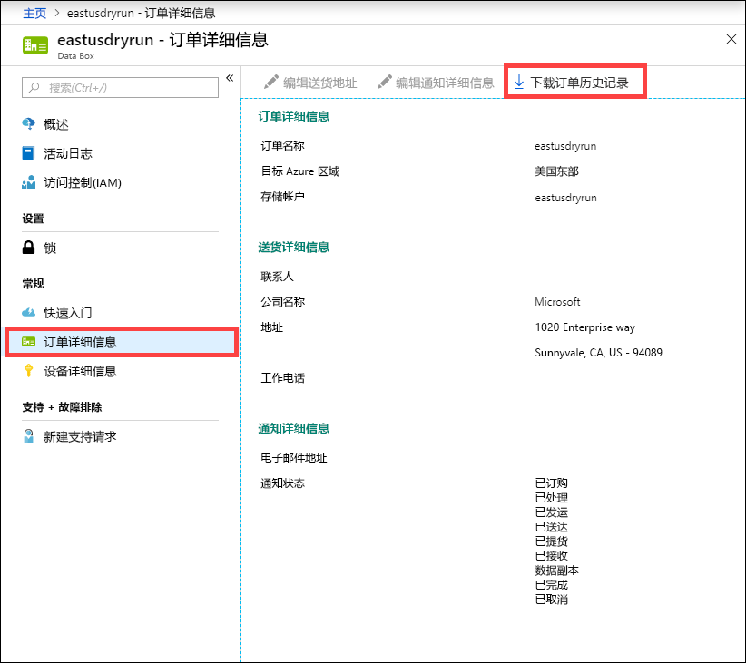
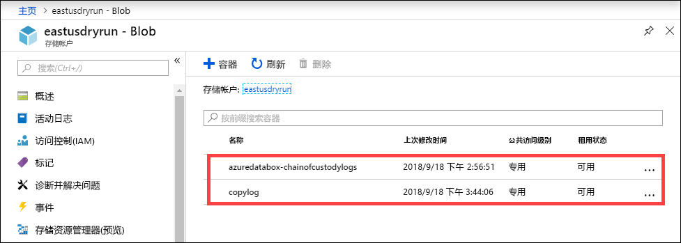
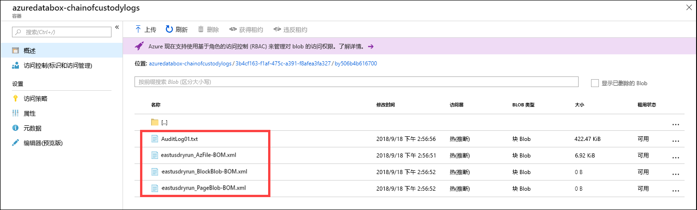

# <a name="use-the-azure-portal-to-administer-your-azure-data-box-and-azure-data-box-heavy"></a>使用 Azure 门户管理 Azure Data Box 和 Azure Data Box Heavy

本文同时适用于 Azure Data Box 和 Azure Data Box Heavy。 本文介绍了可对 Azure Data Box 设备执行的一些复杂工作流和管理任务。 可以通过 Azure 门户或本地 Web UI 管理 Data Box 设备。

本文重点介绍可以使用 Azure 门户执行的任务。 使用 Azure 门户可以管理订单、管理 Data Box 设备，以及跟踪订单在从头到尾的处理过程中的状态。

[!INCLUDE [Data Box feature is in preview](../../includes/data-box-feature-is-preview-info.md)]


## <a name="cancel-an-order"></a>取消订单

下达订单后，你可能会出于各种原因需要取消订单。 

对于导入和导出订单，只能在处理订单之前取消订单。 一旦订单已处理并且已准备好 Data Box 设备，就不能取消订单。

可以执行以下步骤来取消订单。

1.  转到“概况”>“取消”。 

    

2.  填写取消订单的原因。  

    

3.  取消订单后，门户会更新订单的状态，并显示订单“已取消”。 

## <a name="clone-an-order"></a>克隆订单

克隆操作在某些情况下很有用。 例如，用户已使用 Data Box 传输了一些数据。 随着生成的数据越来越多，需要使用另一个 Data Box 设备将这些数据传输到 Azure。 在这种情况下，只需克隆同一份订单即可。

> [!IMPORTANT]
> 克隆不适用于导出订单。 只能克隆导入订单。

执行以下步骤可以克隆导入顺序。

1.  转到“概况”>“克隆”。**** 

    

2.  订单的所有详细信息保持不变。 订单名称是原始订单名称后接 *-Clone*。 选中表示确认你已查看隐私信息的复选框。 单击“创建”。

几分钟后将会创建克隆的订单，并且门户会更新，以显示新订单。


## <a name="delete-order"></a>删除订单

订单处理完成后，你可能想要删除订单。 订单中包含姓名、地址和联系信息等个人信息。 删除订单会删除这些个人信息。

只能删除已完成或已取消的订单。 执行以下步骤删除订单。

1. 中转到 "**所有资源**"。 搜索订单。

2. 单击要删除的订单，并转到“概况”。**** 从命令栏中，单击“删除”****。

    

3. 当系统提示确认删除订单时，请输入订单名称。 单击 **“删除”** 。

## <a name="download-shipping-label"></a>下载发货标签

如果 Data Box 的电子墨水显示屏不工作并且没有返回发货标签，则你可能需要下载发货标签。 由于 Data Box Heavy 上没有电子墨水显示屏，因此此工作流程不适用于 Data Box Heavy。

执行以下步骤下载发货标签。

1.  转到“概况”>“下载发货标签”。**** 只有在设备已发货后，此选项才可用。 

    

2.  这会将下载以下退件发货标签。 保存标签，并将其打印出来。折叠标签，并将其插入设备上的清除套管。 请确保标签可见。 清除在之前的发货中留在设备上的任何贴纸。

    

## <a name="edit-shipping-address"></a>编辑寄送地址

下单后，你可能需要编辑寄送地址。 只能在发运设备之前执行此操作。 一旦设备已发运，此选项就不再可用。

执行以下步骤编辑订单。

1. 转到“订单详细信息”>“编辑寄送地址”。****

    

2. 编辑并验证寄送地址，然后保存更改。

    

## <a name="edit-notification-details"></a>编辑通知详细信息

你可能需要更改订单状态电子邮件收件人用户。 例如，当设备已妥投或提货时，需要告知某个用户。 完成数据复制时可能需要告知另一个用户，使该用户在从源中删除数据之前，可以验证数据是否在 Azure 存储帐户中。 在这种情况下，可以编辑通知详细信息。

执行以下步骤编辑通知详细信息。

1. 转到“订单详细信息”>“编辑通知详细信息”。****

    

2. 现在可以编辑通知详细信息，然后保存更改。
 
    


## <a name="download-order-history"></a>下载订单历史记录

Data Box 订单完成以后，会擦除设备磁盘上的数据。 当设备清理完成后，可以在 Azure 门户中下载订单历史记录。

若要下载订单历史记录，请执行以下步骤。

1. 在 Data Box 订单中，转到“概览”。**** 请确保订单完整。 如果订单完整且设备清理已完成，则请转到“订单详细信息”。**** “下载订单历史记录”选项可用。****

    

2. 单击“下载订单历史记录”。**** 在下载的历史记录中，会看到一个有关承运人跟踪日志的记录。 将有两组日志对应于 Data Box Heavy 上的两个节点。 如果向下滚动到该日志的底部，则可看到以下内容的链接：
    
   - **复制日志**-将误码数据复制过程中的文件列表从 Data Box 复制到 Azure 存储帐户 (导入订单) ，*反之亦然* (导出顺序) 。
   - **审核日志** - 包含有关当 Data Box 在 Azure 数据中心外部时如何启动它和访问其上共享的信息。
   - **按导入顺序列出的 BOM 文件**-具有文件的列表 (也称为文件清单) ，你可以在**准备交付**期间下载该文件，并且该文件具有文件名、文件大小和文件校验和。
   - **导出顺序中的详细日志**-在将数据从 Azure 存储帐户复制到 Data Box 时，将包含文件的列表、文件大小和校验和计算。

   下面是来自导入订单的订单历史记录的示例。

       ```
       -------------------------------
       Microsoft Data Box Order Report
       -------------------------------
       Name                                               : DataBoxTestOrder                              
       StartTime(UTC)                                     : 10/31/2018 8:49:23 AM +00:00                       
       DeviceType                                         : DataBox                                           
       -------------------
       Data Box Activities
       -------------------
       Time(UTC)                 | Activity                       | Status          | Description  
       
       10/31/2018 8:49:26 AM     | OrderCreated                   | Completed       |                                                   
       11/2/2018 7:32:53 AM      | DevicePrepared                 | Completed       |                                                   
       11/3/2018 1:36:43 PM      | ShippingToCustomer             | InProgress      | Shipment picked up. Local Time : 11/3/2018 1:36:43        PM at AMSTERDAM-NLD                                                                                
       11/4/2018 8:23:30 PM      | ShippingToCustomer             | InProgress      | Processed at AMSTERDAM-NLD. Local Time : 11/4/2018        8:23:30 PM at AMSTERDAM-NLD                                                                        
       11/4/2018 11:43:34 PM     | ShippingToCustomer             | InProgress      | Departed Facility in AMSTERDAM-NLD. Local Time :          11/4/2018 11:43:34 PM at AMSTERDAM-NLD                                                               
       11/5/2018 1:38:20 AM      | ShippingToCustomer             | InProgress      | Arrived at Sort Facility LEIPZIG-DEU. Local Time :        11/5/2018 1:38:20 AM at LEIPZIG-DEU                                                                
       11/5/2018 2:31:07 AM      | ShippingToCustomer             | InProgress      | Processed at LEIPZIG-DEU. Local Time : 11/5/2018          2:31:07 AM at LEIPZIG-DEU                                                                            
       11/5/2018 4:05:58 AM      | ShippingToCustomer             | InProgress      | Departed Facility in LEIPZIG-DEU. Local Time :            11/5/2018 4:05:58 AM at LEIPZIG-DEU                                                                    
       11/5/2018 4:35:43 AM      | ShippingToCustomer             | InProgress      | Transferred through LUTON-GBR. Local Time :              11/5/2018 4:35:43 AM at LUTON-GBR                                                                         
       11/5/2018 4:52:15 AM      | ShippingToCustomer             | InProgress      | Departed Facility in LUTON-GBR. Local Time :              11/5/2018 4:52:15 AM at LUTON-GBR                                                                        
       11/5/2018 5:47:58 AM      | ShippingToCustomer             | InProgress      | Arrived at Sort Facility LONDON-HEATHROW-GBR.            Local Time : 10/5/2018 5:47:58 AM at LONDON-HEATHROW-GBR                                                
       11/5/2018 6:27:37 AM      | ShippingToCustomer             | InProgress      | Processed at LONDON-HEATHROW-GBR. Local Time :            11/5/2018 6:27:37 AM at LONDON-HEATHROW-GBR                                                            
       11/5/2018 6:39:40 AM      | ShippingToCustomer             | InProgress      | Departed Facility in LONDON-HEATHROW-GBR. Local          Time : 11/5/2018 6:39:40 AM at LONDON-HEATHROW-GBR                                                    
       11/5/2018 8:13:49 AM      | ShippingToCustomer             | InProgress      | Arrived at Delivery Facility in LAMBETH-GBR. Local        Time : 11/5/2018 8:13:49 AM at LAMBETH-GBR                                                         
       11/5/2018 9:13:24 AM      | ShippingToCustomer             | InProgress      | With delivery courier. Local Time : 11/5/2018            9:13:24 AM at LAMBETH-GBR                                                                               
       11/5/2018 12:03:04 PM     | ShippingToCustomer             | Completed       | Delivered - Signed for by. Local Time : 11/5/2018        12:03:04 PM at LAMBETH-GBR                                                                          
       1/25/2019 3:19:25 PM      | ShippingToDataCenter           | InProgress      | Shipment picked up. Local Time : 1/25/2019 3:19:25        PM at LAMBETH-GBR                                                                                       
       1/25/2019 8:03:55 PM      | ShippingToDataCenter           | InProgress      | Processed at LAMBETH-GBR. Local Time : 1/25/2019          8:03:55 PM at LAMBETH-GBR                                                                            
       1/25/2019 8:04:58 PM      | ShippingToDataCenter           | InProgress      | Departed Facility in LAMBETH-GBR. Local Time :            1/25/2019 8:04:58 PM at LAMBETH-GBR                                                                    
       1/25/2019 9:06:09 PM      | ShippingToDataCenter           | InProgress      | Arrived at Sort Facility LONDON-HEATHROW-GBR.            Local Time : 1/25/2019 9:06:09 PM at LONDON-HEATHROW-GBR                                                
       1/25/2019 9:48:54 PM      | ShippingToDataCenter           | InProgress      | Processed at LONDON-HEATHROW-GBR. Local Time :            1/25/2019 9:48:54 PM at LONDON-HEATHROW-GBR                                                            
       1/25/2019 10:30:20 PM     | ShippingToDataCenter           | InProgress      | Departed Facility in LONDON-HEATHROW-GBR. Local          Time : 1/25/2019 10:30:20 PM at LONDON-HEATHROW-GBR                                                   
       1/26/2019 2:17:10 PM      | ShippingToDataCenter           | InProgress      | Arrived at Sort Facility BRUSSELS-BEL. Local Time        : 1/26/2019 2:17:10 PM at BRUSSELS-BEL                                                              
       1/26/2019 2:31:57 PM      | ShippingToDataCenter           | InProgress      | Processed at BRUSSELS-BEL. Local Time : 1/26/2019        2:31:57 PM at BRUSSELS-BEL                                                                          
       1/26/2019 3:37:53 PM      | ShippingToDataCenter           | InProgress      | Processed at BRUSSELS-BEL. Local Time : 1/26/2019        3:37:53 PM at BRUSSELS-BEL                                                                          
       1/27/2019 11:01:45 AM     | ShippingToDataCenter           | InProgress      | Departed Facility in BRUSSELS-BEL. Local Time :          1/27/2019 11:01:45 AM at BRUSSELS-BEL                                                                 
       1/28/2019 7:11:35 AM      | ShippingToDataCenter           | InProgress      | Arrived at Delivery Facility in AMSTERDAM-NLD.            Local Time : 1/28/2019 7:11:35 AM at AMSTERDAM-NLD                                                     
       1/28/2019 9:07:57 AM      | ShippingToDataCenter           | InProgress      | With delivery courier. Local Time : 1/28/2019            9:07:57 AM at AMSTERDAM-NLD                                                                             
       1/28/2019 1:35:56 PM      | ShippingToDataCenter           | InProgress      | Scheduled for delivery. Local Time : 1/28/2019            1:35:56 PM at AMSTERDAM-NLD                                                                            
       1/28/2019 2:57:48 PM      | ShippingToDataCenter           | Completed       | Delivered - Signed for by. Local Time : 1/28/2019        2:57:48 PM at AMSTERDAM-NLD                                                                         
       1/29/2019 2:18:43 PM      | PhysicalVerification           | Completed       |                                              
       1/29/2019 3:49:50 PM      | DeviceBoot                     | Completed       | Appliance booted up successfully                  
       1/29/2019 3:49:51 PM      | AnomalyDetection               | Completed       | No anomaly detected.                               
       1/29/2019 4:55:00 PM      | DataCopy                       | Started         |                                                 
       2/2/2019 7:07:34 PM       | DataCopy                       | Completed       | Copy Completed.                                   
       2/4/2019 7:47:32 PM       | SecureErase                    | Started         |                                                  
       2/4/2019 8:01:10 PM      | SecureErase                    | Completed       | Azure Data Box:DEVICESERIALNO has been sanitized          according to NIST 800-88 Rev 1.                                                                       

       ------------------
       Data Box Log Links
       ------------------

       Account Name         : Gus                                                       
       Copy Logs Path       : databoxcopylog/DataBoxTestOrder_CHC533180024_CopyLog_73a81b2d613547a28ecb7b1612fe93ca.xml
       Audit Logs Path      : azuredatabox-chainofcustodylogs\7fc6cac9-9cd6-4dd8-ae22-1ce479666282\chc533180024
       BOM Files Path       : azuredatabox-chainofcustodylogs\7fc6cac9-9cd6-4dd8-ae22-1ce479666282\chc533180024      
       ```
     然后，可以转到存储帐户并查看复制日志。



也可查看包含审核日志和 BOM 文件的一系列监管日志。



## <a name="view-order-status"></a>查看订单状态

当设备状态在门户中发生更改时，你会通过电子邮件收到通知。

### <a name="statuses-for-import-order"></a>导入顺序的状态

下面是导入顺序的状态。

|订单状态 |说明 |
|---------|---------|
|已订购     | 已成功下单。 <br>如果设备有货，Microsoft 会确定要发货的设备，并准备设备。 <br> 如果不是可以立即提供设备，则将在有设备可用时处理订单。 订单可能需要花费几天到几个月的时间来进行处理。 如果不能在 90 天内履行订单，则订单将取消并且会向你发送通知。         |
|已处理     | 订单处理已完成。 根据你的订单，在数据中心内做好了设备的发货准备工作。         |
|已发运     | 订单已发货。 可以使用门户中你的订单上显示的跟踪 ID 来跟踪货物。        |
|已交货     | 货物已交付到订单中指定的地址。        |
|已提货     |承运人已提取并扫描了你的回寄设备。         |
|Received     | 已收到你的设备并在 Azure 数据中心对其进行了扫描。 <br> 在检查发运的设备后，将启动设备上传。      |
|数据复制     | 正在复制数据。 可以在 Azure 门户中跟踪订单的复制进度。 <br> 请等待数据复制完成。 |
|已完成       |已成功完成订单。<br> 从服务器中删除本地数据之前，请验证数据是否已在 Azure 中。         |
|已完成但出错| 数据复制已完成，但在复制期间发生错误。 <br> 请使用 Azure 门户中提供的路径查看复制日志。 请参阅[上传完成但显示错误时复制日志的示例](https://docs.microsoft.com/azure/databox/data-box-logs#upload-completed-with-errors)。   |
|已完成但出现警告| 数据复制已完成，但数据已修改。 数据具有非关键 blob 或文件名错误，已通过更改文件或 blob 名称修复这些错误。 <br> 请使用 Azure 门户中提供的路径查看复制日志。 对数据中的修改进行注释。 请参阅[当上传完成但出现警告时复制日志的示例](https://docs.microsoft.com/azure/databox/data-box-logs#upload-completed-with-warnings)。   |
|已取消            |订单已取消。 <br> 你取消了订单，或者由于遇到错误，服务取消了订单。 如果不能在 90 天内履行订单，则订单也将取消并且会向你发送通知。     |
|清理 | 已擦除设备磁盘上的数据。 当 Azure 门户中提供了可供下载的订单历史记录时，可以认为设备清理已完成。|

### <a name="statuses-for-export-order"></a>导出顺序的状态

下面是导出顺序的状态。

|订单状态 |说明 |
|---------|---------|
|已订购     | 已成功放置导出顺序。 <br>如果设备有货，Microsoft 会确定要发货的设备，并准备设备。 <br> 如果不是可以立即提供设备，则将在有设备可用时处理订单。 订单可能需要花费几天到几个月的时间来进行处理。 如果不能在 90 天内履行订单，则订单将取消并且会向你发送通知。         |
|已取消            |订单已取消。 <br> 您取消了订单 (您只能在处理订单之前取消) 或遇到错误，服务取消了订单。 如果不能在 90 天内履行订单，则订单也将取消并且会向你发送通知。     |
|已处理     | 订单处理已完成。 根据订单，设备准备好在数据中心进行数据复制。 创建设备共享。         |
|正在复制数据     | 正在将指定 Azure 存储帐户中的数据复制到设备。 可以在 Azure 门户中跟踪订单的复制进度。 <br> 请等待数据复制完成。 |
|复制已完成     | 从指定的 Azure 存储帐户到设备的数据复制已完成。 如果在 order) 中启用了选项，则 (详细日志文件，并在存储帐户中创建复制日志。 详细日志包含有关复制到设备 (名称、路径、计算校验和) 的所有文件的信息。 复制日志包含复制进程的摘要，包括由于任何错误而无法复制的文件的列表。<br> 存储帐户数据保持不变。 |
|复制已完成，但出现错误| 数据复制已完成，但在复制期间发生错误。 <br> 使用 Azure 门户中提供的路径查看 Azure 存储帐户中的复制日志。 请参阅[下载完成但出现错误时复制日志的示例](https://docs.microsoft.com/azure/databox/data-box-logs#upload-completed-with-errors)。   |
|复制已完成，但出现警告| Azure 存储帐户中的数据复制已完成，但数据发生非严重错误。 <br> 请使用 Azure 门户中提供的路径查看复制日志。 记下 "非严重" 错误。 请参阅[下载完成时复制日志的示例，但会出现警告](https://docs.microsoft.com/azure/databox/data-box-logs#upload-completed-with-warnings)。   |
|复制失败并出现错误| 从 Azure 存储帐户复制数据失败，订单已终止。 不会发送设备。<br> 使用 Azure 门户中提供的路径查看 Azure 存储帐户中的复制日志。 请参阅[下载失败并出现错误时的复制日志示例](https://docs.microsoft.com/azure/databox/data-box-logs#upload-completed-with-errors)。   |
|已发运     |订单已发货。 可以使用门户中你的订单上显示的跟踪 ID 来跟踪货物。        |
|已交货     |货物已交付到订单中指定的地址。        |
|已提货     |承运人已提取并扫描了你的回寄设备。         |
|Received     | 已收到你的设备并在 Azure 数据中心对其进行了扫描。 <br> 已检查发货。      |
|已完成           |订单已完成。     |
|清理 | 已擦除设备磁盘上的数据。 当 Azure 门户中提供了可供下载的订单历史记录时，可以认为设备清理已完成。|

> [!NOTE]
> 如果要将数据从 Azure 存储帐户导出到 Data Box 的复制作业完成时出现错误或警告，则设备仍然会发货。 仅当复制失败时，将终止该订单，并且不会发出设备。


如果使用自行管理的装运，则在复制完成后，在收到设备之前，你会看到以下状态 (，而不是上表中提到的状态) ：

|订单状态 |说明 |
|---------|---------|
|准备好在 Azure 数据中心进行装货      |设备已准备好，可以在 Azure 数据中心选取。        |
|已提货    |你已选择设备。         |
|可以在 Azure 数据中心接收     |设备已准备好接收到 Azure 数据中心。        |
|Received     |在 Azure 数据中心接收到设备。      |


## <a name="next-steps"></a>后续步骤

- 了解如何[排查 Data Box 和 Data Box Heavy 问题](data-box-troubleshoot.md)。
