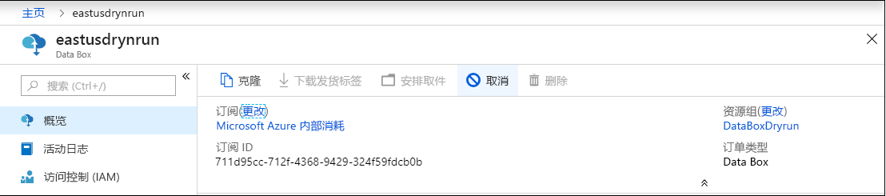
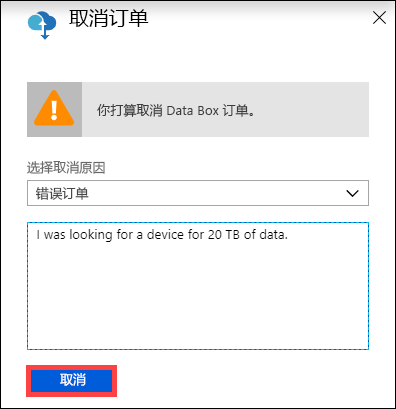
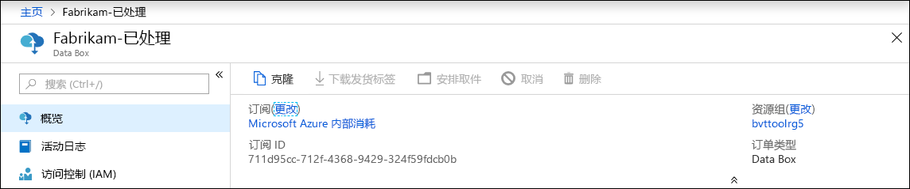
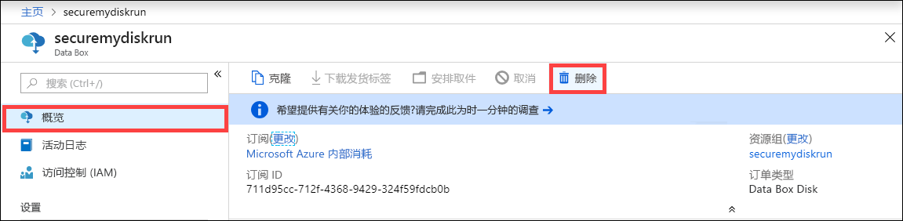
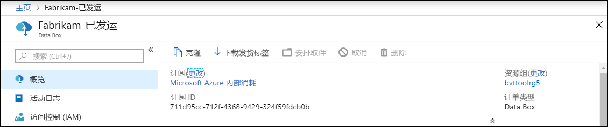
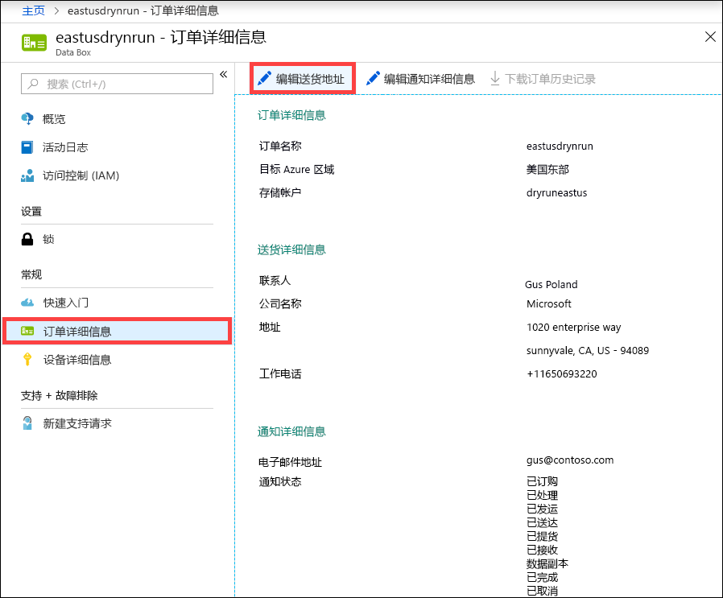
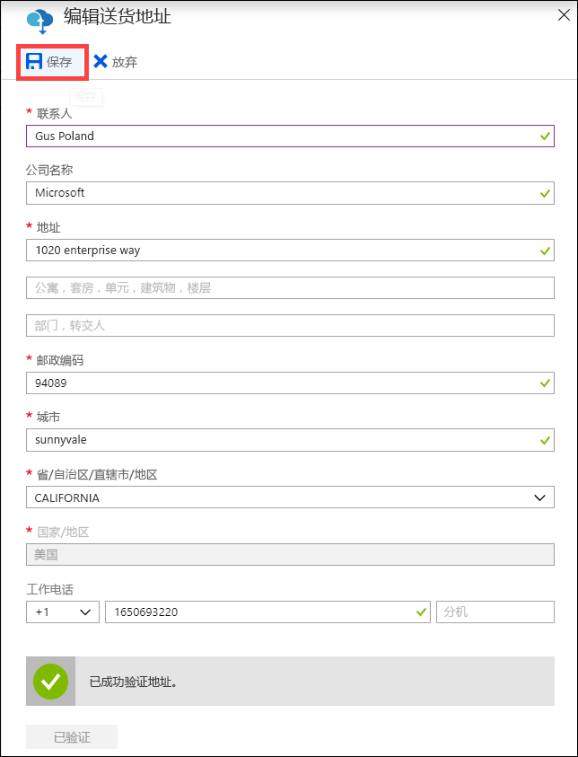
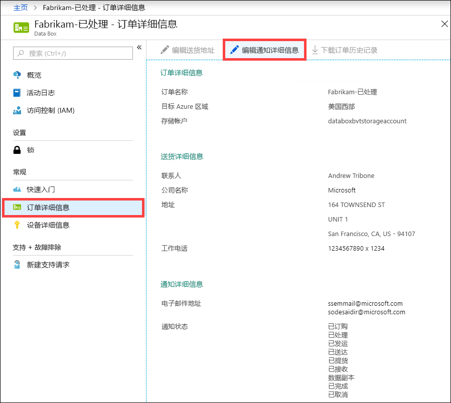
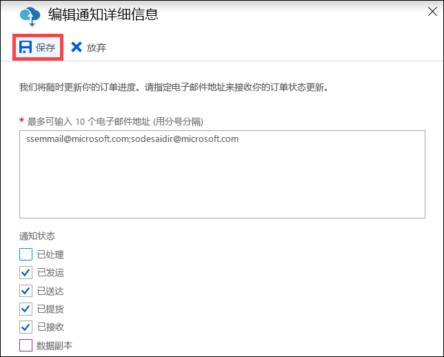

# 使用 Azure 门户管理 Data Box

本文介绍了可对 Data Box 执行的一些复杂工作流和管理任务。 你可以通过 Azure 门户和本地 Web UI 管理 Data Box。 

本文重点介绍可以使用 Azure 门户执行的任务。 使用 Azure 门户可以管理订单、管理 Data Box，以及跟踪订单在从头到尾的处理过程中的状态。

## 取消订单

下达订单后，你可能会出于各种原因需要取消订单。 只能在订单处理之前取消订单。 一旦订单已处理并且已准备好 Data Box，就不能取消订单。 

可以执行以下步骤来取消订单。

1.  转到“概况”>“取消”。 

    

2.  填写取消订单的原因。  

    

3.  取消订单后，门户会更新订单的状态，并显示订单“已取消”。 

## 克隆订单

克隆操作在某些情况下很有用。 例如，用户已使用 Data Box 传输了一些数据。 随着生成的数据越来越多，需要使用 Data Box 将这些数据传输到 Azure。 在这种情况下，只需克隆同一份订单即可。

执行以下步骤来克隆订单。

1.  转到“概况”>“克隆”。 

    

2.  订单的所有详细信息保持不变。 订单名称是原始订单名称后接 *-Clone*。 选中表示确认你已查看隐私信息的复选框。 单击“创建”。    

几分钟后将会创建克隆的订单，并且门户会更新，以显示新订单。

## 删除订单

订单处理完成后，你可能想要删除订单。 订单中包含姓名、地址和联系信息等个人信息。 删除订单会删除这些个人信息。

只能删除已完成或已取消的订单。 执行以下步骤删除订单。

1. 转到“所有资源”。 搜索订单。

2. 单击要删除的订单，并转到“概况”。 在命令栏中，单击“删除”。

    

3. 当系统提示确认删除订单时，请输入订单名称。 单击“删除” 。

## 下载发货标签

如果 Data Box 的电子墨水显示屏不工作并且没有返回发货标签，则你可能需要下载发货标签。 

执行以下步骤下载发货标签。
1.  转到“概况”>“下载发货标签”。 只有在设备已发货后，此选项才可用。 

    

2.  这会将下载以下退件发货标签。 保存该标签并将其打印出来。折叠标签并将插入到设备上的透明封套中。 请确保标签可见。 清除在之前的发货中留在设备上的任何贴纸。

    

## 编辑寄送地址

下单后，你可能需要编辑寄送地址。 只能在发运设备之前执行此操作。 一旦设备已发运，此选项就不再可用。

执行以下步骤编辑订单。

1. 转到“订单详细信息”>“编辑寄送地址”。

    

2. 编辑并验证寄送地址，然后保存更改。

    

## 编辑通知详细信息

你可能需要更改订单状态电子邮件收件人用户。 例如，当设备已妥投或提货时，需要告知某个用户。 完成数据复制时可能需要告知另一个用户，使该用户在从源中删除数据之前，可以验证数据是否在 Azure 存储帐户中。 在这种情况下，可以编辑通知详细信息。

执行以下步骤编辑通知详细信息。

1. 转到“订单详细信息”>“编辑通知详细信息”。

    

2. 现在可以编辑通知详细信息，然后保存更改。
 
    

## 查看订单状态

当设备状态在门户中发生更改时，你会通过电子邮件收到通知。

|订单状态 |说明 |
|---------|---------|
|已订购     | 已成功下单。  如果设备有货，Microsoft 会确定要发货的设备，并准备设备。   如果不是可以立即提供设备，则将在有设备可用时处理订单。 订单可能需要花费几天到几个月的时间来进行处理。 如果不能在 90 天内履行订单，则订单将取消并且会向你发送通知。         |
|已处理     | 订单处理已完成。 根据你的订单，在数据中心内做好了设备的发货准备工作。         |
|已发运     | 订单已发货。 可以使用门户中你的订单上显示的跟踪 ID 来跟踪货物。        |
|已交货     | 货物已交付到订单中指定的地址。        |
|已提货     |承运人已提取并扫描了你的回寄设备。         |
|已收到     | 已收到你的设备并在 Azure 数据中心对其进行了扫描。   在检查发运的设备后，将启动设备上传。      |
|数据复制     | 正在复制数据。 可以在 Azure 门户中跟踪订单的复制进度。   请等待数据复制完成。 |
|已完成       |已成功完成订单。  从服务器中删除本地数据之前，请验证数据是否已在 Azure 中。         |
|已完成但出错| 数据复制已完成，但在复制期间发生错误。   请使用 Azure 门户中提供的路径查看复制日志。   |
|已取消            |订单已取消。   你取消了订单，或者由于遇到错误，服务取消了订单。 如果不能在 90 天内履行订单，则订单也将取消并且会向你发送通知。     |
|清理 | 已擦除设备磁盘上的数据。 当 Azure 门户中提供了订单日志报告时，可以认为设备清理已完成。|

## 后续步骤

- 了解如何[排查 Data Box 问题](data-box-faq.md)。
