# 使用 Azure 门户管理 Data Box（预览版）

本文中的教程适用于 Microsoft Azure Data Box 磁盘预览版。 本文介绍了可对 Data Box 磁盘执行的一些复杂工作流和管理任务。 

可以通过 Azure 门户管理 Data Box 磁盘。 本文重点介绍可以使用 Azure 门户执行的任务。 使用 Azure 门户可以管理订单、管理磁盘，以及跟踪订单在从头到尾的处理过程中的状态。

> [!IMPORTANT]
> Data Box 磁盘以预览版提供。 在部署此解决方案之前，请查看 [Azure 预览版服务的条款](https://azure.microsoft.com/support/legal/preview-supplemental-terms/)。

## 取消订单

下达订单后，你可能会出于各种原因需要取消订单。 只能在磁盘准备工作开始之前取消订单。 一旦磁盘已准备好并且订单已处理，就不能取消订单。 

执行以下步骤取消订单。

1.  转到“概况”>“取消”。 

    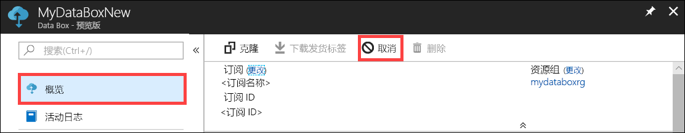

2.  填写取消订单的原因。  

    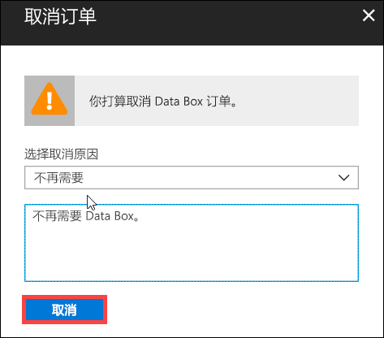

3.  取消订单后，门户会更新订单的状态，并显示订单“已取消”。

    

取消订单时，你不会收到电子邮件通知。

## 克隆订单

克隆操作在某些情况下很有用。 例如，用户已使用 Data Box 磁盘传输了一些数据。 随着生成的数据越来越多，需要使用更多的磁盘将这些数据传输到 Azure。 在这种情况下，只需克隆同一份订单即可。

执行以下步骤来克隆订单。

1.  转到“概况”>“克隆”。 

    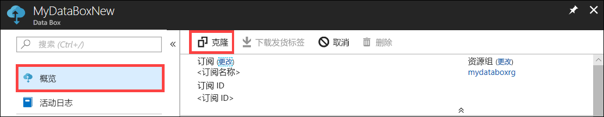

2.  订单的所有详细信息保持不变。 订单名称是原始订单名称后接 *-Clone*。 选中表示确认你已查看隐私信息的复选框。 单击“创建”。    

几分钟后将会创建克隆的订单，并且门户会更新，以显示新订单。

[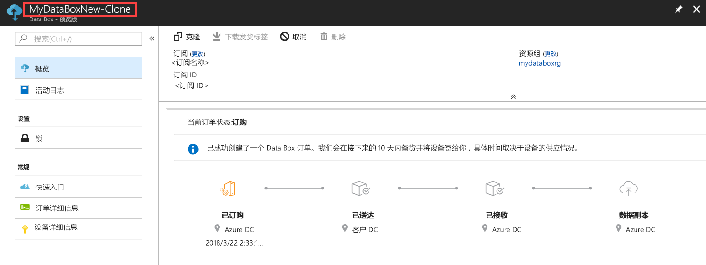](media/data-box-portal-ui-admin/clone-order3.png#lightbox) 

## 删除订单

订单处理完成后，你可能想要删除订单。 订单中包含姓名、地址和联系信息等个人信息。 删除订单会删除这些个人信息。

只能删除已完成或已取消的订单。 执行以下步骤删除订单。

1. 转到“所有资源”。 搜索订单。

    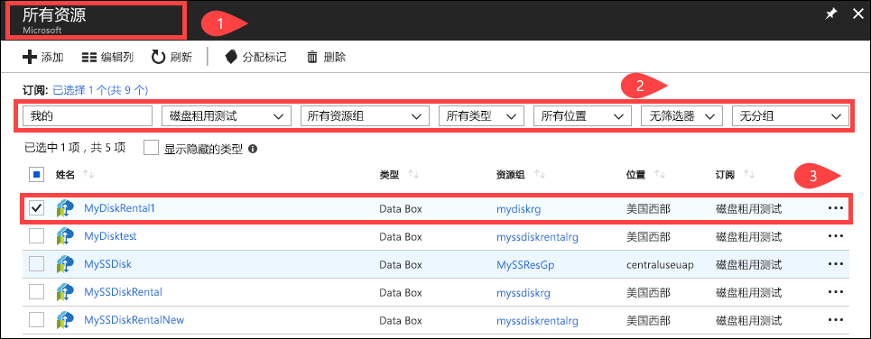

2. 单击要删除的订单，并转到“概况”。 在命令栏中，单击“删除”。

    

3. 当系统提示确认删除订单时，请输入订单名称。 单击“删除” 。

     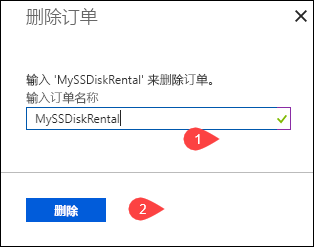

## 下载发货标签

如果磁盘随附的退件发货标签错放或丢失，你可能需要下载发货标签。 

执行以下步骤下载发货标签。
1.  转到“概况”>“下载发货标签”。 只有在磁盘已发货后，此选项才可用。 

    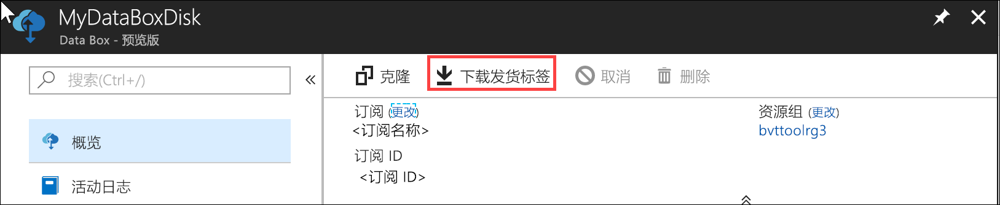

2.  这会将下载以下退件发货标签。 保存标签并打印，然后粘贴在退件上。

    

## 编辑寄送地址

下单后，你可能需要编辑寄送地址。 只能在发运磁盘之前执行此操作。 一旦磁盘已发运，此选项就不再可用。

执行以下步骤编辑订单。

1. 转到“订单详细信息”>“编辑寄送地址”。

    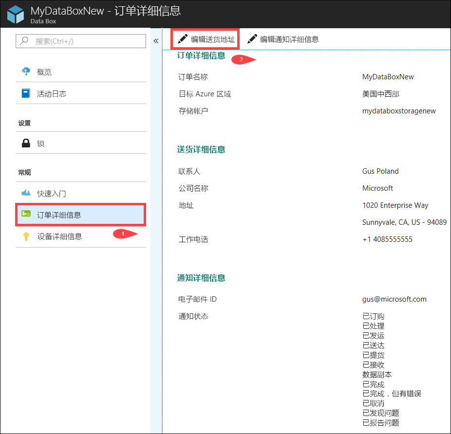

2. 现在可以编辑寄送地址，然后保存更改。

    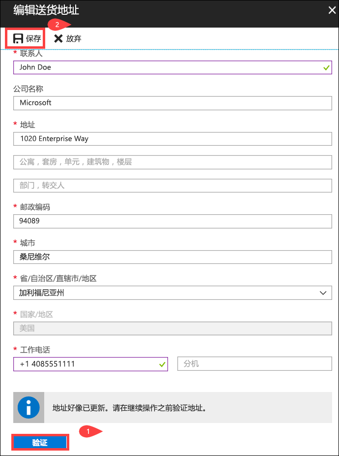

## 编辑通知详细信息

你可能需要更改订单状态电子邮件收件人用户。 例如，当磁盘已妥投或提货时，需要告知某个用户。 完成数据复制时可能需要告知另一个用户，使该用户在从源中删除数据之前，可以验证数据是否在 Azure 存储帐户中。 在这种情况下，可以编辑通知详细信息。

执行以下步骤编辑通知详细信息。

1. 转到“订单详细信息”>“编辑通知详细信息”。

    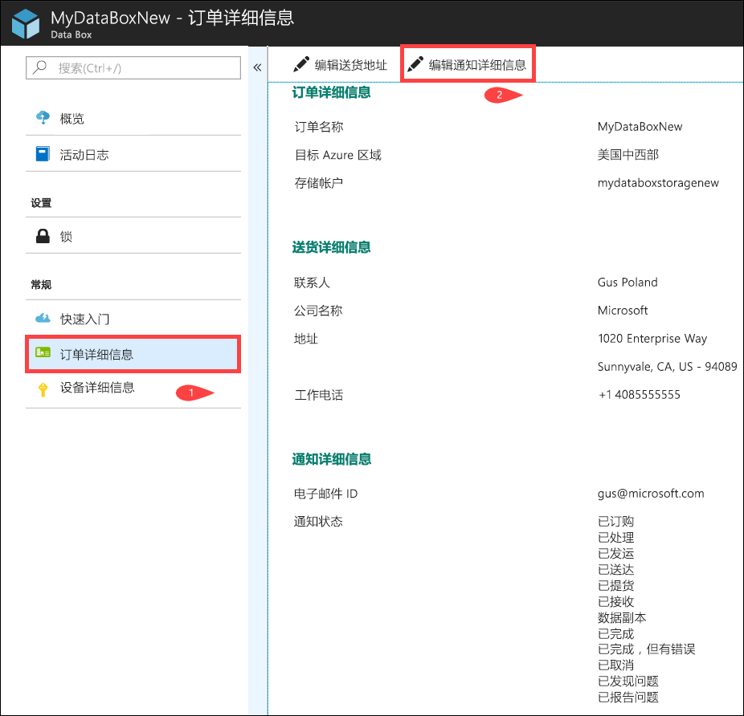

2. 现在可以编辑通知详细信息，然后保存更改。
 
    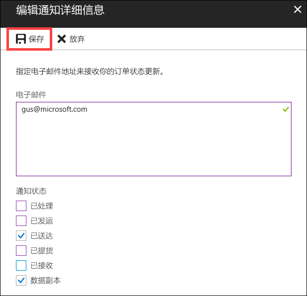

## 查看订单状态

|订单状态 |Description |
|---------|---------|
|已订购     | 已成功下单。   如果磁盘缺货，你会收到通知。  如果磁盘有货，Microsoft 会指定要发货的磁盘，并准备磁盘包装。        |
|已处理     | 订单处理已完成。   在订单处理期间，将执行以下操作：<li>使用 AES-128 BitLocker 加密技术将磁盘加密。 </li> <li>锁定 Data Box 磁盘，防止任何未经授权的访问。</li><li>在此过程中，将生成用于解锁磁盘的支持密钥。</li>        |
|已发运     | 订单已发货。 在 1-2 天内应会收到订单。        |
|已交货     | 磁盘已交付到订单中指定的地址。        |
|已提货     |已提取退件。   在 Azure 数据中心收到货物后，会自动将数据上传到 Azure。         |
|Received     | Azure 数据中心已收到磁盘。 数据复制即将开始。        |
|已复制数据     |正在复制数据。  请等待数据复制完成。         |
|已完成       |已成功完成订单。  从服务器中删除本地数据之前，请验证数据是否在 Azure 中。         |
|已完成但出错| 数据复制已完成，但出现错误。   请使用“概况”中提供的路径查看复制日志。 有关详细信息，请转到[下载诊断日志](data-box-disk-troubleshoot.md#download-diagnostic-logs)。   |
|已取消            |订单已取消。   你取消了订单，或者由于遇到错误，服务取消了订单。     |

## 后续步骤

- 了解如何[排查 Data Box 磁盘问题](data-box-disk-troubleshoot.md)。
