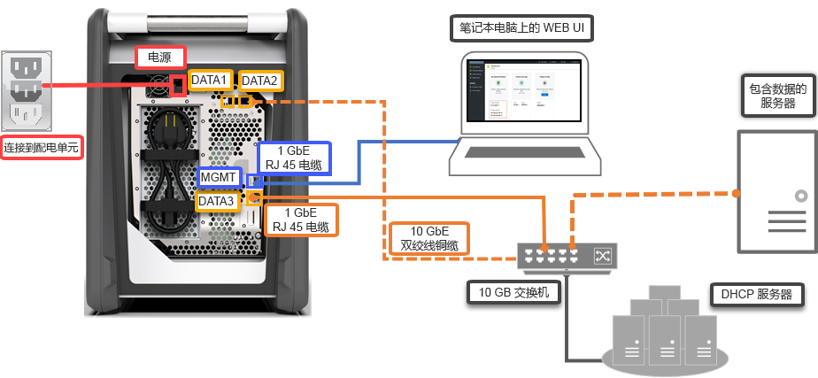

# 快速入门：使用 Azure 门户部署 Azure Data Box

本快速入门介绍如何使用 Azure 门户部署 Azure Data Box。 步骤包括如何对 Data Box 进行布线、配置和数据复制操作，以便将数据上传到 Azure。 快速入门在 Azure 门户以及设备的本地 Web UI 中完成。

有关详细的分步部署和跟踪说明，请转到[教程：订购 Azure Data Box](data-box-deploy-ordered.md)。

## 先决条件

开始之前：

- 确保用于 Data Box 服务的订阅是下述类型之一：
    - Microsoft 企业协议 (EA)。 详细了解 [EA 订阅](https://azure.microsoft.com/pricing/enterprise-agreement/)。
    - 云解决方案提供商 (CSP)。 详细了解 [Azure CSP 计划](https://docs.microsoft.com/azure/cloud-solution-provider/overview/azure-csp-overview)。
    - 使用 - 即用即付。 有关 Azure [即用即付订阅](https://azure.microsoft.com/offers/ms-azr-0003p/)的详细信息。
    - Microsoft Azure 赞助。 详细了解 [Azure 赞助计划](https://azure.microsoft.com/offers/ms-azr-0036p/)。 

- 确保有订阅的所有者或参与者访问权限，以便创建 Data Box 订单。
- 查看 [Data Box 的安全指南](data-box-safety.md)。
- 你有一台主机，其中的数据需复制到 Data Box。 该主机必须
    - 运行[支持的操作系统](data-box-system-requirements.md)。
    - 连接到高速网络。 强烈建议你至少建立一个 10 GbE 连接。 如果 10 GbE 连接不可用，则可使用 1 GbE 数据链路，但复制速度会受影响。 
- 必须找到一个可以放置 Data Box 的平面。 如需将设备置于标准的机架上，则需要数据中心机架中的一个 7U 槽。 可以将设备平放或直放在机架中。
- 你已经采购了以下电缆，用于将 Data Box 连接到主机。
    - 两根 10 GbE SFP+ Twinax 铜线（用于 DATA 1、DATA 2 网络接口）
    - 一根 RJ-45 CAT 6 网线（用于 MGMT 网络接口）
    - 一根 RJ-45 CAT 6A 网线或一根 RJ-45 CAT 6 网线（用于 DATA 3 网络接口，分别配置为 10 Gbps 或 1 Gbps）

## 登录 Azure

在 [http://portal.azure.com](http://portal.azure.com) 中登录 Azure 门户。

## 顺序

此步骤大约需要 5 分钟。

1. 在 Azure 门户中创建新的 Azure Data Box 资源。
2. 选择为此服务启用的现有订阅，然后选择“导入”作为传输类型。 提供数据所在的**来源国家/地区**，以及数据要传输到的 **Azure 目标区域**。
3. 选择“Data Box”。 最大可用容量为 80 TB；如果数据大小更大，则可创建多个订单。
4. 输入订单详细信息和发货信息。 如果该服务在你所在的区域中可用，请提供通知电子邮件地址、查看摘要，然后创建订单。

创建订单后，Microsoft 会准备需发货的设备。

## 电缆 

此步骤大约需要 10 分钟。

收到 Data Box 后，请执行以下步骤，完成设备的布线、连接和启用。 此步骤大约需要 10 分钟。

1. 如果有证据表明设备已被串改或受损，请勿继续。 请联系 Microsoft 支持部门，让其寄送更换设备。
2. 进行设备布线时，请确保有以下电缆：
    
    - （已包括）接地电源线，规格为 10 安或更高，一端有 IEC60320 C-13 连接器，用于连接到设备。
    - 一根 RJ-45 CAT 6 网线（用于 MGMT 网络接口）
    - 两根 10 GbE SFP+ Twinax 铜线（用于 10 Gbps DATA 1、DATA 2 网络接口）
    - 一根 RJ-45 CAT 6A 网线或一根 RJ-45 CAT 6 网线（用于 DATA 3 网络接口，分别配置为 10 Gbps 或 1 Gbps）

3. 在平面上移除和放置设备。 
    
4. 进行设备布线，如下所示。  

      

    1. 将电源线连接到设备。
    2. 使用 RJ-45 CAT 6 网线将主机连接到设备上的管理端口 (MGMT)。 
    3. 使用 SFP+ Twinax 铜线连接至少一个 10 Gbps（首选超过 1 Gbps）的网络接口，DATA 1 或 DATA 2 用于数据。 
    4. 打开设备。 电源按钮位于设备的前面板上。

## 连接

此步骤大约需要 5-7 分钟才能完成。

1. 若要获取设备密码，请在 [Azure 门户](http://portal.azure.com)中转到“常规”>“设备详细信息”。
2. 在用于连接到 Data Box 的计算机上，将静态 IP 地址 192.168.100.5 和子网 255.255.255.0 分配给以太网适配器。 通过 `https://192.168.100.10` 访问设备的本地 Web UI。 打开设备后，进行连接可能需要长达 5 分钟的时间。 
3. 从 Azure 门户使用密码登录。 此时会出现一个错误，指出网站的安全证书有问题。 按照特定于浏览器的说明转到该网页。
4. 默认情况下，10 Gbps（或 1 Gbps）数据接口的网络设置被配置为 DHCP。 如果需要，可以将该接口配置为静态，并提供一个 IP 地址。 

## 复制数据

完成此操作所需的时间取决于数据大小和网络速度。
 
1. 如果使用 Windows 主机，请使用兼容 SMB 的文件复制工具（如 Robocopy）。 对于 NFS 主机，请使用 `cp` 命令或 `rsync` 来复制数据。 将工具连接到设备，并开始将数据复制到共享。 若要详细了解如何使用 Robocopy 来复制数据，请参阅 [Robocopy](https://technet.microsoft.com/library/ee851678.aspx)。
2. 使用路径 `\\<IP address of your device>\ShareName` 连接到共享。 若要获取共享访问凭据，请在 Data Box 的本地 Web UI 中转到“连接和复制”页面。
3. 请确保共享和文件夹名称以及数据遵循 [Azure 存储和 Data Box 服务限制](data-box-limits.md)中描述的准则。

## 寄送到 Azure 

此操作大约需要 10-15 分钟来完成。

1. 在本地 Web UI 中转到“准备交付”页面，开始发货准备。 
2. 通过本地 Web UI 关闭设备。 移除设备的电缆。 
3. 退货标签应该在电子墨水显示器上可见。 如果电子墨水显示器不显示此标签，请从 Azure 门户下载退货标签，然后将其插入附加到设备的透明套袋中。
4. 封好包裹并邮寄给 Microsoft。 

## 验证数据

完成此操作所需的时间取决于数据大小。

1. 将 Data Box 设备连接到 Azure 数据中心网络后，数据会自动开始上传到 Azure。 
2. Azure Data Box 服务会通过 Azure 门户通知数据复制已完成。 

    1. 检查错误日志中是否包含任何错误，如有则采取相应的措施。
    2. 从源中删除数据之前，请确认数据已存储在存储帐户中。

## 清理资源

此步骤需要 2-3 分钟才能完成。

- 在订单尚未处理的情况下，可以在 Azure 门户中取消 Data Box 订单。 订单处理后，无法取消订单。 订单处理会不断进行，直到完成。 若要取消订单，请转到“概况”，然后在命令栏中单击“取消”。

- 在 Azure 门户中的状态显示为“已完成”或“已取消”后，即可删除订单。 若要删除订单，请转到“概况”，然后在命令栏中单击“删除”。

## 后续步骤

本快速入门介绍了如何部署 Azure Data Box，以便将数据导入 Azure。 若要详细了解 Azure Data Box 的管理，请转到以下教程： 

> [!div class="nextstepaction"]
> [使用 Azure 门户管理 Data Box](data-box-portal-admin.md)

