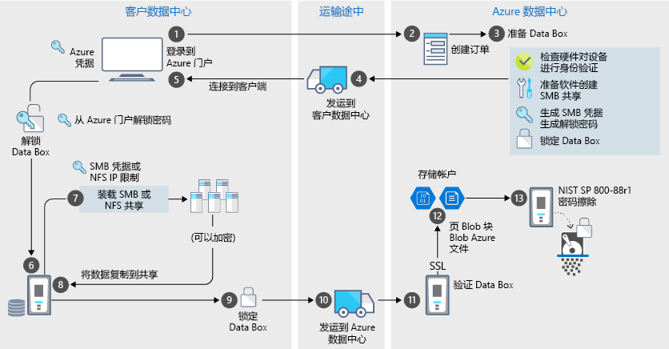

# Azure Data Box 安全性和数据保护

Data Box 确保只有经过授权的实体能够查看、修改或删除你的数据，为数据保护提供安全的解决方案。 本文介绍了帮助保护每个 Data Box 解决方案组件及其存储的数据的 Azure Data Box 安全功能。 

[!INCLUDE [GDPR-related guidance](../../includes/gdpr-intro-sentence.md)]

## 通过组件运行的数据流

Microsoft Azure Data Box 解决方案由四个彼此交互的主要组件构成：

- **Azure 中托管的 Azure Data Box 服务** – 用于创建设备订单、配置设备，然后跟踪订单完成状态的管理服务。
- **Data Box 设备** – 寄送给你的，用于将本地数据导入到 Azure 的传输设备。 
- **连接到设备的客户端/主机** – 基础结构中的客户端，它们连接到 Data Box 设备，并包含需要保护的数据。
- **云存储** – Azure 云中存储数据的位置。 这通常是链接到所创建的 Azure Data Box 资源的存储帐户。

下图指示了通过 Azure Data Box 解决方案运行的从本地到 Azure 的数据流。

## 安全功能

Data Box 确保只有经过授权的实体能够查看、修改或删除你的数据，为数据保护提供安全的解决方案。 此解决方案的安全功能适用于该磁盘，以及用于确保磁盘中存储的数据安全性的关联服务。 

### Data Box 设备保护

Data Box 设备由以下功能提供保护：

- 坚固的装置外壳，能够承受冲击、不利的运输和环境条件。 
- 防篡改封条，可以看出在运输途中发生的任何设备篡改。
- 硬件和软件篡改检测，可以防止进一步的设备操作。
- 仅运行 Data Box 特定的软件。
- 在锁定状态下启动。
- 通过设备解锁密码控制设备访问。
- 访问凭据，用于将数据复制到和复制出设备。

### Data Box 数据保护

流入和流出 Data Box 的数据由以下功能提供保护：

- 用于静态数据的 AES 256 位加密。 
- 可以为传输中数据使用加密的协议。
- 将数据上传到 Azure 后，从设备中安全擦除数据。 数据擦除根据 NIST 800-88r1 标准进行。

### Data Box 服务保护

Data Box 服务受以下功能的保护。

- 访问 Data Box 服务要求组织具备包含 Data Box 在内的 Azure 订阅。 订阅决定可以在 Azure 门户中访问的功能。
- 由于 Data Box 服务在 Azure 中托管，因此受 Azure 安全功能的保护。 有关 Microsoft Azure 提供的安全功能的详细信息，请转到 [Microsoft Azure 信任中心](https://www.microsoft.com/TrustCenter/Security/default.aspx)。 
- Data Box 服务会存储用来解锁服务中的设备的解锁密码。 
- Data box 服务在服务中存储订单详细信息和状态。 删除订单会删除这些信息。 

## 管理个人数据

Azure Data Box 在服务中收集并显示以下关键实例中的个人信息：

- **通知设置** - 创建订单时，需在通知设置下配置用户的电子邮件地址。 此信息可由管理员查看。 当作业进入终止状态或者删除订单时，服务会删除此信息。

- **订单详细信息** – 创建订单后，用户的寄送地址、电子邮件和联系信息将存储在 Azure 门户中。 保存的信息包括：

  - 联系人姓名
  - 电话号码
  - 电子邮件
  - 街道地址
  - 城市
  - 邮政编码
  - 状态
  - 国家/地区/省/区域
  - 承运商帐号
  - 运输跟踪号

    作业完成或者删除订单时，Data Box 服务会删除订单详细信息。

- **寄送地址** – 下单后，Data Box 服务会向 UPS 或 DHL 等第三方承运人提供寄送地址。 

有关详细信息，请在[信任中心](https://www.microsoft.com/trustcenter)查看 Microsoft 隐私策略。

## 安全准则参考

Data Box 中实现了以下安全准则： 

|准则   |说明   |
|---------|---------|
|[IEC 60529 IP52](https://www.iec.ch/)    | 防水防尘保护         |
|[ISTA 2A](https://ista.org/docs/2Aoverview.pdf)     | 对不利运输条件的承受力          |
|[NIST SP 800-147](https://nvlpubs.nist.gov/nistpubs/Legacy/SP/nistspecialpublication800-147.pdf)      | 安全的固件更新         |
|[FIPS 140-2 级别 2](https://csrc.nist.gov/csrc/media/publications/fips/140/2/final/documents/fips1402.pdf)      | 数据保护         |
|[NIST SP 800-88r1](https://nvlpubs.nist.gov/nistpubs/SpecialPublications/NIST.SP.800-88r1.pdf)      | 数据清理         |

## 后续步骤

- 查看 [Data Box 要求](data-box-system-requirements.md)。
- 了解 [Data Box 限制](data-box-limits.md)。
- 在 Azure 门户中快速部署 [Azure Data Box](data-box-quickstart-portal.md)。
