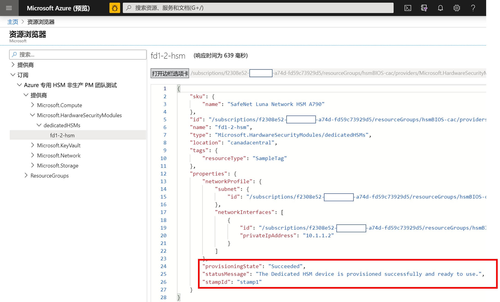
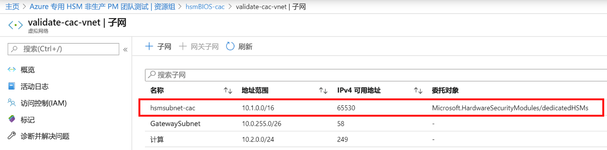
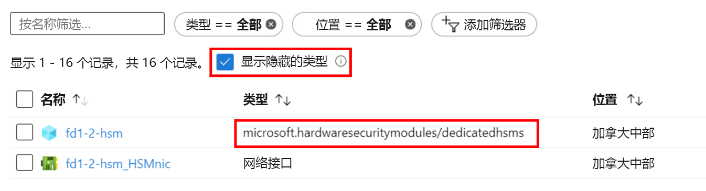

# <a name="troubleshooting-the-azure-dedicated-hsm-service"></a>排查 Azure 专用 HSM 服务问题

Azure 专用 HSM 服务有两个不同的方面。 第一个方面是指在 Azure 中注册和部署包含基础网络组件的 HSM 设备。 第二个方面是指配置 HSM 设备，做好与给定的工作负载或应用程序配合使用/集成的准备。 尽管 Azure 中的 Thales Luna Network HSM 设备与直接从 Thales 购买的相同，但由于它们是 Azure 中的资源，因此有一些独特的注意事项。 本文介绍了这些注意事项以及所产生的任何故障排除见解或最佳做法，确保关键信息的高可见性和访问权限。 开始使用此服务后，可通过向 Microsoft 或 Thales 发送支持请求直接获取权威信息。 

> [!NOTE]
> 应注意的是，在新部署的 HSM 设备上执行任何配置之前，应使用任何相关的修补程序对其进行更新。 特定的必需修补程序是 Thales 支持门户中的 [KB0019789](https://supportportal.gemalto.com/csm?id=kb_article_view&sys_kb_id=19a81c8bdb9a1fc8d298728dae96197d&sysparm_article=KB0019789)，用于解决系统在重启过程中出现的未响应问题。

## <a name="hsm-registration"></a>HSM 注册

专用 HSM 无法免费使用，因为它在云中提供硬件资源，因此是需要保护的宝贵资源。 因此，我们通过 HSMrequest@microsoft.com 借助电子邮件使用一个加入允许列表的过程。 

### <a name="getting-access-to-dedicated-hsm"></a>获取对专用 HSM 的访问权限

如果你认为专用 HSM 会满足自己的密钥存储要求，则可向 HSMrequest@microsoft.com 发送电子邮件，请求访问权限。 请概述一下你的应用程序、你想要 HSM 的区域以及想要的 HSM 的数量。 如果你与 Microsoft 代表（例如客户主管或云解决方案架构师）打交道，则请在请求中提及他们。

## <a name="hsm-provisioning"></a>HSM 预配

可以通过 CLI 或 PowerShell 在 Azure 中预配 HSM 设备。 当你注册获取此服务时，我们会为你提供一个示例 ARM 模板，并会协助你完成初始自定义。 

### <a name="hsm-deployment-failure-information"></a>HSM 部署失败信息

专用 HSM 支持使用 CLI 和 PowerShell 进行部署，因此基于门户的错误信息很有限，并不详细。 使用资源浏览器可以找到更好的信息。 门户主页有一个与此相关的图标，其中提供了更详细的错误信息。 在创建与部署问题相关的支持请求时，如果将该信息粘贴到其中，则对我们解决问题很有帮助。



### <a name="hsm-subnet-delegation"></a>HSM 子网委托
部署失败的头号原因是忘记为要在其上预配 HSM 的客户定义的子网设置适当的委托。 有关部署的 VNet 和子网先决条件中包括该委托的设置。如需更多详细信息，可参阅相关教程。



### <a name="hsm-deployment-race-condition"></a>HSM 部署争用条件

为部署提供的标准 ARM 模板具有 HSM 和 ExpressRoute 网关相关资源。 若要成功进行 HSM 部署，网络资源不可或缺。时机可能很关键。  有时，我们发现部署失败与依赖项问题有关，重新运行部署通常可以解决问题。 如果那样行不通，则删除资源后重新进行部署通常就会成功。 这样尝试以后，如果仍然出现问题，请在 Azure 门户中选择“配置 Azure 安装程序时遇到问题”作为问题类型，提交一项支持请求。

### <a name="hsm-deployment-using-terraform"></a>使用 Terraform 进行 HSM 部署

一些客户已使用 Terraform 作为自动化环境，而不是使用在注册获取此服务时获得的 ARM 模板。 HSM 不能以这种方式部署，但所依赖的网络资源可以。 Terraform 可以通过模块调用一个只有 HSM 部署的最小 ARM 模板。  在这种情况下，应注意确保在部署 HSM 之前网络资源（例如所需的 ExpressRoute 网关）已完全部署好。 以下 CLI 命令可用于测试是否已按要求完成部署并进行集成。 将尖括号占位符替换为具体命名。 应查找“provisioningState 成功”结果

```azurecli
az resource show --ids /subscriptions/<subid>/resourceGroups/<myresourcegroup>/providers/Microsoft.Network/virtualNetworkGateways/<myergateway>
```

### <a name="deployment-failure-based-on-quota"></a>因配额而导致的部署失败
如果超出每个缩放单元 2 个 HSM 和每个区域 4 个 HSM 的限制，部署可能会失败。 若要避免这种情况，请确保先删除以前失败的部署中的资源，然后再重新部署。 请参照下面的“如何查看 HSM”项来检查资源。 如果你认为需要超出该配额（这主要是作为一种保护措施），请将详细信息通过电子邮件发送给 HSMrequest@microsoft.com。

### <a name="deployment-failure-based-on-capacity"></a>因容量而导致的部署失败
如果某个特定的缩放单元或区域已满，即几乎所有的免费 HSM 均已预配，则可能会导致部署失败。 每个缩放单元有 11 个可供客户使用的 HSM，这意味着每个区域有 22 个。 每个缩放单元中还有 3 个备件和 1 个测试设备。 如果你认为自己可能已达到限制，请向 HSMrequest@microsoft.com 发送电子邮件，了解特定缩放单元的填充水平。

###  <a name="how-do-i-see-hsms-when-provisioned"></a>在已预配的情况下，如何查看 HSM？
专用 HSM 是一项已加入允许列表的服务，因此在 Azure 门户中被视为“隐藏类型”。 若要查看 HSM 资源，必须勾选“显示隐藏的类型”复选框，如下所示。 HSM 始终带有 NIC 资源。在使用 SSH 进行连接之前，可以在该资源中找出 HSM 的 IP 地址。



## <a name="networking-resources"></a>网络资源

专用 HSM 的部署依赖于网络资源以及一些需要注意的重要限制。

### <a name="provisioning-expressroute"></a>预配 ExpressRoute

专用 HSM 使用 ExpressRoute 网关作为“隧道”在 Azure 数据中心的客户专用 IP 地址空间与物理 HSM 之间通信。  考虑到存在一个 VNet 一个网关的限制，因此，如果需要通过 ExpressRoute 连接到本地资源，客户必须使用另一 VNet 进行该连接。  

### <a name="hsm-private-ip-address"></a>HSM 专用 IP 地址

为专用 HSM 提供的示例模板假设可以自动从给定的子网范围中获取 HSM IP。 可以通过 ARM 模板中的“NetworkInterfaces”属性指定 HSM 的显式 IP 地址。 


## <a name="hsm-initialization"></a>HSM 初始化

初始化准备新的 HSM 是为了使用，准备现有的 HSM 是为了重用。 必须先完成 HSM 的初始化，然后才能生成或存储对象、允许客户端进行连接，或执行加密操作。

### <a name="lost-credentials"></a>凭据丢失

Shell 管理员密码丢失会导致 HSM 密钥材料丢失。 应提交支持请求来重置 HSM。
初始化 HSM 时，请以安全方式存储凭据。 Shell 和 HSM 凭据应根据公司的策略进行保存。

### <a name="failed-logins"></a>登录失败

向 HSM 提供不正确的凭据可能会产生破坏性后果。 下面是 HSM 角色的默认行为。

| 角色 | 阈值（尝试次数） | 错误的登录尝试次数过多的结果 | 恢复 |
|--|--|--|--|
| HSM SO | 3 |  HSM 归零（所有 HSM 对象标识和所有分区都消失）  |  HSM 必须重新初始化。 可以从备份中还原内容。 | 
| 分区 SO | 10 |  分区归零。 |  分区必须重新初始化。 可以从备份中还原内容。 |  
| 审核 | 10 | 锁定 | 10 分钟后自动解锁。 |  
| 加密管理人员 | 10（可以减少） | 如果将“HSM 策略15:允许对分区 PIN 进行 SO 重置”设置为 1（启用），则会锁定 CO 和 CU 角色。<br>如果将“HSM 策略15:允许对分区 PIN 进行 SO 重置”设置为 0（禁用），则会永久锁定 CO 和 CU 角色，分区内容将再也无法访问。 这是默认设置。 | 必须使用 `role resetpw -name co` 解锁 CO 角色并通过分区 SO 重置凭据。<br>必须重新初始化分区，并从备份设备还原密钥材料。 |  

## <a name="hsm-configuration"></a>HSM 配置 

以下各项是配置错误很常见或者有必要强调其影响的情况：

### <a name="hsm-documentation-and-software"></a>HSM 文档和软件
Thales SafeNet Luna 7 HSM 设备的软件和文档不由 Microsoft 提供，必须直接从 Thales 下载。 在注册过程中，需要使用收到的 Thales 客户 ID 进行注册。 由 Microsoft 提供的设备的软件版本为 7.2，固件版本为 7.0.3。 Thales 于 2020 年初将文档公开，该文档可在[此处](https://thalesdocs.com/gphsm/luna/7.2/docs/network/Content/Home_network.htm)找到。  

### <a name="hsm-networking-configuration"></a>HSM 网络配置

在 HSM 中配置网络时请小心。  HSM 通过 ExpressRoute 网关从客户专用 IP 地址空间直接连接到 HSM。  此信道仅用于客户通信，Microsoft 无权访问。 如果 HSM 的配置方式使此网络路径受到影响，则会删除与 HSM 的所有通信。  在这种情况下，唯一的选择是通过 Azure 门户提出 Microsoft 支持请求，以重置设备。 此重置过程会将 HSM 重新设置为其初始状态，所有配置和密钥材料都会丢失。  必须重新创建配置。当设备加入 HA 组时，会复制密钥材料。  

### <a name="hsm-device-reboot"></a>HSM 设备重启

某些配置更改需要重启 HSM。 Microsoft 在 Azure 中对 HSM 的测试表明，在某些情况下，重启可能会停止响应。 这意味着必须在 Azure 门户中创建支持请求，请求强行重启。考虑到这是一个需要在 Azure 数据中心完成的手动过程，这可能需要长达 48 小时的时间才能完成。  若要避免这种情况，请确保已部署直接从 Thales 获得的重启修补程序。 请参阅 Thales Luna Network HSM 7.2 下载内容中的 [KB0019789](https://supportportal.gemalto.com/csm?sys_kb_id=d66911e2db4ffbc0d298728dae9619b0&id=kb_article_view&sysparm_rank=1&sysparm_tsqueryId=d568c35bdb9a4850d6b31f3b4b96199e&sysparm_article=KB0019789)，获取一个建议用于解决系统在重启过程中出现的未响应问题的修补程序（注意：需要在 Thales 支持门户中注册才能下载）。

### <a name="ntls-certificates-out-of-sync"></a>NTLS 证书不同步
当证书过期或被配置更新的内容覆盖时，客户端可能会失去与 HSM 的连接。 应该针对每个 HSM 重新应用证书交换客户端配置。
证书无效的 NTLS 日志记录示例：

> NTLS[8508]: info :0 :Incoming connection request... :192.168.50.2/59415 NTLS[8508]:Error message from SSLAccept is : error:14094418:SSL routines:ssl3_read_bytes:tlsv1 alert unknown ca NTLS[8508]:Error during SSL accept ( RC_SSL_ERROR ) NTLS[8508]: info :0xc0000711 :Fail to establish a secure channel with client :192.168.50.2/59415 :RC_SSL_FAILED_HANDSHAKE NTLS[8508]: info :0 :NTLS Client "Unknown host name" Connection instance removed :192.168.50.2/59415

### <a name="failed-tcp-communication"></a>TCP 通信失败

通过 Luna 客户端安装与 HSM 通信至少需要 TCP 端口 1792。 当环境中的任何网络配置变化时，请考虑这一点。

### <a name="failed-ha-group-member-doesnt-recover"></a>发生故障的 HA 组成员无法恢复

如果某个发生故障的 HA 组成员无法恢复，则必须使用 hagroup recover 命令以手动方式从 Luna 客户端恢复它。
若要启用自动恢复，需要配置 HA 组的重试计数。 默认情况下，HA 组在恢复时不会尝试将 HA 成员恢复到组中。

### <a name="ha-group-doesnt-sync"></a>HA 组不同步

如果成员分区没有相同的克隆域，则 ha synchronize 命令会显示以下内容：警告：同步可能会失败。  槽位 0 和槽位 1 中的成员的私钥克隆设置冲突。
应将具有正确克隆域的新分区添加到 HA 组，然后删除错误配置的分区。

## <a name="hsm-deprovisioning"></a>HSM 取消预配 

仅当 HSM 的操作完全完成后，才能取消它的预配，然后 Microsoft 会重置它并将它返回到可用池。 

### <a name="how-to-delete-an-hsm-resource"></a>如何删除 HSM 资源

除非 HSM 处于“已归零”状态，否则无法删除 HSM 的 Azure 资源。  因此，在尝试将其作为资源删除之前，必须先删除所有的密钥材料。 归零的最快速方式是让 HSM 管理员密码错误 3 次（注意：这是指 HSM 管理员，而不是设备级别管理员）。 Luna shell 确实有一个用于归零的 `hsm -factoryreset` 命令，但该命令只能通过控制台在串行端口上执行，客户无法访问该命令。

## <a name="next-steps"></a>后续步骤

本文阐述了 HSM 部署生命周期中涉及的各个领域，这些领域可能存在问题、需要进行故障排除或需要仔细考虑。 但愿这篇文章能够让你消除不必要的延迟和困扰。如果你有相关的添加或更改内容，请向 Microsoft 提交支持请求，让我们知道。 
