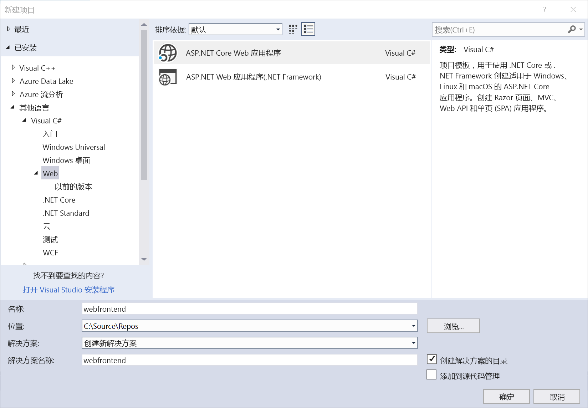
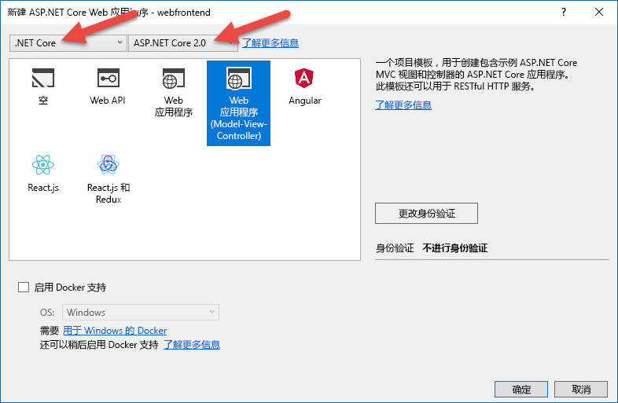
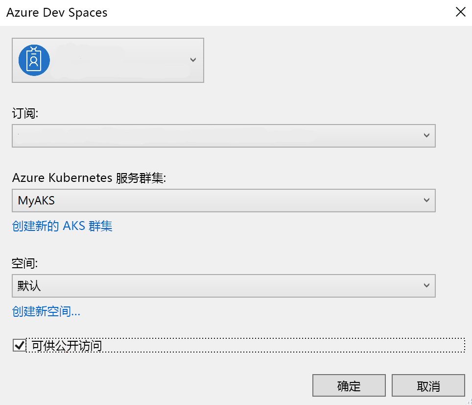
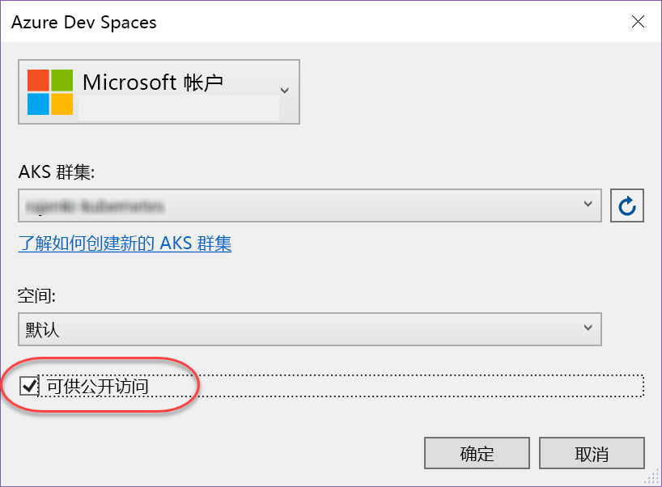
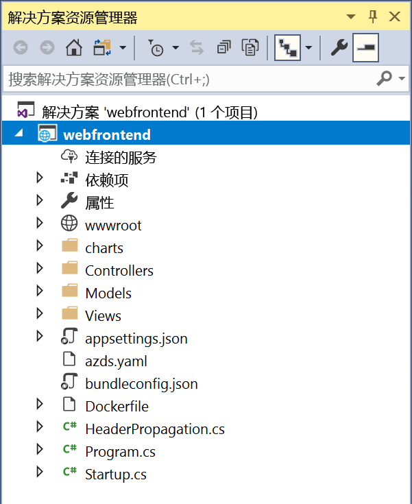

# 在 .NET Core 和 Visual Studio 中开始使用 Azure Dev Spaces

本指南介绍如何：

- 使用 Azure 中的托管 Kubernetes 群集设置 Azure Dev Spaces。
- 使用 Visual Studio 在容器中以迭代方式开发代码。
- 独立开发两个独立的服务，并使用 Kubernetes 的 DNS 服务发现来调用另一个服务。
- 在团队环境中高效地开发和测试代码。

[!INCLUDE]

[!INCLUDE]

## 获取 Visual Studio 工具
1. 安装最新版本的 [Visual Studio 2017](https://www.visualstudio.com/vs/)
1. 在 Visual Studio 安装程序中，确保选中以下工作负荷：
    * ASP.NET 和 Web 开发
1. 安装 [Visual Studio Tools for Kubernetes](https://aka.ms/get-azds-visualstudio)

## 创建在容器中运行的 Web 应用

在此部分中，将创建一个 ASP.NET Core Web 应用并让其在 Kubernetes 的容器中运行。

### 创建 ASP.NET Web 应用

在 Visual Studio 2017 中创建新项目。 目前，该项目必须是 **ASP.NET Core Web 应用程序**。 将该项目命名为“webfrontend”。

选择“Web 应用程序(模型-视图-控制器)”模板，确保以对话框顶部两个下拉列表中的 **.NET Core** 和 **ASP.NET Core 2.0** 为目标。 单击“确定”以创建该项目  。

### 为 AKS 群集启用 Dev Spaces

使用刚才创建的项目，从启动设置下拉列表中选择“Azure Dev Spaces”，如下所示。

在旁边显示的对话框中，确保已使用适当的帐户登录，然后选择一个现有的 Kubernetes 群集。

暂时让“空间”下拉列表默认为 `default`。 稍后会详细介绍此选项。 选中“可公开访问”复选框，允许通过公共终结点访问 Web 应用。 此设置不是必需的，但可以稍后用来在本演练中演示某些概念。 但请勿担心，不管什么情况，都可以使用 Visual Studio 来调试网站。

单击“确定”，选择或创建群集。

如果选择的群集不支持使用 Azure Dev Spaces，则会显示一条消息，询问是否需要对其进行配置。

选择“确定”。

 将会启动一项后台任务来完成此操作。 将需要数分钟才能完成。 若要查看它是否仍在创建，请将鼠标指针悬停在状态栏左下角的“后台任务”图标上方，如下图所示。

> [!Note]
> 在成功创建开发空间之前，无法调试应用程序。

### 查看添加到项目的文件
在等待开发空间创建的过程中，可以在选择使用开发空间时查看已添加到项目的文件。

首先，可以看到添加了名为 `charts` 的文件夹，而在该文件夹中，已为应用程序的 [Helm 图表](https://docs.helm.sh)构建了基架。 这些文件用于将应用程序部署到开发空间中。

可以看到添加了名为 `Dockerfile` 的文件。 此文件提供的信息是以标准 Docker 格式将应用程序打包所必需的。

最后，你将看到一个名为 `azds.yaml` 的文件，其中包含开发空间所需的开发时配置。

## 在 Kubernetes 中调试容器
成功创建开发空间之后，即可调试应用程序。 在代码中设置一个断点，例如在设置 `Message` 变量时所在的 `HomeController.cs` 文件的第 20 行处设置断点。 单击“F5”开始调试。 

Visual Studio 会与生成和部署应用程序所需的开发空间通信，然后打开有 Web 应用运行的浏览器。 容器看起来像是在本地运行，但实际上是在 Azure 的开发空间中运行。 使用 localhost 地址的原因是 Azure Dev Spaces 会创建一个通往在 AKS 中运行的容器的临时 SSH 隧道。

单击页面顶部的“关于”链接即可触发断点。 可以不受限制地访问调试信息（例如调用堆栈、局部变量、异常信息等），就像在本地执行代码一样。

## 以迭代方式开发代码

Azure Dev Spaces 不仅仅是用来让代码在 Kubernetes 中运行，它还可以用来快速地以迭代方式查看所做的代码更改在云的 Kubernetes 环境中的效果。

### 更新内容文件
1. 找到 `./Views/Home/Index.cshtml` 文件，对 HTML 进行编辑。 例如，将第 70 行的 `<h2>Application uses</h2>` 更改为类似 `<h2>Hello k8s in Azure!</h2>` 的内容
1. 保存文件。
1. 转到浏览器并刷新页面。 此时会看到网页显示更新的 HTML。

发生了什么情况？ 对内容文件（例如 HTML 和 CSS）所做的编辑不需要在 .NET Core Web 应用中进行重新编译，因此，活动的 F5 会话会自动将任何修改的内容文件同步到 AKS 中正在运行的容器，方便你立即查看所做的内容编辑。

### 更新代码文件
更新代码文件需要的工作多一些，因为 .NET Core 应用需重新构建并生成更新的应用程序二进制文件。

1. 停止 Visual Studio 中的调试器。
1. 打开名为 `Controllers/HomeController.cs` 的代码文件，编辑“关于”页面将显示的消息：`ViewData["Message"] = "Your application description page.";`
1. 保存文件。
1. 按 **F5** 再次开始调试。 

Azure Dev Spaces 不会在每次进行代码编辑时都重新生成和重新部署新的容器映像（这通常需要很长时间），而是在现有的容器中以增量方式重新编译代码，加快编辑/调试循环速度。

刷新浏览器中的 Web 应用，然后转到“关于”页面。 此时会看到自定义消息显示在 UI 中。

## 后续步骤

> [!div class="nextstepaction"]
> [了解团队开发](team-development-netcore-visualstudio.md)
