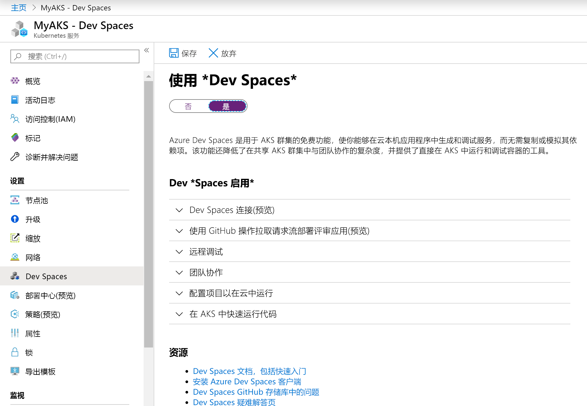
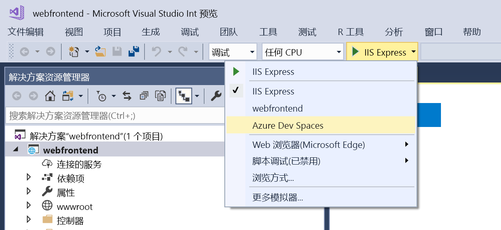
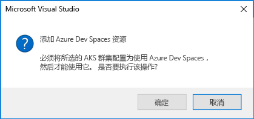

# <a name="quickstart-debug-and-iterate-on-kubernetes-visual-studio--net-core---azure-dev-spaces"></a>快速入门：在 Kubernetes 上进行调试和循环访问：Visual Studio 和 .NET Core - Azure Dev Spaces

本指南介绍如何：

- 使用 Azure 中的托管 Kubernetes 群集设置 Azure Dev Spaces。
- 使用 Visual Studio 在容器中以迭代方式开发代码。
- 使用 Visual Studio 调试群集中运行的代码。

Azure Dev Spaces 还允许使用以下方法进行调试和迭代：
- [Java 和 Visual Studio Code](quickstart-java.md)
- [Node.js 和 Visual Studio Code](quickstart-nodejs.md)
- [.NET Core 和 Visual Studio Code](quickstart-netcore.md)

## <a name="prerequisites"></a>先决条件

- Azure 订阅。 如果没有帐户，可以[创建一个免费帐户](https://azure.microsoft.com/free)。
- 已安装包含“Azure 开发”工作负荷的 Windows 版 Visual Studio 2019。 如果尚未安装 Visual Studio，请在[此处](https://aka.ms/vsdownload?utm_source=mscom&utm_campaign=msdocs)下载。

## <a name="create-an-azure-kubernetes-service-cluster"></a>创建 Azure Kubernetes 服务群集

必须在[支持的区域][supported-regions]中创建 AKS 群集。 创建群集：

1. 登录到 [Azure 门户](https://portal.azure.com)
1. 选择“+ 创建资源”>“Kubernetes 服务”。 
1. 输入“订阅”、“资源组”、“Kubernetes 群集名称”、“区域”、“Kubernetes 版本”和“DNS 名称前缀”。     

    

1. 单击“查看 + 创建”。
1. 单击“创建”。

## <a name="enable-azure-dev-spaces-on-your-aks-cluster"></a>在 AKS 群集上启用 Azure Dev Spaces

在 Azure 门户中导航到你的 AKS 群集，然后单击“Dev Spaces”。 将“使用 Dev Spaces”更改为“是”，然后单击“保存”。  



## <a name="create-a-new-aspnet-web-app"></a>创建新的 ASP.NET Web 应用

1. 打开 Visual Studio。
1. 创建一个新的项目。
1. 选择“ASP.NET Core Web 应用程序”，然后单击“下一步” 。
1. 为项目“webfrontend”命名并单击“创建” 。
1. 出现提示时，请为模板选择“Web 应用程序(模型-视图-控制器)”。
1. 选择顶部的“.NET Core”和“ASP.NET Core 2.1”。 
1. 单击“创建”。

## <a name="connect-your-project-to-your-dev-space"></a>将项目连接到开发空间

在项目中，从启动设置下拉列表中选择“Azure Dev Spaces”，如下所示。



在“Azure Dev Spaces”对话框中，选择你的订阅和 Azure Kubernetes 群集。  将“空间”保留设置为“默认”，并选中“可公开访问”复选框。   单击“确定”。


此过程会使用可公开访问的 URL 将你的服务部署到默认开发空间。 如果选择的群集尚未配置为与 Azure Dev Spaces 一起使用，则会显示一条消息，询问你是否需要对其进行配置。 单击“确定”。



在默认开发空间中运行的服务的公共 URL 将显示在“输出”窗口中： 

```cmd
Starting warmup for project 'webfrontend'.
Waiting for namespace to be provisioned.
Using dev space 'default' with target 'MyAKS'
...
Successfully built 1234567890ab
Successfully tagged webfrontend:devspaces-11122233344455566
Built container image in 39s
Waiting for container...
36s

Service 'webfrontend' port 'http' is available at `http://default.webfrontend.1234567890abcdef1234.eus.azds.io/`
Service 'webfrontend' port 80 (http) is available at http://localhost:62266
Completed warmup for project 'webfrontend' in 125 seconds.
```

在上面的示例中，公共 URL 为 `http://default.webfrontend.1234567890abcdef1234.eus.azds.io/`。 

选择“调试”，然后选择“开始调试”。  几秒钟后，服务会启动，Visual Studio 会打开一个浏览器，其中包含服务的公共 URL。 如果浏览器未自动打开，请在浏览器中导航到服务的公共 URL，并与开发空间中运行的服务交互。

此过程可能已禁用了对你的服务的公共访问。 若要启用公共访问，可以更新 [values.yaml 中的入口值][ingress-update]。

## <a name="update-code"></a>更新代码

如果 Visual Studio 仍连接到开发空间，请单击“停止”按钮。 将 `Controllers/HomeController.cs` 中的第 20 行更改为：
    
```csharp
ViewData["Message"] = "Your application description page in Azure.";
```

保存所做的更改，选择“调试”，然后选择“开始调试”。  几秒钟后，服务会启动，Visual Studio 会打开一个浏览器，其中包含服务的公共 URL。 如果浏览器未自动打开，请在浏览器中导航服务的公共 URL，然后单击“关于”。 可以看到，显示了更新的消息。

Azure Dev Spaces 不会在每次进行代码编辑时都重新生成和重新部署新的容器映像，而是在现有的容器中以增量方式重新编译代码，以加快编辑/调试循环的速度。

## <a name="setting-and-using-breakpoints-for-debugging"></a>设置并使用用于调试的断点

如果 Visual Studio 仍连接到开发空间，请单击“停止”按钮。 打开 `Controllers/HomeController.cs` 并单击第 20 行中的某个位置，以将光标置于此处。 若要设置断点，请按 *F9*，或者依次单击“调试”、“切换断点”。  若要在开发空间中以调试模式启动服务，请按 *F5*，或者依次单击“调试”、“开始调试”。 

在浏览器中打开服务，你会发现未显示任何消息。 返回 Visual Studio，将会看到第 20 行已突出显示。 设置的断点在第 20 行处暂停了服务。 若要恢复服务，请按 *F5*，或者依次单击“调试”、“继续”。  返回浏览器，你会发现，现在显示了消息。

在附加调试器的情况下在 Kubernetes 中运行服务时，你对调试信息（例如调用堆栈、局部变量和异常信息）拥有完全访问权限。

将光标置于 `Controllers/HomeController.cs` 中的第 20 行并按 *F9* 以删除断点。

## <a name="clean-up-your-azure-resources"></a>清理 Azure 资源

在 Azure 门户中导航到你的资源组，然后单击“删除资源组”。 或者，可以使用 [az aks delete](/cli/azure/aks#az-aks-delete) 命令：

```azurecli
az group delete --name MyResourceGroup --yes --no-wait
```

## <a name="next-steps"></a>后续步骤

> [!div class="nextstepaction"]
> [使用多个容器和团队开发](multi-service-netcore-visualstudio.md)

[ingress-update]: how-dev-spaces-works-up.md#how-running-your-code-is-configured
[supported-regions]: https://azure.microsoft.com/global-infrastructure/services/?products=kubernetes-service
