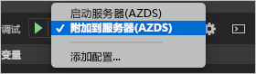

# <a name="quickstart-develop-with-nodejs-on-kubernetes-using-azure-dev-spaces"></a>快速入门：使用 Azure Dev Spaces 在 Kubernetes 上进行 Node.js 开发

本指南介绍如何：

- 使用 Azure 中的托管 Kubernetes 群集设置 Azure Dev Spaces。
- 在容器中使用 Visual Studio Code 和命令行以迭代方式开发代码。
- 通过 Visual Studio Code 调试开发空间中的代码。

## <a name="prerequisites"></a>先决条件

- Azure 订阅。 如果没有 Azure 订阅，可以创建一个[免费帐户](https://azure.microsoft.com/free)。
- [已安装 Visual Studio Code](https://code.visualstudio.com/download)。
- 已安装适用于 Visual Studio Code 的 [Azure Dev Spaces](https://marketplace.visualstudio.com/items?itemName=azuredevspaces.azds) 扩展。
- [已安装 Azure CLI](/cli/azure/install-azure-cli?view=azure-cli-latest)。

## <a name="create-an-azure-kubernetes-service-cluster"></a>创建 Azure Kubernetes 服务群集

需要在[支持的区域][supported-regions]中创建 AKS 群集。 以下命令创建名为 *MyResourceGroup* 的资源组，以及名为 *MyAKS* 的 AKS 群集。

```cmd
az group create --name MyResourceGroup --location eastus
az aks create -g MyResourceGroup -n MyAKS --location eastus --node-vm-size Standard_DS2_v2 --node-count 1 --disable-rbac --generate-ssh-keys
```

## <a name="enable-azure-dev-spaces-on-your-aks-cluster"></a>在 AKS 群集上启用 Azure Dev Spaces

使用 `use-dev-spaces` 命令在 AKS 群集上启用 Dev Spaces，然后按提示操作。 以下命令在 *MyResourceGroup* 组中的 *MyAKS* 群集上启用 Dev Spaces，并创建一个默认开发空间。 

```cmd
$ az aks use-dev-spaces -g MyResourceGroup -n MyAKS

'An Azure Dev Spaces Controller' will be created that targets resource 'MyAKS' in resource group 'MyResourceGroup'. Continue? (y/N): y

Creating and selecting Azure Dev Spaces Controller 'MyAKS' in resource group 'MyResourceGroup' that targets resource 'MyAKS' in resource group 'MyResourceGroup'...2m 24s

Select a dev space or Kubernetes namespace to use as a dev space.
 [1] default
Type a number or a new name: 1

Kubernetes namespace 'default' will be configured as a dev space. This will enable Azure Dev Spaces instrumentation for new workloads in the namespace. Continue? (Y/n): Y

Configuring and selecting dev space 'default'...3s

Managed Kubernetes cluster 'MyAKS' in resource group 'MyResourceGroup' is ready for development in dev space 'default'. Type `azds prep` to prepare a source directory for use with Azure Dev Spaces and `azds up` to run.
```

## <a name="get-sample-application-code"></a>获取示例应用程序代码

本文使用 [Azure Dev Spaces 示例应用程序](https://github.com/Azure/dev-spaces)来演示 Azure Dev Spaces 的用法。

克隆 GitHub 中的应用程序，并导航到 *dev-spaces/samples/nodejs/getting-started/webfrontend* 目录：

```cmd
git clone https://github.com/Azure/dev-spaces
cd dev-spaces/samples/nodejs/getting-started/webfrontend
```

## <a name="prepare-the-application"></a>准备应用程序

使用 `azds prep` 命令生成 Docker 和 Helm 图表资产，以便在 Kubernetes 中运行应用程序：

```cmd
azds prep --public
```

必须在 *dev-spaces/samples/nodejs/getting-started/webfrontend* 目录下运行 `prep` 命令才能正确生成 Docker 和 Helm 图表资产。

## <a name="build-and-run-code-in-kubernetes"></a>在 Kubernetes 中生成并运行代码

使用 `azds up` 命令在 AKS 中生成并运行代码：

```cmd
$ azds up
Using dev space 'default' with target 'MyAKS'
Synchronizing files...2s
Installing Helm chart...2s
Waiting for container image build...2m 25s
Building container image...
Step 1/8 : FROM node
Step 2/8 : ENV PORT 80
Step 3/8 : EXPOSE 80
Step 4/8 : WORKDIR /app
Step 5/8 : COPY package.json .
Step 6/8 : RUN npm install
Step 7/8 : COPY . .
Step 8/8 : CMD ["npm", "start"]
Built container image in 6m 17s
Waiting for container...13s
Service 'webfrontend' port 'http' is available at http://webfrontend.1234567890abcdef1234.eus.azds.io/
Service 'webfrontend' port 80 (http) is available at http://localhost:54256
...
```

打开 `azds up` 命令输出中显示的公共 URL，可以看到服务正在运行。 在此示例中，公共 URL 为 *http://webfrontend.1234567890abcdef1234.eus.azds.io/* 。

如果使用 *Ctrl+C* 停止 `azds up` 命令，服务将继续在 AKS 中运行，并且公共 URL 仍然可用。

## <a name="update-code"></a>更新代码

若要部署服务的更新版本，可以更新项目中的任何文件，然后重新运行 `azds up` 命令。 例如：

1. 如果 `azds up` 仍在运行，请按 *Ctrl+C*。
1. 将 [`server.js`中的第 10 行](https://github.com/Azure/dev-spaces/blob/master/samples/nodejs/getting-started/webfrontend/server.js#L10)更新为：
    
    ```javascript
        res.send('Hello from webfrontend in Azure');
    ```

1. 保存所做更改。
1. 重新运行 `azds up` 命令：

    ```cmd
    $ azds up
    Using dev space 'default' with target 'MyAKS'
    Synchronizing files...1s
    Installing Helm chart...3s
    Waiting for container image build...
    ...    
    ```

1. 导航到正在运行的服务并观察所做的更改。
1. 按 *Ctrl+C* 停止 `azds up` 命令。

## <a name="initialize-code-for-debugging-in-kubernetes-with-visual-studio-code"></a>使用 Visual Studio Code 初始化用于在 Kubernetes 中进行调试的代码

打开 Visual Studio Code，依次单击“文件”、“打开...”，导航到 *dev-spaces/samples/nodejs/getting-started/webfrontend* 目录，然后单击“打开”。   

现在，Visual Studio Code 中会打开 *webfrontend* 项目，这是使用 `azds up` 命令运行的同一个服务。 若要使用 Visual Studio Code 而不是直接使用 `azds up` 在 AKS 中调试此服务，需要准备好此项目，以使用 Visual Studio Code 来与开发空间通信。

若要在 Visual Studio Code 中打开命令面板，请依次单击“视图”、“命令面板”。   开始键入 `Azure Dev Spaces` 并单击 `Azure Dev Spaces: Prepare configuration files for Azure Dev Spaces`。


此命令会准备好项目，使之直接通过 Visual Studio Code 在 Azure Dev Spaces 中运行。 它还会在项目的根目录下生成包含调试配置的 *.vscode* 目录。

## <a name="build-and-run-code-in-kubernetes-from-visual-studio-code"></a>通过 Visual Studio Code 在 Kubernetes 中生成并运行代码

单击左侧的“调试”图标，然后单击顶部的“启动服务器(AZDS)”。  


此命令会以调试模式在 Azure Dev Spaces 中生成并运行服务。 底部的“终端”窗口会显示运行 Azure Dev Spaces 的服务的生成输出和 URL。  “调试控制台”会显示日志输出。 

> [!Note]
> 如果在“命令面板”中看不到任何 Azure Dev Spaces 命令，请确保已安装[适用于 Azure Dev Spaces 的 Visual Studio Code 扩展](https://marketplace.visualstudio.com/items?itemName=azuredevspaces.azds)。  另请确认是否在 Visual Studio Code 中打开了 *dev-spaces/samples/nodejs/getting-started/webfrontend* 目录。

依次单击“调试”、“停止调试”以停止调试器。  

## <a name="setting-and-using-breakpoints-for-debugging"></a>设置并使用用于调试的断点

使用“启动服务器(AZDS)”启动服务。 

依次单击“视图”、“资源管理器”，导航回到“资源管理器”视图。    打开 `server.js` 并单击第 10 行中的某个位置，以将光标置于此处。 若要设置断点，请按 *F9*，或者依次单击“调试”、“切换断点”。  

在浏览器中打开服务，你会发现未显示任何消息。 返回 Visual Studio Code，将会看到，第 10 行已突出显示。 设置的断点在第 10 行处暂停了服务。 若要恢复服务，请按 *F5*，或者依次单击“调试”、“继续”。   返回浏览器，你会发现，现在显示了消息。

在附加调试器的情况下在 Kubernetes 中运行服务时，你对调试信息（例如调用堆栈、局部变量和异常信息）拥有完全访问权限。

将光标置于 `server.js` 中的第 10 行并按 *F9* 以删除断点。

依次单击“调试”、“停止调试”以停止调试器。  

## <a name="update-code-from-visual-studio-code"></a>在 Visual Studio Code 中更新代码

将调试模式更改为“附加到服务器(AZDS)”并启动服务： 



此命令在 Azure Dev Spaces 中生成并运行你的服务。 此外，它还会在服务的容器中启动 [nodemon](https://nodemon.io) 进程，并将 VS Code 附加到该进程。 如果源代码发生了更改，*nodemon* 进程允许自动重启，这样可以加速内部循环的开发，就如同在本地计算机上进行开发一样。

启动服务后，使用浏览器导航到该服务并与之交互。

服务正在运行时，请返回 VS Code 并更新 `server.js` 中的第 10 行。 例如：
```javascript
    res.send('Hello from webfrontend in Azure while debugging!');
```

保存文件并在浏览器中返回到你的服务。 与服务交互，你会发现已显示更新的消息。

运行 *nodemon* 时，一旦检测到任何代码更改，Node 进程就会自动重启。 此自动重启进程类似于在本地计算机上编辑和重启服务，可以提供内部循环开发体验。

## <a name="clean-up-your-azure-resources"></a>清理 Azure 资源

```cmd
az group delete --name MyResourceGroup --yes --no-wait
```

## <a name="next-steps"></a>后续步骤

了解 Azure Dev Spaces 如何帮助开发跨多个容器的更复杂应用程序，以及如何通过在不同的空间中使用不同的代码版本或分支来简化协作式开发。

> [!div class="nextstepaction"]
> [使用多个容器和团队开发](multi-service-nodejs.md)


[supported-regions]: about.md#supported-regions-and-configurations