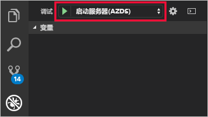
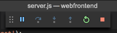

# <a name="quickstart-create-a-kubernetes-development-environment-with-azure-dev-spaces-nodejs"></a>快速入门：使用 Azure Dev Spaces 创建 Kubernetes 开发环境 (Node.js)


[!INCLUDE[](includes/learning-objectives.md)]

[!INCLUDE[](includes/see-troubleshooting.md)]

现在可以在 Azure 中创建基于 Kubernetes 的开发环境了。

[!INCLUDE[](includes/portal-aks-cluster.md)]

## <a name="install-the-azure-cli"></a>安装 Azure CLI
Azure Dev Spaces 需要进行最基本的本地计算机设置。 开发环境的大部分配置存储在云中，可以与其他用户共享。 一开始请下载并运行 [Azure CLI](/cli/azure/install-azure-cli?view=azure-cli-latest)。 

> [!IMPORTANT]
> 如果已安装 Azure CLI，请确保使用 2.0.32 或更高版本。

[!INCLUDE[](includes/sign-into-azure.md)]

[!INCLUDE[](includes/use-dev-spaces.md)]

[!INCLUDE[](includes/install-vscode-extension.md)]

可以一边等待环境的创建，一边开始编写代码。

## <a name="create-a-nodejs-container-in-kubernetes"></a>在 Kubernetes 中创建 Node.js 容器

在此部分，需创建一个 Node.js Web 应用并让其在 Kubernetes 的容器中运行。

### <a name="create-a-nodejs-web-app"></a>创建 Node.js Web 应用
请从 GitHub 下载代码，方法是：导航到 https://github.com/Azure/dev-spaces，然后选择“Clone or Download”（克隆或下载），将 GitHub 存储库下载到本地环境。 本指南的代码位于 `samples/nodejs/getting-started/webfrontend` 中。

[!INCLUDE[](includes/azds-prep.md)]

[!INCLUDE[](includes/build-run-k8s-cli.md)]

### <a name="update-a-content-file"></a>更新内容文件
Azure Dev Spaces 不仅仅是用来让代码在 Kubernetes 中运行，它还可以用来快速地以迭代方式查看所做的代码更改在云的 Kubernetes 环境中的效果。

1. 找到 `./public/index.html` 文件，对 HTML 进行编辑。 例如，将页面的背景色更改为蓝色：

    ```html
    <body style="background-color: #95B9C7; margin-left:10px; margin-right:10px;">
    ```

2. 保存文件。 稍后会在终端窗口中看到一条消息，指出正在运行的容器中的文件已更新。
1. 转到浏览器并刷新页面。 此时会看到颜色更新。

发生了什么情况？ 对内容文件（例如 HTML 和 CSS）所做的编辑不需要 Node.js 进程重启，因此活动的 `azds up` 命令会自动将任何修改的内容文件直接同步到 Azure 中正在运行的容器，方便你快速查看所做的内容编辑。

### <a name="test-from-a-mobile-device"></a>从移动设备进行测试
如果在移动设备上打开 Web 应用，你会注意到 UI 在小型设备上显示不正确。

若要修复此问题，可添加一个 `viewport` META 标记：
1. 打开 `./public/index.html` 文件
1. 在现有的 `head` 元素中添加 `viewport` META 标记：

    ```html
    <head>
        <!-- Add this line -->
        <meta name="viewport" content="width=device-width, initial-scale=1">
    </head>
    ```

1. 保存文件。
1. 刷新设备的浏览器。 此时会看到 Web 应用正确地呈现。 

此示例说明了某些问题只有在使用相应应用的设备上进行测试才会被发现。 使用 VS Azure Dev Spaces 时，可以快速地循环访问代码并在目标设备上验证任何更改。

### <a name="update-a-code-file"></a>更新代码文件
更新服务器端代码文件需要的工作多一些，因为 Node.js 应用需重启。

1. 在终端窗口中按 `Ctrl+C`（用于停止 `azds up`）。
1. 打开名为 `server.js` 的代码文件，编辑服务的 hello 消息： 

    ```javascript
    res.send('Hello from webfrontend running in Azure!');
    ```

3. 保存文件。
1. 在终端窗口中运行 `azds up`。 

这样会重新生成容器映像并重新部署 Helm 图表。 重新加载浏览器页面即可查看代码更改的效果。

不过，还有一种更快的开发代码的方法，该方法在下一部分介绍。 

## <a name="debug-a-container-in-kubernetes"></a>在 Kubernetes 中调试容器

[!INCLUDE[](includes/debug-intro.md)]

[!INCLUDE[](includes/init-debug-assets-vscode.md)]

### <a name="select-the-azds-debug-configuration"></a>选择 AZDS 调试配置
1. 若要打开“调试”视图，请单击 VS Code 侧**活动栏**中的“调试”图标。
1. 选择“启动程序(AZDS)”作为活动的调试配置。



> [!Note]
> 如果在命令面板中看不到任何 Azure Dev Spaces 命令，请确保已安装 Azure Dev Spaces 的 VS Code 扩展。

### <a name="debug-the-container-in-kubernetes"></a>在 Kubernetes 中调试容器
按 **F5** 在 Kubernetes 中调试代码！

与 `up` 命令类似，代码会在开始调试后同步到开发环境，而容器则会在生成后部署到 Kubernetes。 这次调试器会附加到远程容器。

[!INCLUDE[](includes/tip-vscode-status-bar-url.md)]

在服务器端的代码文件中设置一个断点，例如，在 `server.js` 的 `app.get('/api'...` 中设置断点。 刷新浏览器页面，或者按“再说一遍”按钮，然后即可按断点对代码进行单步调试。

可以不受限制地访问调试信息（例如调用堆栈、本地变量、异常信息等），就像在本地执行代码一样。

### <a name="edit-code-and-refresh-the-debug-session"></a>编辑代码并刷新调试会话
在调试器处于活动状态的情况下进行代码编辑，例如再次修改 hello 消息：

```javascript
app.get('/api', function (req, res) {
    res.send('**** Hello from webfrontend running in Azure! ****');
});
```

保存文件，然后在“调试操作”窗格中单击“刷新”按钮。 



Azure Dev Spaces 不会在每次进行代码编辑时都重新生成和重新部署新的容器映像（这通常需要很长时间），而是在两次调试会话期间重启 Node.js 进程，加快编辑/调试循环速度。

刷新浏览器中的 Web 应用，或者按“再说一遍”按钮。 此时会看到自定义消息显示在 UI 中。

### <a name="use-nodemon-to-develop-even-faster"></a>使用 NodeMon 加快开发速度
*Nodemon* 是一种常用的工具，可供 Node.js 开发人员用来进行快速开发。 开发人员通常不会每次进行服务器端代码编辑都手动重启 Node 进程，而是将其 Node 项目配置为通过 *nodemon* 监视文件更改并自动重启服务器进程。 使用这种工作方式，开发人员只需在进行代码编辑后刷新其浏览器即可。

使用 Azure Dev Spaces 时，可以使用的许多开发工作流与在本地开发无异。 示例性的 `webfrontend` 项目配置为使用 *nodemon*（在 `package.json` 中配置为开发依赖项）就是为了说明这一点。

请尝试以下步骤：
1. 停止 VS Code 调试器。
1. 单击 VS Code 侧**活动栏**中的“调试”图标。 
1. 选择“附加(AZDS)”作为活动的调试配置。
1. 按 F5。

在此配置中，容器配置为启动 *nodemon*。 进行服务器代码编辑时，*nodemon* 会自动重启 Node 进程，就像在本地开发一样。 
1. 在 `server.js` 中再次编辑 hello 消息，然后保存文件。
1. 刷新浏览器或单击“再说一遍”按钮即可看到更改生效！

**现在，你有了一种对代码进行快速循环访问并直接在 Kubernetes 中进行调试的方法！**

## <a name="next-steps"></a>后续步骤

> [!div class="nextstepaction"]
> [使用多个容器和团队开发](get-started-nodejs.md#call-a-service-running-in-a-separate-container)