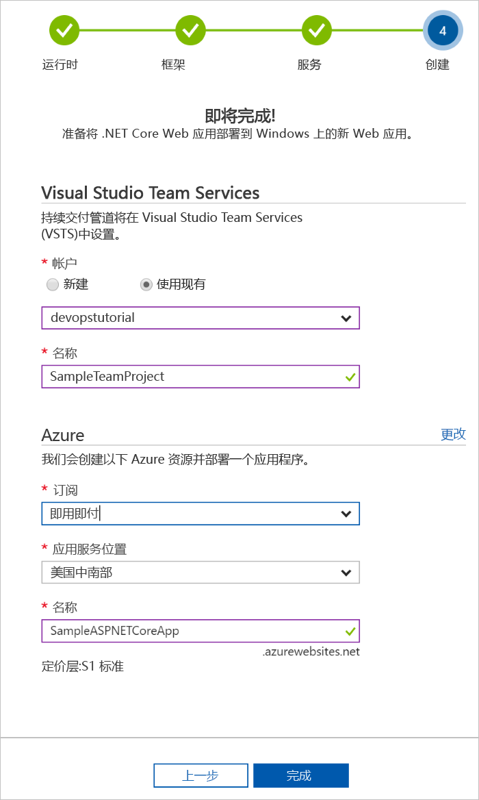

# 使用 Azure DevOps 项目创建用于 Go 的 CI/CD 管道

使用 **Azure DevOps 项目**为 **Go** 应用程序配置持续集成 (CI) 和持续交付 (CD)。  Azure DevOps 项目可简化 VSTS 生成和发布管道的初始配置。

如果没有 Azure 订阅，可以通过 [Visual Studio Dev Essentials](https://visualstudio.microsoft.com/dev-essentials/) 免费获取一个。

## 登录到 Azure 门户

Azure DevOps 项目在 VSTS 中创建 CI/CD 管道。  可以创建**新 VSTS** 帐户，也可以使用**现有帐户**。  Azure DevOps 项目也在所选的 **Azure 订阅**中创建 **Azure 资源**。

1. 登录到 [Microsoft Azure 门户](https://portal.azure.com)。

1. 在左侧导航栏中选择“+ 创建资源”图标，然后搜索“DevOps 项目”。  选择“创建”。

    

## 选择示例应用程序和 Azure 服务

1. 选择 **Go** 示例应用程序，然后选择“下一步”。

1. **示例 Go 应用**是默认的框架。  选择“下一步”。 

1. 在前述步骤中选择的应用程序框架规定了适用于部署的 Azure 服务部署目标的类型。  保留默认 Azure 服务，然后选择“下一步”。

## 配置 VSTS 和 Azure 订阅 

1. 创建**新的**免费 VSTS 帐户，或者选择**现有的**帐户。  为 VSTS 项目选择一个**名称**。  选择 **Azure 订阅**、**位置**，然后为应用程序选择一个**名称**。  完成后，选择“完成”。

    

1. **项目仪表板**会在数分钟内加载到 Azure 门户中。  首先会在 VSTS 帐户的存储库中设置示例应用程序，然后执行生成并将应用程序部署到 Azure。  可以通过此仪表板查看**代码存储库**、**VSTS CI/CD 管道**以及 **Azure 中的应用程序**。  在仪表板的右侧，选择“浏览”即可查看正在运行的应用程序。

     

## 提交代码更改并执行 CI/CD

Azure DevOps 项目已在 VSTS 或 GitHub 帐户中创建了一个 Git 存储库。  请执行以下步骤，以便查看存储库并对应用程序进行代码更改。

1. 在 DevOps 项目仪表板的左侧，选择 **master** 分库的链接。  该链接会打开新建 Git 存储库的视图。

1. 若要查看存储库克隆 URL，请在浏览器右上角选择“克隆”。 可以在最常用的 IDE 中克隆 Git 存储库。  在后续几个步骤中，可以使用 Web 浏览器直接对 master 分库进行代码更改并提交所做的更改。

1. 在浏览器左侧导航到 **views/index.html** 文件。

1. 选择“编辑”，对某些文本进行更改。  例如，修改某个 div 标记中的文本。

1. 选择“提交”，然后保存所做的更改。

1. 在浏览器中，导航到“Azure DevOps 项目仪表板”。  此时会看到一个生成正在进行。  所做的更改会自动通过 VSTS CI/CD 管道进行生成和部署。

## 检查 VSTS CI/CD 管道

Azure DevOps 项目已自动在 VSTS 帐户中配置完整的 VSTS CI/CD 管道。  根据需要浏览和自定义管道。  请执行以下步骤，自行熟悉 VSTS 生成和发布定义。

1. 在 Azure DevOps 项目仪表板**顶部**选择“生成管道”。  此链接会打开一个浏览器标签页，并打开新项目的 VSTS 生成定义。

1. 选择**省略号**。  此操作会打开一个菜单，可以在其中启动多项活动，例如将新生成排队、暂停某个生成、编辑生成定义。

1. 选择“编辑”。

1. 在此视图中，针对生成定义**检查各种任务**。  此生成会执行各种任务，例如从 Git 存储库提取源、还原依赖项、发布用于部署的输出。

1. 在生成定义的顶部，选择“生成定义名称”。

1. 将生成定义的**名称**更改为更具说明性的名称。  选择“保存和排队”，然后选择“保存”。

1. 在生成定义名称下，选择“历史记录”。  此时会看到最近针对生成所做的更改的审核线索。  VSTS 会记录对生成定义所做的任何更改，并可用于版本比较。

1. 选择“触发器”。  Azure DevOps 项目已自动创建一个 CI 触发器，每次向存储库提交内容都会启动新的生成。  可以选择在 CI 过程中包括或排除分库。

1. 选择“保留期”。  可以根据方案指定策略，以便保留或删除特定数目的生成。

1. 选择“生成和发布”，然后选择“发布”。  Azure DevOps 项目创建的 VSTS 发布定义可以用于管理到 Azure 的部署。

1. 在浏览器左侧，选择发布定义旁边的**省略号**，然后选择“编辑”。

1. 发布定义包含一个**管道**，用于定义发布过程。  在“项目”下选择“删除”。  在前述步骤中检查过的生成定义生成用于项目的输出。 

1. 在“删除”图标右侧，选择“持续部署触发器”。  此发布定义有一个启用的 CD 触发器，每次有新的生成项目可用时，此触发器就会执行部署。  也可选择禁用此触发器，这样一来，部署就需要手动执行。 

1. 在浏览器左侧选择“任务”。  这些任务是部署过程执行的活动。  在此示例中，已创建了一个用于将项目部署到 **Azure 应用服务**的任务。

1. 在浏览器右侧选择“查看发布”。  此视图显示发布历史记录。

1. 选择某个发布旁边的**省略号**，然后选择“打开”。  可以在此视图中浏览多个菜单，例如发布摘要、关联的工作项、测试。

1. 选择“提交”。  此视图显示与特定部署相关联的代码提交。 

1. 选择“日志”。  日志包含有关部署过程的有用信息。  日志可以在部署过程中以及部署以后查看。

## 清理资源

不再需要本快速入门中创建的 Azure 应用服务和相关的资源时，可以在 Azure DevOps 项目仪表板中使用“删除”功能将其删除。

## 后续步骤

若要详细了解如何根据团队的需求修改生成和发布定义，请参阅以下教程：

> [!div class="nextstepaction"]
> [自定义 CD 过程](https://docs.microsoft.com/vsts/pipelines/release/define-multistage-release-process?view=vsts)
