#  <a name="quickstart-create-a-cicd-pipeline-in-azure-pipelines-for-nodejs-with-azure-devops-projects"></a>快速入门：使用 Azure DevOps Projects 创建用于 Node.js 的 Azure Pipelines 中的 CI/CD 管道
在本快速入门中，你将使用 [GatsbyJS](https://www.gatsbyjs.org/) 和简化的 Azure DevOps 项目创建体验创建一个 NodeJS 渐进式 Web 应用 (PWA)。 完成此过程后，即已为 Azure Pipelines 中的 PWA 创建了持续集成 (CI) 和持续交付 (CD) 管道。 Azure DevOps Projects 可以完成在开发、部署和监视时所需的设置。

## <a name="prerequisites"></a>先决条件

- 具有活动订阅的 Azure 帐户。 [免费创建帐户](https://azure.microsoft.com/free/?ref=microsoft.com&utm_source=microsoft.com&utm_medium=docs&utm_campaign=visualstudio)。 
- 一个 [Azure DevOps](https://azure.microsoft.com/services/devops/) 组织。

## <a name="sign-in-to-the-azure-portal"></a>登录到 Azure 门户

DevOps Projects 在 Azure Pipelines 中创建 CI/CD 管道。 可以创建新的 Azure DevOps 组织，或使用现有的组织。 DevOps Projects 还可以在所选的 Azure 订阅中创建 Azure 资源。

1. 登录到 [Azure 门户](https://portal.azure.com)，然后在左窗格中选择“创建资源”  。 

   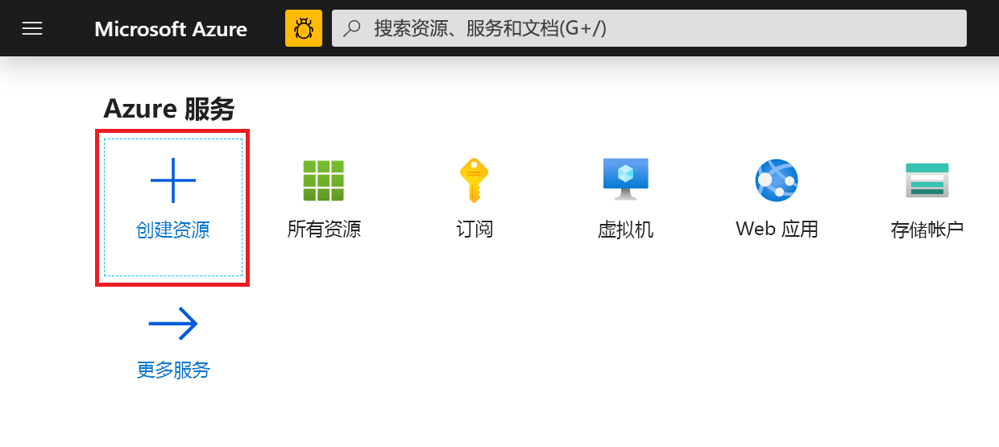

2. 搜索并选择“DevOps Projects”  ，然后选择“创建”  。

 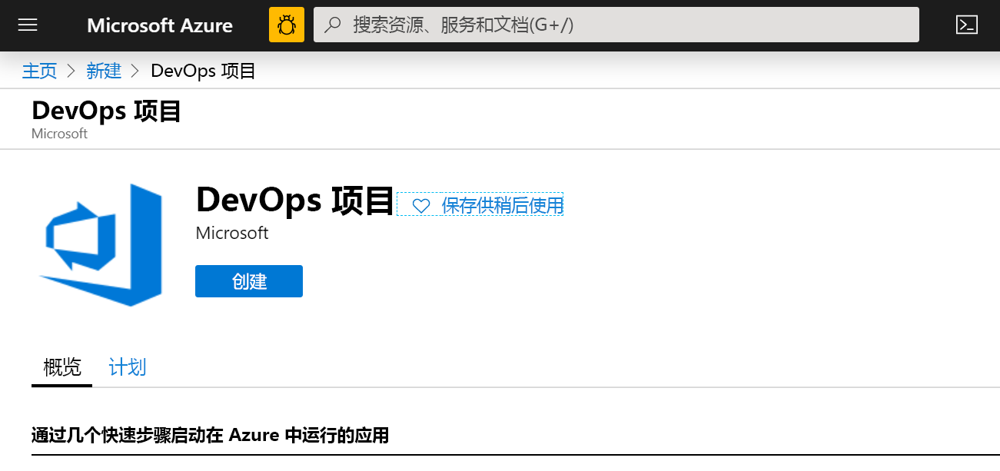 

## <a name="select-a-sample-application-and-azure-service"></a>选择示例应用程序和 Azure 服务

1. 选择 Node.js 示例应用程序。   

 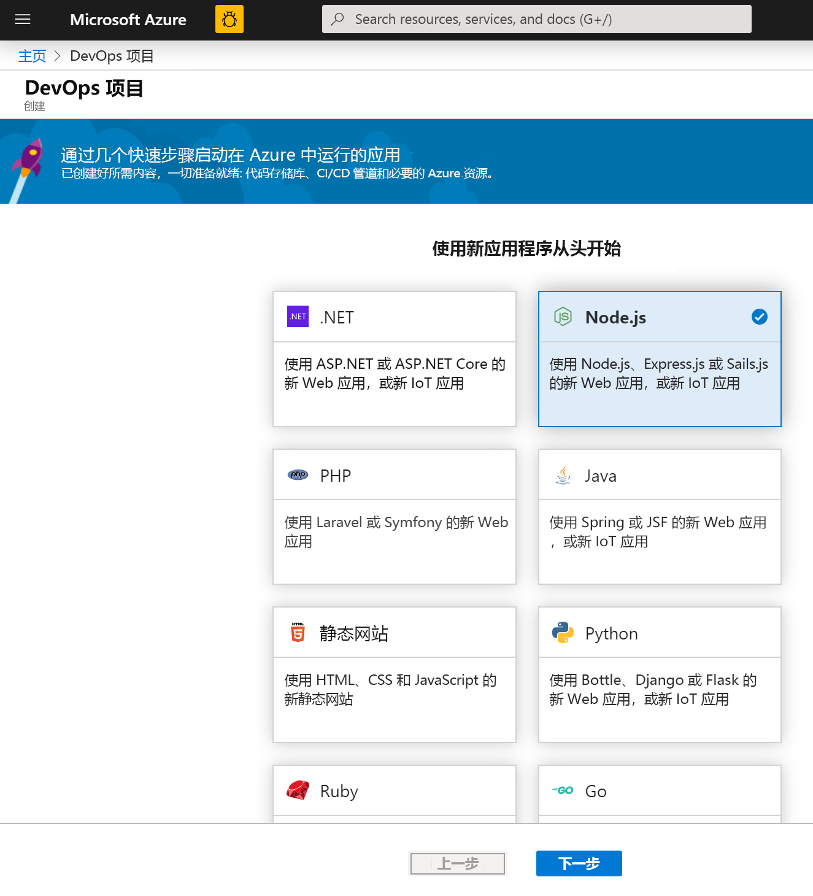 

2. 默认的示例框架为 **Express.js**。 将选项更改为“简单 Node.js 应用”，然后选择“下一步”。   

 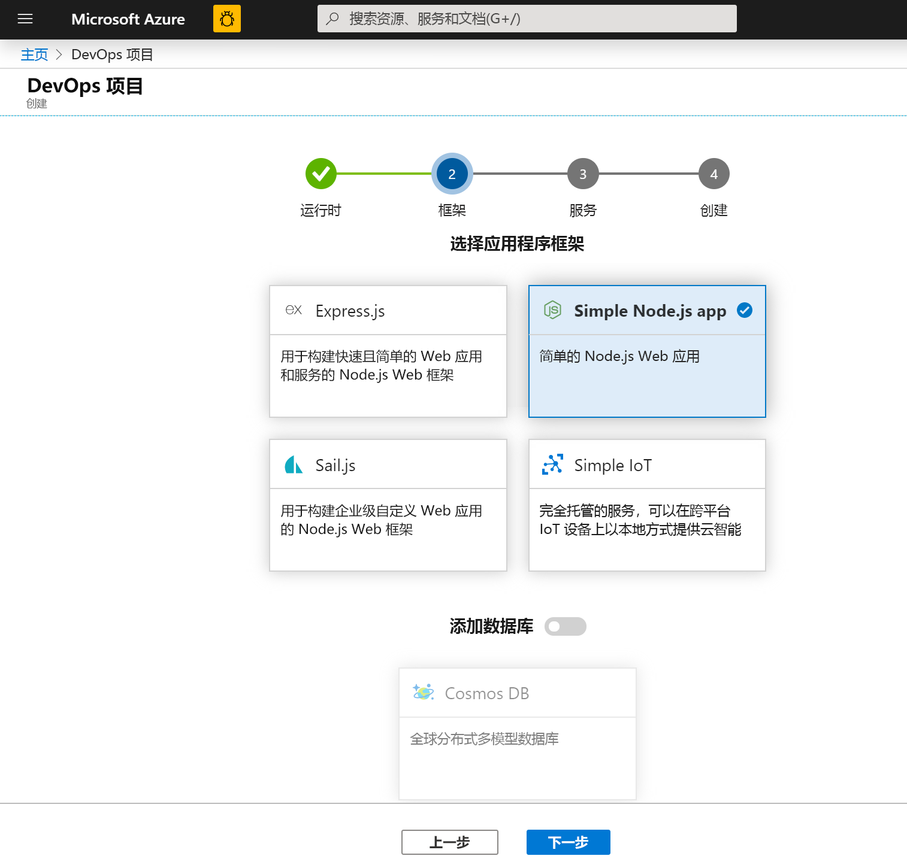 

3. 此步骤中提供的部署目标取决于在步骤 2 中选择的应用程序框架。  在此示例中，“Windows Web 应用”是默认部署目标。   保留设置“用于容器的 Web 应用”，然后选择“下一步”。  

 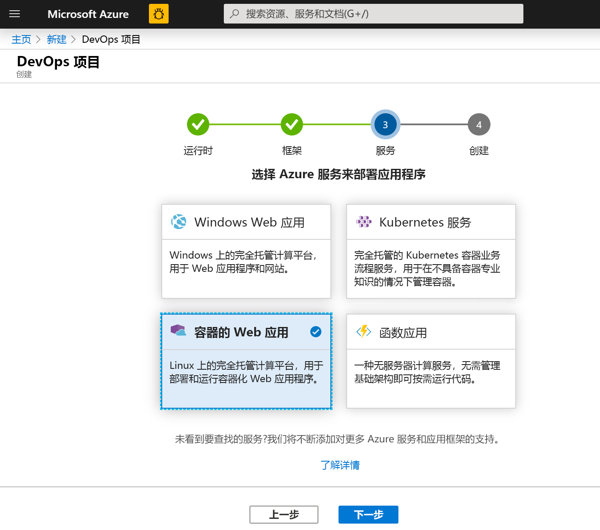 

## <a name="configure-a-project-name-and-an-azure-subscription"></a>配置项目名称和 Azure 订阅

1. 在 DevOps 项目创建工作流的最后一个步骤中指定项目名称，选择 Azure 订阅，然后选择“完成”。   

 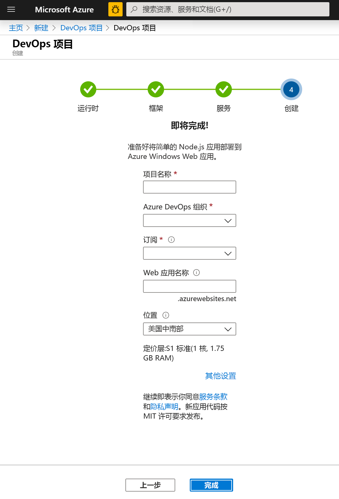 

2. 生成项目并将应用程序部署到 Azure 时，会显示摘要页。 短暂的一段时间后，将在 [Azure DevOps 组织](https://dev.azure.com/)中创建一个项目，其中包含 Git 存储库、看板、部署管道、测试计划和应用所需的工件。  

## <a name="managing-your-project"></a>管理项目

1. 导航到“所有资源”并找到你的 DevOps 项目。  选择该 **DevOps 项目**。

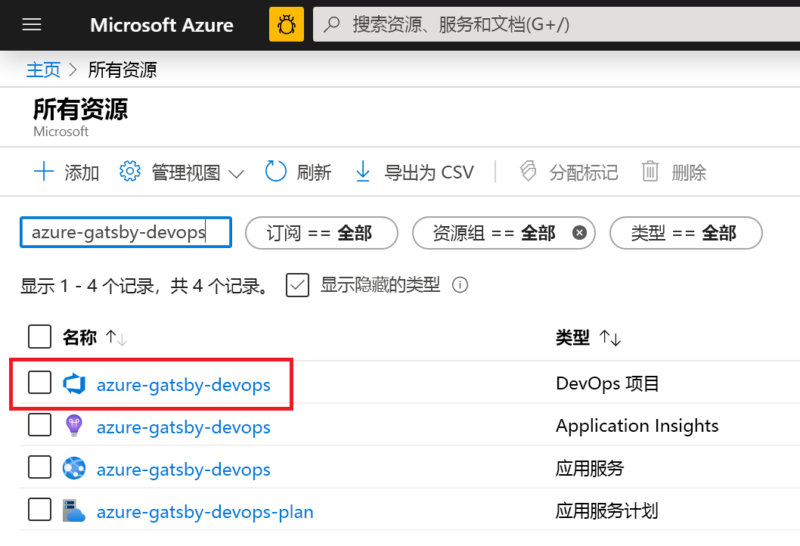

2. 你将定向到一个仪表板，在其中可以查看项目主页、代码存储库、CI/CD 管道，以及正在运行的应用的链接。 选择“项目主页”查看 **Azure DevOps** 中的应用程序，在另一个浏览器标签页中选择“应用程序终结点”查看实时示例应用。    稍后我们将更改此示例以使用 GatsbyJS 生成的 PWA。

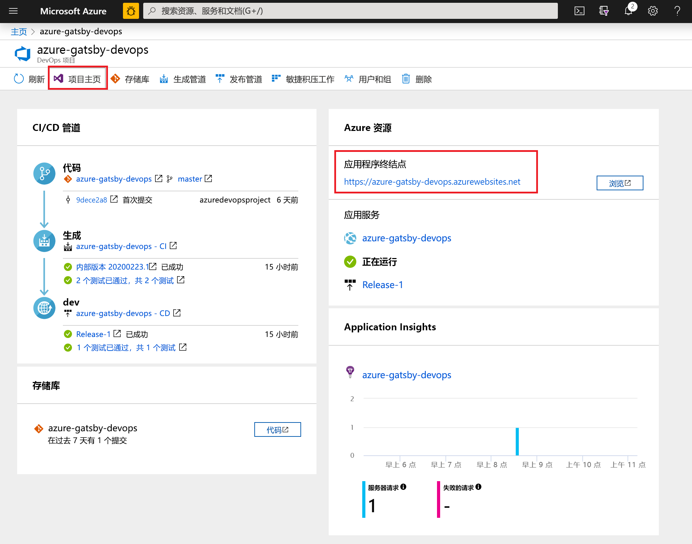 

3. 在 Azure DevOps 项目中，可以邀请团队成员进行协作，并建立一个看板以开始跟踪工作。  有关详细信息，请参阅[此文](https://docs.microsoft.com/azure/devops/user-guide/what-is-azure-devops?view=azure-devops)。

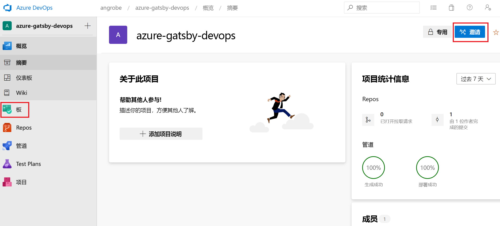

## <a name="clone-the-repo-and-install-your-gatsby-pwa"></a>克隆存储库并安装 Gatsby PWA

DevOps Projects 在 Azure Repos 或 GitHub 中创建一个 Git 存储库。 此示例已创建一个 Azure 存储库。  下一步是克隆该存储库并进行更改。

1. 在 **DevOps 项目**中选择“存储库”，然后单击“克隆”。    可通过多种机制将 Git 存储库克隆到桌面。  请选择适合你的开发体验的机制。  

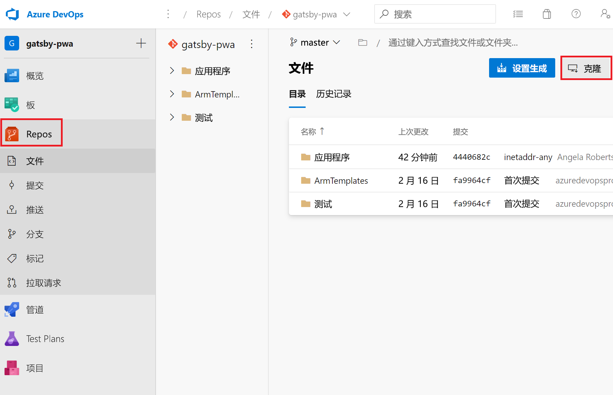

2. 将存储库克隆到桌面后，对初学者 (starter) 模板进行一些更改。 首先从终端安装 GatsbyJS CLI。
```powershell
npm install -g gatsby
```

3. 在终端中，导航到存储库的根目录。 其中应包含如下所示的三个文件夹：
```powershell
Mode                LastWriteTime         Length Name
----                -------------         ------ ----
d-----        2/23/2020  10:42 PM                Application
d-----        2/23/2020   3:05 PM                ArmTemplates
d-----        2/23/2020   3:05 PM                Tests
```

4. 我们不需要 Application 文件夹中的所有文件，因为该文件夹将替换为 Gatsby 初学者模板。 按顺序运行以下命令，以修剪该文件夹。
```powershell
cp .\Application\Dockerfile .
rmdir Application
```

5. 使用 Gatsby CLI 生成示例 PWA。 在终端中运行 `gatsby new` 启动 PWA 向导，并选择初学者模板的 `gatsby-starter-blog`。 命令如以下示例所示：
```powershell
c:\myproject> gatsby new
√ What is your project called? ... my-gatsby-project
? What starter would you like to use? » - Use arrow-keys. Return to submit.
    gatsby-starter-default
    gatsby-starter-hello-world
>   gatsby-starter-blog
    (Use a different starter)
```

6. 现已创建一个名为 `my-gatsby-project` 的文件夹。 将其重命名为 `Application`，并将 `Dockerfile` 复制到其中。
```powershell
mv my-gatsby-project Application
mv Dockerfile Application
```

7. 在偏好的编辑器中打开 Dockerfile，将第一行从 `FROM node:8` 更改为 `FROM node:12`。 此项更改确保容器使用 Node.js 版本 12.x 而不是 8.x。 GatsbyJS 需要较新式版本的 Node.js。

8. 接下来，打开 Application 文件夹中的 package.json 文件，并编辑[脚本字段](https://docs.npmjs.com/files/package.json#scripts)，确保开发和生产服务器侦听所有可用网络接口（例如 0.0.0.0）和端口 80。 如果不指定这些设置，容器应用服务无法将流量路由到容器中运行的 Node.js 应用。 `scripts` 字段应如下所示。 具体而言，需要更改 `develop`、`serve` 和 `start` 目标的默认值。
```json
  "scripts": {
    "build": "gatsby build",
    "develop": "gatsby develop  -H 0.0.0.0 -p 80",
    "format": "prettier --write \"**/*.{js,jsx,json,md}\"",
    "start": "npm run serve",
    "serve": "npm run build && gatsby serve -H 0.0.0.0 -p 80",
    "clean": "gatsby clean",
    "test": "echo \"Write tests! -> https://gatsby.dev/unit-testing\" && exit 1"
  }
```

## <a name="edit-your-cicd-pipelines"></a>编辑 CI/CD 管道

1. 在提交上一部分编写的代码之前，请对生成和发布管道进行一些更改。 编辑“生成管道”，并将 Node 任务更新为使用 Node.js 版本 12.x。 将“任务版本”字段设置为 1.x，将“版本”字段设置为 12.x。  
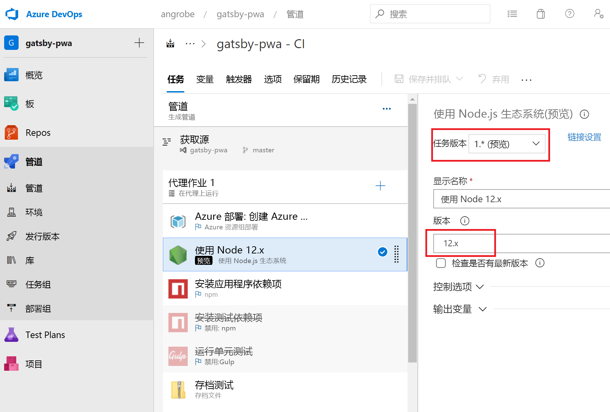

2. 在本快速入门中，我们不会创建单元测试，并会在生成管道中禁用这些步骤。 编写测试时，可以重新启用这些步骤。 单击右键并选择标记为“安装测试依赖项”和“运行单元测试”的任务，然后禁用这些任务。  

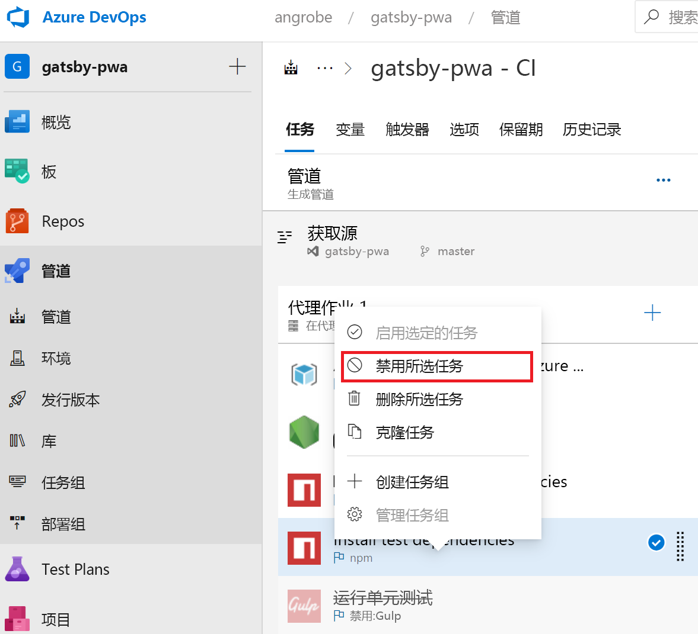

3. 编辑发布管道。
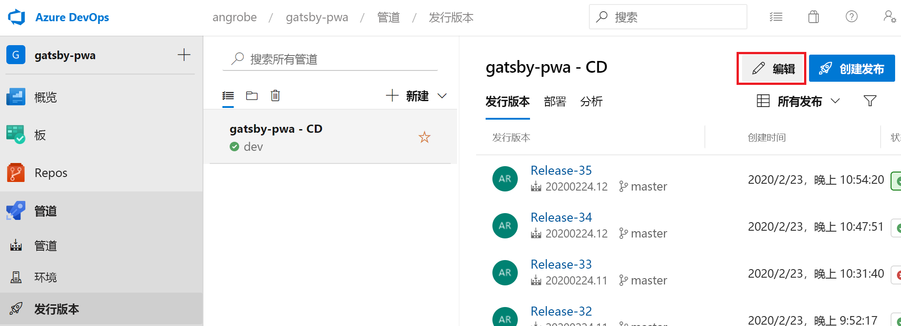

4. 与编辑生成管道时一样，将 Node 任务更改为使用 12.x，并禁用两个测试任务。 发布管道应如此屏幕截图所示。

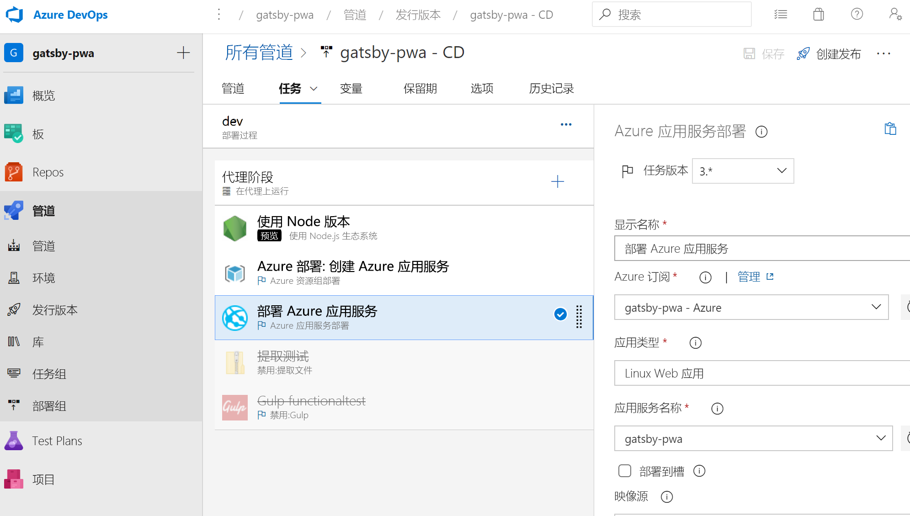

1. 在浏览器左侧转到 **views/index.pug** 文件。

1. 选择“编辑”，  然后对 h2 标题进行更改。  
    例如，输入“Azure DevOps Projects 快速入门”或进行一些其他的更改。 

1. 选择“提交”并保存更改。 

1. 在浏览器中，转到 DevOps Projects 仪表板。   
此时会看到一个生成正在进行。 所做的更改会自动通过 CI/CD 管道进行生成和部署。

## <a name="commit-your-changes-and-examine-the-azure-cicd-pipeline"></a>提交更改并检查 Azure CI/CD 管道

在前两个步骤中，你将 Gatsby 生成的 PWA 添加到了 Git 存储库，并编辑了管道以生成并部署代码。 我们可以提交该代码，并通过生成和发布管道监视其进度。

1. 在终端中项目 Git 存储库的根目录下，运行以下命令以将代码推送到 Azure DevOps 项目：
```powershell
git add .
git commit -m "My first Gatsby PWA"
git push
```

2. `git push` 完成后，即会启动生成。 可以在 **Azure DevOps 仪表板**中跟踪进度。


3. 几分钟后，生成和发布管道应会完成，PWA 应会部署到容器中。 在上面所示的仪表板中单击“应用程序终结点”链接，此时应会看到博客的 Gatsby 初学者项目。 


## <a name="clean-up-resources"></a>清理资源

不再需要创建的 Azure 应用服务和其他相关资源时，可将其删除。 请使用 DevOps Projects 仪表板上的“删除”功能。 


## <a name="next-steps"></a>后续步骤

在配置 CI/CD 过程时，系统自动创建了生成和发布管道。 可以根据团队的需求更改这些生成和发布管道。 若要详细了解 CI/CD 管道，请参阅：

> [!div class="nextstepaction"]
> [自定义 CD 过程](https://docs.microsoft.com/azure/devops/pipelines/release/define-multistage-release-process?view=vsts)

