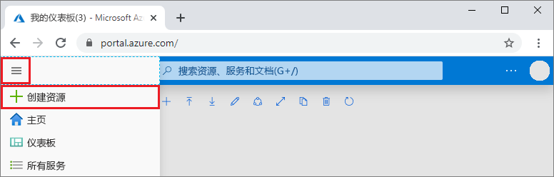

# 使用 Azure DevOps Projects 创建用于 Python 的 CI/CD 管道

Azure DevOps Projects 提供一种简化的体验，适合为 Python 应用创建 Azure 资源并设置持续集成 (CI) 和持续交付 (CD) 管道。  

如果没有 Azure 订阅，可以通过 [Visual Studio Dev Essentials](https://visualstudio.microsoft.com/dev-essentials/) 免费获取一个。

## 登录到 Azure 门户

 DevOps Projects 在 Azure Pipelines 中创建 CI/CD 管道。  可以创建免费的新 Azure DevOps 组织，或使用现有的组织。 DevOps Projects 还可以在所选的 Azure 订阅中创建 Azure 资源。

1. 登录到 [Microsoft Azure 门户](https://portal.azure.com)。

2. 在左窗格中选择“创建资源”图标，然后搜索“DevOps Projects”。  

3. 选择“创建”。

    

## 选择示例应用程序和 Azure 服务

1. 选择 Python 示例应用程序。 Python 示例包括一个选项，可以从多个应用程序框架中进行选择。

1. 默认的示例框架为 Django。 保留默认设置，然后选择“下一步”。    
“适用于容器的 Web 应用”是默认的部署目标。 以前选择的应用程序框架规定了此处提供的 Azure 服务部署目标的类型。 

3. 保留默认服务，然后选择“下一步”。
 
## 配置 Azure DevOps 和 Azure 订阅 

1. 创建新的 Azure DevOps 组织，或者选择现有的组织。 

    a. 输入 Azure DevOps 中项目的名称。  

    b. 选择 Azure 订阅和位置，输入应用程序的名称，然后选择“完成”。  
     几分钟后，Projects 仪表板会显示在 Azure 门户中。 首先会在 Azure DevOps 组织的存储库中设置示例应用程序，然后执行生成并将应用程序部署到 Azure。 可以通过此仪表板查看代码存储库、你的 CI/CD 管道以及 Azure 中的应用程序。  
    
2. 选择“浏览”，查看正在运行的应用程序。

     
    
   DevOps Projects 会自动配置 CI 生成和发布触发器。 现在，可以使用可将最新工作部署到网站的 CI/CD 过程，与某个团队展开 Python 应用协作。

## 提交代码更改并执行 CI/CD

 DevOps Projects 在 Azure Repos 或 GitHub 中创建一个 Git 存储库。 若要查看存储库并对应用程序进行代码更改，请执行以下操作： 

1. 在 DevOps Projects 仪表板的左侧，选择 master 分库的链接。  
        该链接会打开新建 Git 存储库的视图。

1. 若要查看存储库克隆 URL，请在浏览器右上角选择“克隆”。   
可以在最常用的 IDE 中克隆 Git 存储库。  在后续几个步骤中，可以使用 Web 浏览器直接对 master 分库进行代码更改并提交所做的更改。

1. 在左侧转到 **app/templates/app/index.html** 文件。

1. 选择“编辑”，对某些文本进行更改。 例如，更改某个 div 标记的某些文本。

1. 选择“提交”并保存更改。

1. 在浏览器中，转到 DevOps Projects 仪表板。   
    此时会看到一个生成正在进行。 刚做的更改会自动通过 CI/CD 管道进行生成和部署。

## 检查 CI/CD 管道

在上一步中，DevOps Projects 自动配置了一个完整的 CI/CD 管道。 根据需要浏览和自定义管道。 若要了解生成和发布管道，请执行以下操作：

1. 在 DevOps Projects 仪表板顶部，选择“生成管道”。  
浏览器标签页会显示新项目的生成管道。

1. 指向“状态”字段，然后选择省略号 (...)。  
        菜单中会显示多个选项，例如，将新生成排队、暂停某个生成，以及编辑生成管道。

1. 选择“编辑”。

1. 在此窗格中，可以检查生成管道的各种任务。  
        该生成会执行各种任务，例如，从 Git 存储库提取源、还原依赖项、发布用于部署的输出。

1. 在生成管道的顶部，选择生成管道名称。

1. 将生成管道的名称更改为更具描述性的名称，选择“保存并排队”，然后选择“保存”。

1. 在生成管道名称下，选择“历史记录”。  
        此时会看到最近针对生成所做的更改的审核线索。  Azure DevOps 会跟踪对生成管道所做的任何更改，并允许进行版本比较。

1. 选择“触发器”。  
         DevOps Projects 会自动创建一个 CI 触发器，每次向存储库提交内容都会启动新的生成。  可以选择在 CI 过程中包括或排除分库。

1. 选择“保留期”。  
        可以根据方案指定策略，以保留或删除特定数目的生成。

1. 选择“生成和发布”，然后选择“发布”。   
 DevOps Projects 会创建一个发布管道，用于管理到 Azure 的部署。

1. 选择发布管道旁边的省略号，然后选择“编辑”。  
发布管道定义发布过程。  
        
12. 在“项目”下选择“删除”。   
在前述步骤中检查过的生成管道会生成用于项目的输出。 

1. 在“删除”图标的旁边，选择“持续部署触发器”。  
        此发布管道有一个启用的 CD 触发器，每次有新的生成项目可用时，此触发器就会运行部署。 （可选）可以禁用此触发器，这样就需要手动执行部署。 

1. 在左侧，选择“任务”。   
这些任务是部署过程执行的活动。 在此示例中，已创建一个用于将项目部署到 Azure 应用服务的任务。

1. 在右侧选择“查看发布”，以显示发布历史记录。  
        
1. 选择某个发布旁边的省略号 (...)，然后选择“打开”。  
        可以在此视图中浏览多个菜单，例如发布摘要、关联的工作项、测试。

1. 选择“提交”。 
        此视图显示与特定部署相关联的代码提交。 

1. 选择“日志”。   
日志包含有关部署过程的有用信息。 可以在部署期间和之后查看日志。

## 清理资源

不再需要 Azure 应用服务和相关资源时，可将其删除。 请使用 DevOps Projects 仪表板上的“删除”功能。

## 后续步骤

当你配置 CI/CD 过程时，系统自动创建了生成和发布管道。 可以根据你的团队的需求修改这些生成和发布管道。 若要详细了解 CI/CD 管道，请参阅：

> [!div class="nextstepaction"]
> [自定义 CD 过程](https://docs.microsoft.com/azure/devops/pipelines/release/define-multistage-release-process?view=vsts)
