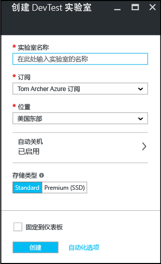

# 在 Azure 开发测试实验室中创建实验室
## 先决条件
若要创建实验室，需要：

* Azure 订阅。 若要了解 Azure 购买选项，请参阅[如何购买 Azure](https://azure.microsoft.com/pricing/purchase-options/) 或[免费试用一个月](https://azure.microsoft.com/pricing/free-trial/)。 必须成为订阅所有者才可以创建实验室。

## 在 Azure 开发测试实验室中创建实验室的步骤
以下步骤演示了如何使用 Azure 门户在 Azure 开发测试实验室中创建实验室。 

1. 登录到 [Azure 门户](http://go.microsoft.com/fwlink/p/?LinkID=525040)。
2. 选择“更多服务”，然后从列表中选择“开发测试实验室”。
3. 在“开发测试实验室”边栏选项卡中，选择“添加”。
   
    
4. 在“创建 开发测试实验室”  边栏选项卡上：
   
   1. 为新的实验室输入“实验室名称”  。
   2. 选择要与实验室关联的“订阅”  。
   3. 选择用于存储实验室的“位置”  。
   4. 选择“自动关机”  ，指定是否要自动关闭所有实验室的 VM 以及为其指定参数。 
   5. 如果想要在门户仪表板上显示实验室的快捷方式，请选择“固定到仪表板”。
   6. 请选择“自动化选项”，以便获取适用于配置自动化的 Azure Resource Manager 模板。 
   7. 选择“创建” 。
    
    

[!INCLUDE [devtest-lab-try-it-out](../../includes/devtest-lab-try-it-out.md)]

## 后续步骤
实验室创建完成后，以下是一些可以考虑执行的后续步骤：

* [保护对实验室进行的访问](devtest-lab-add-devtest-user.md)。
* [设置实验室策略](devtest-lab-set-lab-policy.md)。
* [创建实验室模板](devtest-lab-create-template.md)。
* [创建适用于 VM 的自定义项目](devtest-lab-artifact-author.md)。
* [将含有项目的 VM 添加到实验室](devtest-lab-add-vm-with-artifacts.md)。

