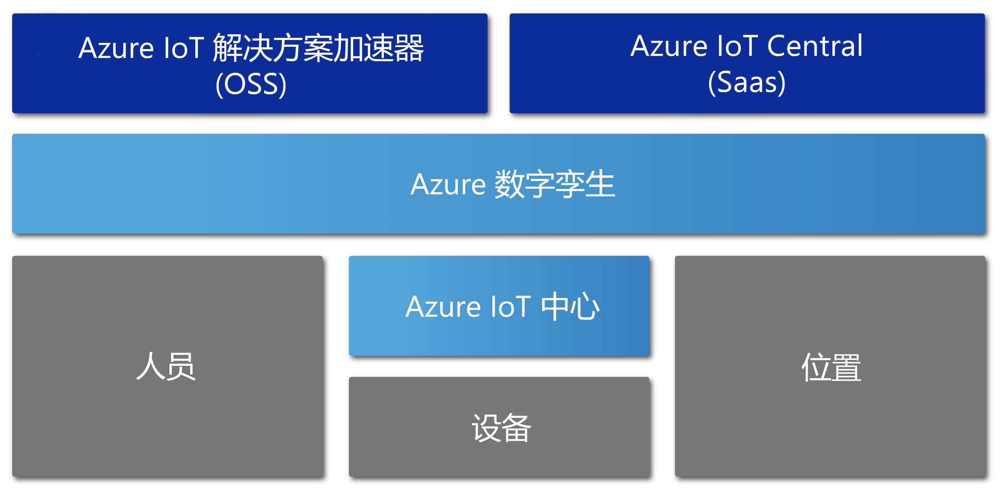

# Azure 数字孪生概述

Azure 数字孪生预览版是一种 Azure IoT 服务，用于创建物理环境的综合性模型。 它可以创建空间智能图，为人员、空间和设备之间的关系和交互建模。

可以通过 Azure 数字孪生在物理空间中而不是许多不同的传感器中查询数据。 此服务用于构建可重用的、高度可缩放的、可以进行空间感知的体验，以便跨数字世界和物理世界将流式处理数据链接到一起。 可以通过这些唯一相关的上下文功能来增强应用。 

Azure 数字孪生适用于所有类型的环境，例如，仓库、机构、学校、医院和银行。 它甚至可以用于体育场、工厂、停车场、公园、智能电网、城市。 以下是一些 Azure 数字孪生可能非常有用的方案：

- 预测工厂的维护需求。
- 分析某个输电网络的实时电力需求。
- 优化办公室的可用空间的使用。
- 跟踪多个州的每日温度。
- 监视繁忙的无人机路径。
- 确定自动驾驶车辆。
- 分析大楼房间的占用情况。
- 找出商店中最繁忙的收银机。

不管实际的业务方案是什么，都可以通过 Azure 数字孪生预配相应的数字实例。

以下视频更深入地探讨了 Azure 数字孪生。

> [!VIDEO https://www.youtube.com/embed/TvN_NxpgyzQ]

## 关键功能

Azure 数字孪生包括以下重要功能。

### 空间智能图

[  空间智能图](./concepts-objectmodel-spatialgraph.md#spatial-intelligence-graph)或智能图  是物理环境的虚拟表示形式， 用于对人员、地点和设备之间的关系建模。

考虑一个智能实用工具应用，该应用涉及某个街区中的多个连接的电量计量。 智能公用事业公司必须准确地监视和预测电量使用情况和计费。 每个设备和传感器必须使用有关位置和计费客户的上下文来建模。 可以使用空间智能图对此类复杂关系建模。

### 数字孪生对象模型

[数字孪生对象模型](./concepts-objectmodel-spatialgraph.md#digital-twins-object-models)是预定义的设备协议和数据架构， 可以满足解决方案的特定于域的需求，加快并简化开发过程。

例如，房间占用应用程序可以使用预定义的空间类型，例如校园、大楼、楼层、房间。

### 多个嵌套式租户

可以生成能够安全地缩放并重用于多个租户的解决方案。 也可创建多个子租户，这些子租户可以通过独立且安全的方式进行访问和使用。

例如，可以对空间利用应用进行配置，将同一大楼中某个租户的数据与其他租户的数据隔离开， 或者通过应用将拥有多个大楼的某个租户的数据组合起来。

### 高级计算功能

可以通过[用户定义函数](./concepts-user-defined-functions.md)针对传入的[设备数据](./concepts-device-ingress.md)定义并运行自定义函数，以便向预定义的终结点发送信号。 此高级功能改进设备任务的自定义和自动化。

例如，智能农业应用程序可能包含一个用户定义的函数，用于评估土壤湿度传感器读数，此外还有天气预报， 这样就可以通过应用发送有关灌溉需求的信号。

### 内置访问控制

访问和标识管理功能（例如[基于角色的访问控制](./security-role-based-access-control.md)和 [Azure Active Directory](./security-authenticating-apis.md)）可以用来安全地控制人员和设备的访问。

例如，可以对设施管理应用进行配置，允许房间住户在指定范围内设置温度， 允许设施管理员将任何房间的温度设置为任何值。

### 生态系统

可以将一个 Azure 数字孪生实例连接到多个强大的 Azure 服务。 这些服务包括 Azure 流分析、Azure AI、Azure 存储， 另外还包括 Azure Maps、Microsoft 混合现实、Dynamics 365 或 Office 365。

例如，智能办公大楼应用程序使用 Azure 数字孪生来表示许多楼层中的团队和设备。 当设备将实时数据流式传输到预配的数字孪生实例中时，流分析就可以处理该数据，以便提供可操作的重要见解。 数据存储在 Azure 存储中并转换为可共享文件格式。 该文件通过 Office 365 分发到整个组织。

## 受益于 Azure 数字孪生的解决方案

Azure 数字孪生可用于表示物理世界及其多项关系。 它可以简化 IoT 建模、数据处理、事件处理和设备跟踪。 请考虑下面的一些跨行业方案， 这些方案都受益于它的使用：

* 向物业管理公司显示某段时间的空间占用情况，让其了解如何才能以最佳方式配置其办公大楼。
* 触发移动应用的工单。 通过它进行保安调度，对保洁服务以及零售空间或体育场地的其他服务进行计划。
* 向大楼的住户实时显示大楼中的哪些房间已占用。 然后，帮助住户预订符合其需求的工作区。
* 跟踪资产在某个空间的位置。
* 通过对用户偏好和用电限制建模，优化电动车辆的充电。

## 在其他 IoT 服务的上下文中的 Azure 数字孪生

Azure 数字孪生使用 Azure IoT 中心来连接 IoT 设备和传感器，使一切与物理世界同步。 下图显示了 Azure 数字孪生与其他 Azure IoT 服务的关系。

有关 IoT 的详细信息，请参阅 [Azure IoT 技术和解决方案](../iot-fundamentals/iot-services-and-technologies.md)。

## 后续步骤

查看关于 Azure 数字孪生的简短演示：

>[!div class="nextstepaction"]
>[快速入门：通过 Azure 数字孪生查找可用房间](./quickstart-view-occupancy-dotnet.md)

深入了解使用 Azure 数字孪生的设施管理应用程序：

>[!div class="nextstepaction"]
>[教程：部署 Azure 数字孪生并配置空间图](./tutorial-facilities-setup.md)

了解 Azure 数字孪生核心概念：

>[!div class="nextstepaction"]
>[了解数字孪生对象模型和空间智能图](./concepts-objectmodel-spatialgraph.md)