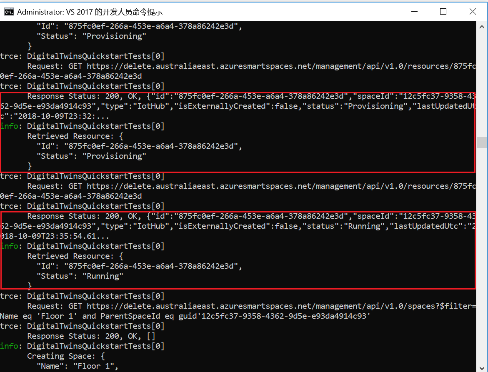
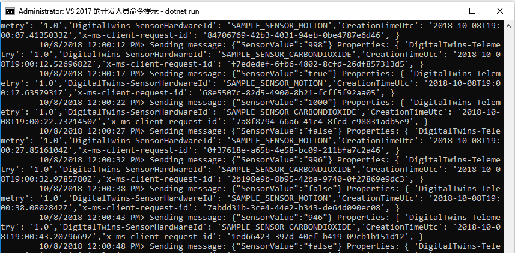
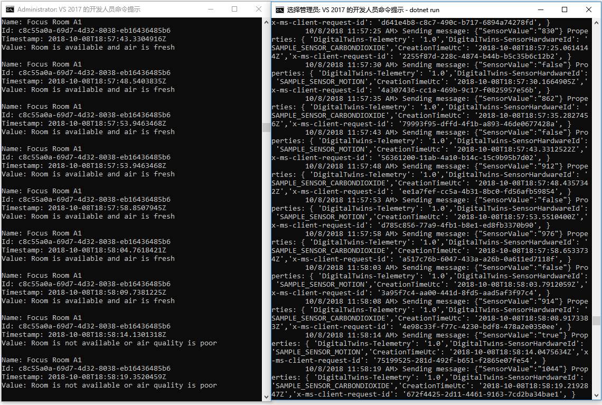

# <a name="quickstart-find-available-rooms-by-using-azure-digital-twins"></a>快速入门：通过 Azure 数字孪生查找可用房间

可以通过 Azure 数字孪生服务重新创建物理环境的数字图像。 然后，你可以获得环境中事件的通知并自定义对其的响应。

本快速入门使用[一对 .NET 示例](https://github.com/Azure-Samples/digital-twins-samples-csharp)将一栋虚构的办公大楼数字化， 并介绍如何查找该大楼中的可用房间。 可以通过数字孪生将多个传感器与环境相关联。 还可以借助二氧化碳模拟传感器来确定可用房间的空气质量是否理想。 其中一个示例应用程序会生成用于可视化此方案的随机传感器数据。

以下视频汇总了快速入门设置：

>[!VIDEO https://www.youtube.com/embed/1izK266tbMI]

## <a name="prerequisites"></a>先决条件

1. 如果没有 Azure 帐户，请在开始前创建一个[免费帐户](https://azure.microsoft.com/free/?WT.mc_id=A261C142F)。

1. 本快速入门中运行的两个控制台应用程序使用 C# 编写。 在开发计算机上安装 [.NET Core SDK 2.1.403 或更高版本](https://www.microsoft.com/net/download)。 如果已安装 .NET Core SDK，则可在开发计算机上验证 C# 的当前版本。 在命令提示符处运行 `dotnet --version`。

1. 下载[示例 C# 项目](https://github.com/Azure-Samples/digital-twins-samples-csharp/archive/master.zip)。 解压缩 digital-twins-samples-csharp-master.zip 存档。

## <a name="create-a-digital-twins-instance"></a>创建数字孪生实例

使用此部分的步骤在[门户](https://portal.azure.com)中创建数字孪生的新实例。

[!INCLUDE [create-digital-twins-portal](../../includes/digital-twins-create-portal.md)]

## <a name="set-permissions-for-your-app"></a>设置应用的权限

此部分将示例应用程序注册到 Azure Active Directory (Azure AD)，使之能够访问数字孪生实例。 如果已经进行了 Azure AD 应用注册，请将其重用于示例。 确保按此部分所述对其进行配置。

[!INCLUDE [digital-twins-permissions](../../includes/digital-twins-permissions.md)]

## <a name="build-application"></a>生成应用程序

使用以下步骤来生成 occupancy 应用程序。

1. 打开命令提示符。 转到解压缩 `digital-twins-samples-csharp-master.zip` 文件的文件夹。
1. 运行 `cd occupancy-quickstart/src`。
1. 运行 `dotnet restore`。
1. 编辑 [appSettings.json](https://github.com/Azure-Samples/digital-twins-samples-csharp/blob/master/occupancy-quickstart/src/appSettings.json)，更新以下变量：
    - **ClientId**：输入 Azure AD 应用注册的应用程序 ID，此 ID 记录在上一部分。
    - **租户**：输入 Azure AD 租户的目录 ID，此 ID 也记录在上一部分。
    - **BaseUrl**：数字孪生实例的管理 API URL 采用 `https://yourDigitalTwinsName.yourLocation.azuresmartspaces.net/management/api/v1.0/` 格式。 请将此 URL 中的占位符替换为上一部分的实例的值。

## <a name="provision-graph"></a>预配图形

此步骤为数字孪生空间图预配以下项：

- 多个空间。
- 一个设备。
- 两个传感器。
- 一个自定义函数。
- 一个角色分配。

空间图使用 [provisionSample.yaml](https://github.com/Azure-Samples/digital-twins-samples-csharp/blob/master/occupancy-quickstart/src/actions/provisionSample.yaml) 文件进行预配。

1. 运行 `dotnet run ProvisionSample`。

    >[!NOTE]
    >请使用设备登录 Azure CLI 工具向 Azure AD 进行用户身份验证。 用户必须使用 [Microsoft 登录](https://microsoft.com/devicelogin)页输入一个给定的用于身份验证的代码。 输入代码以后，请按步骤进行身份验证。 运行工具时，用户必须进行身份验证。

    >[!TIP]
    > 运行此步骤时，如果出现以下错误消息，请确保变量已正确复制：`EXIT: Unexpected error: The input is not a valid Base-64 string ...`

1. 预配步骤可能需要数分钟。 此外还会在数字孪生实例中预配 IoT 中心， 并且会一直循环下去，直至 IoT 中心的状态为 `Running`。

    [](media/quickstart-view-occupancy-dotnet/digital-twins-provision-sample1.png#lightbox)

1. 在执行结束时，请复制设备的 `ConnectionString`，以便在设备模拟器示例中使用。 仅复制下图所示的字符串。

    [](media/quickstart-view-occupancy-dotnet/digital-twins-provision-sample.png#lightbox)

    >[!TIP]
    > 可以使用 [Azure 数字孪生图形查看器](https://github.com/Azure/azure-digital-twins-graph-viewer)查看和修改空间图。

## <a name="send-sensor-data"></a>发送传感器数据

请通过以下步骤生成并运行传感器模拟器应用程序。

1. 打开新的命令提示符窗口。 转到 digital-twins-samples-csharp-master 文件夹中的已下载项目。
1. 运行 `cd device-connectivity`。
1. 运行 `dotnet restore`。
1. 编辑 [appsettings.json](https://github.com/Azure-Samples/digital-twins-samples-csharp/blob/master/device-connectivity/appsettings.json)，使用上面的 `ConnectionString` 更新 **DeviceConnectionString**。
1. 运行 `dotnet run`，开始发送传感器数据。 可以看到数据会被发送到数字孪生，如下图所示。

     [](media/quickstart-view-occupancy-dotnet/digital-twins-device-connectivity.png#lightbox)

1. 让此模拟器运行，这样就可以同时查看结果和下一步操作。 此窗口会显示发送到数字孪生的模拟传感器数据， 而下一步则会进行实时查询，以便查找空气清新的可用房间。

    >[!TIP]
    > 运行此步骤时，如果出现以下错误消息，请确保 `DeviceConnectionString` 已正确复制：`EXIT: Unexpected error: The input is not a valid Base-64 string ...`

## <a name="find-available-spaces-with-fresh-air"></a>查找空气清新的可用空间

传感器示例模拟两个传感器的随机数据值。 这两个传感器是移动传感器和二氧化碳传感器。 在示例中，空气清新的可用空间按定义是指房间没有被占用， 且二氧化碳水平低于 1,000 ppm。 如果不满足条件，则表明空间不可用或者空气质量差。

1. 打开用于运行上述预配步骤的命令提示符窗口。
1. 运行 `dotnet run GetAvailableAndFreshSpaces`。
1. 并排查看此命令提示符窗口和传感器数据命令提示符窗口。

    一个命令提示符窗口每五秒钟向数字孪生发送一次模拟的移动和二氧化碳数据。 另一命令以实时方式读取图形，根据随机的模拟数据来找出空气清新的可用房间。 它会根据上一次发送的传感器数据以近实时方式显示这其中的一个条件：
   - 房间可用且空气清新。
   - 房间已占用或空气质量差。

     [](media/quickstart-view-occupancy-dotnet/digital-twins-get-available.png#lightbox)

若要了解本快速入门中的情况以及所调用的 API，请打开 [Visual Studio Code](https://code.visualstudio.com/Download)，其中的代码工作区项目位于 digital-twins-samples-csharp 中。 请使用以下命令：

```plaintext
<path>\occupancy-quickstart\src>code ..\..\digital-twins-samples.code-workspace
```

这些教程会详细探讨代码， 并介绍如何修改配置数据以及调用哪些 API。 有关管理 API 的详细信息，请转到数字孪生 Swagger 页：

```plaintext
https://YOUR_INSTANCE_NAME.YOUR_LOCATION.azuresmartspaces.net/management/swagger
```

| Name | 替换为 |
| --- | --- |
| YOUR_INSTANCE_NAME | 数字孪生实例的名称 |
| YOUR_LOCATION | 托管实例的服务器区域 |

或者，为了方便，请浏览到[数字孪生 Swagger](https://docs.westcentralus.azuresmartspaces.net/management/swagger)。

## <a name="clean-up-resources"></a>清理资源

这些教程详细介绍如何执行以下操作：

- 生成应用程序，以便设施管理员提高住户工作效率。
- 更有效地运营此大楼。

若要继续学习这些教程，请勿清除本快速入门中创建的资源。 如果不打算继续学习，请删除通过本快速入门创建的所有资源。

1. 删除下载示例存储库时创建的文件夹。
1. 在 [Azure 门户](https://portal.azure.com)左侧的菜单中，选择“所有资源”。  然后，选择数字孪生资源。 在“所有资源”窗格的顶部选择“删除”   。

    > [!TIP]
    > 如果在删除数字孪生实例时遇到麻烦，请使用已推出的包含修补程序的服务更新。 请重新尝试删除实例。

## <a name="next-steps"></a>后续步骤

本快速入门通过一个简单的方案介绍了如何查找具有良好工作条件的房间。 若要深入分析此方案，请参阅以下教程：

>[!div class="nextstepaction"]
>[教程：部署 Azure 数字孪生并配置空间图](tutorial-facilities-setup.md)
