# <a name="quickstart-create-an-instance-of-azure-database-migration-service-in-hybrid-mode-using-the-azure-portal-preview"></a>快速入门：使用 Azure 门户（预览版）在混合模式下创建 Azure 数据库迁移服务实例

Azure 数据库迁移服务混合模式使用本地托管的迁移辅助角色以及云中运行的 Azure 数据库迁移服务的实例来管理数据库迁移。 混合模式特别适用于在本地网络与 Azure 之间缺乏站点到站点连接的情况，或站点到站点连接带宽有限的情况。

在本快速入门中，你将使用 Azure 门户在混合模式下创建 Azure 数据库迁移服务的实例。 然后，在本地网络中下载、安装和设置混合辅助角色。 预览期间，可以使用 Azure 数据库迁移服务混合模式将数据从本地 SQL Server 实例迁移到 Azure SQL 数据库。

> [!IMPORTANT]
> Azure 数据库迁移服务混合安装程序需要 .NET 4.7.2 或更高版本。 若要查找最新版本的 .NET，请参阅[下载 .NET Framework](https://dotnet.microsoft.com/download/dotnet-framework) 页。

如果没有 Azure 订阅，请在开始之前创建一个[免费](https://azure.microsoft.com/free/)帐户。

## <a name="sign-in-to-the-azure-portal"></a>登录到 Azure 门户

打开 Web 浏览器，导航到 [Microsoft Azure 门户](https://portal.azure.com/)，然后输入登录到门户所需的凭据。

默认视图是服务仪表板。

## <a name="register-the-resource-provider"></a>注册资源提供程序

在创建 Azure 数据库迁移服务的第一个实例之前，请注册 Microsoft.DataMigration 资源提供程序。

1. 在 Azure 门户，选择“订阅”，选择要在其中创建 Azure 数据库迁移服务实例的订阅，再选择“资源提供程序”   。

    

2. 搜索迁移服务，再选择“Microsoft.DataMigration”右侧的“注册”   。

    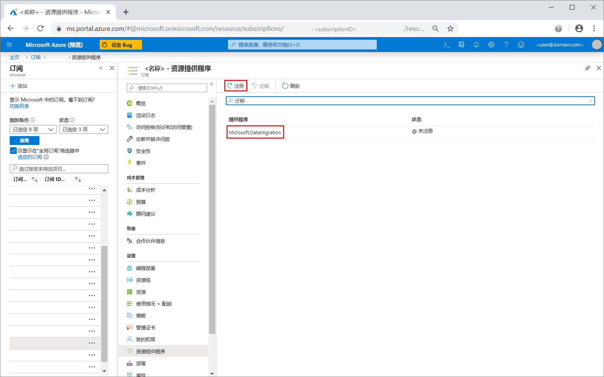

## <a name="create-an-instance-of-the-service"></a>创建服务的实例

1. 选择“+创建资源”以创建 Azure 数据库迁移服务的实例。 

2. 在市场中搜索“迁移”，选择“Azure 数据库迁移服务”，并在“Azure 数据库迁移服务”屏幕中选择“创建”。   

3. 在“创建迁移服务”屏幕中： 

    - 选择一个容易记住且唯一的服务名称，用于标识 Azure 数据库迁移服务的实例  。
    - 选择要在其中创建实例的 Azure **订阅**。
    - 选择现有的**资源组**，或创建一个新组。
    - 选择距离源或目标服务器最近的“位置”  。

    > [!IMPORTANT]
    > 在预览期间，仅美国东部区域支持混合模式。 在本地网络中安装混合辅助角色后，即使迁移到其他区域中的目标，对性能也几乎没有影响。

    - 对于“服务模式”，选择“混合（预览版）”   。

      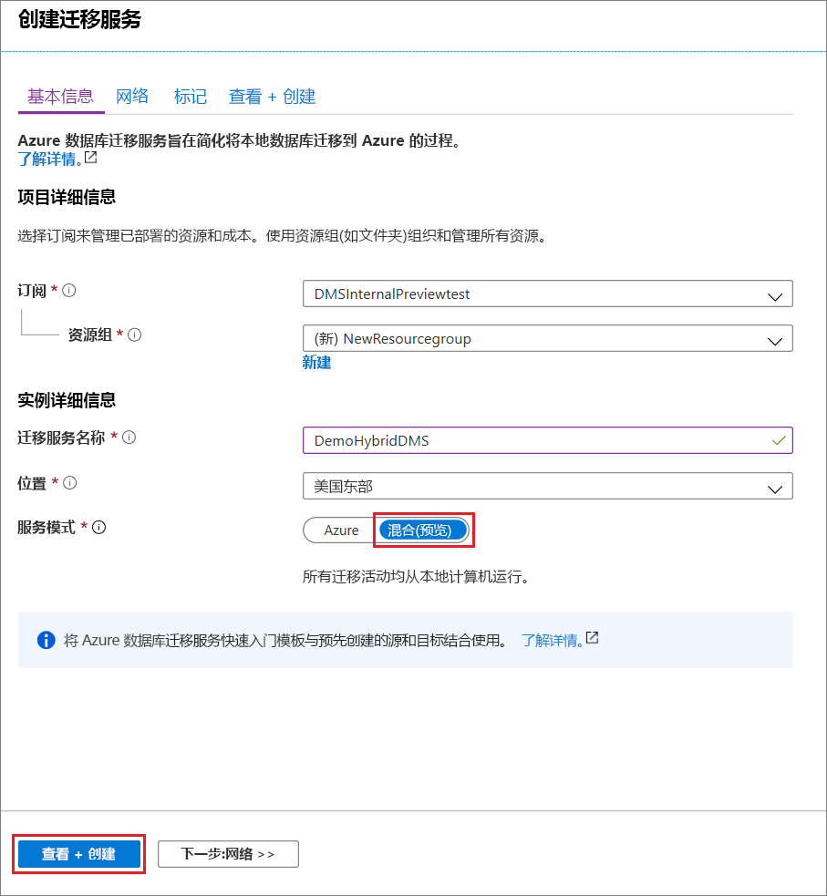

4. 选择“查看 + 创建”  。

5. 在“查看 + 创建”选项卡上，查看条款，验证提供的其他信息，然后选择“创建”   。

    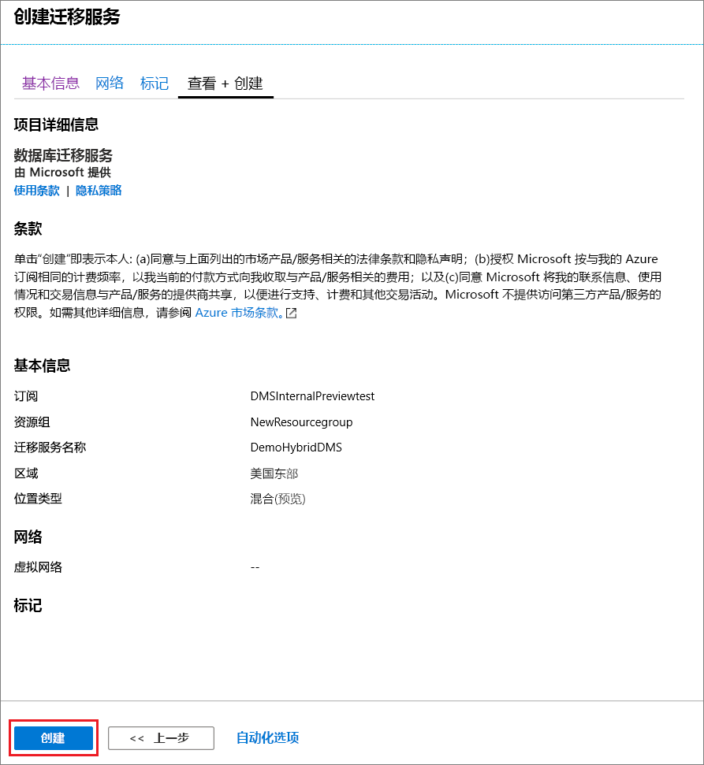

    片刻之后，创建混合模式下的 Azure 数据库迁移服务的实例并可以进行设置。 显示下图所示的 Azure 数据库迁移服务实例：

    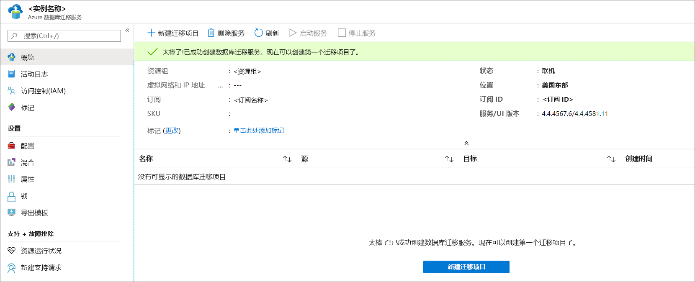

6. 创建服务后，选择“属性”，然后复制“资源 ID”框中显示的值，该值将用于安装 Azure 数据库迁移服务混合辅助角色   。

    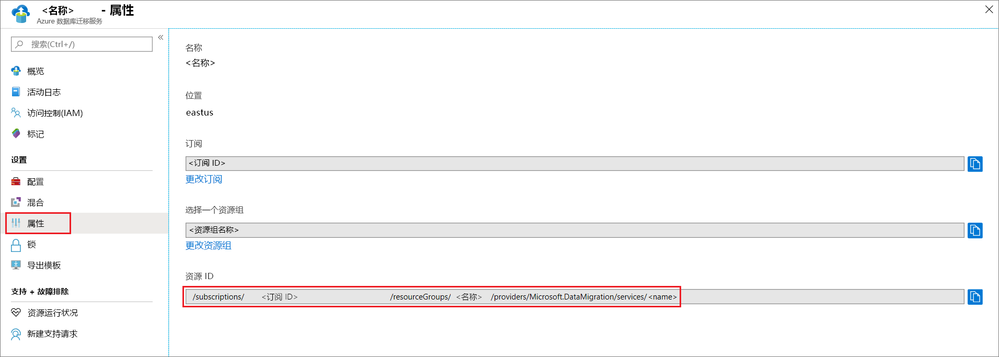

## <a name="create-azure-app-registration-id"></a>创建 Azure 应用注册 ID

需要创建 Azure 应用注册 ID，本地混合辅助角色可使用该 ID 与云中的 Azure 数据库迁移服务进行通信。

1. 在 Azure portal，选择“Azure Active Directory”，选择“应用注册”，然后选择“新建注册”    。
2. 指定应用程序的名称，然后在“支持的帐户类型”下，选择要支持的帐户类型，以指定可使用该应用程序的用户  。

    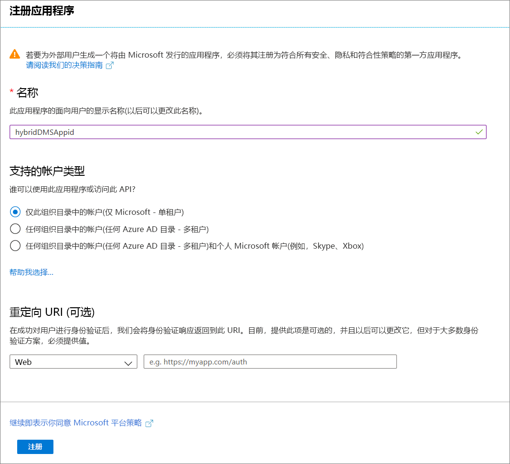

3. 使用“重定向 URI (可选)”字段的默认值，然后选择“注册”   。

4. 完成应用 ID 注册后，请记下“应用程序(客户端) ID”，安装混合辅助角色时将用到它  。

5. 在 Azure 门户中，导航到“Azure 数据库迁移服务”，选择“访问控制 (IAM)”，然后选择“添加角色分配”，分配对应用 ID 的参与者访问权限   。

    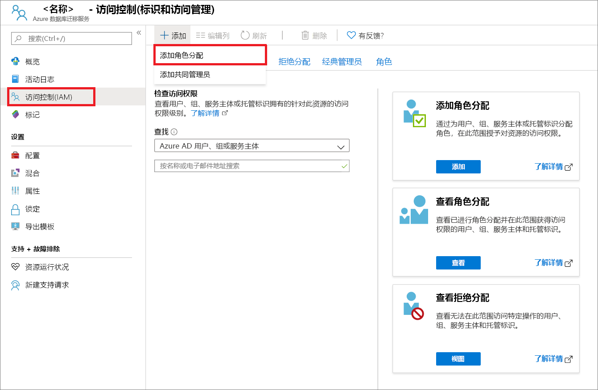

6. 选择“**参与者**”作为角色，将访问权限分配给“**Azure AD 用户或服务主体**”，然后选择应用 ID 名称。

    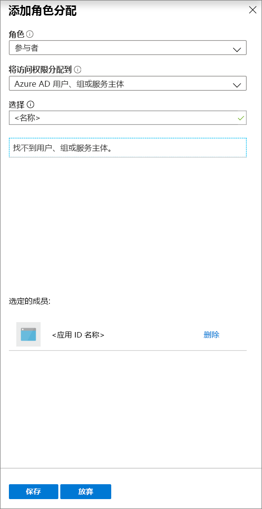

7. 选择“保存”，为 Azure 数据库迁移服务资源上的应用 ID 保存角色分配  。

## <a name="download-and-install-the-hybrid-worker"></a>下载并安装混合辅助角色

1. 在 Azure 门户，导航到 Azure 数据库迁移服务的实例。

2. 在“设置”下，选择“混合”，然后选择“安装程序下载”，下载混合辅助角色    。

    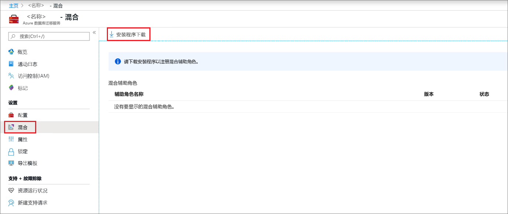

3. 提取将托管 Azure 数据库迁移服务混合辅助角色的服务器上的 ZIP 文件。

    > [!IMPORTANT]
    > Azure 数据库迁移服务混合安装程序需要 .NET 4.7.2 或更高版本。 若要查找最新版本的 .NET，请参阅[下载 .NET Framework](https://dotnet.microsoft.com/download/dotnet-framework) 页。

4. 在安装文件夹中，找到并打开“dmsSettings.json”文件，指定“ApplicationId”和“resourceId”，然后保存文件    。

    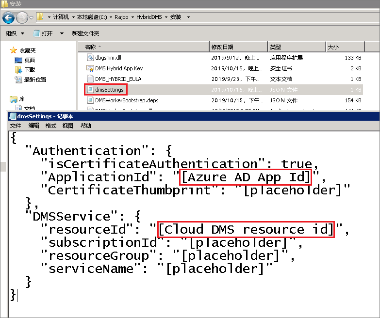
 
5. 使用以下命令生成证书，Azure 数据库迁移服务可使用该证书对来自混合辅助角色的通信进行验证。

    ```
    <drive>:\<folder>\Install>DMSWorkerBootstrap.exe -a GenerateCert
    ```

    将在安装文件夹中生成证书。

    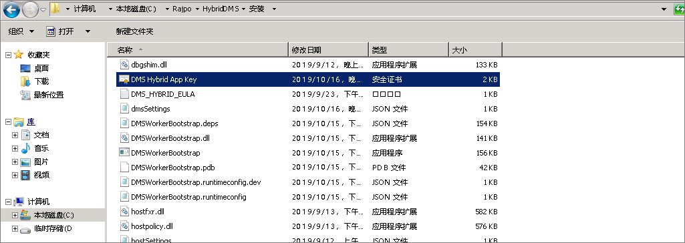

6. 在 Azure 门户中，导航到“管理”下的“应用 ID”，选择“证书和机密”，然后选择“上传证书”以选择生成的公共证书    。

    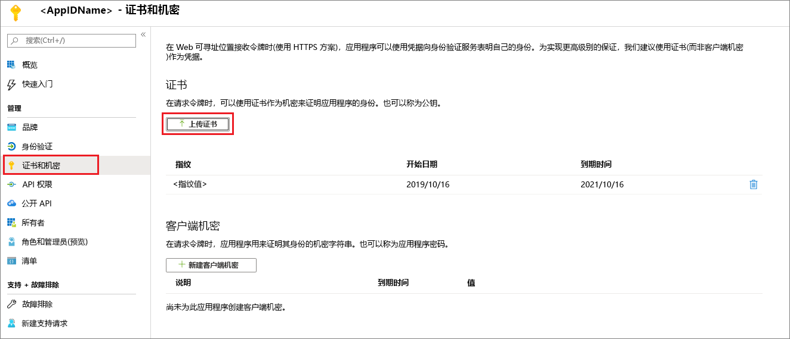

7. 运行以下命令，在本地服务器上安装 Azure 数据库迁移服务混合辅助角色：

    ```
    <drive>:\<folder>\Install>DMSWorkerBootstrap.exe -a Install -IAcceptDMSLicenseTerms
    ```

8. 如果安装程序运行时未出现错误，则该服务将在 Azure 数据库迁移服务中显示为联机状态，可迁移数据库。

    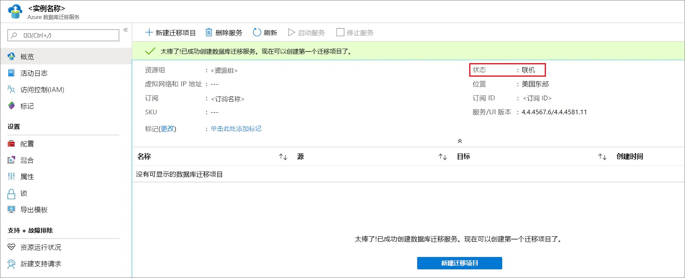

## <a name="uninstall-azure-database-migration-service-hybrid-mode"></a>卸载 Azure 数据库迁移服务混合模式

目前，只能使用以下命令，通过本地服务器上的 Azure 数据库迁移服务混合辅助角色安装程序来卸载 Azure 数据库迁移服务混合模式：

```
<drive>:\<folder>\Install>DMSWorkerBootstrap.exe -a uninstall
```

## <a name="next-steps"></a>后续步骤

> [!div class="nextstepaction"]
> [将 SQL Server 联机迁移到 Azure SQL 数据库托管实例](tutorial-sql-server-managed-instance-online.md)
> [将 SQL Server 脱机迁移到 Azure SQL 数据库中的单一数据库或共用数据库](tutorial-sql-server-to-azure-sql.md)
