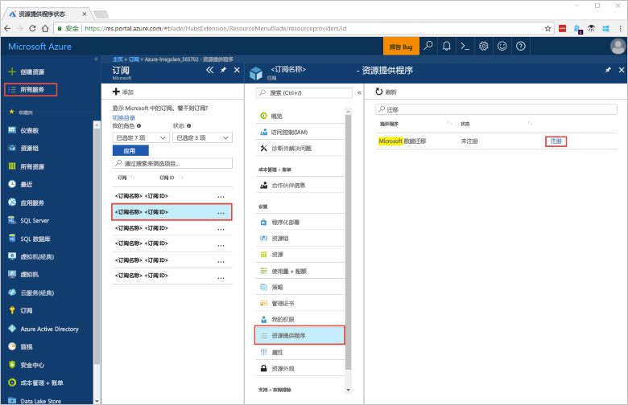
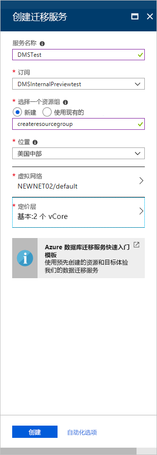

# 使用 Azure 门户创建 Azure 数据库迁移服务实例
在本快速入门中，我们将使用 Azure 门户创建 Azure 数据库迁移服务的实例。  创建服务后，可使用它将数据从本地 SQL Server 迁移到 Azure SQL 数据库。

如果没有 Azure 订阅，请在开始之前创建一个[免费](https://azure.microsoft.com/free/)帐户。

## 登录到 Azure 门户
打开 Web 浏览器，导航到 [Microsoft Azure 门户](https://portal.azure.com/)，然后输入登录到门户所需的凭据。

默认视图是服务仪表板。

## 注册资源提供程序
在创建数据库迁移服务的第一个实例之前，请注册 Microsoft.DataMigration 资源提供程序。

1. 在 Azure 门户中，依次选择“所有服务”和“订阅”。

2. 选择要在其中创建 Azure 数据库迁移服务实例的订阅，再选择“资源提供程序”。

3. 搜索迁移服务，再选择“Microsoft.DataMigration”右侧的“注册”。

    

## 创建服务的实例
1. 选择“+ 创建资源”创建 Azure 数据库迁移服务的实例。

2. 在市场中搜索“迁移”，选择“Azure 数据库迁移服务”，并在“Azure 数据库迁移服务”屏幕中选择“创建”。

3. 在“创建迁移服务”屏幕中： 

    - 选择一个容易记住且唯一的**服务名称**用于标识 Azure 数据库迁移服务的实例。
    - 选择要在其中创建实例的 Azure **订阅**。
    - 选择现有的**资源组**，或创建一个新组。
    - 选择距离源或目标服务器最近的“位置”。
    - 选择现有的**虚拟网络** (VNET) 或创建一个。

        VNET 为 Azure 数据库迁移服务提供对源数据库和目标环境的访问权限。

        有关如何在 Azure 门户中创建 VNET 的详细信息，请参阅[使用 Azure 门户创建虚拟网络](https://aka.ms/vnet)一文。

    - 为“定价层”选择“基础: 1 vCore”。

        

4. 选择**创建**。

    片刻之后，Azure 数据库迁移服务的实例即会创建并可供使用。 此时，会显示下图所示的数据库迁移服务：

    

## 清理资源
可以通过删除 [Azure 资源组](../azure-resource-manager/resource-group-overview.md)来清理在本快速入门中创建的资源。 若要删除资源组，请导航到所创建的 Azure 数据库迁移服务实例。 选择该**资源组**的名称，然后选择“删除资源组”。 此操作会删除资源组本身及其包含的所有资产。

## 后续步骤
> [!div class="nextstepaction"]
> [将本地 SQL Server 迁移到 Azure SQL 数据库](tutorial-sql-server-to-azure-sql.md)