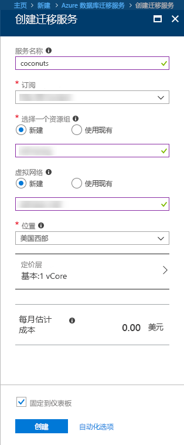
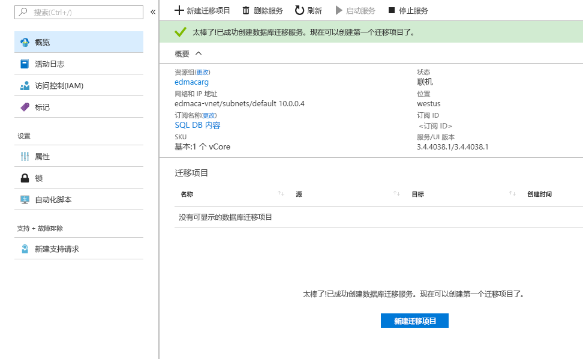

# 使用 Azure 门户创建数据库迁移服务实例
此快速入门中，使用 Azure 门户创建 Azure 数据库迁移服务的实例。  创建服务后，即可使用它将数据从本地 SQL Server 迁移到 Azure SQL 数据库。

如果你还没有 Azure 订阅，可以在开始前创建一个[免费](https://azure.microsoft.com/free/)帐户。

## 登录到 Azure 门户
打开 Web 浏览器，导航到 [Microsoft Azure 门户](https://portal.azure.com/)。 输入登录到门户所需的凭据。 默认视图是服务仪表板。

## 创建 Azure 数据库迁移服务
1. 单击“+”创建新服务。  数据库迁移服务仍是预览版。  

1. 在应用商店中搜索“迁移”，选择“数据库迁移服务(预览版)”，然后单击“创建”。

    

    - 选择易记忆且唯一的“服务名称”以标识 Azure 数据库迁移服务实例。
    - 选择要在其中创建数据库迁移服务的 Azure“订阅”。
    - 创建一个名称唯一的新“网络”。
    - 选择距离源或目标服务器最近的“位置”。
    - 为“定价层”选择“基础: 1 vCore”。

1. 单击“创建” 。

稍后，Azure 数据库迁移服务将创建并可供使用。  将看见图像中显示的数据库迁移服务。

## 清理资源
可以通过删除 [Azure 资源组](../azure-resource-manager/resource-group-overview.md)来清除在此快速入门中创建的资源。  若要删除资源组，请导航到所创建的数据库迁移服务，单击“资源组”名称，然后选择“删除资源组”。  此操作将删除资源组本身及其全部资产。

## 后续步骤
> [!div class="nextstepaction"]
> [将本地 SQL Server 迁移到 Azure SQL DB](tutorial-sql-server-to-azure-sql.md)