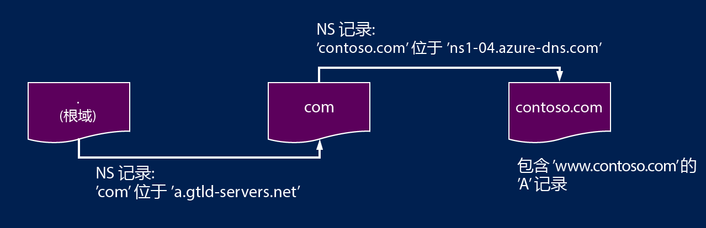
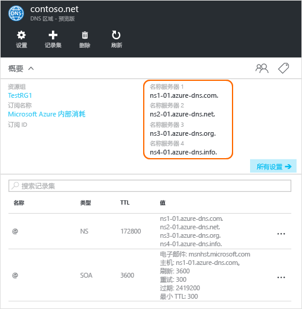

# 将域委托给 Azure DNS
使用 Azure DNS 可以托管 DNS 区域，以及管理 Azure 中域的 DNS 记录。 要使域的 DNS 查询才能抵达 Azure DNS，必须将该域从其父域委托给 Azure DNS。 请记住，Azure DNS 不是域注册机构。 本文介绍域委托的工作原理，以及如何将域委托给 Azure DNS。

## DNS 委托的工作原理
### 域和区域
域名系统是域的层次结构。 该层次结构从名为“**.**”的“根”域开始。  根域的下面是顶级域，例如“com”、“net”、“org”、“uk”或“jp”。  再往下是二级域，例如“org.uk”或“co.jp”。  依此类推。 DNS 层次结构中的域托管在不同的 DNS 区域。 这些区域遍布全球，由世界各地的 DNS 名称服务器托管。

**DNS 区域**

域在域名系统中具有一个唯一名称，例如“contoso.com”。 DNS 区域用来托管某个特定域的 DNS 记录。 例如，域“contoso.com”可能包含许多 DNS 记录，例如“mail.contoso.com”（用于邮件服务器）和“www.contoso.com”（用于网站）。

**域注册机构**

域注册机构是可以提供 Internet 域名的公司。 它们将会验证所要使用的 Internet 域是否可用，以及是否允许购买。 注册域名后，注册者即是该域名的合法所有者。 如果已有一个 Internet 域，将使用当前的域注册机构将该域委托给 Azure DNS。

> [!NOTE]
> 若要详细了解谁拥有指定的域名或如何购买域，请参阅 [Internet domain management in Azure AD](https://msdn.microsoft.com/library/azure/hh969248.aspx)（Azure AD 中的 Internet 域管理）。
> 
> 

### 解析和委托
有两种类型的 DNS 服务器：

* *权威* DNS 服务器托管 DNS 区域。 它只应答这些区域中的 DNS 记录查询。
* *递归* DNS 服务器不托管 DNS 区域。 它调用权威 DNS 服务器来收集所需的数据，以应答所有 DNS 查询。

> [!NOTE]
> Azure DNS 提供权威 DNS 服务。  它不提供递归 DNS 服务。
> 
> Azure 中的云服务和 VM 自动配置为使用 Azure 基础结构中单独提供的递归 DNS 服务。  有关如何更改这些 DNS 设置的详细信息，请参阅 [Name Resolution in Azure](../virtual-network/virtual-networks-name-resolution-for-vms-and-role-instances.md#name-resolution-using-your-own-dns-server)（Azure 中的名称解析）。
> 
> 

电脑或移动设备中的 DNS 客户端通常调用递归 DNS 服务器来执行客户端应用程序所需的任何 DNS 查询。

当递归 DNS 服务器收到 DNS 记录查询时（例如“www.contoso.com”），必须先找到托管“contoso.com”域的区域的名称服务器。 为此，它从根名称服务器开始，查找托管“com”区域的名称服务器。 然后，查询“com”名称服务器，查找托管“contoso.com”区域的名称服务器。  最后，它便可以向这些名称服务器查询“www.contoso.com”。

这称为 DNS 名称解析。 严格地说，DNS 解析还有其他步骤，例如跟踪 CNAME，但这对于了解 DNS 委托的工作原理并不重要。

父区域如何“指向”子区域的名称服务器？ 方法是使用一种特殊的 DNS 记录，名为 NS 记录（NS 代表“名称服务器”）。 例如，根区域包含“com”的 NS 记录，并显示“com”区域的名称服务器。 而“com”区域又包含“contoso.com”的 NS 记录，其中显示“contoso.com”区域的名称服务器。 在父区域中设置子区域的 NS 记录称为委托域。

每个委托实际上有两份 NS 记录：一份在父区域中指向子区域，另一份在子区域本身。 “contoso.com”区域包含“contoso.com”的 NS 记录（“com”中的 NS 记录除外）。 这些记录称为权威 NS 记录，位于子区域的顶点处。

## 将域委托给 Azure DNS
在 Azure DNS 中创建 DNS 区域后，需要在父区域中设置 NS 记录，使 Azure DNS 成为区域的名称解析权威来源。 如果域是从注册机构购买的，注册机构将提供设置这些 NS 记录的选项。

> [!NOTE]
> 不必要拥有域即可在 Azure DNS 中以该域名创建 DNS 区域。 但是，必须拥有域才能在注册机构中设置对 Azure DNS 的委托。
> 
> 

例如，假设购买了域“contoso.com”，并在 Azure DNS 中创建了名为“contoso.com”的区域。 作为域的所有者，注册机构将提供选项来设置域的名称服务器地址（即 NS 记录）。 注册机构将这些 NS 记录存储在父域中（在本例中为“.com”）。 然后，当世界各地的客户端尝试解析“contoso.com”中的 DNS 记录时，将定向到在 Azure DNS 区域中的域。

### 查找名称服务器的名称
在将 DNS 区域委托给 Azure DNS 之前，首先需要知道区域的名称服务器名称。 每次创建区域时，Azure DNS 都会分配某个池中的名称服务器。

若要查看分配给区域的名称服务器，最简单的方法是使用 Azure 门户。  在本示例中，为区域“contoso.net”分配了名称服务器“ns1-01.azure-dns.com”、“ns2-01.azure-dns.net”、“ns3-01.azure-dns.org”和“ns4-01.azure-dns.info”：

 

Azure DNS 自动在包含所分配名称服务器的区域中创建权威 NS 记录。  只需要检索这些记录，就能通过 Azure PowerShell 或 Azure CLI 查看名称服务器的名称。

使用 Azure PowerShell 可按如下所示检索权威 NS 记录。 请注意，记录名称 “@” 用于引用区域顶点处的记录。

    PS> $zone = Get-AzureRmDnsZone –Name contoso.net –ResourceGroupName MyResourceGroup
    PS> Get-AzureRmDnsRecordSet –Name “@” –RecordType NS –Zone $zone

    Name              : @
    ZoneName          : contoso.net
    ResourceGroupName : MyResourceGroup
    Ttl               : 3600
    Etag              : 5fe92e48-cc76-4912-a78c-7652d362ca18
    RecordType        : NS
    Records           : {ns1-01.azure-dns.com, ns2-01.azure-dns.net, ns3-01.azure-dns.org,
                        ns4-01.azure-dns.info}
    Tags              : {}

也可以使用跨平台 Azure CLI 来检索权威 NS 记录，从而发现分配给区域的名称服务器：

    C:\> azure network dns record-set show MyResourceGroup contoso.net @ NS
    info:    Executing command network dns record-set show
        + Looking up the DNS Record Set "@" of type "NS"
    data:    Id                              : /subscriptions/.../resourceGroups/MyResourceGroup/providers/Microsoft.Network/dnszones/contoso.net/NS/@
    data:    Name                            : @
    data:    Type                            : Microsoft.Network/dnszones/NS
    data:    Location                        : global
    data:    TTL                             : 172800
    data:    NS records
    data:        Name server domain name     : ns1-01.azure-dns.com.
    data:        Name server domain name     : ns2-01.azure-dns.net.
    data:        Name server domain name     : ns3-01.azure-dns.org.
    data:        Name server domain name     : ns4-01.azure-dns.info.
    data:
    info:    network dns record-set show command OK

### 设置委托
每个注册机构都有自身的 DNS 管理工具，可以更改域的名称服务器记录。 在注册机构的 DNS 管理页中，可以编辑 NS 记录并将 NS 记录替换为 Azure DNS 创建的记录。

将域委托给 Azure DNS 时，必须使用 Azure DNS 提供的名称服务器名称。  无论域名是什么，都始终应该使用名称服务器的所有 4 个名称。  域委托不需要名称服务器名称即可使用相同的顶级域作为域。

不要使用“粘性记录”指向 Azure DNS 名称服务器 IP 地址，因为这些 IP 地址今后可能会更改。 Azure DNS 目前不支持使用区域中名称服务器名称进行委托（有时称为“虚构名称服务器”）。

### 验证名称解析是否正常工作
完成委托后，可以使用“nslookup”等工具来查询区域的 SOA 记录（这也是在创建区域时自动创建的），验证名称解析是否正常工作。

请注意，不需要指定 Azure DNS 名称服务器，因为如果已正确设置委托，则普通的 DNS 解析进程将自动查找名称服务器。

    nslookup –type=SOA contoso.com

    Server: ns1-04.azure-dns.com
    Address: 208.76.47.4

    contoso.com
    primary name server = ns1-04.azure-dns.com
    responsible mail addr = msnhst.microsoft.com
    serial = 1
    refresh = 900 (15 mins)
    retry = 300 (5 mins)
    expire = 604800 (7 days)
    default TTL = 300 (5 mins)

## 在 Azure DNS 中委托子域
如果想要设置独立的子区域，可以在 Azure DNS 中委托子域。 例如，假设要设置独立的子区域“partners.contoso.com”，请在 Azure DNS 中设置并委托“contoso.com”。

设置子域的过程与普通委托类似。 唯一的差别是，在步骤 3 中，必须在 Azure DNS 的父区域“contoso.com”中创建 NS 记录，而不是通过域注册机构设置。

1. 在 Azure DNS 中创建子区域“partners.contoso.com”。
2. 查找子区域中的权威 NS 记录，获取在 Azure DNS 中托管子区域的名称服务器。
3. 通过在指向子区域的父区域中配置 NS 记录来委托子区域。

### 委托子域
以下 PowerShell 示例演示委托子域的工作原理。 在 Azure 门户或跨平台 Azure CLI 中也可以执行相同的步骤。

#### 步骤 1。 创建父区域和子区域
首先，创建父区域和子区域。 这些区域可以位于相同或不同的资源组中。

    $parent = New-AzureRmDnsZone -Name contoso.com -ResourceGroupName RG1
    $child = New-AzureRmDnsZone -Name partners.contoso.com -ResourceGroupName RG1

#### 步骤 2. 检索 NS 记录
然后，从子区域检索权威 NS 记录，如以下示例中所示。  这些记录包含分配给子区域的名称服务器。

    $child_ns_recordset = Get-AzureRmDnsRecordSet -Zone $child -Name "@" -RecordType NS

#### 步骤 3. 委托子区域
在父区域中创建相应的 NS 记录集以完成委托。 请注意，父区域中的记录集名称与子区域名称匹配，在本例中为“partners”。

    $parent_ns_recordset = New-AzureRmDnsRecordSet -Zone $parent -Name "partners" -RecordType NS -Ttl 3600
    $parent_ns_recordset.Records = $child_ns_recordset.Records
    Set-AzureRmDnsRecordSet -RecordSet $parent_ns_recordset

### 验证名称解析是否正常工作
可以通过查找子区域的 SOA 记录来验证所有设置是否正确。

    nslookup –type=SOA partners.contoso.com

    Server: ns1-08.azure-dns.com
    Address: 208.76.47.8

    partners.contoso.com
        primary name server = ns1-08.azure-dns.com
        responsible mail addr = msnhst.microsoft.com
        serial = 1
        refresh = 900 (15 mins)
        retry = 300 (5 mins)
        expire = 604800 (7 days)
        default TTL = 300 (5 mins)

## 后续步骤
[Manage DNS zones](dns-operations-dnszones.md)

[Manage DNS records](dns-operations-recordsets.md)

<!--HONumber=Nov16_HO2-->

