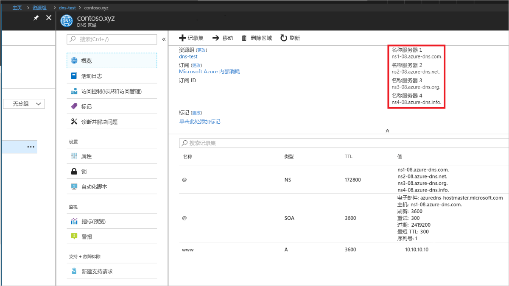

# <a name="quickstart-configure-azure-dns-for-name-resolution-using-the-azure-portal"></a>快速入门：使用 Azure 门户将 Azure DNS 配置为进行名称解析

 可以将 Azure DNS 配置为解析公共域中的主机名。 例如，如果从某个域名注册机构处购买了 contoso.com 域名，则可将 Azure DNS 配置为托管 contoso.com 域，并将 www.contoso.com 解析为 Web 服务器或 Web 应用的 IP 地址。

在本快速入门中，请先创建一个测试域，然后创建一个名为“www”的可解析为 IP 地址 10.10.10.10 的地址记录。

请注意，本快速入门中使用的所有名称和 IP 地址都只是示例，不代表实际方案。 但在适用情况下，也会讨论实际方案。

<!---
You can also perform these steps using [Azure PowerShell](dns-getstarted-powershell.md) or the cross-platform [Azure CLI 2.0](dns-getstarted-cli.md).
--->

DNS 区域用来包含某个特定域的 DNS 条目。 若要开始在 Azure DNS 中托管域，需要为该域名创建 DNS 区域。 随后会在此 DNS 区域内为每个 DNS 条目（或记录）创建域。 以下步骤显示如何执行该操作。

如果没有 Azure 订阅，请在开始之前创建一个[免费帐户](https://azure.microsoft.com/free/?WT.mc_id=A261C142F)。

## <a name="create-a-dns-zone"></a>创建 DNS 区域

1. 登录到 Azure 门户。
2. 在左上角单击“+ 创建资源”>“网络”，然后单击“DNS 区域”以打开“创建 DNS 区域”页。

    

4. 在“创建 DNS 区域”页上，输入以下值，并单击“创建”：


   | **设置** | **值** | **详细信息** |
   |---|---|---|
   |**Name**|contoso.xyz|此示例的 DNS 区域的名称。 可以在本快速入门中使用所需的任何值，只要其尚未在 Azure DNS 服务器上配置即可。 实际值可以是从域名注册机构购买的域。|
   |**订阅**|[订阅]|选择要在其中创建 DNS 区域的订阅。|
   |**资源组**|**新建：** dns-test|创建资源组。 资源组名称必须在所选订阅中唯一。 |
   |**位置**|美国东部||

创建区域可能需要几分钟。

## <a name="create-a-dns-record"></a>创建 DNS 记录

现在请创建新的地址记录（“A”记录）。 “A”记录用于将主机名称解析为 IP v4 地址。

1. 在 Azure 门户的“收藏夹”窗格中单击“所有资源”。 在“所有资源”页中单击“contoso.xyz”DNS 区域。 如果所选订阅中已包含多个资源，则可在“按名称筛选…”框中输入“contoso.xyz”， 轻松访问 DNS 区域。

1. 在“DNS 区域”页顶部，选择“+ 记录集”以打开“添加记录集”页。

1. 在“添加记录集”页中，输入以下值，并单击“确定”。 在此示例中，请创建一个“A”记录。

   |**设置** | **值** | **详细信息** |
   |---|---|---|
   |**Name**|www|记录的名称。 这是需用于主机的名称，而该主机需解析为 IP 地址。|
   |类型|A| 要创建的 DNS 记录的类型。 “A”记录是最常见的，但是也有其他适用于邮件服务器 (MX)、IP v6 地址 (AAAA) 等的记录类型。 |
   |**TTL**|1|DNS 请求的生存时间。 指定允许 DNS 服务器和客户端缓存响应的时间。|
   |**TTL 单位**|小时|TTL 值的时间度量。|
   |IP 地址|10.10.10.10| 此值是“A”记录解析成的 IP 地址。 这只是本快速入门的测试值。 对于实际示例，则请输入 Web 服务器的公共 IP 地址。|


由于在本快速入门中并没有实际购买真实的域名，因此不需将 Azure DNS 配置为域名注册机构的名称服务器。 但在实际方案中，则需 Internet 上的任何人都能够解析你的主机，以便连接到你的 Web 服务器或应用。 有关实际方案的详细信息，请参阅[将域委托给 Azure DNS](dns-delegate-domain-azure-dns.md)。


## <a name="test-the-name-resolution"></a>测试名称解析

有了测试区域且在其中有了测试性的“A”记录以后，即可使用名为 nslookup 的工具测试名称解析。 

1. 首先，需记下要通过 nslookup 使用的 Azure DNS 名称服务器。 

   用于你的区域的名称服务器列在 DNS 区域的“概述”页上。 复制其中一个名称服务器的名称：

   

2. 现在请打开一个命令提示符并运行以下命令：

   ```
   nslookup <host name> <name server>
   
   For example:

   nslookup www.contoso.xyz ns1-08.azure-dns.com
   ```

此时会看到类似以下屏幕截图的结果：


验证名称解析是否正常工作。 www.contoso.xyz 解析为 10.10.10.10，就像你所配置的那样！

## <a name="clean-up-resources"></a>清理资源

不再需要时，可以通过删除 **dns-test** 资源组来删除本快速入门中创建的资源。 若要执行此操作，请单击“dns-test”资源组，然后单击“删除资源组”。


## <a name="next-steps"></a>后续步骤

> [!div class="nextstepaction"]
> [在自定义域中为 web 应用创建 DNS 记录](./dns-web-sites-custom-domain.md)