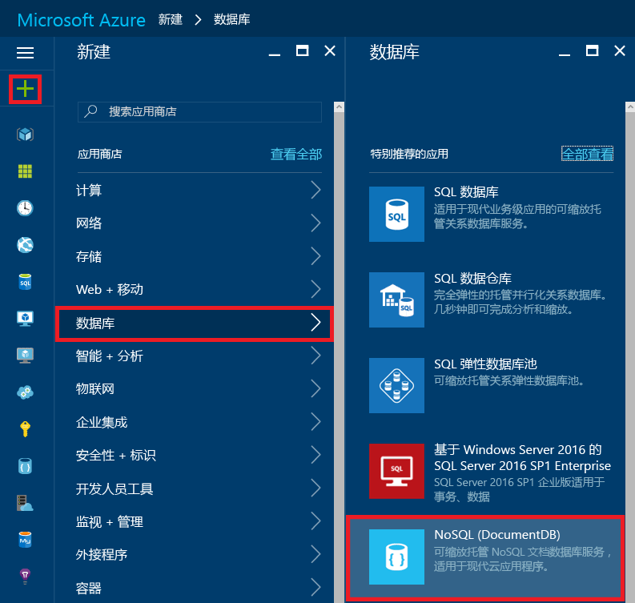

# 如何使用 Azure 门户创建 DocumentDB NoSQL 帐户
> [!div class="op_single_selector"]
> * [Azure 门户](documntdb-create-account.md)
> * [Azure CLI 和 Azure Resource Manager](documentdb-automation-resource-manager-cli.md)
> 
> 

若要使用 Microsoft Azure DocumentDB 构建数据库，必须：

* 有一个 Azure 帐户。如果没有 Azure 帐户，可以获取[免费 Azure 帐户](https://azure.microsoft.com/free)。
* 创建一个 DocumentDB 帐户。

可以使用 Azure 门户、Azure Resource Manager 模板或 Azure 命令行接口 (CLI) 来创建 DocumentDB 帐户。本文说明如何使用 Azure 门户创建 DocumentDB 帐户。若要使用 Azure Resource Manager 或 Azure CLI 创建帐户，请参阅[自动创建 DocumentDB 数据库帐户](documentdb-automation-resource-manager-cli.md)。

你是 DocumentDB 新手吗？ 观看 Scott Hanselman 制作的[这个](https://azure.microsoft.com/documentation/videos/create-documentdb-on-azure/)四分钟视频，了解如何在在线门户中完成最常见的任务。

1. 登录到 [Azure 门户](https://portal.azure.com/)。
2. 在跳转栏中，依次单击“**新建**”、“**数据 + 存储器**”、“**DocumentDB”(NoSQL)**。
   
   
3. 在“**新帐户**”边栏选项卡中，为 DocumentDB 帐户指定所需的配置。
   
    
   
   * 在“ID”框中，输入一个名称用于标识 DocumentDB 帐户。对“ID”进行验证后，“ID”框中会出现一个绿色的复选标记。该“ID”值将成为 URI 中的主机名。“ID”只能包含小写字母、数字及“-”字符，且长度必须为 3 到 50 个字符。请注意，*documents.azure.com* 会追加到所选择的终结点名称，最终组成 DocumentDB 帐户终结点。
   * 在 **NoSQL API** 框中，选择要使用的编程模型：
     
     * **DocumentDB**：DocumentDB API 可通过 .NET、Java、Node.js、Python 和 JavaScript [SDK](documentdb-sdk-dotnet.md)，以及 HTTP [REST](https://msdn.microsoft.com/library/azure/dn781481.aspx) 使用，并对所有 DocumentDB 功能提供编程访问权限。
     * **MongoDB**：DocumentDB 还为 **MongoDB** API 提供[协议级别支持](documentdb-protocol-mongodb.md)。选择 MongoDB API 选项时，可以使用现有的 MongoDB SDK 和 [工具](documentdb-mongodb-mongochef.md)来和 DocumentDB 对话。可以[移动](documentdb-import-data.md)现有的 MongoDB 应用程序以使用 DocumentDB，[无需更改代码](documentdb-connect-mongodb-account.md)，并利用完全托管的具有无限规模、全局复制和其他功能的数据库作为服务。
   * 对于“订阅”，请选择要用于 DocumentDB 帐户的 Azure 订阅。如果帐户只有一个订阅，则默认为选择该帐户。
   * 在“资源组”中，为 DocumentDB 帐户选择或创建资源组。默认创建新的资源组。有关详细信息，请参阅[使用 Azure 门户管理 Azure 资源](../articles/azure-portal/resource-group-portal.md)。
   * 使用“位置”指定在其中托管 DocumentDB 帐户的地理位置。
4. 配置了新的 DocumentDB 帐户后，单击“创建”。若要检查部署状态，请检查通知中心。
   
   
   
   
5. 在创建 DocumentDB 帐户后，可随时以默认设置开始使用。DocumentDB 帐户的默认一致性设置为“**会话**”。可单击资源菜单中的“**默认一致性**”调整默认一致性。若要了解有关 DocumentDB 提供的一致性级别的详细信息，请参阅 [DocumentDB 中的一致性级别](documentdb-consistency-levels.md)。
   
   
   
   

[How to: Create a DocumentDB account]: #Howto
[Next steps]: #NextSteps
[documentdb-manage]: ../articles/documentdb/documentdb-manage.md

## 后续步骤
现在你已经有了 DocumentDB 帐户，下一步是创建 DocumentDB 数据库。

可以使用以下其中一项来创建新的数据库：

* Azure 门户，如[使用 Azure 门户创建 DocumentDB 数据库](documentdb-create-database.md)中所述。
* 综合教程包括示例数据：[.NET](documentdb-get-started.md)、[.NET MVC](documentdb-dotnet-application.md)、[Java](documentdb-java-application.md)、[Node.js](documentdb-nodejs-application.md) 或 [Python](documentdb-python-application.md)。
* 在 GitHub 中可用的 [.NET](documentdb-dotnet-samples.md#database-examples)、[Node.js](documentdb-nodejs-samples.md#database-examples)，或 [Python](documentdb-python-samples.md#database-examples) 示例代码。
* [.NET](documentdb-sdk-dotnet.md)、[Node.js](documentdb-sdk-node.md)、[Java](documentdb-sdk-java.md)、[Python](documentdb-sdk-python.md) 和 [REST](https://msdn.microsoft.com/library/azure/mt489072.aspx) SDK。

创建数据库后，必须向数据库[添加一个或多个集合](documentdb-create-collection.md)，然后向集合[添加文档](documentdb-view-json-document-explorer.md)。

集合中添加文档后，可以针对文档将 [DocumentDB SQL](documentdb-sql-query.md) 用于[执行查询](documentdb-sql-query.md#executing-queries)。可以在门户、[REST API](https://msdn.microsoft.com/library/azure/dn781481.aspx) 或其中一个 [SDK](documentdb-sdk-dotnet.md) 中，通过使用[查询资源管理器](documentdb-query-collections-query-explorer.md)执行查询。

### 了解详细信息
若要详细了解 DocumentDB，请浏览以下资源：

* [DocumentDB 学习路径](https://azure.microsoft.com/documentation/learning-paths/documentdb/)
* [DocumentDB 分层资源模型和概念](documentdb-resources.md)

<!---HONumber=AcomDC_0921_2016-->