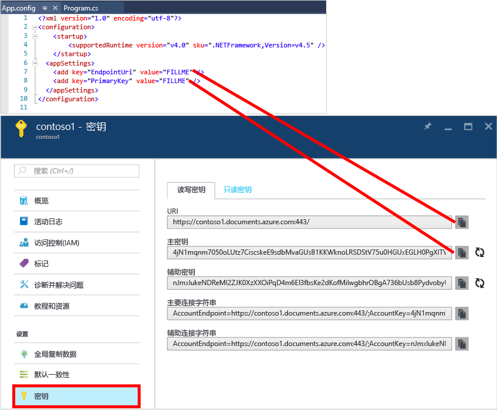

# NoSQL 教程︰构建 DocumentDB C# 控制台应用程序
> [!div class="op_single_selector"]
> * [.NET](documentdb-get-started.md)
> * [Node.js](documentdb-nodejs-get-started.md)
> 
> 

欢迎使用 Azure DocumentDB .NET SDK 的 NoSQL 教程！ 获取“快速启动”项目或完成本教程后，你将拥有一个可创建并查询 DocumentDB 资源的控制台应用程序。

* **[快速启动](#quickstart)**：下载示例项目、添加连接信息，然后运行 DocumentDB 应用（所需时间不超过 10 分钟）。
* **[教程](#tutorial)**：30 分钟内从头生成“快速启动”应用。

## 先决条件
* 有效的 Azure 帐户。 如果没有，可以注册 [免费帐户](https://azure.microsoft.com/free/)。
* [Visual Studio 2013 或 Visual Studio 2015](http://www.visualstudio.com/)。
* .NET Framework 4.6

## 快速启动
1. 从 [GitHub](https://github.com/Azure-Samples/documentdb-dotnet-getting-started-quickstart/archive/master.zip) 下载示例项目 .zip，或者克隆 [documentdb-dotnet-getting-started-quickstart](https://github.com/Azure-Samples/documentdb-dotnet-getting-started-quickstart) 存储库。
2. 使用 Azure 门户 [创建 DocumentDB 帐户](documentdb-create-account.md)。
3. 在 App.config 文件中，将 EndpointUri 和 PrimaryKey 值替换为从 [Azure 门户](https://portal.azure.com/)检索到的值（方法是导航到“DocumentDB (NoSQL)”边栏选项卡，单击“帐户名”，然后单击资源菜单上的“密钥”）。
    
4. 生成项目。 控制台窗口显示要创建、查询，然后清理的新资源。
   
    

## 教程
本教材介绍了如何创建 DocumentDB 数据库、DocumentDB 集合和 JSON 文档。 然后查询集合、清理和删除数据库。 本教程生成与“快速启动”项目相同的项目，但可以通过增量方式生成该项目，并且会收到有关要添加到该项目的代码的解释。

## 第 1 步：创建 DocumentDB 帐户
让我们创建一个 DocumentDB 帐户。 如果已经有一个想要使用的帐户，可以跳到 [设置 Visual Studio 解决方案](#SetupVS)。

[!INCLUDE [documentdb-create-dbaccount](../../includes/documentdb-create-dbaccount.md)]

## 第 2 步：设置 Visual Studio 解决方案
1. 在计算机上打开 **Visual Studio 2015** 。
2. 在“文件”菜单中，选择“新建”，然后选择“项目”。
3. 在“新建项目”对话框中，选择“模板” / “Visual C#” / “控制台应用程序”，为项目命名，然后单击“确定”。
   
4. 在 **“解决方案资源管理器”**中，右键单击 Visual Studio 解决方案下方的新控制台应用程序。
5. 接下来，在未关闭菜单的情况下，单击“管理 NuGet 包...”****
   
6. 在“Nuget”选项卡上，单击“浏览”，然后在搜索框中输入 **azure documentdb**。
7. 在结果中找到 **Microsoft.Azure.DocumentDB**，然后单击“安装”。
   DocumentDB 客户端库的程序包 ID 为 [Microsoft.Azure.DocumentDB](https://www.nuget.org/packages/Microsoft.Azure.DocumentDB)
   

很好！ 现在，我们已完成安装，让我们开始编写一些代码。 可以在 [GitHub](https://github.com/Azure-Samples/documentdb-dotnet-getting-started/blob/master/src/Program.cs)上找到本教程的完整代码项目。

## 第 3 步：连接到 DocumentDB 帐户
首先，在 Program.cs 文件中 C# 应用程序的开始位置添加这些引用︰

    using System;
    using System.Linq;
    using System.Threading.Tasks;

    // ADD THIS PART TO YOUR CODE
    using System.Net;
    using Microsoft.Azure.Documents;
    using Microsoft.Azure.Documents.Client;
    using Newtonsoft.Json;

> [!IMPORTANT]
> 为了完成该 NoSQL 教程，请确保添加以上依赖关系。
> 
> 

现在，在公共类 *Program* 下面添加这两个常量和*客户端*变量。

    public class Program
    {
        // ADD THIS PART TO YOUR CODE
        private const string EndpointUri = "<your endpoint URI>";
        private const string PrimaryKey = "<your key>";
        private DocumentClient client;

接下来，转到 [Azure 门户](https://portal.azure.com) 检索 URI 和主密钥。 DocumentDB URI 和主密钥是必需的，可让应用程序知道要连接的对象，让 DocumentDB 信任应用程序的连接。

在 Azure 门户中，导航到 DocumentDB 帐户，然后单击“密钥” 。

从门户中复制该 URI 并将它粘贴到 program.cs 文件中的 `<your endpoint URI>` 。 然后从门户中复制“主密钥”并将它粘贴到 `<your key>`。

![NoSQL 教程用于创建 C# 控制台应用程序的 Azure 门户的屏幕截图。 显示 DocumentDB 帐户，在“DocumentDB 帐户”边栏选项卡上突出显示“ACTIVE”中心、“键”按钮，在“键”边栏选项卡上突出显示 URI、主键、辅键的值][keys]

开始使用入门应用程序时，请首先创建一个新的 **DocumentClient**实例。

在 **Main** 方法下面，添加这个名为 **GetStartedDemo** 的新异步任务，将新的 **DocumentClient** 实例化。

    static void Main(string[] args)
    {
    }

    // ADD THIS PART TO YOUR CODE
    private async Task GetStartedDemo()
    {
        this.client = new DocumentClient(new Uri(EndpointUri), PrimaryKey);
    }

添加以下代码，从 **Main** 方法中运行异步任务。 **Main** 方法将捕获异常并将它们写到控制台上。

    static void Main(string[] args)
    {
            // ADD THIS PART TO YOUR CODE
            try
            {
                    Program p = new Program();
                    p.GetStartedDemo().Wait();
            }
            catch (DocumentClientException de)
            {
                    Exception baseException = de.GetBaseException();
                    Console.WriteLine("{0} error occurred: {1}, Message: {2}", de.StatusCode, de.Message, baseException.Message);
            }
            catch (Exception e)
            {
                    Exception baseException = e.GetBaseException();
                    Console.WriteLine("Error: {0}, Message: {1}", e.Message, baseException.Message);
            }
            finally
            {
                    Console.WriteLine("End of demo, press any key to exit.");
                    Console.ReadKey();
            }

按 **F5** 运行应用程序。

祝贺你！ 已成功连接到 DocumentDB 帐户了，现在让我们看看如何使用 DocumentDB 资源。  

## 第 4 步：创建数据库
在添加创建数据库的代码之前，添加一个用于向控制台写入的帮助器方法。

将 **WriteToConsoleAndPromptToContinue** 方法复制并粘贴到 **GetStartedDemo** 方法下面。

    // ADD THIS PART TO YOUR CODE
    private void WriteToConsoleAndPromptToContinue(string format, params object[] args)
    {
            Console.WriteLine(format, args);
            Console.WriteLine("Press any key to continue ...");
            Console.ReadKey();
    }

可以通过使用 **DocumentClient** 类的 [CreateDatabaseAsync](https://msdn.microsoft.com/library/microsoft.azure.documents.client.documentclient.createdatabaseasync.aspx) 方法来创建 DocumentDB [数据库](documentdb-resources.md#databases)。 数据库是跨集合分区的 JSON 文档存储的逻辑容器。

将 **CreateDatabaseIfNotExists** 方法复制并粘贴到 **WriteToConsoleAndPromptToContinue** 方法下面。

    // ADD THIS PART TO YOUR CODE
    private async Task CreateDatabaseIfNotExists(string databaseName)
    {
            // Check to verify a database with the id=FamilyDB does not exist
            try
            {
                    await this.client.ReadDatabaseAsync(UriFactory.CreateDatabaseUri(databaseName));
                    this.WriteToConsoleAndPromptToContinue("Found {0}", databaseName);
            }
            catch (DocumentClientException de)
            {
                    // If the database does not exist, create a new database
                    if (de.StatusCode == HttpStatusCode.NotFound)
                    {
                            await this.client.CreateDatabaseAsync(new Database { Id = databaseName });
                            this.WriteToConsoleAndPromptToContinue("Created {0}", databaseName);
                    }
                    else
                    {
                            throw;
                    }
            }
    }

将以下代码复制并粘贴到客户端创建下方的 **GetStartedDemo** 方法。 这将创建一个名为 *FamilyDB*的数据库。

    private async Task GetStartedDemo()
    {
        this.client = new DocumentClient(new Uri(EndpointUri), PrimaryKey);

        // ADD THIS PART TO YOUR CODE
        await this.CreateDatabaseIfNotExists("FamilyDB_va");

按 **F5** 运行应用程序。

祝贺你！ 你已成功创建 DocumentDB 数据库。  

## 步骤 5：创建集合
> [!WARNING]
> **CreateDocumentCollectionAsync** 将创建一个具有保留吞吐量的新集合，它牵涉定价。 有关详细信息，请访问 [定价页](https://azure.microsoft.com/pricing/details/documentdb/)。
> 
> 

可以通过使用 **DocumentClient** 类的 [CreateDocumentCollectionAsync](https://msdn.microsoft.com/library/microsoft.azure.documents.client.documentclient.createdocumentcollectionasync.aspx) 方法来创建[集合](documentdb-resources.md#collections)。 集合是 JSON 文档和相关联的 JavaScript 应用程序逻辑的容器。

将 **CreateDocumentCollectionIfNotExists** 方法复制并粘贴到 **CreateDatabaseIfNotExists** 方法下面。

    // ADD THIS PART TO YOUR CODE
    private async Task CreateDocumentCollectionIfNotExists(string databaseName, string collectionName)
    {
        try
        {
            await this.client.ReadDocumentCollectionAsync(UriFactory.CreateDocumentCollectionUri(databaseName, collectionName));
            this.WriteToConsoleAndPromptToContinue("Found {0}", collectionName);
        }
        catch (DocumentClientException de)
        {
            // If the document collection does not exist, create a new collection
            if (de.StatusCode == HttpStatusCode.NotFound)
            {
                DocumentCollection collectionInfo = new DocumentCollection();
                collectionInfo.Id = collectionName;

                // Configure collections for maximum query flexibility including string range queries.
                collectionInfo.IndexingPolicy = new IndexingPolicy(new RangeIndex(DataType.String) { Precision = -1 });

                // Here we create a collection with 400 RU/s.
                await this.client.CreateDocumentCollectionAsync(
                    UriFactory.CreateDatabaseUri(databaseName),
                    collectionInfo,
                    new RequestOptions { OfferThroughput = 400 });

                this.WriteToConsoleAndPromptToContinue("Created {0}", collectionName);
            }
            else
            {
                throw;
            }
        }
    }

将以下代码复制并粘贴到数据库创建下方的 **GetStartedDemo** 方法。 这将创建一个名为 *FamilyCollection_va* 的文档集合。

        this.client = new DocumentClient(new Uri(EndpointUri), PrimaryKey);

        await this.CreateDatabaseIfNotExists("FamilyDB_oa");

        // ADD THIS PART TO YOUR CODE
        await this.CreateDocumentCollectionIfNotExists("FamilyDB_va", "FamilyCollection_va");

按 **F5** 运行应用程序。

祝贺你！ 你已成功创建 DocumentDB 文档集合。  

## 步骤 6：创建 JSON 文档
可以通过使用 **DocumentClient** 类的 [CreateDocumentAsync](https://msdn.microsoft.com/library/microsoft.azure.documents.client.documentclient.createdocumentasync.aspx) 方法创建[文档](documentdb-resources.md#documents)。 文档为用户定义的（任意）JSON 内容。 现在，我们可以插入一个或多个文档。 如果已有要在数据库中存储的数据，则可以使用 DocumentDB 的 [数据迁移工具](documentdb-import-data.md)。

在本例中，首先需要创建 **Family** 类来表示存储在 DocumentDB 中的对象。 此外还将创建 **Family** 中使用的 **Parent**、**Child**、**Pet** 和 **Address** 子类。 请注意，文档必须将 **ID** 属性序列化为 JSON 格式的 **ID**。 通过在 **GetStartedDemo** 方法后添加以下内部子类来创建这些类。

将 **Family**、**Parent**、**Child**、**Pet** 和 **Address** 类复制并粘贴到 **WriteToConsoleAndPromptToContinue** 方法下面。

    private void WriteToConsoleAndPromptToContinue(string format, params object[] args)
    {
        Console.WriteLine(format, args);
        Console.WriteLine("Press any key to continue ...");
        Console.ReadKey();
    }

    // ADD THIS PART TO YOUR CODE
    public class Family
    {
        [JsonProperty(PropertyName = "id")]
        public string Id { get; set; }
        public string LastName { get; set; }
        public Parent[] Parents { get; set; }
        public Child[] Children { get; set; }
        public Address Address { get; set; }
        public bool IsRegistered { get; set; }
        public override string ToString()
        {
                return JsonConvert.SerializeObject(this);
        }
    }

    public class Parent
    {
        public string FamilyName { get; set; }
        public string FirstName { get; set; }
    }

    public class Child
    {
        public string FamilyName { get; set; }
        public string FirstName { get; set; }
        public string Gender { get; set; }
        public int Grade { get; set; }
        public Pet[] Pets { get; set; }
    }

    public class Pet
    {
        public string GivenName { get; set; }
    }

    public class Address
    {
        public string State { get; set; }
        public string County { get; set; }
        public string City { get; set; }
    }

将 **CreateFamilyDocumentIfNotExists** 方法复制并粘贴到 **CreateDocumentCollectionIfNotExists** 方法下面。

    // ADD THIS PART TO YOUR CODE
    private async Task CreateFamilyDocumentIfNotExists(string databaseName, string collectionName, Family family)
    {
        try
        {
            await this.client.ReadDocumentAsync(UriFactory.CreateDocumentUri(databaseName, collectionName, family.Id));
            this.WriteToConsoleAndPromptToContinue("Found {0}", family.Id);
        }
        catch (DocumentClientException de)
        {
            if (de.StatusCode == HttpStatusCode.NotFound)
            {
                await this.client.CreateDocumentAsync(UriFactory.CreateDocumentCollectionUri(databaseName, collectionName), family);
                this.WriteToConsoleAndPromptToContinue("Created Family {0}", family.Id);
            }
            else
            {
                throw;
            }
        }
    }

然后插入两个文档，Andersen Family 和 Wakefield Family 各一个。

将以下代码复制并粘贴到文档集合创建下的 **GetStartedDemo** 方法。

    await this.CreateDatabaseIfNotExists("FamilyDB_va");

    await this.CreateDocumentCollectionIfNotExists("FamilyDB_va", "FamilyCollection_va");

    // ADD THIS PART TO YOUR CODE
    Family andersenFamily = new Family
    {
            Id = "Andersen.1",
            LastName = "Andersen",
            Parents = new Parent[]
            {
                    new Parent { FirstName = "Thomas" },
                    new Parent { FirstName = "Mary Kay" }
            },
            Children = new Child[]
            {
                    new Child
                    {
                            FirstName = "Henriette Thaulow",
                            Gender = "female",
                            Grade = 5,
                            Pets = new Pet[]
                            {
                                    new Pet { GivenName = "Fluffy" }
                            }
                    }
            },
            Address = new Address { State = "WA", County = "King", City = "Seattle" },
            IsRegistered = true
    };

    await this.CreateFamilyDocumentIfNotExists("FamilyDB_va", "FamilyCollection_va", andersenFamily);

    Family wakefieldFamily = new Family
    {
            Id = "Wakefield.7",
            LastName = "Wakefield",
            Parents = new Parent[]
            {
                    new Parent { FamilyName = "Wakefield", FirstName = "Robin" },
                    new Parent { FamilyName = "Miller", FirstName = "Ben" }
            },
            Children = new Child[]
            {
                    new Child
                    {
                            FamilyName = "Merriam",
                            FirstName = "Jesse",
                            Gender = "female",
                            Grade = 8,
                            Pets = new Pet[]
                            {
                                    new Pet { GivenName = "Goofy" },
                                    new Pet { GivenName = "Shadow" }
                            }
                    },
                    new Child
                    {
                            FamilyName = "Miller",
                            FirstName = "Lisa",
                            Gender = "female",
                            Grade = 1
                    }
            },
            Address = new Address { State = "NY", County = "Manhattan", City = "NY" },
            IsRegistered = false
    };

    await this.CreateFamilyDocumentIfNotExists("FamilyDB_va", "FamilyCollection_va", wakefieldFamily);

按 **F5** 运行应用程序。

祝贺你！ 你已成功创建了两个 DocumentDB 文档。  

## 步骤 7：查询 DocumentDB 资源
DocumentDB 支持对存储在每个集合中的 JSON 文档进行各种 [查询](documentdb-sql-query.md) 。  下面的示例代码演示了各种查询（使用 DocumentDB SQL 语法以及 LINQ），我们可以针对上一步中插入的文档执行查询。

将 **ExecuteSimpleQuery** 方法复制并粘贴到 **CreateFamilyDocumentIfNotExists** 方法下面。

    // ADD THIS PART TO YOUR CODE
    private void ExecuteSimpleQuery(string databaseName, string collectionName)
    {
        // Set some common query options
        FeedOptions queryOptions = new FeedOptions { MaxItemCount = -1 };

            // Here we find the Andersen family via its LastName
            IQueryable<Family> familyQuery = this.client.CreateDocumentQuery<Family>(
                    UriFactory.CreateDocumentCollectionUri(databaseName, collectionName), queryOptions)
                    .Where(f => f.LastName == "Andersen");

            // The query is executed synchronously here, but can also be executed asynchronously via the IDocumentQuery<T> interface
            Console.WriteLine("Running LINQ query...");
            foreach (Family family in familyQuery)
            {
                    Console.WriteLine("\tRead {0}", family);
            }

            // Now execute the same query via direct SQL
            IQueryable<Family> familyQueryInSql = this.client.CreateDocumentQuery<Family>(
                    UriFactory.CreateDocumentCollectionUri(databaseName, collectionName),
                    "SELECT * FROM Family WHERE Family.LastName = 'Andersen'",
                    queryOptions);

            Console.WriteLine("Running direct SQL query...");
            foreach (Family family in familyQueryInSql)
            {
                    Console.WriteLine("\tRead {0}", family);
            }

            Console.WriteLine("Press any key to continue ...");
            Console.ReadKey();
    }

将以下代码复制并粘贴到第二次文档创建下的 **GetStartedDemo** 方法。

    await this.CreateFamilyDocumentIfNotExists("FamilyDB_va", "FamilyCollection_va", wakefieldFamily);

    // ADD THIS PART TO YOUR CODE
    this.ExecuteSimpleQuery("FamilyDB_va", "FamilyCollection_va");

按 **F5** 运行应用程序。

祝贺你！ 你已成功完成对 DocumentDB 集合的查询。

下图说明了如何对创建的集合调用 DocumentDB SQL 查询语法，相同的逻辑也适用于 LINQ 查询。

查询中的 [FROM](documentdb-sql-query.md#from-clause) 关键字是可选的，因为 DocumentDB 查询的范围已限制为单个集合。 因此，“FROM Families f”可与“FROM root r”或者任何其他所选变量名进行交换。 默认情况下，DocumentDB 将推断你选择的 Families、root 或变量名，并默认引用当前集合。

## 步骤 8：替换 JSON 文档
DocumentDB 支持替换 JSON 文档。  

将 **ReplaceFamilyDocument** 方法复制并粘贴到 **ExecuteSimpleQuery** 方法下面。

    // ADD THIS PART TO YOUR CODE
    private async Task ReplaceFamilyDocument(string databaseName, string collectionName, string familyName, Family updatedFamily)
    {
        try
        {
            await this.client.ReplaceDocumentAsync(UriFactory.CreateDocumentUri(databaseName, collectionName, familyName), updatedFamily);
            this.WriteToConsoleAndPromptToContinue("Replaced Family {0}", familyName);
        }
        catch (DocumentClientException de)
        {
            throw;
        }
    }

将以下代码复制并粘贴到查询执行下的 **GetStartedDemo** 方法。 替换文档之后，将再次运行相同查询以查看更改后的文档。

    await this.CreateFamilyDocumentIfNotExists("FamilyDB_va", "FamilyCollection_va", wakefieldFamily);

    this.ExecuteSimpleQuery("FamilyDB_va", "FamilyCollection_va");

    // ADD THIS PART TO YOUR CODE
    // Update the Grade of the Andersen Family child
    andersenFamily.Children[0].Grade = 6;

    await this.ReplaceFamilyDocument("FamilyDB_va", "FamilyCollection_va", "Andersen.1", andersenFamily);

    this.ExecuteSimpleQuery("FamilyDB_va", "FamilyCollection_va");

按 **F5** 运行应用程序。

祝贺你！ 你已成功替换 DocumentDB 文档。

## 步骤 9：删除 JSON 文档
DocumentDB 支持删除 JSON 文档。  

将 **DeleteFamilyDocument** 方法复制并粘贴到 **ReplaceFamilyDocument** 方法下面。

    // ADD THIS PART TO YOUR CODE
    private async Task DeleteFamilyDocument(string databaseName, string collectionName, string documentName)
    {
        try
        {
            await this.client.DeleteDocumentAsync(UriFactory.CreateDocumentUri(databaseName, collectionName, documentName));
            Console.WriteLine("Deleted Family {0}", documentName);
        }
        catch (DocumentClientException de)
        {
            throw;
        }
    }

将以下代码复制并粘贴到第二次查询执行下的 **GetStartedDemo** 方法。

    await this.ReplaceFamilyDocument("FamilyDB_va", "FamilyCollection_va", "Andersen.1", andersenFamily);

    this.ExecuteSimpleQuery("FamilyDB_va", "FamilyCollection_va");

    // ADD THIS PART TO CODE
    await this.DeleteFamilyDocument("FamilyDB_va", "FamilyCollection_va", "Andersen.1");

按 **F5** 运行应用程序。

祝贺你！ 你已成功删除 DocumentDB 文档。

## 步骤 10：删除数据库
删除已创建的数据库将删除该数据库及其所有子资源（集合、文档等）。

将以下代码复制并粘贴到文档删除下的 **GetStartedDemo** 方法，删除整个数据库和所有子资源。

    this.ExecuteSimpleQuery("FamilyDB_va", "FamilyCollection_va");

    await this.DeleteFamilyDocument("FamilyDB_va", "FamilyCollection_va", "Andersen.1");

    // ADD THIS PART TO CODE
    // Clean up/delete the database
    await this.client.DeleteDatabaseAsync(UriFactory.CreateDatabaseUri("FamilyDB_va"));

按 **F5** 运行应用程序。

祝贺你！ 你已成功删除 DocumentDB 数据库。

## 步骤 11：一起运行 C# 控制台应用程序！
在 Visual Studio 中按 F5，即可在调试模式下构建应用程序。

你应该看到已启动应用的输出。 输出会显示我们所添加的查询的结果，并且应与下面的示例文本相匹配。

    Created FamilyDB_va
    Press any key to continue ...
    Created FamilyCollection_va
    Press any key to continue ...
    Created Family Andersen.1
    Press any key to continue ...
    Created Family Wakefield.7
    Press any key to continue ...
    Running LINQ query...
        Read {"id":"Andersen.1","LastName":"Andersen","District":"WA5","Parents":[{"FamilyName":null,"FirstName":"Thomas"},{"FamilyName":null,"FirstName":"Mary Kay"}],"Children":[{"FamilyName":null,"FirstName":"Henriette Thaulow","Gender":"female","Grade":5,"Pets":[{"GivenName":"Fluffy"}]}],"Address":{"State":"WA","County":"King","City":"Seattle"},"IsRegistered":true}
    Running direct SQL query...
        Read {"id":"Andersen.1","LastName":"Andersen","District":"WA5","Parents":[{"FamilyName":null,"FirstName":"Thomas"},{"FamilyName":null,"FirstName":"Mary Kay"}],"Children":[{"FamilyName":null,"FirstName":"Henriette Thaulow","Gender":"female","Grade":5,"Pets":[{"GivenName":"Fluffy"}]}],"Address":{"State":"WA","County":"King","City":"Seattle"},"IsRegistered":true}
    Replaced Family Andersen.1
    Press any key to continue ...
    Running LINQ query...
        Read {"id":"Andersen.1","LastName":"Andersen","District":"WA5","Parents":[{"FamilyName":null,"FirstName":"Thomas"},{"FamilyName":null,"FirstName":"Mary Kay"}],"Children":[{"FamilyName":null,"FirstName":"Henriette Thaulow","Gender":"female","Grade":6,"Pets":[{"GivenName":"Fluffy"}]}],"Address":{"State":"WA","County":"King","City":"Seattle"},"IsRegistered":true}
    Running direct SQL query...
        Read {"id":"Andersen.1","LastName":"Andersen","District":"WA5","Parents":[{"FamilyName":null,"FirstName":"Thomas"},{"FamilyName":null,"FirstName":"Mary Kay"}],"Children":[{"FamilyName":null,"FirstName":"Henriette Thaulow","Gender":"female","Grade":6,"Pets":[{"GivenName":"Fluffy"}]}],"Address":{"State":"WA","County":"King","City":"Seattle"},"IsRegistered":true}
    Deleted Family Andersen.1
    End of demo, press any key to exit.

祝贺你！ 你已经完成该 NoSQL 教程，并且获得了一个正常工作的 C# 控制台应用程序！

## 后续步骤
* 需要更复杂的 ASP.NET MVC NoSQL 教程？ 请参阅 [Build a web application with ASP.NET MVC using DocumentDB](documentdb-dotnet-application.md)（使用 DocumentDB 构建具有 ASP.NET MVC 的 Web 应用程序）。
* 想要使用 DocumentDB 执行规模和性能测试？ 请参阅 [Performance and Scale Testing with Azure DocumentDB](documentdb-performance-testing.md)
* 了解如何 [监视 DocumentDB 帐户](documentdb-monitor-accounts.md)。
* 在 [Query Playground](https://www.documentdb.com/sql/demo)中对示例数据集运行查询。
* 在 [DocumentDB 文档页](https://azure.microsoft.com/documentation/services/documentdb/)的“Develop”（开发）部分中了解有关编程模型的详细信息。

[documentdb-create-account]: documentdb-create-account.md
[documentdb-manage]: documentdb-manage.md
[keys]: media/documentdb-get-started-quickstart/nosql-tutorial-keys.png

<!--HONumber=Nov16_HO2-->

