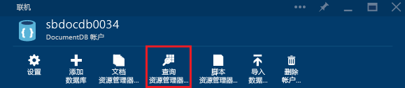
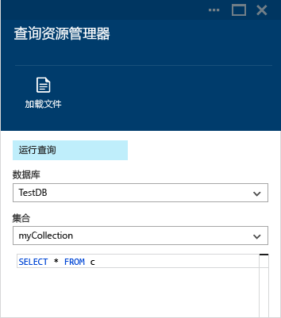
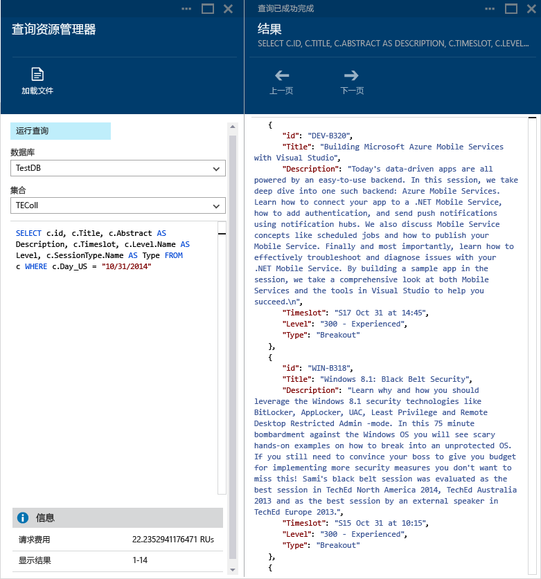
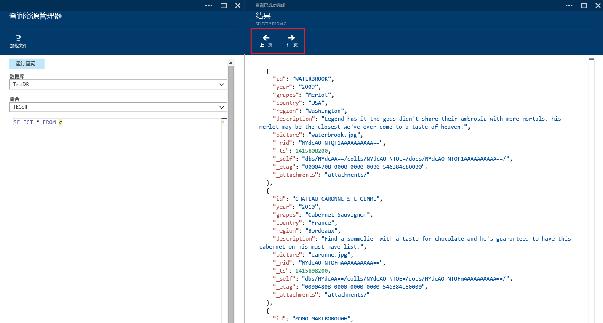
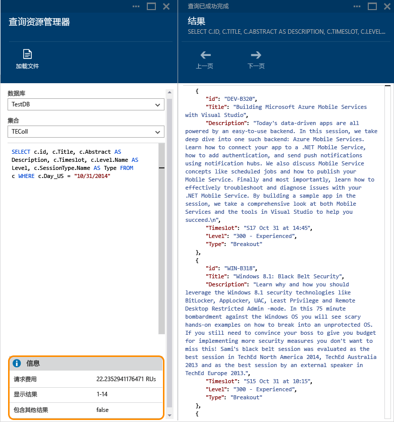
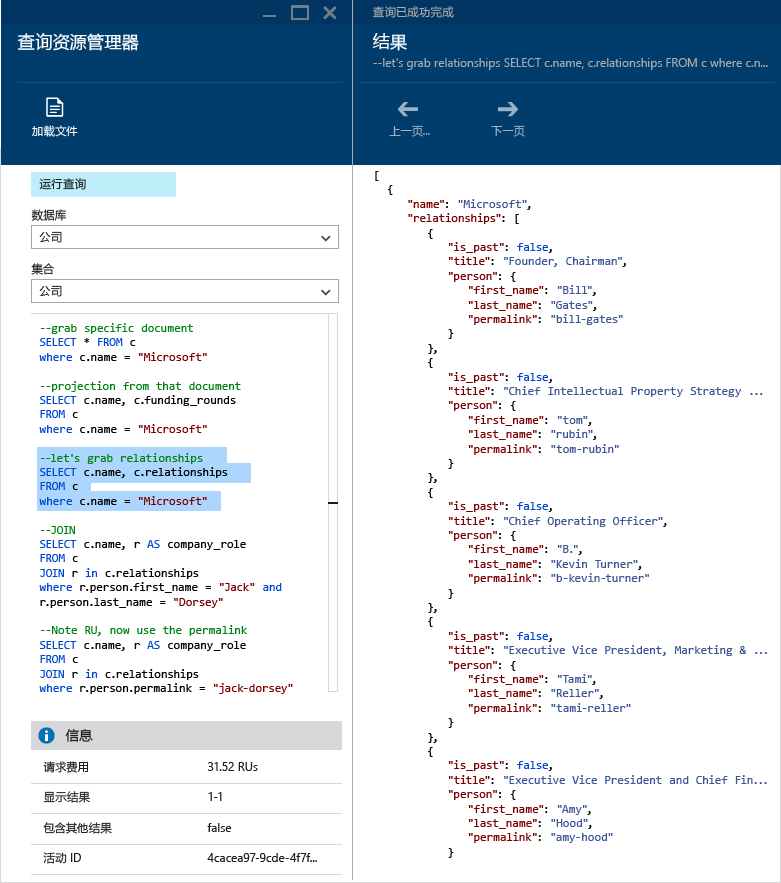
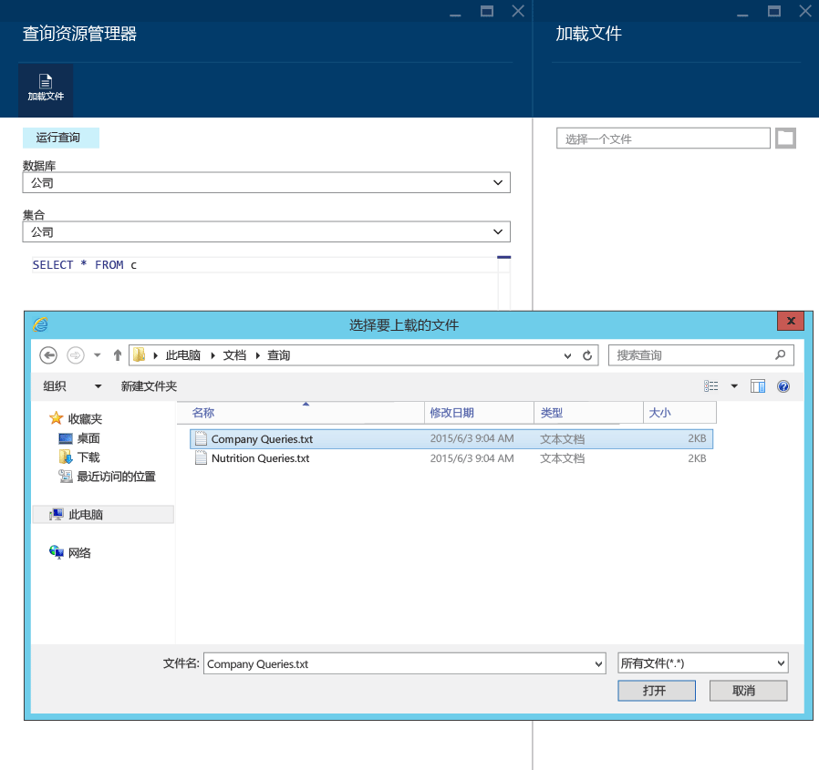
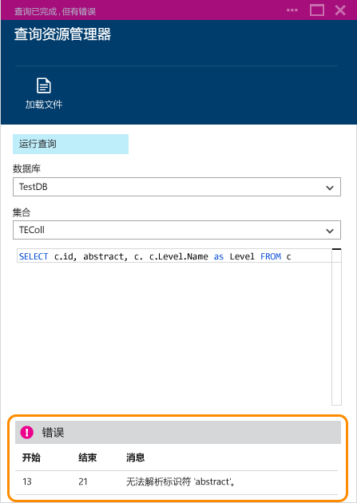

# 在 Azure 门户中使用查询资源管理器为 Azure Cosmos DB 编写、编辑和运行 SQL 查询
本文概述了 [Microsoft Azure Cosmos DB](https://azure.microsoft.com/services/documentdb/) 查询资源管理器，该资源管理器是一个 Azure 门户工具，用于针对 [DocumentDB](documentdb-create-collection.md) 集合编写、编辑和运行 SQL 查询。

1. 在 [Azure 门户](https://portal.azure.com)的左侧导航栏中，单击 “Azure Cosmos DB”。 

    如果未显示 Azure Cosmos DB，单击底部的“更多服务”，然后单击 “Azure Cosmos DB”。
2. 在资源菜单中，单击“查询资源管理器”。 
   
    
3. 在“查询资源管理器”边栏选项卡中，从下拉列表中选择要查询的**数据库**和**集合**，然后键入要运行的查询。 
   
    “数据库”和“集合”下拉列表会根据启动查询资源管理器的上下文进行预填充。 
   
    提供了 `SELECT TOP 100 * FROM c` 的默认查询。  可以接受默认查询，也可以使用 [SQL 查询速查表](documentdb-sql-query-cheat-sheet.md)或 [SQL 查询和 SQL 语法](documentdb-sql-query.md)文章中所述的 SQL 查询语言构造自己的查询。
   
    单击“运行查询”查看结果。
   
    
4. “结果”边栏选项卡将显示查询的输出。 
   
    

## 处理结果
默认情况下，查询资源管理器会返回 100 条一组的结果。  如果查询生成了 100 多条结果，只需使用“下一页”和“上一页”命令即可浏览结果集。

对于成功的查询，“信息”窗格将包含度量值，如请求费用、查询进行的往返数、当前显示的结果集，以及是否有更多结果（如上文所述，可通过“下一页”命令进行访问）。

## 使用多个查询
如果正在使用多个查询，并且想要在它们之间快速切换，则可以在“查询资源管理器”边栏选项卡的查询文本框中输入所有查询，然后突出显示想要运行的查询，再单击“运行查询”以查看结果。

## 将查询从文件添加到 SQL 查询编辑器
可以使用“加载文件”命令加载现有文件的内容。

## 故障排除
如果查询完成但有错误，查询资源管理器将显示可以帮助进行故障排除工作的错误列表。

## 运行门户外部的 DocumentDB API SQL 查询
Azure 门户中的查询资源管理器只是一种对 Cosmos DB 运行 SQL 查询的方式。 还可以使用 [REST API](https://msdn.microsoft.com/library/azure/dn781481.aspx) 或[客户端 SDK](documentdb-sdk-dotnet.md) 运行 SQL 查询。 有关使用这些其他方法的详细信息，请参阅[执行 SQL 查询](documentdb-sql-query.md#ExecutingSqlQueries)

## 后续步骤
有关查询资源管理器中支持的 DocumentDB API SQL 语法的详细信息，请参阅 [SQL 查询和 SQL 语法](documentdb-sql-query.md)一文或打印 [SQL 查询速查表](documentdb-sql-query-cheat-sheet.md)。
还可以尝试使用[查询板块](https://www.documentdb.com/sql/demo)，在其中可以使用示例数据集联机测试查询。

