# 查看、编辑、创建和上传 JSON 文档 

本文概述了在门户中创建、编辑和查询文档的两种方式：[文档资源管理器](#launch-document-explorer)和[数据资源管理器（预览版）](#data-explorer)。

> [!NOTE]
> 具有 MongoDB 协议支持的 Azure Cosmos DB 帐户中未启用文档资源管理器。 启用此功能后，此页将会更新。

## 在 Azure 门户中启动文档资源管理器
1. 在 [Azure 门户](https://portal.azure.com)的左侧导航栏中，单击 “Azure Cosmos DB”。 

    如果未显示 Azure Cosmos DB，单击底部的“更多服务”，然后单击 “Azure Cosmos DB”。
2. 选择帐户名称。 
3. 在资源菜单中，单击“文档资源管理器”。 
   
    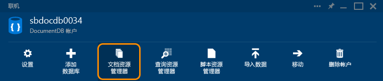
   
    在“文档资源管理器”边栏选项卡上，将根据在其中启动文档资源管理器的上下文对“数据库”和“集合”下拉列表进行预填充。 

## 创建 JSON 文档
1. [启动文档资源管理器](#launch-document-explorer)。
2. 在“文档资源管理器”边栏选项卡上，单击“创建文档”。 
   
    将在“文档”边栏选项卡上显示最小 JSON 代码段。
   
    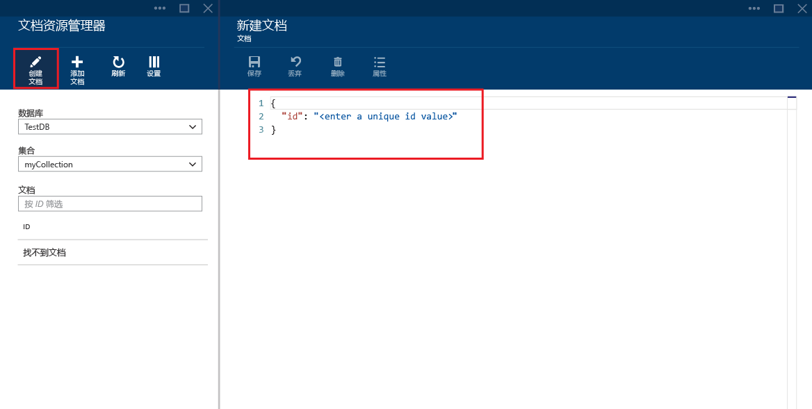
3. 在“文档”边栏选项卡中，键入或粘贴要创建的 JSON 文档的内容，然后单击“保存”以便将文档提交到在“文档资源管理器”边栏选项卡中指定的数据库和集合。
   
    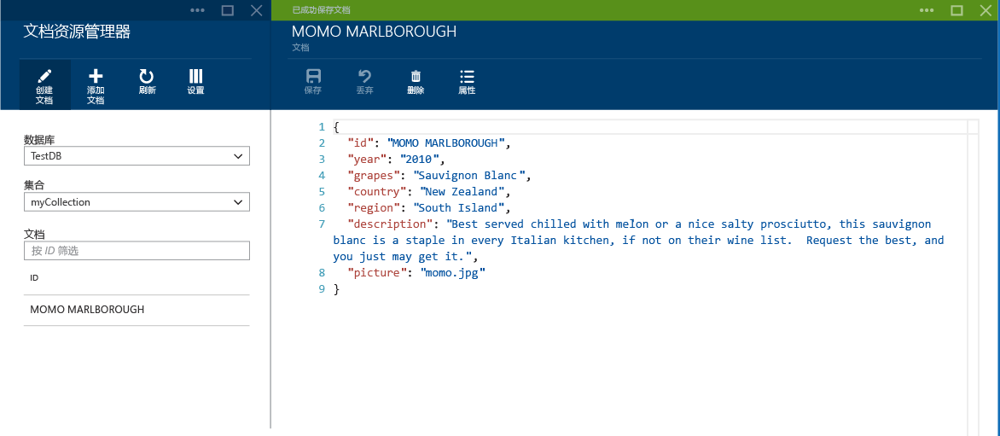
   
   > [!NOTE]
   > 如果你不提供“id”属性，文档资源管理器将自动添加 id 属性并生成一个 GUID 作为 id 值。
   > 
   > 
   
    如果已有来自 JSON 文件、MongoDB、SQL Server、CSV 文件、Azure 表存储、Amazon DynamoDB、HBase 或其他 DocumentDB API 集合的数据，可以使用 DocumentDB API 的[数据迁移工具](documentdb-import-data.md)快速导入数据。

## 编辑 JSON 文档
1. [启动文档资源管理器](#launch-document-explorer)。
2. 若要编辑现有文档，请在“文档资源管理器”边栏选项卡中选中该文档，在“文档”边栏选项卡中编辑该文档，然后单击“保存”。
   
    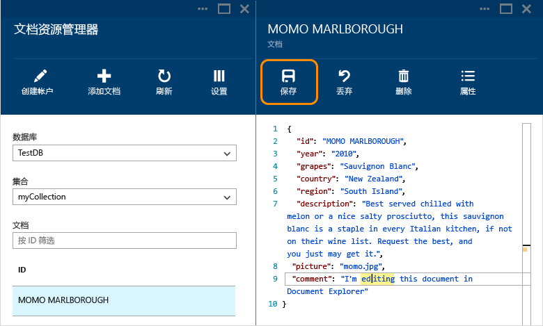
   
    如果在编辑某个文档时想放弃当前的一组编辑，单击“文档”边栏选项卡中的“放弃”并确认放弃操作即可，将重新加载文档的先前状态。
   
    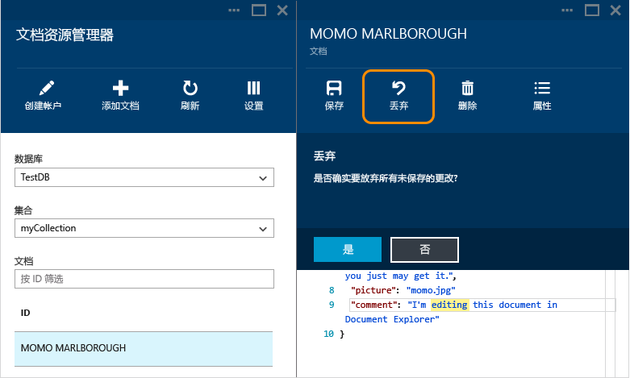

## 删除 Cosmos DB 中的文档
1. [启动文档资源管理器](#launch-document-explorer)。
2. 在“文档资源管理器”选择文档，单击“删除”，然后确认删除。 确认后，将立即从“文档资源管理器”列表中删除该文档。
   
    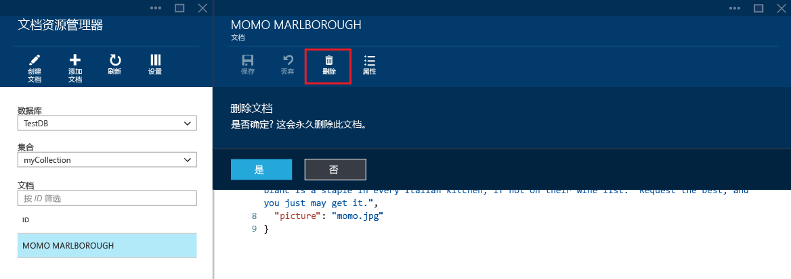

## 使用 JSON 文档
文档资源管理器可验证任何新建或编辑的文档是否包含有效的 JSON。  你甚至可以查看 JSON 错误，方法是将鼠标悬停在错误部分以获取有关验证错误的详细信息。

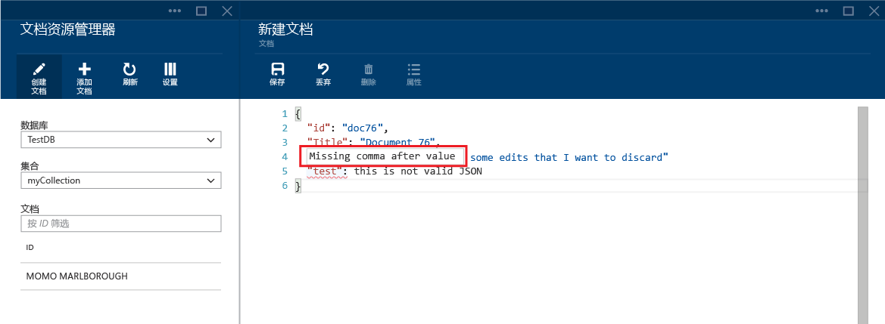

此外，文档资源管理器还可以防止你使用无效的 JSON 内容保存文档。

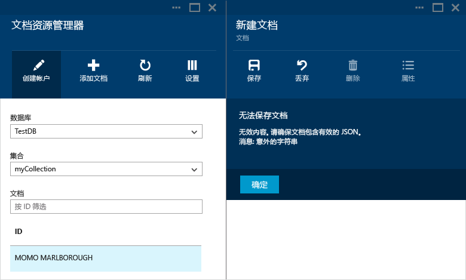

最后，文档资源管理器还允许通过单击“属性”令来轻松查看当前所加载文档的系统属性。

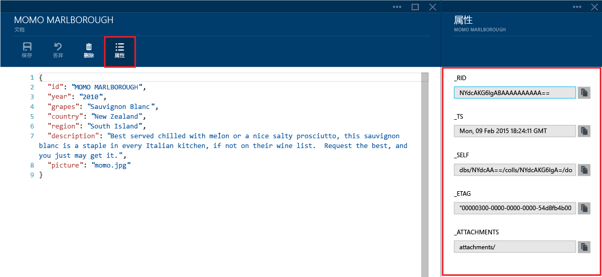

> [!NOTE]
> 时间戳 (_ts) 属性在内部表示为新纪元时间，但文档资源管理器以方便阅读的 GMT 格式显示该值。
> 
> 

## 筛选文档
文档资源管理器还支持多种导航选项和高级设置。

默认情况下，文档资源管理器将加载所选集合中最多前 100 个文档（按文档创建日期从最早到最晚排列）。  可通过选择“文档资源管理器”边栏选项卡底部的“加载更多”选项加载其他文档（每批加载 100 个文档）。 可通过“筛选”命令选择要加载的具体文档。

1. [启动文档资源管理器](#launch-document-explorer)。
2. 在“文档资源管理器”边栏选项卡的顶部，单击“筛选”。  
   
    
3. 将在命令栏的下方显示筛选设置。 在筛选设置中，提供 WHERE 子句和/或 ORDER BY 子句，然后单击“筛选”。
   
   
   
   文档资源管理器将自动刷新与筛选查询匹配的文档结果。 有关 DocumentDB API SQL 语法的详细信息，请阅读 [SQL 查询和 SQL 语法](documentdb-sql-query.md)一文，或打印 [SQL 查询速查表](documentdb-sql-query-cheat-sheet.md)的副本。
   
   可使用“数据库”和“集合”下拉列表框轻松更改当前查看其中文档的集合，而无需关闭并重新启动文档资源管理器。  
   
   文档资源管理器还支持按文档的 id 属性筛选当前加载的一组文档。  只需在文档筛选器中的 id 框中键入即可。
   
   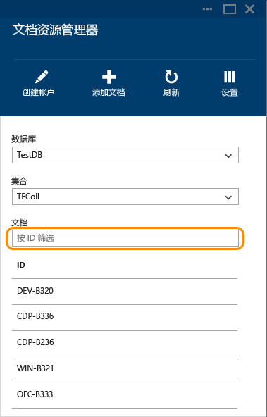
   
   系统将根据你提供的条件筛选文档资源管理器列表中的结果。
   
   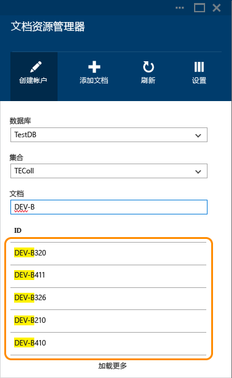
   
   > [!IMPORTANT]
   > 文档资源管理器的筛选器功能仅从***当前***加载的文档集中进行筛选，而并不对当前所选集合执行查询。
   > 
   > 
4. 若要刷新由文档资源管理器加载的文档列表，请单击边栏选项卡顶部的“刷新”。
   
    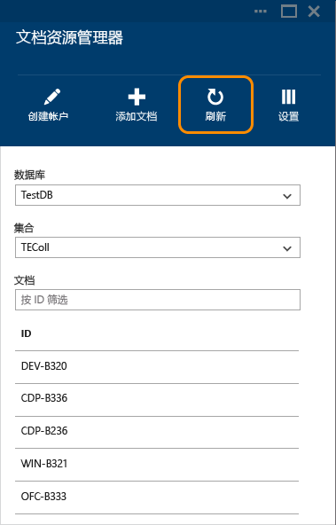

## 批量添加文档
文档资源管理器支持批量引入一个或多个现有 JSON 文档，每个上传操作最多上传 100 个 JSON 文件。  

1. [启动文档资源管理器](#launch-document-explorer)。
2. 若要开始上载过程，请单击“上载文档”。
   
    
   
    将打开“上载文档”边栏选项卡。 
3. 单击浏览按钮以打开文件资源管理器窗口，选择要上载的一个或多个 JSON 文档，然后单击“打开”。
   
    
   
   > [!NOTE]
   > 文档资源管理器当前仅支持每个单独上传操作最多上传 100 个 JSON 文档。
   > 
   > 
4. 选好之后，单击“上传”按钮。  这些文档将自动添加到“文档资源管理器”网格，上传结果显示为操作进度。 导入失败将报告为单独的文件。
   
    
5. 操作完成后，你可以选择另外最多 100 个文档进行上传。

## 使用数据资源管理器（预览版）

在门户中创建、编辑和查询文档的另一方法是使用数据资源管理器。 要打开数据资源管理器，请单击门户里导航栏上的“数据资源管理器（预览版）”，然后依次展开数据库名称和集合名称，依次单击“文档”和“新建文档”，如下方屏幕截图所示。

## 在门户外使用 JSON 文档
Azure 门户中的文档资源管理器只是在 Cosmos DB 中处理文档的一种方法。 也可以通过 [REST API](https://msdn.microsoft.com/library/azure/mt489082.aspx) 或[客户端 SDK](documentdb-sdk-dotnet.md) 来处理文档。 有关代码示例，请参阅 [.NET SDK 文档示例](documentdb-dotnet-samples.md#document-examples)和 [Node.js SDK 文档示例](documentdb-nodejs-samples.md#document-examples)。

如果需要从其他源（JSON 文件、MongoDB、SQL Server、CSV 文件、Azure 表存储、Amazon DynamoDB 或 HBase）导入或迁移文件，可以使用 Cosmos DB 的[数据迁移工具](documentdb-import-data.md)将数据快速导入到 Cosmos DB。

## 故障排除
**症状**：文档资源管理器返回“未找到文档”。

**解决方案**：确保已选择正确的订阅、已插入文档的数据库和集合。 另外，请检查以确保在吞吐量配额内运行。 如果在最大吞吐量级别运行并受到限制，请减少应用程序使用量，以便在集合的最大吞吐量配额下运行。

**说明**：门户是一种应用程序，就像任何其他应用程序一样，对 Cosmos DB 数据库和集合进行调用。 如果当前由于从单独的应用程序进行调用，请求受到限制，门户可能也同样受到限制，导致资源未显示在门户中。 若要解决此问题，需解决高吞吐量使用率的原因，然后刷新门户边栏选项卡。 有关如何测量和降低吞吐量使用率的信息，请参阅[性能提示](documentdb-performance-tips.md#throughput)一文的[吞吐量](documentdb-performance-tips.md)部分。

## 后续步骤
若要详细了解文档资源管理器中支持的 DocumentDB API SQL 语法，请参阅 [SQL 查询和 SQL 语法](documentdb-sql-query.md)一文或打印 [SQL 查询备忘单](documentdb-sql-query-cheat-sheet.md)。

