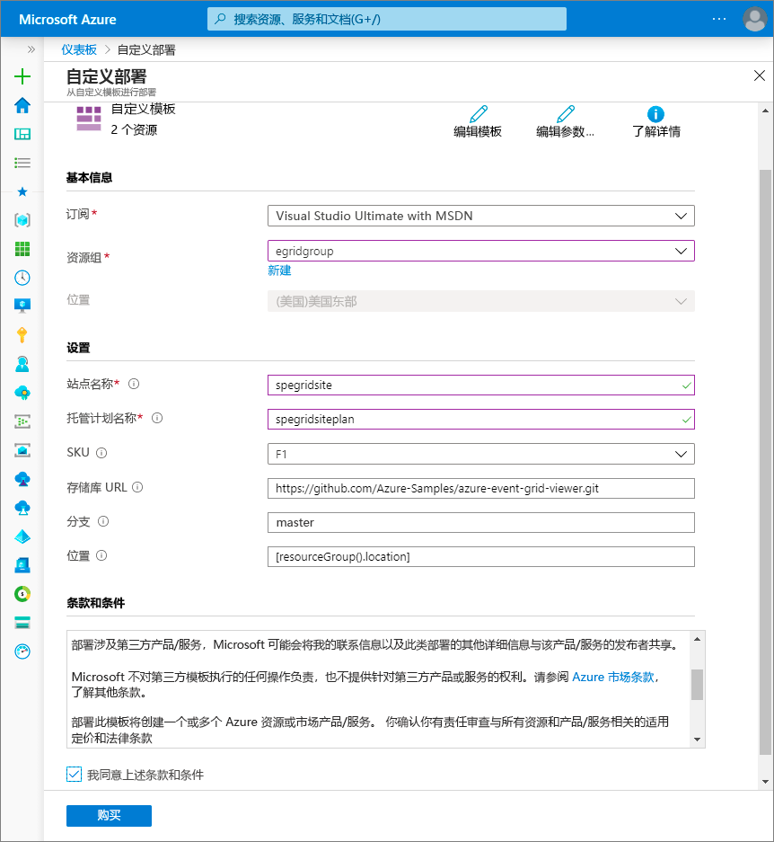
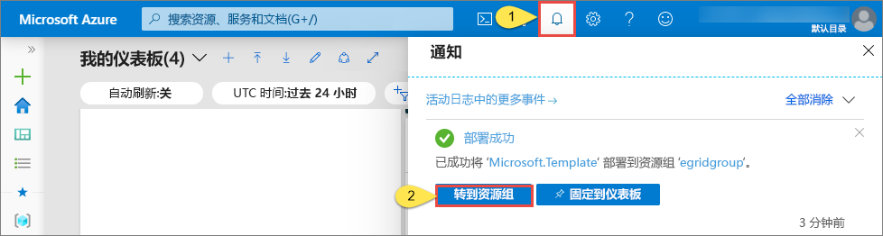
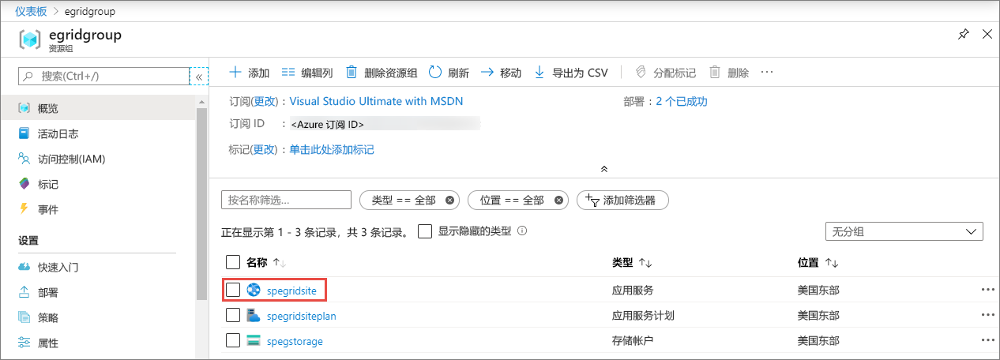
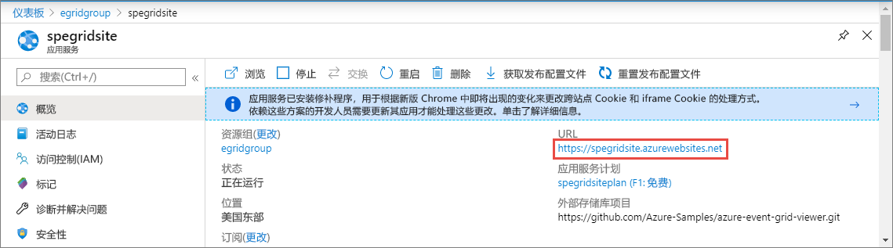
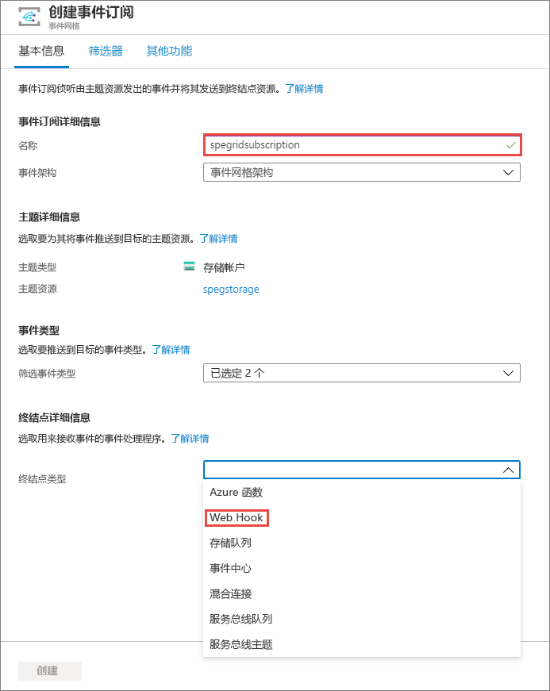
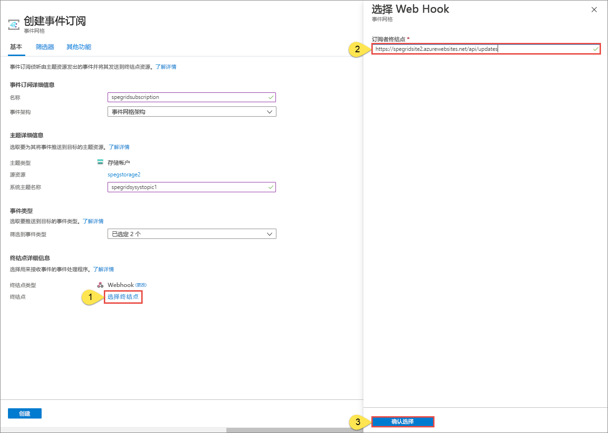
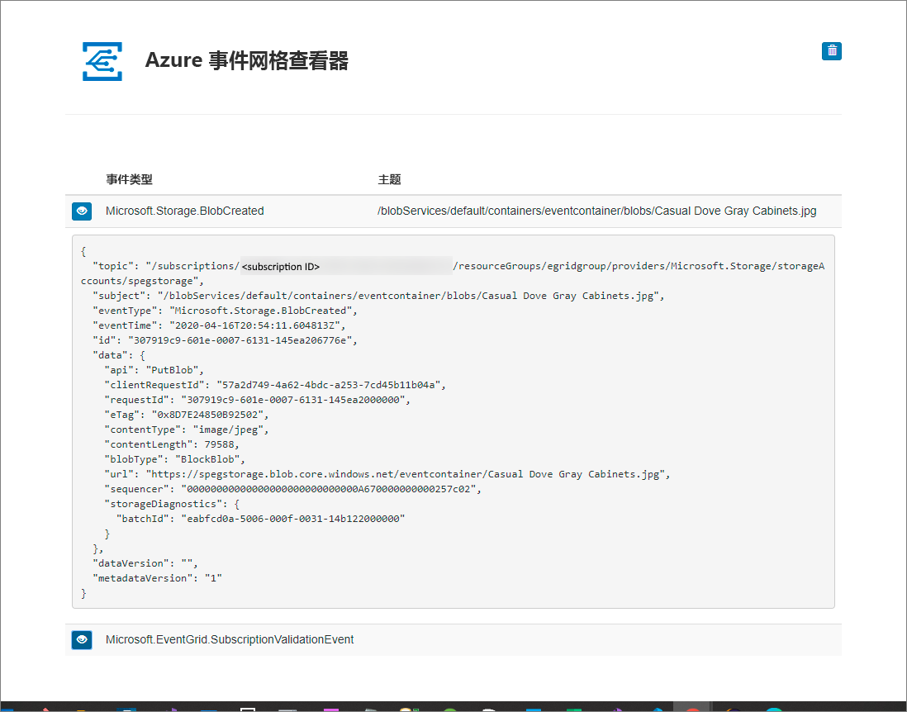

# 快速入门：利用 Azure 门户将 Blob 存储事件路由到 Web 终结点

Azure 事件网格是针对云的事件处理服务。 在本文中，你将使用 Azure 门户创建 Blob 存储帐户、订阅该 Blob 存储的事件，并触发事件来查看结果。 通常，你会将事件发送到处理事件数据并执行操作的终结点。 但是，为了简化本文，你将事件发送到收集并显示消息的 Web 应用。

[!INCLUDE [quickstarts-free-trial-note.md](../../includes/quickstarts-free-trial-note.md)]

完成后即可看到事件数据已发送到 Web 应用。

## 创建存储帐户

1. 登录到 [Azure 门户](https://portal.azure.com/)。

1. 若要创建 Blob 存储，请选择“创建资源”。  

1. 选择“存储”  来筛选可用选项，并选择“存储帐户 - blob、文件、表、队列”  。

   

   要订阅事件，请创建常规用途 v2 存储帐户或 Blob 存储帐户。
   
1. 在“创建存储帐户”页中执行以下步骤： 
    1. 选择 Azure 订阅。 
    2. 对于“资源组”  ，创建一个新资源组或选择现有的资源组。 
    3. 输入存储帐户的名称。 
    4. 选择“查看 + 创建”  。 

           
    5. 在“查看 + 创建”页上查看设置，然后选择“创建”。   

        >[!NOTE]
        > 只有种类为“StorageV2 (常规用途 v2)”和“BlobStorage”的存储帐户支持事件集成。   “存储(常规用途 v1)”  不  支持与事件网格集成。

## 创建消息终结点

在订阅 Blob 存储的事件之前，让我们创建事件消息的终结点。 通常情况下，终结点基于事件数据执行操作。 为了简化此快速入门，将部署用于显示事件消息的[预建的 Web 应用](https://github.com/Azure-Samples/azure-event-grid-viewer)。 所部署的解决方案包括应用服务计划、应用服务 Web 应用和 GitHub 中的源代码。

1. 选择“部署到 Azure”  将解决方案部署到你的订阅。 

   
2. 在“自定义部署”页上执行以下步骤：  
    1. 对于“资源组”，请选择你在创建存储帐户时创建的资源组。  这样就可以在完成本教程后，通过删除资源组来更轻松地清理资源。  
    2. 对于“站点名称”，请输入 Web 应用的名称。 
    3. 对于“托管计划名称”，请输入用于托管 Web 应用的应用服务计划的名称。 
    4. 选中“我同意上述条款和条件”对应的复选框。  
    5. 选择“购买”。  

       
1. 部署可能需要几分钟才能完成。 在门户中选择“警报”（钟形图标），然后选择“转到资源组”。  

    
4. 在“资源组”页上，在资源列表中，选择你创建的 Web 应用。  在此列表中还可以看到应用服务计划和存储帐户。 

    
5. 在 Web 应用的“应用服务”页上，选择相应的 URL 以导航到该网站。  URL 应采用以下格式：`https://<your-site-name>.azurewebsites.net`。
    
    

6. 确认你可以看到站点，但尚未有任何事件发布到站点。

   

[!INCLUDE [event-grid-register-provider-portal.md](../../includes/event-grid-register-provider-portal.md)]

## 订阅 Blob 存储

订阅主题，以告知事件网格要跟踪哪些事件，以及要将事件发送到何处。

1. 在门户中，导航到你之前创建的 Azure 存储帐户。 在左侧菜单中，选择“所有资源”并选择你的存储帐户。  
2. 在“存储帐户”页上，在左侧菜单中选择“事件”。  
1. 依次选择“更多选项”和“Webhook”。   你正在使用终结点的 Web Hook 将事件发送到查看器应用。 

   
3. 在“创建事件订阅”页中执行以下步骤：  
    1. 输入事件订阅的“名称”  。
    2. 对于“终结点类型”，请选择“Web Hook”。   

       
4. 对于“终结点”，请单击“选择终结点”，输入你的 Web 应用的 URL 并将 `api/updates` 添加到主页 URL（例如：`https://spegridsite.azurewebsites.net/api/updates`），然后选择“确认选择”。   

   
5. 现在，在“创建事件订阅”页上，选择“创建”以创建事件订阅。   

   

1. 再次查看 Web 应用，并注意现已向该应用发送了订阅验证事件。 选择眼睛图标以展开事件数据。 事件网格发送验证事件，以便终结点可以验证它是否想要接收事件数据。 Web 应用包含用于验证订阅的代码。

   

现在，让我们触发一个事件，看事件网格如何将消息分发到终结点。

## 向终结点发送事件

通过上传一个文件来为 Blob 存储触发一个事件。 该文件不需要有任何特定内容。 本文假定你有一个名为 testfile.txt 的文件，但是可以使用任何文件。

1. 在 Azure 门户中，导航到你的 Blob 存储帐户，然后在“概述”页上选择“容器”。  

   

1. 选择“+ 容器”  。 为容器命名，使用任意访问级别，然后选择“创建”。  

   

1. 选择新容器。

   

1. 若要上传文件，请选择“上传”。  在“上传 Blob”页上，浏览并选择要上传用于测试的文件，然后在该页上选择“上传”。   

   

1. 浏览到你的测试文件并上传它。

1. 现已触发事件，并且事件网格已将消息发送到订阅时配置的终结点。 消息采用 JSON 格式，它包含一个或多个事件的数组。 在以下示例中，JSON 消息包含一个事件的数组。 查看 Web 应用，将会看到已收到一个“已创建 Blob”事件。  

   

## 清理资源

如果打算继续处理此事件，请不要清除本文中创建的资源。 否则，请删除本文中创建的资源。

 选择资源组，然后选择“删除资源组”。

## 后续步骤

了解如何创建自定义主题和事件订阅后，请详细了解事件网格的功能：

- [关于事件网格](overview.md)
- [将 Blob 存储事件路由到自定义 Web 终结点](../storage/blobs/storage-blob-event-quickstart.md?toc=%2fazure%2fevent-grid%2ftoc.json)
- [通过 Azure 事件网格和逻辑应用监视虚拟机的更改](monitor-virtual-machine-changes-event-grid-logic-app.md)
- [将大数据流式传输到数据仓库](event-grid-event-hubs-integration.md)
