# <a name="create-and-route-blob-storage-events-with-the-azure-portal-and-event-grid"></a>使用 Azure 门户和事件网格创建和路由 Blob 存储事件

Azure 事件网格是针对云的事件处理服务。 在本文中，你将使用 Azure 门户创建 Blob 存储帐户、订阅该 Blob 存储的事件，并触发事件来查看结果。 通常，你将事件发送到用于处理事件数据并执行操作的终结点。 但是，为了简化本文，你将事件发送到收集并显示消息的 Web 应用。

[!INCLUDE [quickstarts-free-trial-note.md](../../includes/quickstarts-free-trial-note.md)]

完成后即可看到事件数据已发送到 Web 应用。

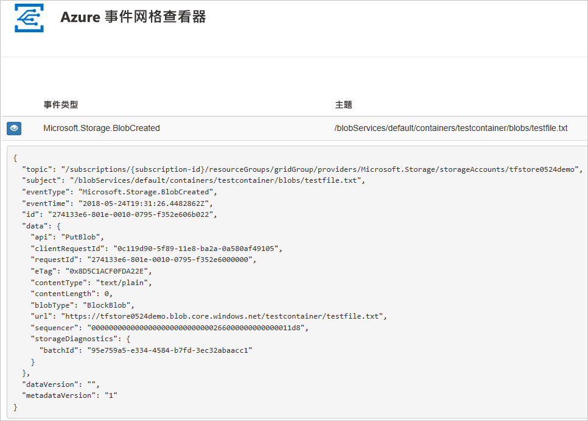

## <a name="create-a-storage-account"></a>创建存储帐户

要使用 Blob 存储事件，需要 [Blob 存储帐户](../storage/common/storage-create-storage-account.md?toc=%2fazure%2fstorage%2fblobs%2ftoc.json#blob-storage-accounts)或[常规用途 v2 存储帐户](../storage/common/storage-account-options.md#general-purpose-v2-accounts)。 常规用途 v2 (GPv2) 是支持所有存储服务（包括 Blob、文件、队列和表）的所有功能的存储帐户。 Blob 存储帐户是将非结构化数据作为 Blob（对象）存储在 Azure 存储的专用存储帐户。 Blob 存储帐户类似于常规用途存储帐户，并且具有现在使用的所有卓越的耐用性、可用性、伸缩性和性能功能，包括用于块 blob 和追加 blob 的 100% API 一致性。 对于仅需要块 blob 或追加 blob 存储的应用程序，我们建议使用 Blob 存储帐户。 

1. 登录到 [Azure 门户](https://portal.azure.com/)。

1. 若要创建 Blob 存储，请选择“创建资源”。 

   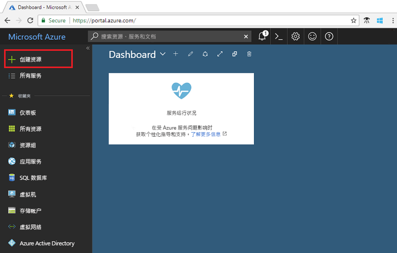

1. 选择“存储”来筛选可用选项，并选择“存储帐户 - blob、文件、表、队列”。

   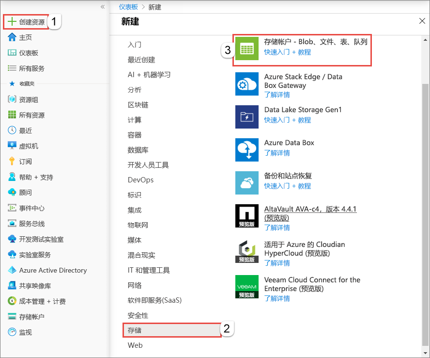

1. 为 Blob 存储提供值，包括帐户的唯一名称。 对于帐户类型，请选择“Blob 存储”。 对于位置，选择支持事件网格的[位置](overview.md)之一。 提供值后，选择“创建”。

   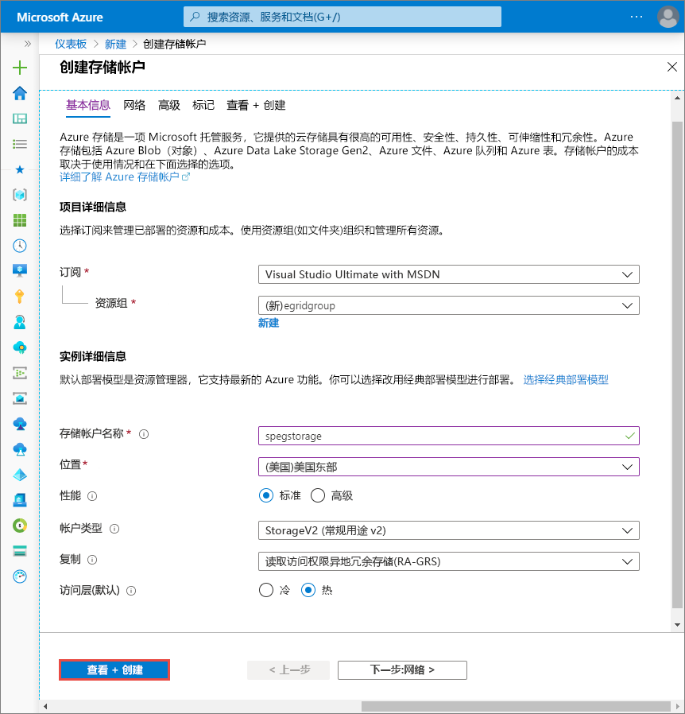

## <a name="create-a-message-endpoint"></a>创建消息终结点

在订阅 Blob 存储的事件之前，让我们创建事件消息的终结点。 通常情况下，终结点基于事件数据执行操作。 为了简化此快速入门，将部署用于显示事件消息的[预建 Web 应用](https://github.com/dbarkol/azure-event-grid-viewer)。 部署的解决方案包括应用服务计划、应用服务 Web 应用和 GitHub 中的源代码。

1. 选择“部署到 Azure”将解决方案部署到你的订阅。 在 Azure 门户中，为参数提供值。

   <a href="https://portal.azure.com/#create/Microsoft.Template/uri/https%3A%2F%2Fraw.githubusercontent.com%2Fdbarkol%2Fazure-event-grid-viewer%2Fmaster%2Fazuredeploy.json" target="_blank"></a>

1. 部署可能需要几分钟才能完成。 部署成功后，请查看 Web 应用以确保它正在运行。 在 Web 浏览器中导航到 `https://<your-site-name>.azurewebsites.net`

1. 查看站点，但是尚未有事件发布到它。

   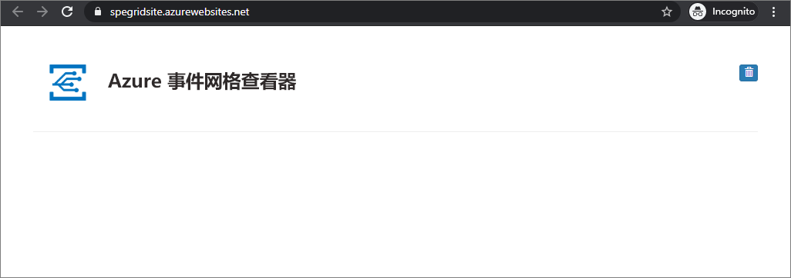

[!INCLUDE [event-grid-register-provider-portal.md](../../includes/event-grid-register-provider-portal.md)]

## <a name="subscribe-to-the-blob-storage"></a>订阅 Blob 存储

订阅主题，以告知事件网格要跟踪哪些事件，以及要将事件发送到何处。

1. 在门户中，选择你的 blob 存储，然后选择“事件”。

   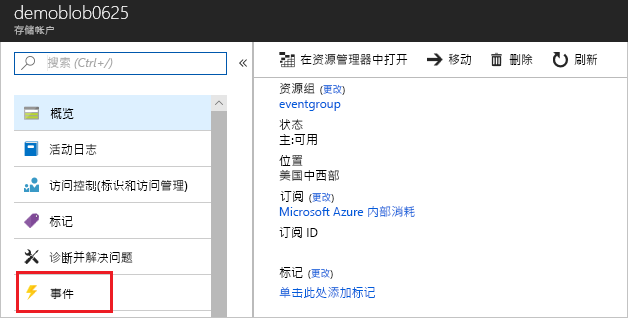

1. 若要将事件发送到查看器应用，请为终结点使用 Webhook。 依次选择“更多选项”和“Webhook”。

   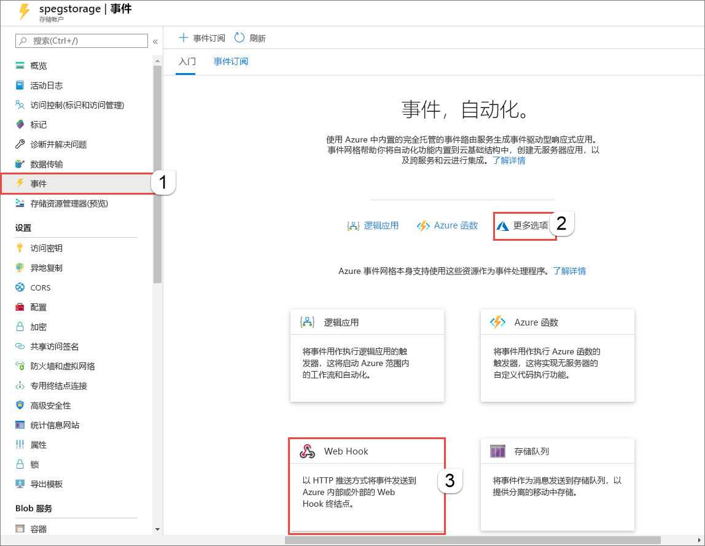

1. 事件订阅中预先填写了你的 Blob 存储的值。 对于 Webhook 终结点，请提供你的 Web 应用的 URL，并将 `api/updates` 添加到主页 URL。 为你的订阅提供一个名称。 完成后，选择“创建”。

   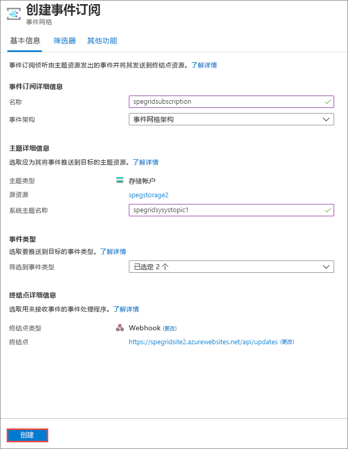

1. 再次查看 Web 应用，并注意订阅验证事件已发送给它。 选择眼睛图标以展开事件数据。 事件网格发送验证事件，以便终结点可以验证它是否想要接收事件数据。 Web 应用包含用于验证订阅的代码。

   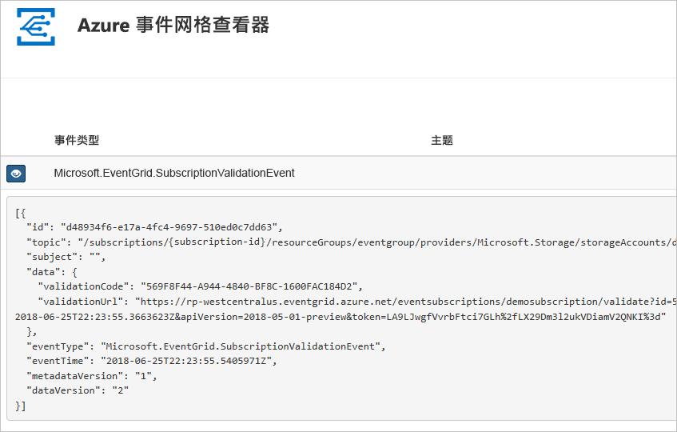

现在，让我们触发一个事件，看事件网格如何将消息分发到终结点。

## <a name="send-an-event-to-your-endpoint"></a>向终结点发送事件

通过上传一个文件来为 Blob 存储触发一个事件。 该文件不需要有任何特定内容。 本文假定你有一个名为 testfile.txt 的文件，但是可以使用任何文件。

1. 针对你的 Blob 存储，选择“Blob”。

   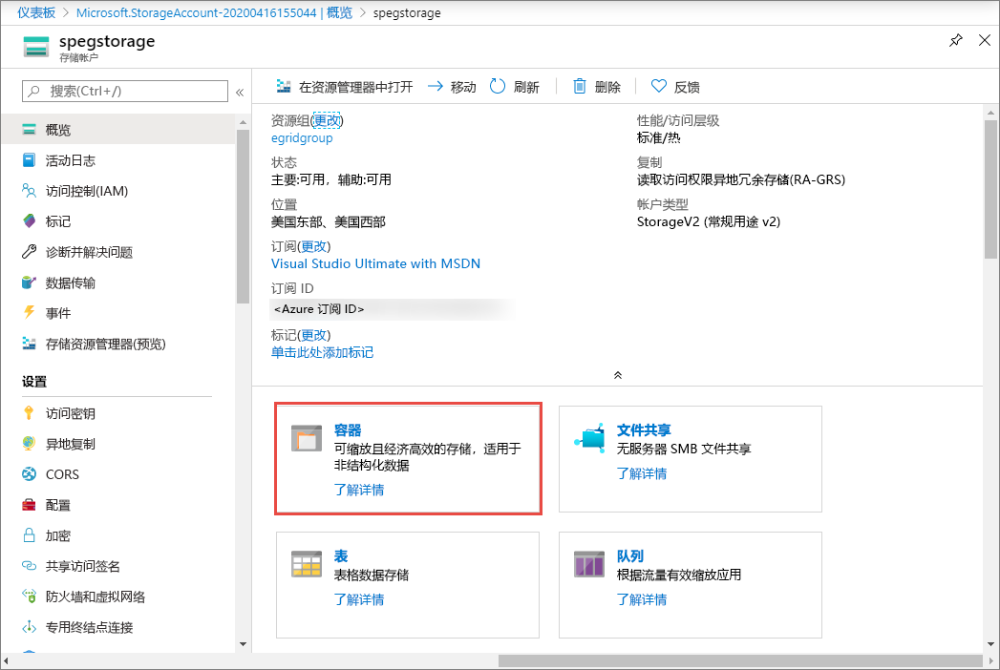

1. 选择“+ 容器”。 为容器提供一个名称，并使用任意访问级别。

   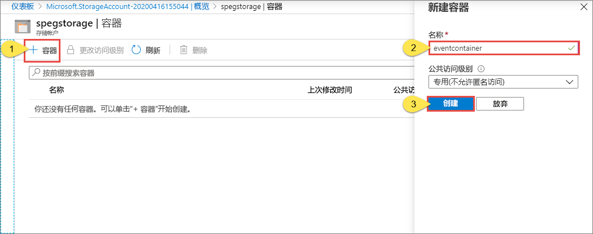

1. 选择新容器。

   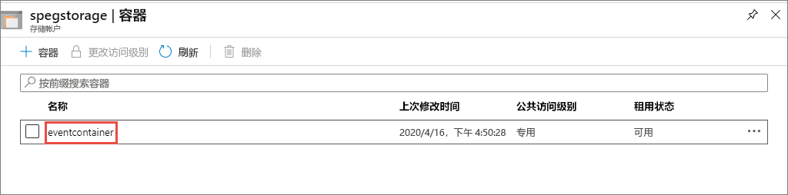

1. 若要上传文件，请选择“上传”。

   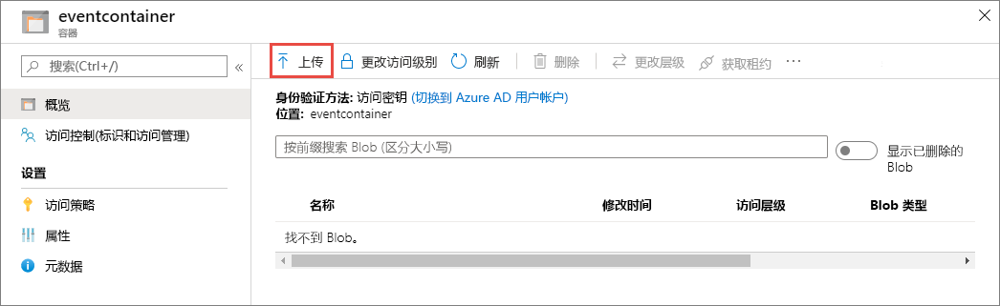

1. 浏览到你的测试文件并上传它。

1. 现已触发事件，并且事件网格已将消息发送到订阅时配置的终结点。 查看你的 Web 应用，将会看到已收到了一个 blob 已创建事件。 

  ```json
  {
    "topic": "/subscriptions/{subscription-id}/resourceGroups/eventgroup/providers/Microsoft.Storage/storageAccounts/demoblob0625",
    "subject": "/blobServices/default/containers/eventcontainer/blobs/testfile.txt",
    "eventType": "Microsoft.Storage.BlobCreated",
    "eventTime": "2018-06-25T22:50:41.1823131Z",
    "id": "89a2f9da-c01e-00bb-13d6-0c599506e4e3",
    "data": {
      "api": "PutBlockList",
      "clientRequestId": "41341a9b-e977-4a91-9000-c64125039047",
      "requestId": "89a2f9da-c01e-00bb-13d6-0c5995000000",
      "eTag": "0x8D5DAEE13C8F9ED",
      "contentType": "text/plain",
      "contentLength": 4,
      "blobType": "BlockBlob",
      "url": "https://demoblob0625.blob.core.windows.net/eventcontainer/testfile.txt",
      "sequencer": "00000000000000000000000000001C24000000000004712b",
      "storageDiagnostics": {
        "batchId": "ef633252-32fd-464b-8f5a-0d10d68885e6"
      }
    },
    "dataVersion": "",
    "metadataVersion": "1"
  }
  ```

## <a name="clean-up-resources"></a>清理资源

如果打算继续处理此事件，请不要清除本文中创建的资源。 否则，请删除本文中创建的资源。

选择资源组，然后选择“删除资源组”。

## <a name="next-steps"></a>后续步骤

了解如何创建自定义主题和事件订阅后，请详细了解事件网格的功能：

- [关于事件网格](overview.md)
- [将 Blob 存储事件路由到自定义 Web 终结点](../storage/blobs/storage-blob-event-quickstart.md?toc=%2fazure%2fevent-grid%2ftoc.json)
- [通过 Azure 事件网格和逻辑应用监视虚拟机的更改](monitor-virtual-machine-changes-event-grid-logic-app.md)
- [将大数据流式传输到数据仓库](event-grid-event-hubs-integration.md)
