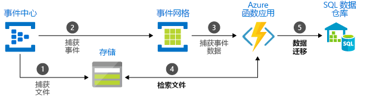

# 在传递消息的 Azure 服务之间进行选择

Azure 提供三种协助在整个解决方案中传递事件消息的服务。 这些服务分别为：

* [事件网格](/azure/event-grid/)
* [事件中心](/azure/event-hubs/)
* [服务总线](/azure/service-bus-messaging/)

虽然它们有一些相似之处，但是每种服务都旨在针对特定的场景。 本文介绍这些服务之间的区别，并帮助你选择最适合你应用程序的服务。 在许多情况下，消息传递服务是互补的，可以一同使用。

## 事件与消息服务

传递事件的服务与传递消息的服务之间有一个需要注意的重要区别。

### 事件

事件是条件或状态更改的轻量通知。 事件发布者对于如何处理事件没有期望。 事件使用者决定要对通知执行的操作。 事件可以是离散单元或一系列的一部分。

离散事件报告状态更改，并可操作。 若要执行下一步，使用者只需知道发生了问题。 事件数据包含关于所发生事件的信息，但不包含触发事件的数据。 例如，事件会通知使用者文件已创建。 它可能包含文件的常规信息，但不包含文件本身。 离散事件非常适合于需要缩放的无服务器解决方案。

系列事件报告情况，并且可分析。 事件按时间排序并彼此相关。 使用者需要排序的一系列事件以分析发生的情况。

### 消息

消息是由将使用的服务生成或存储在其他位置的原始数据。 消息包含触发消息管道的数据。 消息发布者对于使用者如何处理消息有期望。 双方之间存在协定。 例如，发布者发送一条包含原始数据的消息，并期望使用者基于该数据创建文件且在工作完成后发送响应。

## 服务对比

| 服务 | 目的 | Type | 使用时机 |
| ------- | ------- | ---- | ----------- |
| 事件网格 | 反应编程 | 事件分发（离散） | 对状态更改做出响应 |
| 事件中心 | 大数据管道 | 事件流式处理（系列） | 遥测数据和分布式数据流式处理 |
| 服务总线 | 高价值企业消息传递 | 消息 | 订单处理和财务交易 |

### 事件网格

事件网格是启用事件驱动、反应编程的事件底板。 它使用发布-订阅模式。 发布服务器发出事件，但不知道处理哪些事件。 订阅服务器决定需要处理的事件。

事件网格与 Azure 服务深度集成，并可与第三方服务集成。 它简化事件消耗，并通过消除不断的轮询需求降低成本。 事件网格高效可靠地路由来自 Azure 和非 Azure 资源的事件。 它将事件分布到注册的订阅服务器终结点。 事件消息包含你需要对服务和应用程序中的更改做出响应的信息。 事件网格不是数据管道，并且不提供已更新的实际对象。

它具有以下特征：

* 动态可缩放
* 低成本
* 无服务器

### 事件中心

Azure 事件中心是大数据管道。 它促进遥测数据和事件流数据的捕获、保留和重播。 数据可能来自多个并发源。 事件中心允许提供遥测数据和事件数据给多种流式处理基础结构和分析服务。 它作为数据流或捆绑事件批提供。 此服务提供一种可实现快速数据检索以进行实时处理及重复重播所存储原始数据的解决方案。 可以将流数据捕获到一个文件中以进行处理和分析。

它具有以下特征：

* 低延迟
* 每秒可以接收和处理数百万的事件

### 服务总线

服务总线适用于传统企业应用程序。 这些企业应用程序需要事务、排序、重复检测和即时一致性。 服务总线使得云本机应用程序能够为业务进程提供可靠的状态转换管理。 处理不能丢失或复制的高价值消息时，请使用 Azure 服务总线。 服务总线还利于跨混合云解决方案的高度安全通信，并且可以将现有本地系统连接到云解决方案。

服务总线是一个中转消息传送系统。 它将消息存储在“中转站”（例如队列）中，直到使用方准备好接收这些消息。

它具有以下特征：

* 需要轮询的可靠异步消息传递（企业消息传递作为服务）
* 高级消息传递功能，例如，FIFO、批处理/会话、事务、死信、时态控制、路由和筛选以及重复检测

## 同时使用多种服务

在某些情况下，可同时使用多种服务满足不同的角色。 例如，电子商务网站可以使用服务总线处理订单，使用事件中心捕获站点遥测数据，使用事件网格响应事件（例如商品已云发货）。

在其他情况下，可将它们链接在一起以形成事件和数据管道。 使用事件网格可响应其他服务中的事件。 有关结合使用事件网格和事件中心以将数据迁移到数据仓库的实例，请参阅[将大数据流式传输到数据仓库](event-grid-event-hubs-integration.md)。 下图显示流式处理数据的工作流。

## 后续步骤

* 有关 Azure 消息传递服务的更多信息，请参阅博客文章 [Events, Data Points, and Messages - Choosing the right Azure messaging service for your data](https://azure.microsoft.com/blog/events-data-points-and-messages-choosing-the-right-azure-messaging-service-for-your-data/)（事件、数据点和消息 - 为数据选择合适的 Azure 消息传递服务）。
* 有关事件网格的介绍，请参阅[关于事件网格](overview.md)。
* 若要开始使用事件网格，请参阅[使用 Azure 事件网格创建和路由自定义事件](custom-event-quickstart.md)。
* 若要开始使用事件中心，请参阅[使用 Azure 门户创建事件中心命名空间和事件中心](../event-hubs/event-hubs-create.md)。
* 若要开始使用服务总线，请参阅[使用 Azure 门户创建服务总线命名空间](../service-bus-messaging/service-bus-create-namespace-portal.md)。