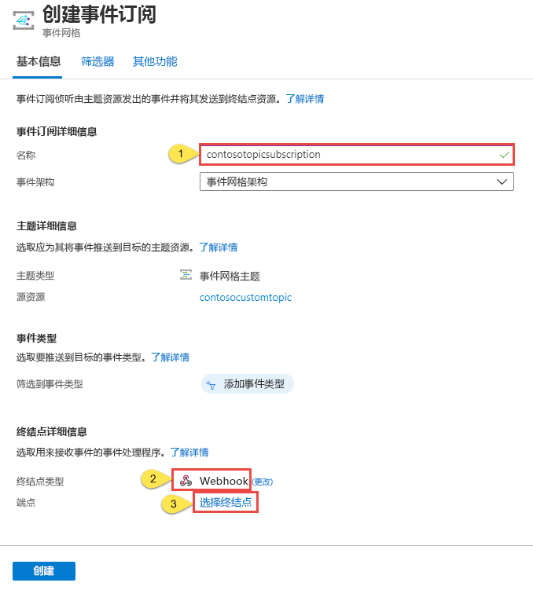

# <a name="create-and-route-custom-events-with-the-azure-portal-and-event-grid"></a>使用 Azure 门户和事件网格创建和路由自定义事件

Azure 事件网格是针对云的事件处理服务。 在本文中，请使用 Azure 门户创建一个自定义主题，然后订阅该主题，再触发可查看结果的事件。 通常将事件发送到与该事件对应的终结点，例如 webhook 或 Azure Function。 但在本文中，为简便起见，请将事件发送到仅收集消息的 URL。 可从 [RequestBin](https://requestb.in/) 或 [Hookbin](https://hookbin.com/) 使用第三方工具创建此 URL。

>[!NOTE]
>RequestBin 和 Hookbin 并不适合在高吞吐量方案中使用。 在这里使用这些工具纯粹是为了演示。 如果一次推送多个事件，可能不会在工具中看到所有事件。

完成后即可看到事件数据已发送到某个终结点。


[!INCLUDE [quickstarts-free-trial-note.md](../../includes/quickstarts-free-trial-note.md)]

## <a name="create-a-resource-group"></a>创建资源组

事件网格主题是 Azure 资源，必须放置在 Azure 资源组中。 该资源组是在其中部署和管理 Azure 资源的逻辑集合。

1. 在左侧导航栏中，选择“资源组”。 然后选择“添加”。

   

1. 将资源组名称设置为 gridResourceGroup，将位置设置为 westus2。 选择“创建”。

   

## <a name="create-a-custom-topic"></a>创建自定义主题

主题提供用户定义的终结点，可向其发布事件。 

1. 若要在资源组中创建一个主题，请选择“更多服务”，然后搜索“事件网格”。 从可用选项中选择“事件网格主题”。

   

1. 选择“添加”。

   

1. 为主题提供一个名称。 主题名称必须唯一，因为它由 DNS 条目表示。 选择一个[支持的区域](overview.md)。 选择之前创建的资源组。 选择“创建”。

   

1. 创建主题后，选择“刷新”即可查看主题。

   

## <a name="create-a-message-endpoint"></a>创建消息终结点

在订阅主题之前, 让我们创建事件消息的终结点。 与其编写代码来响应事件，不如创建一个终结点来收集消息，方便你查看。 RequestBin 和 Hookbin 是第三方工具，用于创建终结点和查看发送到其中的请求。 转到 [RequestBin](https://requestb.in/)，然后单击“创建 RequestBin”；或者转到 [Hookbin](https://hookbin.com/)，然后单击“新建终结点”。  复制 bin URL，因为在订阅主题时需要它。

## <a name="subscribe-to-a-topic"></a>订阅主题

订阅主题是为了告知事件网格要跟踪哪些事件。 

1. 若要创建事件网格订阅，请再次选择“更多服务”并搜索“事件网格”。 从可用选项中选择“事件网格订阅”。

   

1. 选择“+ 事件订阅”。

   

1. 提供事件订阅的唯一名称。 对于主题类型，请选择“事件网格主题”。 对于实例，请选择创建的自定义主题。 提供来自 RequestBin 或 Hookbin 的 URL 作为事件通知的终结点。 提供值以后，选择“创建”。

   

现在，让我们触发一个事件，看事件网格如何将消息分发到终结点。 本文为简便起见，使用 Cloud Shell 将示例事件数据发送到主题。 通常情况下，应用程序或 Azure 服务会发送事件数据。

[!INCLUDE [cloud-shell-try-it.md](../../includes/cloud-shell-try-it.md)]

## <a name="send-an-event-to-your-topic"></a>向主题发送事件

首先，让我们获取主题的 URL 和密钥。 使用你的主题名称来替换 `<topic_name>`。

```azurecli-interactive
endpoint=$(az eventgrid topic show --name <topic_name> -g gridResourceGroup --query "endpoint" --output tsv)
key=$(az eventgrid topic key list --name <topic_name> -g gridResourceGroup --query "key1" --output tsv)
```

以下示例获取示例事件数据：

```azurecli-interactive
body=$(eval echo "'$(curl https://raw.githubusercontent.com/Azure/azure-docs-json-samples/master/event-grid/customevent.json)'")
```

如果 `echo "$body"`，则可看到完整的事件。 JSON 的 `data` 元素是事件的有效负载。 可以将任何格式正确的 JSON 置于此字段中。 也可将主题字段用于高级路由和筛选。

CURL 是执行 HTTP 请求的实用工具。 本文使用 CURL 向主题发送事件。 

```azurecli-interactive
curl -X POST -H "aeg-sas-key: $key" -d "$body" $endpoint
```

你已经触发事件，而事件网格则已将消息发送到你在订阅时配置的终结点。 浏览到此前创建的终结点 URL。 或者，在打开的浏览器中单击“刷新”。 此时会看到刚发送的事件。

```json
[{
  "id": "1807",
  "eventType": "recordInserted",
  "subject": "myapp/vehicles/motorcycles",
  "eventTime": "2017-08-10T21:03:07+00:00",
  "data": {
    "make": "Ducati",
    "model": "Monster"
  },
  "dataVersion": "1.0",
  "metadataVersion": "1",
  "topic": "/subscriptions/{subscription-id}/resourceGroups/{resource-group}/providers/Microsoft.EventGrid/topics/{topic}"
}]
```

## <a name="clean-up-resources"></a>清理资源

如果打算继续使用此事件，请勿清除本文中创建的资源。 如果不打算继续学习，请删除本文中创建的资源。

选择资源组，然后选择“删除资源组”。

## <a name="next-steps"></a>后续步骤

了解如何创建主题和事件订阅以后，即可进一步学习事件网格的功能：

- [关于事件网格](overview.md)
- [将 Blob 存储事件路由到自定义 Web 终结点](../storage/blobs/storage-blob-event-quickstart.md?toc=%2fazure%2fevent-grid%2ftoc.json)
- [通过 Azure 事件网格和逻辑应用监视虚拟机的更改](monitor-virtual-machine-changes-event-grid-logic-app.md)
- [将大数据流式传输到数据仓库](event-grid-event-hubs-integration.md)
