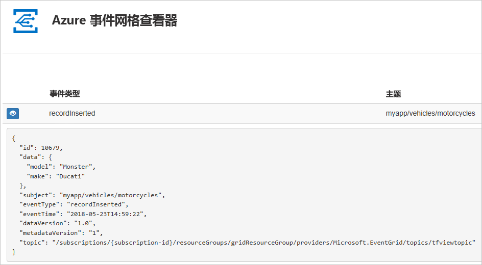
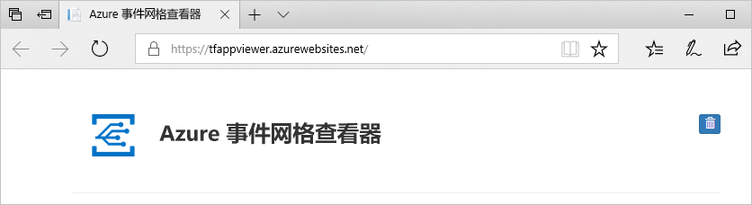
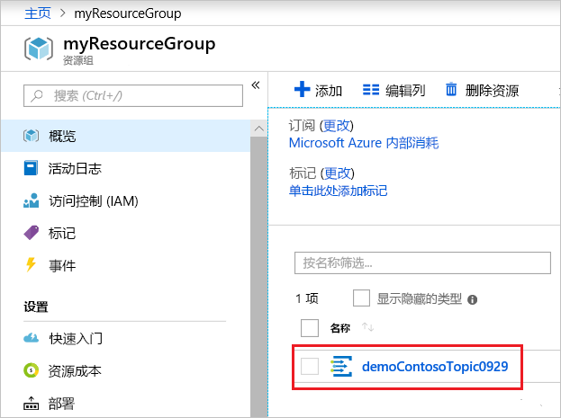
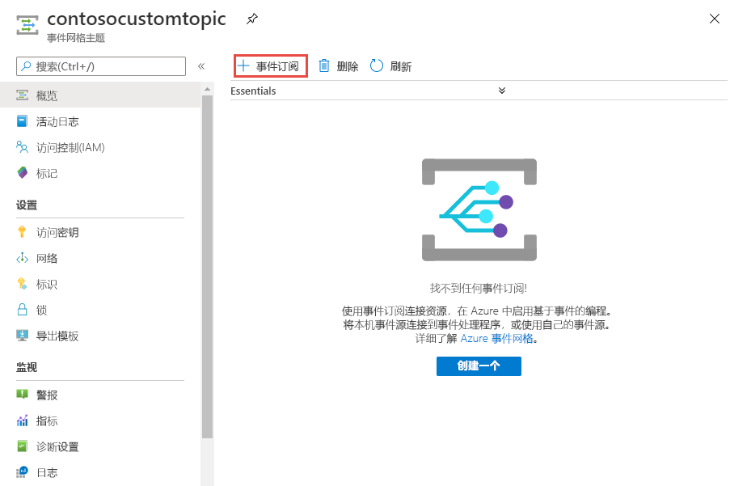
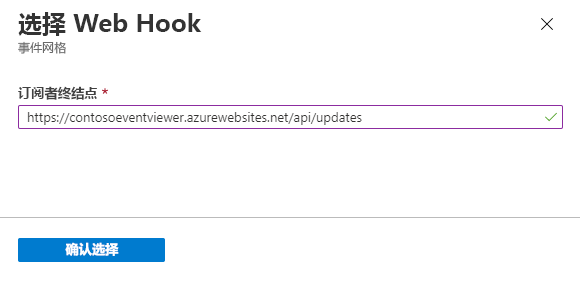
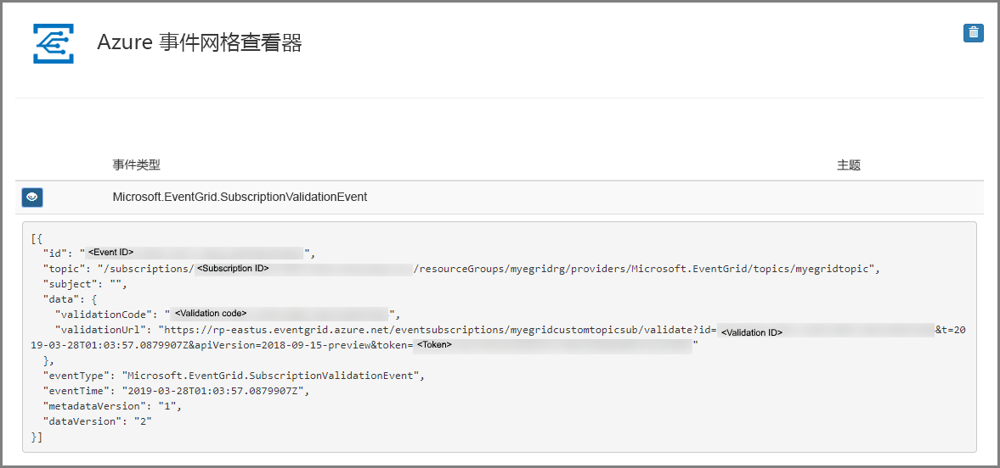

# <a name="quickstart-route-custom-events-to-web-endpoint-with-the-azure-portal-and-event-grid"></a>快速入门：使用 Azure 门户和事件网格将自定义事件路由到 Web 终结点

Azure 事件网格是针对云的事件处理服务。 在本文中，将使用 Azure 门户创建一个自定义主题，然后订阅该自定义主题，再触发可查看结果的事件。 通常，你会将事件发送到处理事件数据并执行操作的终结点。 但是，为了简化本文，你将事件发送到收集并显示消息的 Web 应用。

完成后即可看到事件数据已发送到 Web 应用。



[!INCLUDE [quickstarts-free-trial-note.md](../../includes/quickstarts-free-trial-note.md)]

[!INCLUDE [event-grid-register-provider-portal.md](../../includes/event-grid-register-provider-portal.md)]

## <a name="create-a-custom-topic"></a>创建自定义主题

事件网格主题提供用户定义的终结点，可向其发布事件。 

1. 登录到 [Azure 门户](https://portal.azure.com/)。

1. 若要创建自定义主题，请选择“创建资源”。 

   

1. 搜索“事件网格主题”，然后在可用选项中选择它。

   

1. 选择“创建”。

   

1. 为自定义主题提供唯一名称。 主题名称必须唯一，因为它由 DNS 条目表示。 请不要使用图中所示的名称。 而是创建自己的名称 - 它必须介于 3 到 50 个字符之间，并且只包含值 a-z、A-Z、0-9 和“-”。 为资源组提供名称。 选择“创建”。

   

1. 创建自定义主题后，将会看到成功通知。

   

   如果部署失败，请找出错误的原因。 选择“部署失败”。

   

   选择错误消息。

   

   下图显示了由于自定义主题名称已失败的部署。 如果看到此错误，请使用不同的名称重试部署。

   

## <a name="create-a-message-endpoint"></a>创建消息终结点

在订阅自定义主题之前，让我们创建事件消息的终结点。 通常情况下，终结点基于事件数据执行操作。 为了简化此快速入门，将部署用于显示事件消息的[预建的 Web 应用](https://github.com/Azure-Samples/azure-event-grid-viewer)。 所部署的解决方案包括应用服务计划、应用服务 Web 应用和 GitHub 中的源代码。

1. 选择“部署到 Azure”将解决方案部署到你的订阅。 在 Azure 门户中，为参数提供值。

   <a href="https://portal.azure.com/#create/Microsoft.Template/uri/https%3A%2F%2Fraw.githubusercontent.com%2FAzure-Samples%2Fazure-event-grid-viewer%2Fmaster%2Fazuredeploy.json" target="_blank"></a>

1. 部署可能需要几分钟才能完成。 部署成功后，请查看 Web 应用以确保它正在运行。 在 Web 浏览器中导航到 `https://<your-site-name>.azurewebsites.net`

1. 查看站点，但是尚未有事件发布到它。

   

## <a name="subscribe-to-custom-topic"></a>订阅自定义主题

订阅事件网格主题，以告知事件网格要跟踪哪些事件，以及要将事件发送到何处。

1. 在门户中，选择自定义主题。

   

1. 选择“+ 事件订阅”。

   

1. 选择“Web 挂钩”作为终结点类型。 提供事件订阅的名称。

   

1. 选择“选择终结点”。 

1. 对于 Webhook 终结点，请提供你的 Web 应用的 URL，并将 `api/updates` 添加到主页 URL。 选择“确认所选内容”。

   

1. 完成提供事件订阅值后，选择“创建”。

再次查看 Web 应用，并注意现已向该应用发送了订阅验证事件。 选择眼睛图标以展开事件数据。 事件网格发送验证事件，以便终结点可以验证它是否想要接收事件数据。 Web 应用包含用于验证订阅的代码。



## <a name="send-an-event-to-your-topic"></a>向主题发送事件

现在，让我们触发一个事件，看事件网格如何将消息分发到终结点。 使用 Azure CLI 或 PowerShell 向自定义主题发送测试性事件。 通常情况下，应用程序或 Azure 服务会发送事件数据。

第一个示例使用 Azure CLI。 它获取自定义主题的 URL 和密钥，以及示例事件数据。 将自定义主题名称用于 `<topic_name>`。 它将创建示例事件数据。 JSON 的 `data` 元素是事件的有效负载。 可以将任何格式正确的 JSON 置于此字段中。 也可将主题字段用于高级路由和筛选。 CURL 是发送 HTTP 请求的实用工具。

```azurecli-interactive
endpoint=$(az eventgrid topic show --name <topic_name> -g myResourceGroup --query "endpoint" --output tsv)
key=$(az eventgrid topic key list --name <topic_name> -g myResourceGroup --query "key1" --output tsv)

event='[ {"id": "'"$RANDOM"'", "eventType": "recordInserted", "subject": "myapp/vehicles/motorcycles", "eventTime": "'`date +%Y-%m-%dT%H:%M:%S%z`'", "data":{ "make": "Ducati", "model": "Monster"},"dataVersion": "1.0"} ]'

curl -X POST -H "aeg-sas-key: $key" -d "$event" $endpoint
```

第二个示例使用 PowerShell，执行的步骤类似。

```azurepowershell-interactive
$endpoint = (Get-AzureRmEventGridTopic -ResourceGroupName gridResourceGroup -Name <topic-name>).Endpoint
$keys = Get-AzureRmEventGridTopicKey -ResourceGroupName gridResourceGroup -Name <topic-name>

$eventID = Get-Random 99999

#Date format should be SortableDateTimePattern (ISO 8601)
$eventDate = Get-Date -Format s

#Construct body using Hashtable
$htbody = @{
    id= $eventID
    eventType="recordInserted"
    subject="myapp/vehicles/motorcycles"
    eventTime= $eventDate   
    data= @{
        make="Ducati"
        model="Monster"
    }
    dataVersion="1.0"
}

#Use ConvertTo-Json to convert event body from Hashtable to JSON Object
#Append square brackets to the converted JSON payload since they are expected in the event's JSON payload syntax
$body = "["+(ConvertTo-Json $htbody)+"]"

Invoke-WebRequest -Uri $endpoint -Method POST -Body $body -Headers @{"aeg-sas-key" = $keys.Key1}
```

现已触发事件，并且事件网格已将消息发送到订阅时配置的终结点。 查看 Web 应用以查看刚刚发送的事件。

```json
[{
  "id": "1807",
  "eventType": "recordInserted",
  "subject": "myapp/vehicles/motorcycles",
  "eventTime": "2017-08-10T21:03:07+00:00",
  "data": {
    "make": "Ducati",
    "model": "Monster"
  },
  "dataVersion": "1.0",
  "metadataVersion": "1",
  "topic": "/subscriptions/{subscription-id}/resourceGroups/{resource-group}/providers/Microsoft.EventGrid/topics/{topic}"
}]
```


## <a name="clean-up-resources"></a>清理资源

如果打算继续处理此事件，请不要清除本文中创建的资源。 否则，请删除本文中创建的资源。

选择资源组，然后选择“删除资源组”。

## <a name="next-steps"></a>后续步骤

了解如何创建自定义主题和事件订阅后，请详细了解事件网格的功能：

- [关于事件网格](overview.md)
- [将 Blob 存储事件路由到自定义 Web 终结点](../storage/blobs/storage-blob-event-quickstart.md?toc=%2fazure%2fevent-grid%2ftoc.json)
- [通过 Azure 事件网格和逻辑应用监视虚拟机的更改](monitor-virtual-machine-changes-event-grid-logic-app.md)
- [将大数据流式传输到数据仓库](event-grid-event-hubs-integration.md)
