# <a name="create-and-route-custom-events-with-the-azure-portal-and-event-grid"></a>使用 Azure 门户和事件网格创建和路由自定义事件

Azure 事件网格是针对云的事件处理服务。 在本文中，请使用 Azure 门户创建一个自定义主题，然后订阅该主题，再触发可查看结果的事件。 将事件发送到记录事件数据的 Azure 函数。 完成后，可以看到事件数据已发送到某个终结点并已记录。

[!INCLUDE [quickstarts-free-trial-note.md](../../includes/quickstarts-free-trial-note.md)]

## <a name="create-a-custom-topic"></a>创建自定义主题

事件网格主题提供用户定义的终结点，可向其发布事件。 

1. 登录到 [Azure 门户](https://portal.azure.com/)。

1. 若要创建自定义主题，请选择“创建资源”。 

   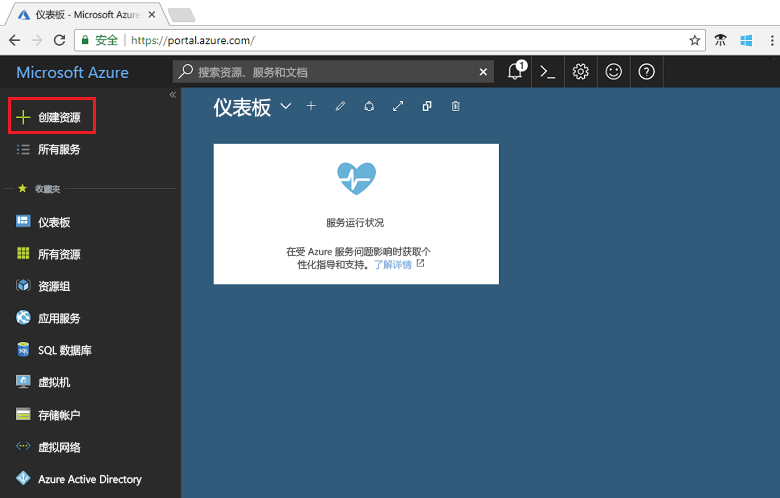

1. 搜索“事件网格主题”，然后在可用选项中选择它。

   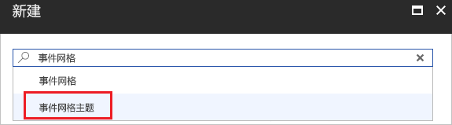

1. 选择**创建**。

   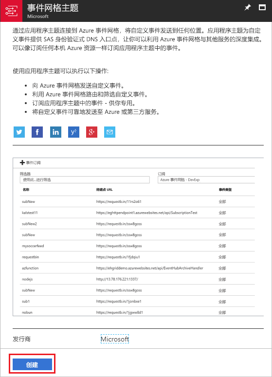

1. 为自定义主题提供唯一名称。 主题名称必须唯一，因为它由 DNS 条目表示。 请不要使用图中所示的名称。 应创建自己的名称。 选择一个[支持的区域](overview.md)。 为资源组提供名称。 选择**创建**。

   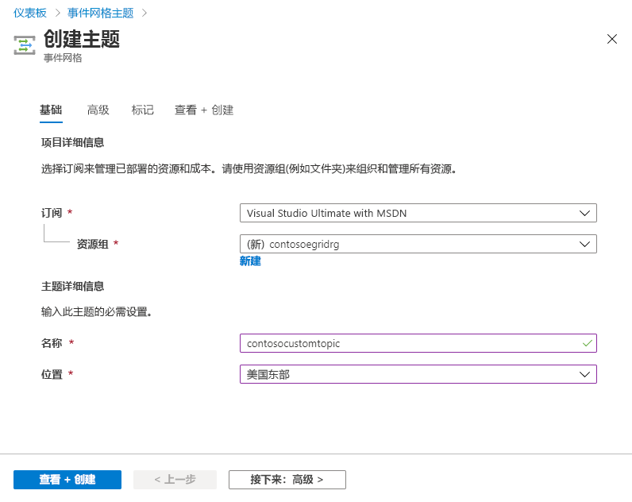

1. 创建自定义主题后，将会看到成功通知。

   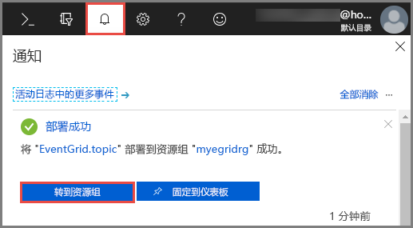

   如果部署失败，请找出错误的原因。 选择“部署失败”。

   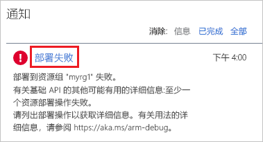

   选择错误消息。

   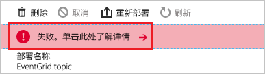

   下图显示了由于自定义主题名称已失败的部署。 如果看到此错误，请使用不同的名称重试部署。

   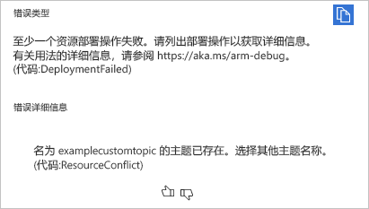

## <a name="create-an-azure-function"></a>创建 Azure 函数

在订阅主题之前, 让我们创建事件消息的终结点。 在本文中，我们使用 Azure Functions 为终结点创建函数应用。

1. 若要创建函数，请选择“创建资源”。

   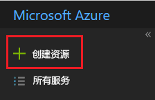

1. 选择“计算”和“函数应用”。

   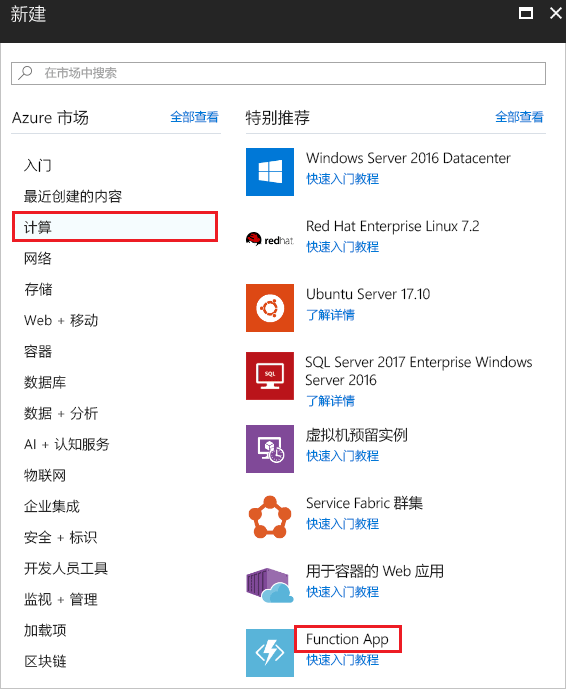

1. 为 Azure 函数提供唯一名称。 请不要使用图中所示的名称。 选择在本文中创建的资源组。 对于托管计划，请使用“消耗计划”。 使用建议的新存储帐户。 可以关闭 Application Insights。 提供值后，选择“创建”。

   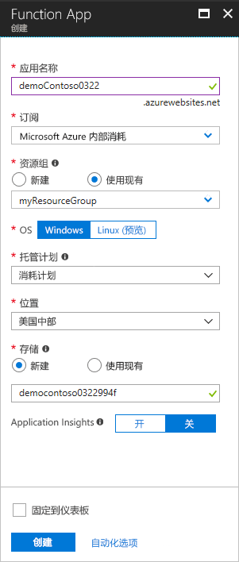

1. 部署完成后，选择“转到资源”。

   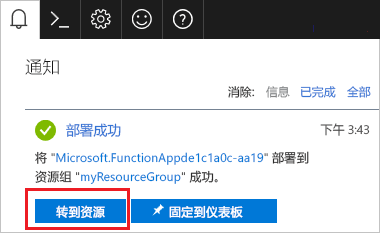

1. 在“函数”旁边，选择 **+**。

   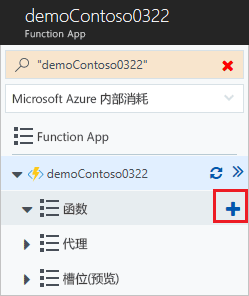

1. 在可用的选项中，选择“自定义函数”。

   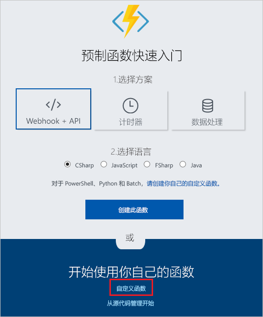

1. 向下滚动，直到出现“事件网格触发器”。 选择“C#”。

   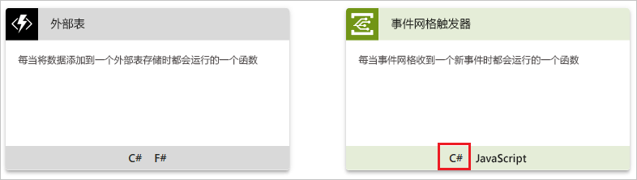

1. 接受默认值，选择“创建”。

   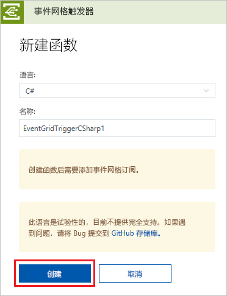

现在，创建的函数可以接收事件。

## <a name="subscribe-to-a-topic"></a>订阅主题

订阅主题，以告知事件网格要跟踪哪些事件，以及要将事件发送到何处。

1. 在 Azure 函数中，选择“添加事件网格订阅”。

   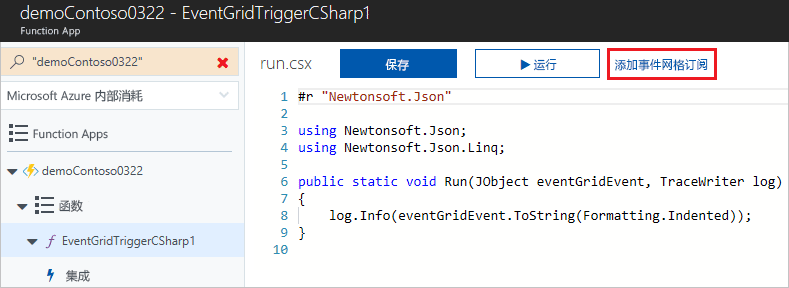

1. 提供订阅的值。 选择“事件网格主题”作为主题类型。 对于订阅和资源组，请选择在其中创建了自定义主题的订阅和资源组。 例如，选择自定义主题的名称。 订阅服务器终结点中已预填充函数的 URL。

   

1. 在触发事件之前，请打开函数的日志，以便在发送事件数据时可以查看这些数据。 在 Azure 函数的底部，选择“日志”。

   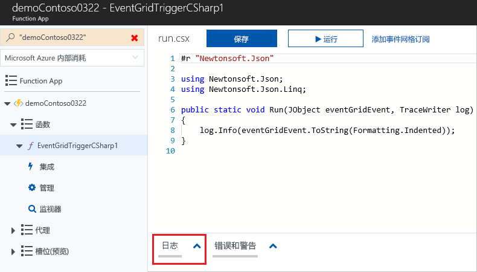

现在，让我们触发一个事件，看事件网格如何将消息分发到终结点。 本文为简便起见，使用 Cloud Shell 将示例事件数据发送到自定义主题。 通常情况下，应用程序或 Azure 服务会发送事件数据。

[!INCLUDE [cloud-shell-try-it.md](../../includes/cloud-shell-try-it.md)]

## <a name="send-an-event-to-your-topic"></a>向主题发送事件

使用 Azure CLI 或 PowerShell 向自定义主题发送测试性事件。

第一个示例使用 Azure CLI。 它获取主题的 URL 和密钥，以及示例性的事件数据。 使用你的主题名称来替换 `<topic_name>`。 若要查看完整事件，请使用 `echo "$body"`。 JSON 的 `data` 元素是事件的有效负载。 可以将任何格式正确的 JSON 置于此字段中。 也可将主题字段用于高级路由和筛选。 CURL 是发送 HTTP 请求的实用工具。

```azurecli-interactive
endpoint=$(az eventgrid topic show --name <topic_name> -g myResourceGroup --query "endpoint" --output tsv)
key=$(az eventgrid topic key list --name <topic_name> -g myResourceGroup --query "key1" --output tsv)

body=$(eval echo "'$(curl https://raw.githubusercontent.com/Azure/azure-docs-json-samples/master/event-grid/customevent.json)'")

curl -X POST -H "aeg-sas-key: $key" -d "$body" $endpoint
```

第二个示例使用 PowerShell，执行的步骤类似。

```azurepowershell-interactive
$endpoint = (Get-AzureRmEventGridTopic -ResourceGroupName gridResourceGroup -Name <topic-name>).Endpoint
$keys = Get-AzureRmEventGridTopicKey -ResourceGroupName gridResourceGroup -Name <topic-name>

$eventID = Get-Random 99999

#Date format should be SortableDateTimePattern (ISO 8601)
$eventDate = Get-Date -Format s

#Construct body using Hashtable
$htbody = @{
    id= $eventID
    eventType="recordInserted"
    subject="myapp/vehicles/motorcycles"
    eventTime= $eventDate   
    data= @{
        make="Ducati"
        model="Monster"
    }
    dataVersion="1.0"
}

#Use ConvertTo-Json to convert event body from Hashtable to JSON Object
#Append square brackets to the converted JSON payload since they are expected in the event's JSON payload syntax
$body = "["+(ConvertTo-Json $htbody)+"]"

Invoke-WebRequest -Uri $endpoint -Method POST -Body $body -Headers @{"aeg-sas-key" = $keys.Key1}
```

现已触发事件，并且事件网格已将消息发送到订阅时配置的终结点。 请在日志中查看事件数据。

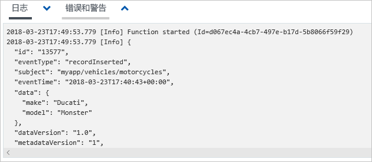

## <a name="clean-up-resources"></a>清理资源

如果打算继续处理此事件，请不要清除本文中创建的资源。 否则，请删除本文中创建的资源。

选择资源组，然后选择“删除资源组”。

## <a name="next-steps"></a>后续步骤

了解如何创建自定义主题和事件订阅后，请详细了解事件网格的功能：

- [关于事件网格](overview.md)
- [将 Blob 存储事件路由到自定义 Web 终结点](../storage/blobs/storage-blob-event-quickstart.md?toc=%2fazure%2fevent-grid%2ftoc.json)
- [通过 Azure 事件网格和逻辑应用监视虚拟机的更改](monitor-virtual-machine-changes-event-grid-logic-app.md)
- [将大数据流式传输到数据仓库](event-grid-event-hubs-integration.md)
