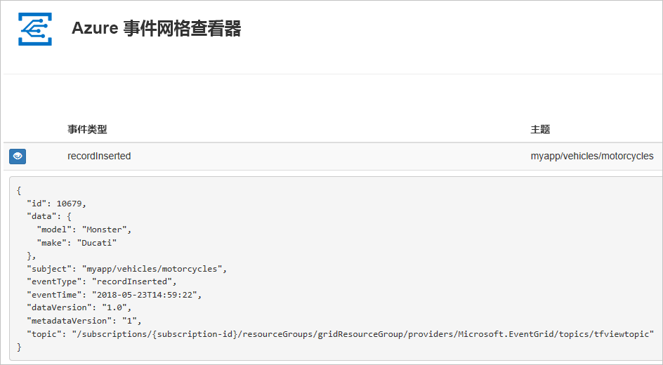
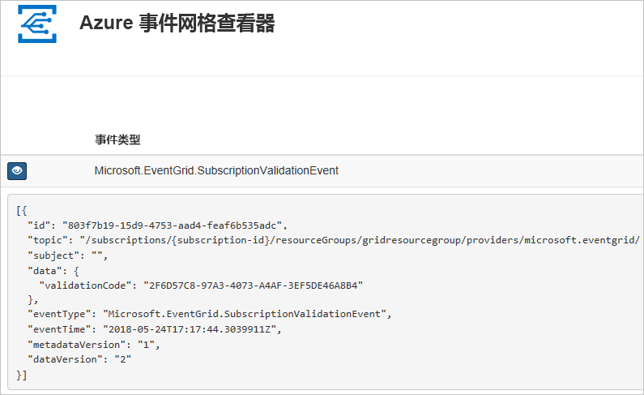

# <a name="quickstart-route-custom-events-to-web-endpoint-with-powershell-and-event-grid"></a>快速入门：使用 PowerShell 和事件网格将自定义事件路由到 Web 终结点

Azure 事件网格是针对云的事件处理服务。 在本文中，请使用 Azure PowerShell 创建一个自定义主题，然后订阅该主题，再触发可查看结果的事件。 通常，你会将事件发送到处理事件数据并执行操作的终结点。 但是，为了简化本文，你将事件发送到收集并显示消息的 Web 应用。

完成后即可看到事件数据已发送到 Web 应用。



[!INCLUDE [updated-for-az](../../includes/updated-for-az.md)]

[!INCLUDE [quickstarts-free-trial-note.md](../../includes/quickstarts-free-trial-note.md)]

本文要求运行最新版本的 Azure PowerShell。 如需进行安装或升级，请参阅[安装和配置 Azure PowerShell](/powershell/azure/install-Az-ps)。

## <a name="create-a-resource-group"></a>创建资源组

事件网格主题是 Azure 资源，必须放置在 Azure 资源组中。 该资源组是在其中部署和管理 Azure 资源的逻辑集合。

使用 [New-AzResourceGroup](/powershell/module/az.resources/new-azresourcegroup) 命令创建资源组。

以下示例在“westus2”  位置创建名为“gridResourceGroup”  的资源组。

```powershell-interactive
New-AzResourceGroup -Name gridResourceGroup -Location westus2
```

[!INCLUDE [event-grid-register-provider-powershell.md](../../includes/event-grid-register-provider-powershell.md)]

## <a name="create-a-custom-topic"></a>创建自定义主题

事件网格主题提供用户定义的终结点，可向其发布事件。 以下示例在资源组中创建自定义主题。 用主题的唯一名称替换 `<your-topic-name>`。 主题名称必须唯一，因为它是 DNS 条目的一部分。 此外，它必须介于 3 到 50 个字符之间，并且只包含值 a-z、A-Z、0-9 和“-”

```powershell-interactive
$topicname="<your-topic-name>"

New-AzEventGridTopic -ResourceGroupName gridResourceGroup -Location westus2 -Name $topicname
```

## <a name="create-a-message-endpoint"></a>创建消息终结点

在订阅主题之前，让我们创建事件消息的终结点。 通常情况下，终结点基于事件数据执行操作。 为了简化此快速入门，将部署用于显示事件消息的[预建的 Web 应用](https://github.com/Azure-Samples/azure-event-grid-viewer)。 所部署的解决方案包括应用服务计划、应用服务 Web 应用和 GitHub 中的源代码。

将 `<your-site-name>` 替换为 Web 应用的唯一名称。 Web 应用名称必须唯一，因为它是 DNS 条目的一部分。

```powershell-interactive
$sitename="<your-site-name>"

New-AzResourceGroupDeployment `
  -ResourceGroupName gridResourceGroup `
  -TemplateUri "https://raw.githubusercontent.com/Azure-Samples/azure-event-grid-viewer/master/azuredeploy.json" `
  -siteName $sitename `
  -hostingPlanName viewerhost
```

部署可能需要几分钟才能完成。 部署成功后，请查看 Web 应用以确保它正在运行。 在 Web 浏览器中导航到 `https://<your-site-name>.azurewebsites.net`

应会看到站点上当前未显示任何消息。

## <a name="subscribe-to-a-topic"></a>订阅主题

订阅主题，以告知事件网格要跟踪哪些事件以及要将这些事件发送到哪个位置。 以下示例将订阅所创建的主题，并将 Web 应用中的 URL 作为事件通知的终结点传递。

Web 应用的终结点必须包括后缀 `/api/updates/`。

```powershell-interactive
$endpoint="https://$sitename.azurewebsites.net/api/updates"

New-AzEventGridSubscription `
  -EventSubscriptionName demoViewerSub `
  -Endpoint $endpoint `
  -ResourceGroupName gridResourceGroup `
  -TopicName $topicname
```

再次查看 Web 应用，并注意现已向该应用发送了订阅验证事件。 选择眼睛图标以展开事件数据。 事件网格发送验证事件，以便终结点可以验证它是否想要接收事件数据。 Web 应用包含用于验证订阅的代码。



## <a name="send-an-event-to-your-topic"></a>向主题发送事件

让我们触发一个事件，看看事件网格如何将消息分发到终结点。 首先，让我们获取主题的 URL 和密钥。

```powershell-interactive
$endpoint = (Get-AzEventGridTopic -ResourceGroupName gridResourceGroup -Name $topicname).Endpoint
$keys = Get-AzEventGridTopicKey -ResourceGroupName gridResourceGroup -Name $topicname
```

在本文中，为简便起见，请将示例事件数据设置为发送到自定义主题。 通常情况下，应用程序或 Azure 服务会发送事件数据。 以下示例使用 Hashtable 来构造事件的数据 `htbody`，然后将其转换为正确格式的 JSON 有效负载对象 `$body`：

```powershell-interactive
$eventID = Get-Random 99999

#Date format should be SortableDateTimePattern (ISO 8601)
$eventDate = Get-Date -Format s

#Construct body using Hashtable
$htbody = @{
    id= $eventID
    eventType="recordInserted"
    subject="myapp/vehicles/motorcycles"
    eventTime= $eventDate   
    data= @{
        make="Ducati"
        model="Monster"
    }
    dataVersion="1.0"
}

#Use ConvertTo-Json to convert event body from Hashtable to JSON Object
#Append square brackets to the converted JSON payload since they are expected in the event's JSON payload syntax
$body = "["+(ConvertTo-Json $htbody)+"]"
```

如果查看 `$body`，则可看到完整的事件。 JSON 的 `data` 元素是事件的有效负载。 可以将任何格式正确的 JSON 置于此字段中。 也可将主题字段用于高级路由和筛选。

现在，请向主题发送事件。

```powershell-interactive
Invoke-WebRequest -Uri $endpoint -Method POST -Body $body -Headers @{"aeg-sas-key" = $keys.Key1}
```

现已触发事件，并且事件网格已将消息发送到订阅时配置的终结点。 查看 Web 应用以查看刚刚发送的事件。

```json
[{
  "id": "1807",
  "eventType": "recordInserted",
  "subject": "myapp/vehicles/motorcycles",
  "eventTime": "2018-01-25T15:58:13",
  "data": {
    "make": "Ducati",
    "model": "Monster"
  },
  "dataVersion": "1.0",
  "metadataVersion": "1",
  "topic": "/subscriptions/{subscription-id}/resourceGroups/{resource-group}/providers/Microsoft.EventGrid/topics/{topic}"
}]
```

## <a name="clean-up-resources"></a>清理资源

如果打算继续处理此事件或事件查看器应用，请不要清除本文中创建的资源。 否则，请使用以下命令删除本文中创建的资源。

```powershell
Remove-AzResourceGroup -Name gridResourceGroup
```

## <a name="next-steps"></a>后续步骤

了解如何创建主题和事件订阅以后，即可进一步学习事件网格的功能：

- [关于事件网格](overview.md)
- [将 Blob 存储事件路由到自定义 Web 终结点](../storage/blobs/storage-blob-event-quickstart.md?toc=%2fazure%2fevent-grid%2ftoc.json)
- [通过 Azure 事件网格和逻辑应用监视虚拟机的更改](monitor-virtual-machine-changes-event-grid-logic-app.md)
- [将大数据流式传输到数据仓库](event-grid-event-hubs-integration.md)
