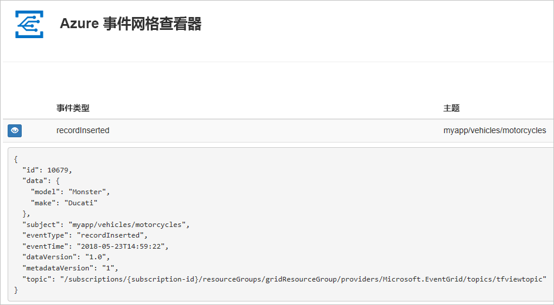
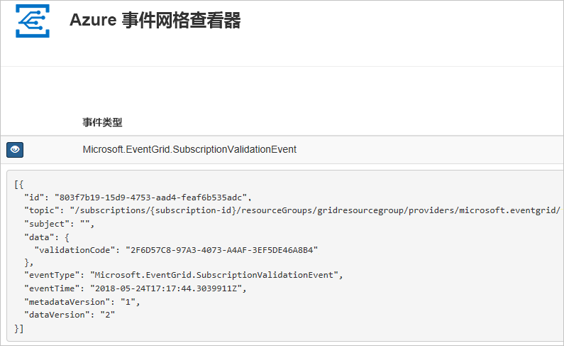

# <a name="create-and-route-custom-events-with-azure-cli-and-event-grid"></a>使用 Azure CLI 和事件网格创建和路由自定义事件

Azure 事件网格是针对云的事件处理服务。 在本文中，请使用 Azure CLI 创建一个自定义主题，然后订阅该主题，再触发可查看结果的事件。 通常，你将事件发送到用于处理事件数据并执行操作的终结点。 但是，为了简化本文，你将事件发送到收集并显示消息的 Web 应用。

完成后即可看到事件数据已发送到 Web 应用。



[!INCLUDE [quickstarts-free-trial-note.md](../../includes/quickstarts-free-trial-note.md)]

[!INCLUDE [cloud-shell-try-it.md](../../includes/cloud-shell-try-it.md)]

如果选择在本地安装并使用 CLI，本文需要运行最新版的 Azure CLI（2.0.24 或更高版本）。 若要查找版本，请运行 `az --version`。 如果需要进行安装或升级，请参阅[安装 Azure CLI](/cli/azure/install-azure-cli)。

如果不使用 Cloud Shell，则必须先使用 `az login` 登录。

## <a name="create-a-resource-group"></a>创建资源组

事件网格主题是 Azure 资源，必须放置在 Azure 资源组中。 该资源组是在其中部署和管理 Azure 资源的逻辑集合。

使用 [az group create](/cli/azure/group#az_group_create) 命令创建资源组。 

以下示例在“westus2”位置创建名为“gridResourceGroup”的资源组。

```azurecli-interactive
az group create --name gridResourceGroup --location westus2
```

[!INCLUDE [event-grid-register-provider-cli.md](../../includes/event-grid-register-provider-cli.md)]

## <a name="create-a-custom-topic"></a>创建自定义主题

事件网格主题提供用户定义的终结点，可向其发布事件。 以下示例在资源组中创建自定义主题。 用主题的唯一名称替换 `<your-topic-name>`。 主题名称必须唯一，因为它是 DNS 条目的一部分。

```azurecli-interactive
topicname=<your-topic-name>

az eventgrid topic create --name $topicname -l westus2 -g gridResourceGroup
```

## <a name="create-a-message-endpoint"></a>创建消息终结点

在订阅主题之前, 让我们创建事件消息的终结点。 通常情况下，终结点基于事件数据执行操作。 为了简化此快速入门，将部署用于显示事件消息的[预建 Web 应用](https://github.com/dbarkol/azure-event-grid-viewer)。 部署的解决方案包括应用服务计划、应用服务 Web 应用和 GitHub 中的源代码。

将 `<your-site-name>` 替换为 Web 应用的唯一名称。 Web 应用名称必须唯一，因为它是 DNS 条目的一部分。

```azurecli-interactive
sitename=<your-site-name>

az group deployment create \
  --resource-group gridResourceGroup \
  --template-uri "https://raw.githubusercontent.com/dbarkol/azure-event-grid-viewer/master/azuredeploy.json" \
  --parameters siteName=$sitename hostingPlanName=viewerhost
```

部署可能需要几分钟才能完成。 部署成功后，请查看 Web 应用以确保它正在运行。 在 Web 浏览器中导航到 `https://<your-site-name>.azurewebsites.net`

应该看到当前未显示任何消息的站点。

## <a name="subscribe-to-a-topic"></a>订阅主题

订阅主题，以告知事件网格要跟踪哪些事件，以及要将这些事件发送到何处。 以下示例将订阅所创建的主题，并将 Web 应用中的 URL 作为事件通知的终结点传递。

Web 应用的终结点必须包括后缀 `/api/updates/`。

```azurecli-interactive
endpoint=https://$sitename.azurewebsites.net/api/updates

az eventgrid event-subscription create \
  -g gridResourceGroup \
  --topic-name $topicname \
  --name demoViewerSub \
  --endpoint $endpoint
```

再次查看 Web 应用，并注意订阅验证事件已发送给它。 选择眼睛图标以展开事件数据。 事件网格发送验证事件，以便终结点可以验证它是否想要接收事件数据。 Web 应用包含用于验证订阅的代码。



## <a name="send-an-event-to-your-topic"></a>向主题发送事件

让我们触发一个事件，看看事件网格如何将消息分发到终结点。 首先，让我们获取自定义主题的 URL 和密钥。

```azurecli-interactive
endpoint=$(az eventgrid topic show --name $topicname -g gridResourceGroup --query "endpoint" --output tsv)
key=$(az eventgrid topic key list --name $topicname -g gridResourceGroup --query "key1" --output tsv)
```

在本文中，为简便起见，请使用要发送到主题的示例事件数据。 通常情况下，应用程序或 Azure 服务会发送事件数据。 以下示例获取事件数据：

```azurecli-interactive
body=$(eval echo "'$(curl https://raw.githubusercontent.com/Azure/azure-docs-json-samples/master/event-grid/customevent.json)'")
```

若要查看完整事件，请使用 `echo "$body"`。 JSON 的 `data` 元素是事件的有效负载。 可以将任何格式正确的 JSON 置于此字段中。 也可将主题字段用于高级路由和筛选。

CURL 是发送 HTTP 请求的实用工具。 本文使用 CURL 向主题发送事件。 

```azurecli-interactive
curl -X POST -H "aeg-sas-key: $key" -d "$body" $endpoint
```

现已触发事件，并且事件网格已将消息发送到订阅时配置的终结点。 查看 Web 应用以查看刚刚发送的事件。

```json
[{
  "id": "1807",
  "eventType": "recordInserted",
  "subject": "myapp/vehicles/motorcycles",
  "eventTime": "2017-08-10T21:03:07+00:00",
  "data": {
    "make": "Ducati",
    "model": "Monster"
  },
  "dataVersion": "1.0",
  "metadataVersion": "1",
  "topic": "/subscriptions/{subscription-id}/resourceGroups/{resource-group}/providers/Microsoft.EventGrid/topics/{topic}"
}]
```

## <a name="clean-up-resources"></a>清理资源
如果打算继续处理此事件或事件查看器应用，请不要清除本文中创建的资源。 否则，请使用以下命令删除本文中创建的资源。

```azurecli-interactive
az group delete --name gridResourceGroup
```

## <a name="next-steps"></a>后续步骤

了解如何创建主题和事件订阅以后，即可进一步学习事件网格的功能：

- [关于事件网格](overview.md)
- [将 Blob 存储事件路由到自定义 Web 终结点](../storage/blobs/storage-blob-event-quickstart.md?toc=%2fazure%2fevent-grid%2ftoc.json)
- [通过 Azure 事件网格和逻辑应用监视虚拟机的更改](monitor-virtual-machine-changes-event-grid-logic-app.md)
- [将大数据流式传输到数据仓库](event-grid-event-hubs-integration.md)
