# <a name="quickstart-route-custom-events-to-an-azure-function-with-event-grid"></a>快速入门：使用事件网格将自定义事件路由到 Azure 函数

Azure 事件网格是针对云的事件处理服务。 Azure 函数是受支持的事件处理程序之一。 在本文中，将使用 Azure 门户创建一个自定义主题，然后订阅该自定义主题，再触发可查看结果的事件。 将事件发送至 Azure 函数。

[!INCLUDE [quickstarts-free-trial-note.md](../../includes/quickstarts-free-trial-note.md)]

## <a name="create-azure-function"></a>创建 Azure 函数

在订阅自定义主题之前，让我们创建一个函数来处理事件。 在 Azure 门户中单击“创建资源”并键入“函数”，然后选择“函数应用”并单击创建。 选择资源组下的“新建”并为其指定名称。 本教程的余下部分将使用此资源组。 为函数应用命名，将“发布”切换按钮保持为“代码”，接着任意选择运行时和区域，然后点击“创建”。

当你准备好函数应用时，请导航到它并单击“+ 新建函数”。 开发环境选择为“门户内”并单击“继续”。 在“创建函数”下，选择“更多模板”以查看更多模板，然后搜索“Azure 事件网格触发器”并选择它。 如果这是你第一次使用此触发器，可能需要单击“安装”来安装该扩展。

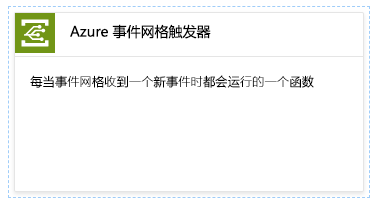

安装扩展后，单击“继续”，为函数命名，然后点击“创建”。

[!INCLUDE [event-grid-register-provider-portal.md](../../includes/event-grid-register-provider-portal.md)]

## <a name="create-a-custom-topic"></a>创建自定义主题

事件网格主题提供用户定义的终结点，可向其发布事件。 

1. 登录到 [Azure 门户](https://portal.azure.com/)。
2. 在左侧导航菜单中选择“所有服务”，搜索“事件网格”，然后选择“事件网格主题”。    

    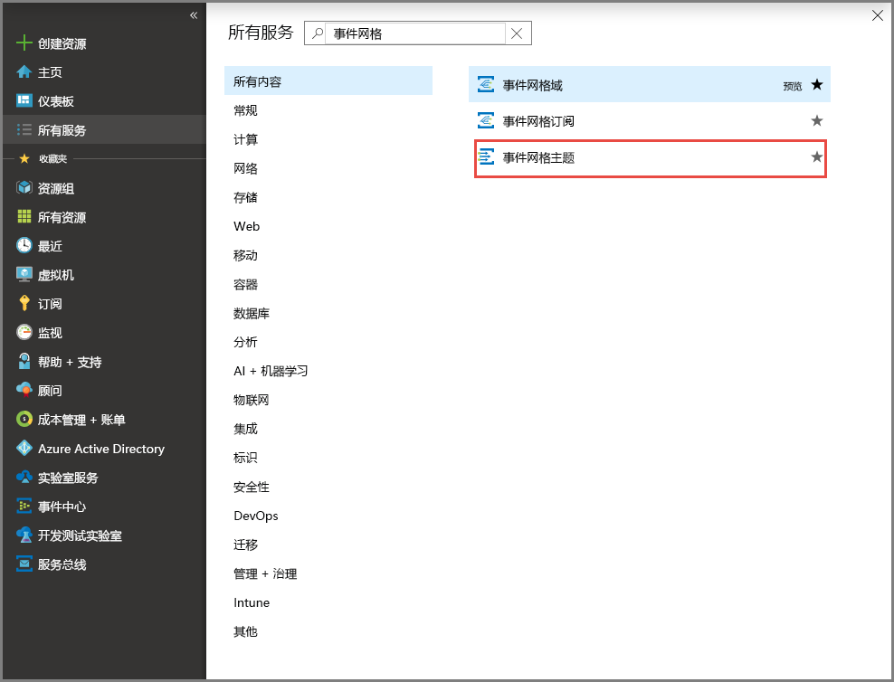
3. 在“事件网格主题”页上的工具栏中选择“添加”。   

    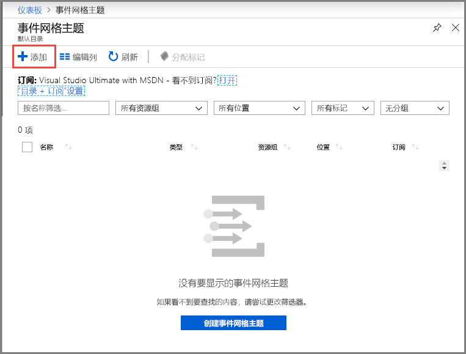

4. 在“创建主题”页上执行以下步骤： 

    1. 为自定义主题提供唯一的**名称**。 主题名称必须唯一，因为它由 DNS 条目表示。 请不要使用图中所示的名称。 而是创建自己的名称 - 它必须介于 3 到 50 个字符之间，并且只包含值 a-z、A-Z、0-9 和“-”。
    2. 选择 **Azure 订阅**。
    3. 选择与前面的步骤一致的资源组。
    4. 选择事件网格主题的**位置**。
    5. 在“事件架构”字段中，保留默认值“事件网格架构”。   

       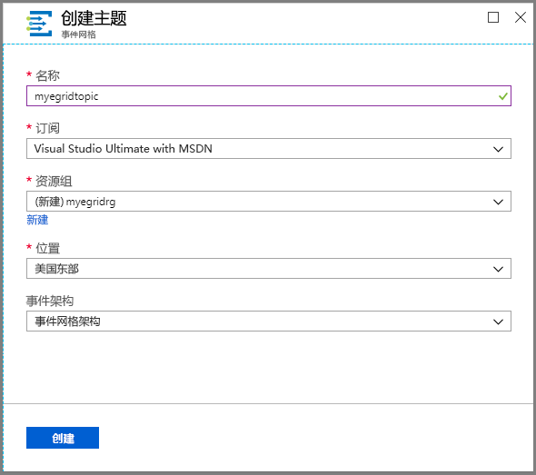
    6. 选择“创建”  。 

5. 创建自定义主题后，将会看到成功通知。 选择“转到资源组”。  

   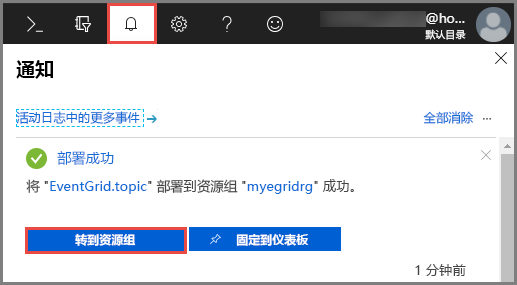

6. 在“资源组”页上，选择事件网格主题。  

   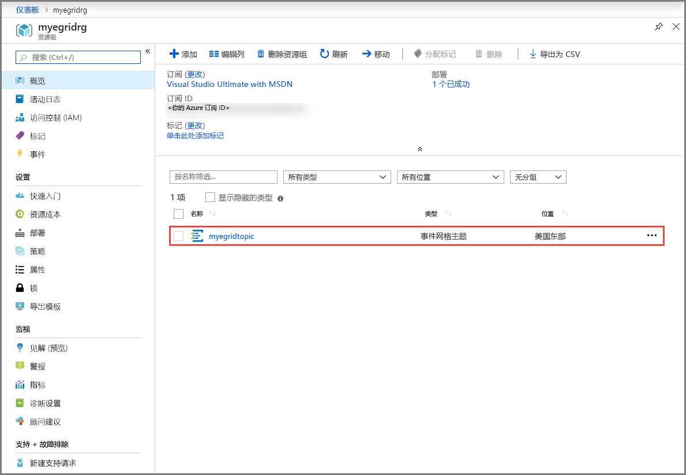

7. 此时会显示事件网格的“事件网格主题”页。  请将此页保持打开状态， 稍后在本快速入门中需要使用此页。 

    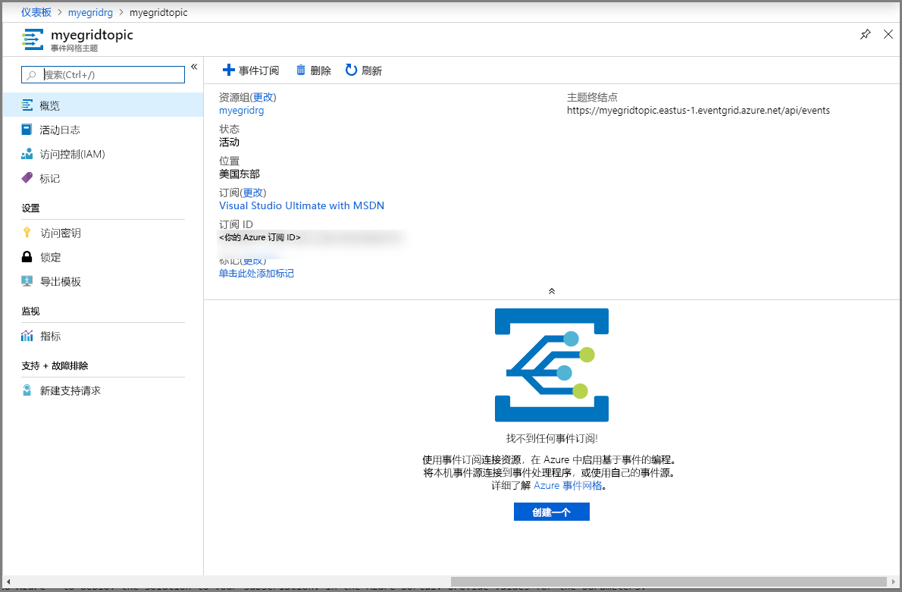

## <a name="subscribe-to-custom-topic"></a>订阅自定义主题

订阅事件网格主题，以告知事件网格要跟踪哪些事件，以及要将事件发送到何处。

1. 现在，请在自定义主题的“事件网格主题”页上的工具栏中，选择“+ 事件订阅”。  

   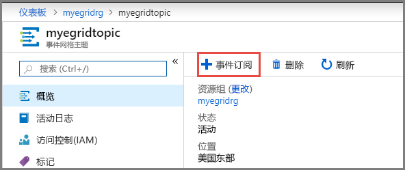

2. 在“创建事件订阅”页上执行以下步骤： 
    1. 输入事件订阅的“名称”  。
    3. 选择“Azure 函数”作为“终结点类型”   。 
    4. 选择“选择终结点”。  

       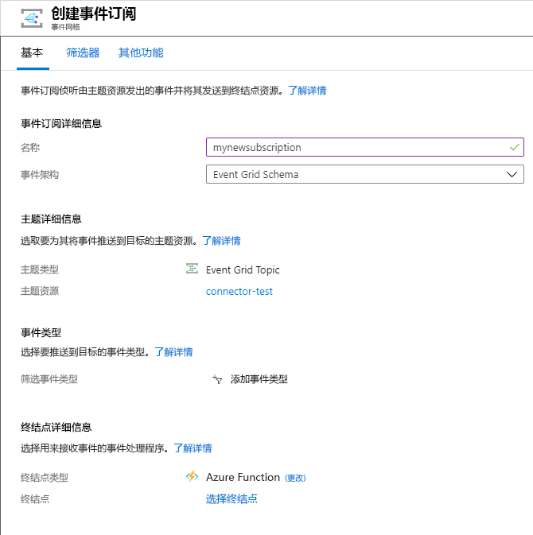

    5. 对于函数终结点，选择你的函数应用所在的 Azure 订阅和资源组，然后选择之前创建的函数应用和函数。 选择“确认所选内容”  。

       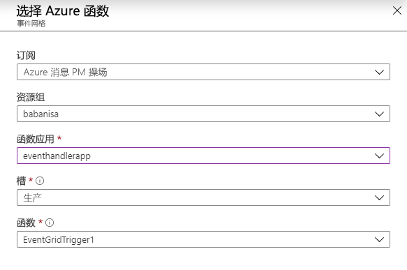

    6. 返回“创建事件订阅”页，选择“创建”。  

## <a name="send-an-event-to-your-topic"></a>向主题发送事件

现在，让我们触发一个事件，看事件网格如何将消息分发到终结点。 使用 Azure CLI 或 PowerShell 向自定义主题发送测试性事件。 通常情况下，应用程序或 Azure 服务会发送事件数据。

第一个示例使用 Azure CLI。 它获取自定义主题的 URL 和密钥，以及示例事件数据。 将自定义主题名称用于 `<topic name>`。 它将创建示例事件数据。 JSON 的 `data` 元素是事件的有效负载。 可以将任何格式正确的 JSON 置于此字段中。 也可将主题字段用于高级路由和筛选。 CURL 是发送 HTTP 请求的实用工具。


### <a name="azure-cli"></a>Azure CLI
1. 在 Azure 门户中选择“Cloud Shell”。  在 Cloud Shell 窗口的左上角选择“Bash”。  

    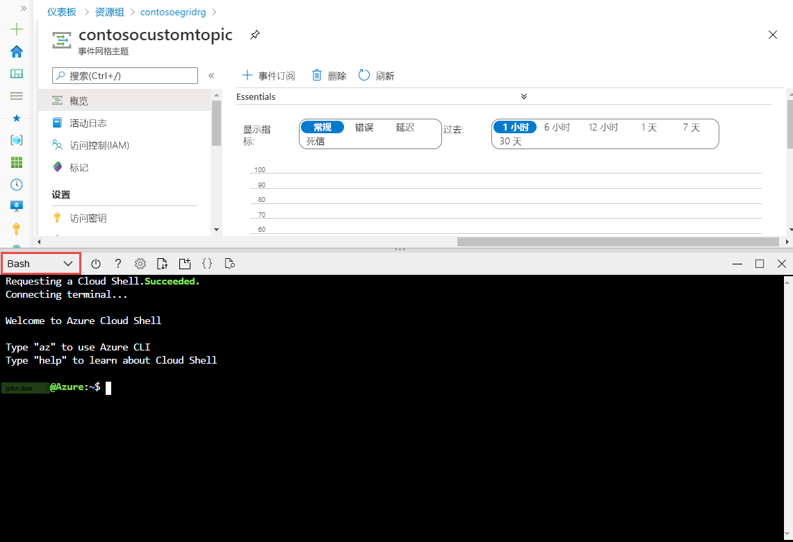
1. 运行以下命令以获取主题的**终结点**：复制并粘贴该命令后，更新**主题名称**和**资源组名称**，然后运行该命令。 

    ```azurecli
    endpoint=$(az eventgrid topic show --name <topic name> -g <resource group name> --query "endpoint" --output tsv)
    ```
2. 运行以下命令以获取自定义主题的**密钥**：复制并粘贴该命令后，更新**主题名称**和**资源组名称**，然后运行该命令。 

    ```azurecli
    key=$(az eventgrid topic key list --name <topic name> -g <resource group name> --query "key1" --output tsv)
    ```
3. 复制以下包含事件定义的语句，然后按 **ENTER**。 

    ```json
    event='[ {"id": "'"$RANDOM"'", "eventType": "recordInserted", "subject": "myapp/vehicles/motorcycles", "eventTime": "'`date +%Y-%m-%dT%H:%M:%S%z`'", "data":{ "make": "Ducati", "model": "Monster"},"dataVersion": "1.0"} ]'
    ```
4. 运行以下 **Curl** 命令以发布事件：

    ```
    curl -X POST -H "aeg-sas-key: $key" -d "$event" $endpoint
    ```

### <a name="azure-powershell"></a>Azure PowerShell
第二个示例使用 PowerShell，执行的步骤类似。

1. 在 Azure 门户中选择“Cloud Shell”（或者转到 https://shell.azure.com/) 。  在 Cloud Shell 窗口的左上角选择“PowerShell”。  参阅“Azure CLI”部分的示例 **Cloud Shell** 窗口图像。
2. 设置以下变量。 复制并粘贴每个命令后，更新**主题名称**和**资源组名称**，然后运行该命令：

    ```powershell
    $resourceGroupName = <resource group name>
    $topicName = <topic name>
    ```
3. 运行以下命令以获取主题的**终结点**和**密钥**：

    ```powershell
    $endpoint = (Get-AzEventGridTopic -ResourceGroupName $resourceGroupName -Name $topicName).Endpoint
    $keys = Get-AzEventGridTopicKey -ResourceGroupName $resourceGroupName -Name $topicName
    ```
4. 准备事件。 在 Cloud Shell 窗口中复制并运行这些语句。 

    ```powershell
    $eventID = Get-Random 99999

    #Date format should be SortableDateTimePattern (ISO 8601)
    $eventDate = Get-Date -Format s

    #Construct body using Hashtable
    $htbody = @{
        id= $eventID
        eventType="recordInserted"
        subject="myapp/vehicles/motorcycles"
        eventTime= $eventDate   
        data= @{
            make="Ducati"
            model="Monster"
        }
        dataVersion="1.0"
    }
    
    #Use ConvertTo-Json to convert event body from Hashtable to JSON Object
    #Append square brackets to the converted JSON payload since they are expected in the event's JSON payload syntax
    $body = "["+(ConvertTo-Json $htbody)+"]"
    ```
5. 使用 **Invoke-WebRequest** cmdlet 发送事件。 

    ```powershell
    Invoke-WebRequest -Uri $endpoint -Method POST -Body $body -Headers @{"aeg-sas-key" = $keys.Key1}
    ```

### <a name="verify-in-the-event-grid-viewer"></a>在事件网格查看器中验证
现已触发事件，并且事件网格已将消息发送到订阅时配置的终结点。 导航到事件网格触发器函数并打开日志。 这时应该会在日志中看到该事件的数据有效负载的副本。 如果不确定，请先打开日志窗口，或点击重新连接，然后再次尝试发送测试事件。

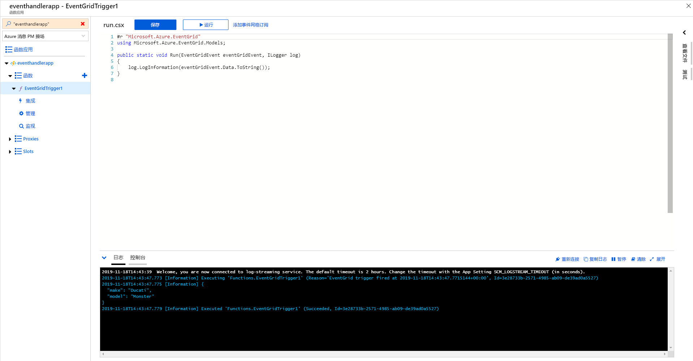

## <a name="clean-up-resources"></a>清理资源
如果打算继续处理此事件，请不要清除本文中创建的资源。 否则，请删除本文中创建的资源。

1. 在左侧菜单中选择“资源组”。  如果左侧菜单中未显示此选项，请在左侧菜单中选择“所有服务”，然后选择“资源组”。   
2. 选择资源组以启动“资源组”页。  
3. 在工具栏中选择“删除资源组”。  
4. 输入资源组的名称以确认删除，然后选择“删除”。  

    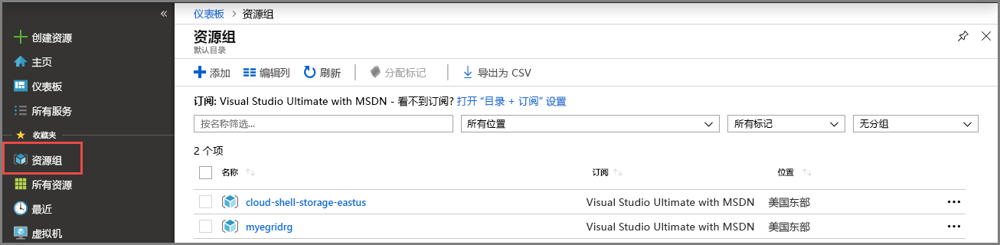

    图中显示的另一个资源组是 Cloud Shell 窗口创建并使用的。 如果你以后不打算使用 Cloud Shell 窗口，请删除该资源组。 

## <a name="next-steps"></a>后续步骤

了解如何创建主题和事件订阅以后，即可进一步学习事件网格的功能：

- [关于事件网格](overview.md)
- [将 Blob 存储事件路由到自定义 Web 终结点](../storage/blobs/storage-blob-event-quickstart.md?toc=%2fazure%2fevent-grid%2ftoc.json)
- [通过 Azure 事件网格和逻辑应用监视虚拟机的更改](monitor-virtual-machine-changes-event-grid-logic-app.md)
- [将大数据流式传输到数据仓库](event-grid-event-hubs-integration.md)
