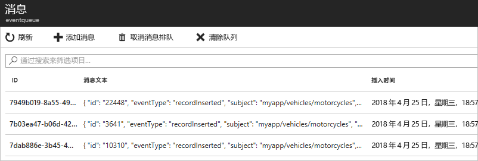

# <a name="route-custom-events-to-azure-queue-storage-with-azure-cli-and-event-grid"></a>使用 Azure CLI 和事件网格将自定义事件路由到 Azure 队列存储

Azure 事件网格是针对云的事件处理服务。 Azure 队列存储是受支持的事件处理程序之一。 在本文中，请使用 Azure CLI 创建一个自定义主题，然后订阅该主题，再触发可查看结果的事件。 将事件发送到队列存储。

[!INCLUDE [quickstarts-free-trial-note.md](../../includes/quickstarts-free-trial-note.md)]

[!INCLUDE [event-grid-preview-feature-note.md](../../includes/event-grid-preview-feature-note.md)]

## <a name="create-a-resource-group"></a>创建资源组

事件网格主题是 Azure 资源，必须放置在 Azure 资源组中。 该资源组是在其中部署和管理 Azure 资源的逻辑集合。

使用 [az group create](/cli/azure/group#az-group-create) 命令创建资源组。 

以下示例在“westus2”位置创建名为“gridResourceGroup”的资源组。

```azurecli-interactive
az group create --name gridResourceGroup --location westus2
```

[!INCLUDE [event-grid-register-provider-cli.md](../../includes/event-grid-register-provider-cli.md)]

## <a name="create-a-custom-topic"></a>创建自定义主题

事件网格主题提供用户定义的终结点，可向其发布事件。 以下示例在资源组中创建自定义主题。 用主题的唯一名称替换 `<topic_name>`。 主题名称必须唯一，因为它由 DNS 条目表示。

```azurecli-interactive
# if you have not already installed the extension, do it now.
# This extension is required for preview features.
az extension add --name eventgrid

az eventgrid topic create --name <topic_name> -l westus2 -g gridResourceGroup
```

## <a name="create-queue-storage"></a>创建队列存储

在订阅主题之前, 让我们创建事件消息的终结点。 创建用于收集事件的队列存储。

```azurecli-interactive
storagename="<unique-storage-name>"
queuename="eventqueue"

az storage account create -n $storagename -g gridResourceGroup -l westus2 --sku Standard_LRS
az storage queue create --name $queuename --account-name $storagename
```

## <a name="subscribe-to-a-topic"></a>订阅主题

订阅主题是为了告知事件网格要跟踪哪些事件。以下示例订阅所创建的主题，并传递终结点队列存储的资源 ID。 通过 Azure CLI，可采用终结点的形式传递队列存储 ID。 终结点的格式如下：

`/subscriptions/<subscription-id>/resourcegroups/<resource-group-name>/providers/Microsoft.Storage/storageAccounts/<storage-name>/queueservices/default/queues/<queue-name>`

以下脚本获取队列存储帐户的资源 ID。 它构造队列存储的 ID 并订阅事件网格主题。 它将终结点类型设置为 `storagequeue` 并使用终结点的队列 ID。

```azurecli-interactive
storageid=$(az storage account show --name $storagename --resource-group gridResourceGroup --query id --output tsv)
queueid="$storageid/queueservices/default/queues/$queuename"

az eventgrid event-subscription create \
  --topic-name <topic_name> \
  -g gridResourceGroup \
  --name <event_subscription_name> \
  --endpoint-type storagequeue \
  --endpoint $queueid
```

如果使用 REST API 创建订阅，则以独立参数的形式传递存储帐户 ID 和队列名称。

```json
"destination": {
  "endpointType": "storagequeue",
  "properties": {
    "queueName":"eventqueue",
    "resourceId": "/subscriptions/<subscription-id>/resourcegroups/<resource-group-name>/providers/Microsoft.Storage/storageAccounts/<storage-name>"
  }
  ...
```

## <a name="send-an-event-to-your-topic"></a>向主题发送事件

让我们触发一个事件，看看事件网格如何将消息分发到终结点。 首先，让我们获取自定义主题的 URL 和密钥。 同样，请将主题名称用于 `<topic_name>`。

```azurecli-interactive
endpoint=$(az eventgrid topic show --name <topic_name> -g gridResourceGroup --query "endpoint" --output tsv)
key=$(az eventgrid topic key list --name <topic_name> -g gridResourceGroup --query "key1" --output tsv)
```

在本文中，为简便起见，请使用要发送到主题的示例事件数据。 通常情况下，应用程序或 Azure 服务会发送事件数据。 CURL 是发送 HTTP 请求的实用工具。 本文使用 CURL 向主题发送事件。  以下示例将三个事件发送到事件网格主题：

```azurecli-interactive
for i in 1 2 3
do
   body=$(eval echo "'$(curl https://raw.githubusercontent.com/Azure/azure-docs-json-samples/master/event-grid/customevent.json)'")
   curl -X POST -H "aeg-sas-key: $key" -d "$body" $endpoint
done
```

导航到门户中的队列存储，请注意，事件网格会将这三个事件发送到队列。




## <a name="clean-up-resources"></a>清理资源
如果打算继续处理此事件，请不要清除本文中创建的资源。 否则，请使用以下命令删除本文中创建的资源。

```azurecli-interactive
az group delete --name gridResourceGroup
```

## <a name="next-steps"></a>后续步骤

了解如何创建主题和事件订阅以后，即可进一步学习事件网格的功能：

- [关于事件网格](overview.md)
- [将 Blob 存储事件路由到自定义 Web 终结点](../storage/blobs/storage-blob-event-quickstart.md?toc=%2fazure%2fevent-grid%2ftoc.json)
- [通过 Azure 事件网格和逻辑应用监视虚拟机的更改](monitor-virtual-machine-changes-event-grid-logic-app.md)
- [将大数据流式传输到数据仓库](event-grid-event-hubs-integration.md)
