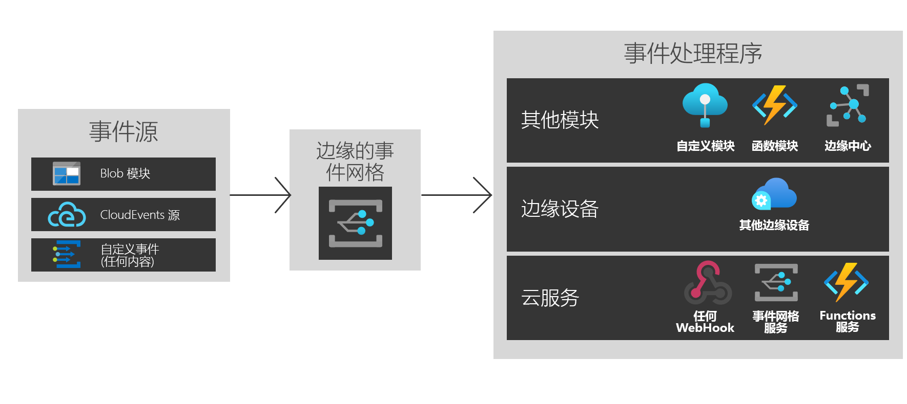

# Azure IoT Edge 上的 Azure 事件网格是什么？
IoT Edge 事件网格为边缘提供了 Azure 事件网格的强大功能和灵活性。 创建主题、发布事件并订阅多个目标，无论它们是同一设备上的模块、其他边缘设备还是云中的服务。

与在云中一样，IoT Edge 事件网格处理大规模事件的传递、筛选和可靠交付。 使用高级字符串、数字和布尔值筛选器对事件进行筛选，以确保仅将相关事件发送到不同的事件处理程序。 使用重试逻辑可确保事件到达目标，即使该事件在发布时不可用。 通过该逻辑可将 IoT Edge 事件网格用作强大的存储和转发机制。

IoT Edge 事件网格同时支持 CloudEvents v1.0 和自定义事件架构。 它还支持与云中的事件网格相同的 Pub/Sub 语义，以便轻松实现互操作性。

本文将对 Azure IoT Edge 事件网格进行简要概述。 有关在边缘上使用此模块的分步说明，请参阅[在本地发布和订阅事件](pub-sub-events-webhook-local.md)。 

此图显示了可使用 IoT Edge 事件网格的某些方法，但并非受支持功能的完整列表。

## 何时使用 IoT Edge 事件网格

IoT Edge 事件网格旨在提供易于在边缘和云之间使用且可靠的事件模型。

IoT Edge 事件网格可通过 Azure 云服务的对称运行时外围应用生成，因此可在任何需要的地方使用相同的事件和 API 调用。 无论是在云中、在边缘还是在两者之间发布/订阅，IoT Edge 事件网格现可作为你的首选解决方案。

使用 IoT Edge 事件网格在模块之间触发简单的工作流。 例如，创建一个主题，然后将“创建的存储 blob”事件从存储模块发布到该主题。 现可为该主题订阅一个或多个函数或自定义模块。

在边缘设备之间扩展功能。 如果正在发布 blob 模块事件，并且希望使用多个近边缘设备的计算能力，请创建跨设备订阅。

最后，连接到云。 如果 blob 模块事件要定期同步到云，请使用云上提供的更大计算，或者发送已处理的数据，创建其他云服务订阅。

IoT Edge 事件网格提供了灵活可靠的分离式事件处理体系结构。

## 事件源

与云中非常相似，通过 IoT Edge 事件网格可在模块之间直接进行集成以构建事件驱动的体系结构。 目前，可以通过以下方式将事件发送到 IoT Edge 事件网格：

* IoT Edge 上的 Azure Blob 存储
* CloudEvents 源
* 通过 HTTP POST 自定义模块和容器

## 事件处理程序

IoT Edge 事件网格旨在将事件发送到所需的任何位置。 目前支持以下目标存储选项：

* 其他模块，包括 IoT 中心、函数和自定义模块
* 其他边缘设备
* Webhook
* Azure 事件网格云服务
* 事件中心
* 服务总线队列
* 服务总线主题
* 存储队列

## 支持的环境
目前支持 Windows 64 位、Linux 64 位和 ARM 32 位环境。

## 概念

Azure 事件网格中有以下五个概念，可帮助你开始入门：

* **事件** - 发生了什么。
* **事件源** - 事件发生的地点。
* **主题** - 其中发布者发送事件的终结点。
* **事件订阅** - 用于路由事件，有时用于多个处理程序的终结点或内置机制。 订阅还用于处理程序，以便智能地筛选传入事件。
* **事件处理程序** - 对事件作出反应的应用或服务。

## 成本

IoT Edge 事件网格在公共预览期间可免费使用。

## 问题
在 [https://github.com/Azure/event-grid-iot-edge/issues](https://github.com/Azure/event-grid-iot-edge/issues) 上报告有关使用 IoT Edge 事件网格的问题。

## 后续步骤

* [在本地发布和订阅事件](pub-sub-events-webhook-local.md)
* [在云中发布和订阅事件](pub-sub-events-webhook-cloud.md)
* [将事件转发到事件网格云](forward-events-event-grid-cloud.md)
* [将事件转发到 IoT 中心](forward-events-iothub.md)
* [在本地响应 Blob 存储事件](react-blob-storage-events-locally.md)