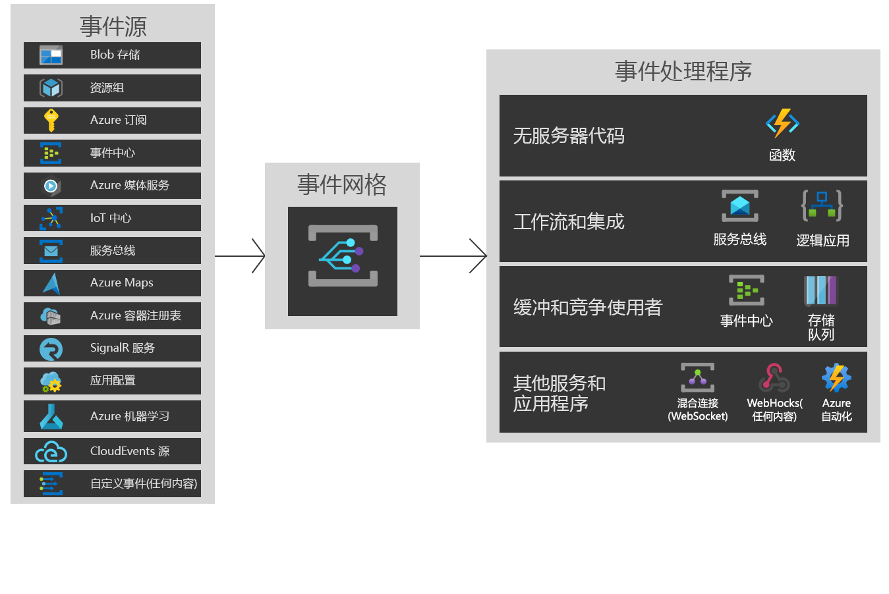

# Azure 事件网格简介

通过 Azure 事件网格，可使用基于事件的体系结构轻松生成应用程序。 你可以选择要订阅的 Azure 资源，并提供要向其发送事件的事件处理程序或 WebHook 终结点。 事件网格包含来自 Azure 服务对事件的内置支持，如存储 blob 和资源组。 事件网格还可以使用自定义主题和自定义 webhook 对应用程序和第三方事件提供自定义支持。 

可以使用筛选器将特定事件路由到不同的终结点，多播到多个终结点，并确保事件可靠传送。 此外，事件网格还提供对自定义和第三方事件的内置支持。

目前，事件网格支持以下区域：

* 亚洲东南部
* 亚洲东部
* 澳大利亚东部
* 澳大利亚东南部
* 美国中部
*   美国东部
*   美国东部 2
* 西欧
* 北欧
* 日本东部
* 日本西部
*   美国中西部
*   美国西部
*   美国西部 2

本文将对 Azure 事件网格进行简要概述。 若要开始使用事件网格，请参阅[使用 Azure 事件网格创建和路由自定义事件](custom-event-quickstart.md)。 下图显示了事件网格如何连接来源和处理程序，但它未提供支持的选项的完整列表。

## 事件源

当前，以下 Azure 服务支持将事件发送到事件网格：

* Azure 订阅（管理操作）
* 自定义主题
* 事件中心
* IoT 中心
* 媒体服务
* 资源组（管理操作）
* 服务总线
* 存储 Blob
* 常规用途 v2 (GPv2) 存储

有关演示如何使用每个事件源的文章的链接，请参阅 [Azure 事件网格中的事件源](event-sources.md)。

## 事件处理程序

当前，以下 Azure 服务支持从事件网格处理事件： 

* Azure 自动化
* Azure Functions
* 事件中心
* 混合连接
* 逻辑应用
* Microsoft Flow
* 队列存储
* Webhook

有关演示如何使用每个事件处理程序的文章的链接，请参阅 [Azure 事件网格中的事件处理程序](event-handlers.md)。

## 概念

在可以开始进行操作的 Azure 事件网格中有五个概念：

* 事件 - 发生了什么。
* **事件源** - 事件发生的地点。
* 主题 - 其中发布者发送事件的终结点。
* 事件订阅 - 用于路由事件，有时用于多个处理程序的终结点或内置机制。 订阅还用于处理程序，以便智能地筛选传入事件。
* 事件处理程序 - 对事件作出反应的应用或服务。

有关这些概念的详细信息，请参阅 [Azure 事件网格中的概念](concepts.md)。

## 功能

下面是 Azure 事件网格中的一些主要功能：

* 简洁性 - 指向并单击从 Azure 资源到任何事件处理程序或终结点的目标事件。
* 高级筛选 - 筛选事件类型或事件发布路径，以确保事件处理程序仅接收相关的事件。
* 扇出 - 订阅到相同事件的多个终结点，以将该事件的副本发送到所需的所有位置。
* 可靠性 - 会以指数退避算法在 24 小时内重试，以确保事件成功传送。
* 按事件支付 - 仅支付事件网格的使用量。
* 高吞吐量 - 通过对每秒数以百万计事件的支持，在事件网格上生成大量工作负荷。
* 内置事件 - 使用资源定义的内置事件快速启动和运行。
* 自定义事件 - 在应用中使用事件网格路由、筛选并可靠地传送自定义事件。

有关事件网格、事件中心和服务总线之间的比较，请参阅[在传送消息的 Azure 服务之间进行选择](compare-messaging-services.md)。

## 使用事件网格可以做什么？

Azure 事件网格提供了多个极大地改进无服务器的功能、运维自动化和集成工作： 

### 无服务器应用程序体系结构

事件网格将数据源与事件处理程序连接。 例如，使用事件网格在每次向 Blob 存储容器添加新照片时，立即触发无服务器功能运行图像分析。 

### 运维自动化

使用事件网格，可以加快自动化，简化策略执行。 例如，事件网格可在创建虚拟机或启动 SQL 数据库时通知 Azure 自动化。 这些事件可用于自动检查服务配置是否符合要求，是否将元数据放入操作工具、标记虚拟机或文件工作项中。

### 应用程序集成

事件网格将应用与其他服务连接。 例如，创建一个自定义主题以将应用的事件数据发送到事件网格，并利用其可靠交付、高级路由和与 Azure 的直接集成。 或者，可使用具有逻辑应用的事件网格来处理任何位置的数据，而无需编写代码。 

## 事件网格的费用是多少？

Azure 事件网格使用按事件支付的定价模型，因此，你只需为你所使用的事件付费。 每月前 100,000 个操作是免费的。 操作定义为事件引入、订阅交付尝试、管理调用和按使用者后缀筛选。 有关详细信息，请参阅[定价页](https://azure.microsoft.com/pricing/details/event-grid/)。

## 后续步骤

* [路由存储 Blob 事件](../storage/blobs/storage-blob-event-quickstart.md?toc=%2fazure%2fevent-grid%2ftoc.json)  
  使用事件网格响应存储 blob 事件。
* [创建并订阅自定义事件](custom-event-quickstart.md)  
  立即开始使用 Azure 事件网格快速入门，将自己的自定义事件发送到任何终结点。
* [将逻辑应用用作事件处理程序](monitor-virtual-machine-changes-event-grid-logic-app.md)  
  本教程介绍如何使用逻辑应用生成应用，并对事件网格推送的事件作出响应。
* [将大数据流式传输到数据仓库](event-grid-event-hubs-integration.md)  
  本教程介绍如何使用 Azure Functions 将数据从事件中心流式传输到 SQL 数据仓库。
* [事件网格 REST API 参考](/rest/api/eventgrid)  
  介绍有个 Azure 事件网格的更多技术信息，以及管理事件订阅、路由和过滤的参考。