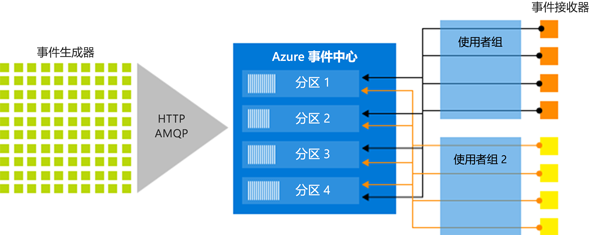

# 什么是 Azure 事件中心？

Azure 事件中心是一个大数据流式处理平台和事件引入服务，每秒能够接收和处理数百万个事件。 事件中心可以处理和存储分布式软件和设备生成的事件、数据或遥测。 可以使用任何实时分析提供程序或批处理/存储适配器转换和存储发送到数据中心的数据。 

在下面这些常见方案中可以使用事件中心：

- 异常情况检测（欺诈/离群值）
- 应用程序日志记录
- 分析管道，例如点击流
- 实时仪表板
- 存档数据
- 事务处理
- 用户遥测数据处理
- 设备遥测数据流式处理 

## 为何使用事件中心？

仅当能够轻松处理并且能够从数据源获取即时见解时，数据才有价值。 事件中心提供低延迟、可无缝集成的分布式流处理平台，并在 Azure 的内部和外部提供数据和分析服务用于构建完整的大数据管道。

事件中心充当事件管道的“前门”，在解决方案体系结构中通常称作“事件引入器”。 事件引入器是位于事件发布者与事件使用者之间的组件或服务，可以将事件流的生成与这些事件的使用分离开来。 事件中心提供统一的流式处理平台和时间保留缓冲区，将事件生成者与事件使用者分离开来。 

## 主要功能

事件中心提供消息流处理功能，但其特征不同于传统的企业消息传送。 事件中心功能围绕高吞吐量和事件处理方案而构建。 事件中心包含以下[关键组件](event-hubs-features.md)：

- **事件生成者**：向事件中心发送数据的实体。 事件发布者可以使用 HTTPS、AMQP 1.0 或 Apache Kafka（1.0 和更高版本）发布事件。
- **分区**：每个使用者只读取消息流的特定子集或分区。
- **使用者组**：整个事件中心的视图（状态、位置或偏移量）。 使用者组使多个消费应用程序都有各自独立的事件流视图，并按自身步调和偏移量独立读取流。
- **吞吐量单位**：预先购买的容量单位，控制事件中心的吞吐量容量。
- **事件接收者**：从事件中心读取事件数据的实体。 所有事件中心使用者通过 AMQP 1.0 会话进行连接，事件在可用时通过会话传送。

下图显示了事件中心流处理体系结构：

## 完全托管的 PaaS 

事件中心是托管的服务，其配置或管理开销极低，因此你可以专注于业务解决方案。 [Apache Kafka 生态系统的事件中心](event-hubs-for-kafka-ecosystem-overview.md)提供 PaaS Kafka 体验，使用户无需管理、配置或运行群集。

## 实时处理和批处理

实时引入、缓冲、存储和处理流，以获取可行的见解。 事件中心使用[分区的使用者模型](event-hubs-features.md#partitions)，可让多个应用程序同时处理流，并允许控制处理速度。

在 [Azure Blob 存储](https://azure.microsoft.com/services/storage/blobs/)或 [Azure Data Lake Store](https://azure.microsoft.com/services/data-lake-store/)  中近乎实时地[捕获](event-hubs-capture-overview.md)数据，以进行长期保留或微批处理。 可以基于用于派生实时分析的同一个流实现此目的。 设置捕获极其简单，无需管理费用即可运行它，并且可以使用事件中心 [吞吐量单位](event-hubs-features.md#throughput-units)自动进行缩放。 使用事件中心捕获可以专注于数据处理而不是数据捕获。

Azure 事件中心还能与 [Azure Functions](/azure/azure-functions/) 集成，以构成无服务器体系结构。

## 可缩放 

使用事件中心可以从 MB 量级的数据流着手，然后逐步扩展到 GB 甚至 TB 量级的处理。 [自动扩充](event-hubs-auto-inflate.md)功能是用于根据用量需求扩展吞吐量单位数的众多选项之一。 

## 丰富的生态系统

[Apache Kafka 生态系统的事件中心](event-hubs-for-kafka-ecosystem-overview.md)可让 [Apache Kafka（1.0 和更高版本）](https://kafka.apache.org/)客户端和应用程序与事件中心通信，而无需管理任何群集。
 
借助支持各种[语言（.NET、Java、Python、Go、Node.js）](https://github.com/Azure/azure-event-hubs)的丰富生态系统，可以从事件中心轻松开始处理流。 所有支持的客户端语言提供低级别集成。

## 后续步骤

若要开始使用事件中心，请参阅以下文章：

* [将数据引入事件中心](event-hubs-quickstart-powershell.md)
* [事件中心功能概述](event-hubs-features.md)

