# 快速入门：使用 Azure 门户创建事件中心
Azure 事件中心是一个大数据流式处理平台和事件引入服务，每秒能够接收和处理数百万个事件。 事件中心可以处理和存储分布式软件和设备生成的事件、数据或遥测。 可以使用任何实时分析提供程序或批处理/存储适配器转换和存储发送到数据中心的数据。 有关事件中心的详细概述，请参阅[事件中心概述](event-hubs-about.md)和[事件中心功能](event-hubs-features.md)。

在本快速入门中，请使用 [Azure 门户](https://portal.azure.com)创建事件中心。

## 必备条件

若要完成本快速入门，请确保具备以下项：

- Azure 订阅。 如果没有订阅，请在开始之前[创建一个免费帐户](https://azure.microsoft.com/free/)。
- [Visual Studio 2019](https://www.visualstudio.com/vs) 或更高版本。
- [.NET Standard SDK](https://www.microsoft.com/net/download/windows) 2.0 或更高版本。

## 创建资源组

资源组是 Azure 资源的逻辑集合。 所有资源在资源组中进行部署和管理。 创建资源组：

1. 登录 [Azure 门户](https://portal.azure.com)。
2. 在左侧导航栏中，单击“资源组”  。 然后单击“添加”  。

   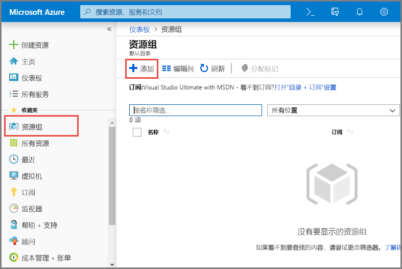

2. 对于“订阅”，请选择要在其中创建资源组的 Azure 订阅的名称。 
3. 键入**资源组的唯一名称**。 系统会立即检查该名称是否在当前选定的 Azure 订阅中可用。
4. 选择资源组所在的**区域**。
5. 选择“查看 + 创建”  。

   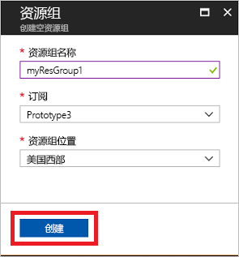
6. 在“查看 + 创建”页上，选择“创建”。   

## 创建事件中心命名空间

事件中心命名空间提供唯一的范围容器，可以通过其完全限定的域名进行引用，而在该容器中，可以创建一个或多个事件中心。 若要使用门户在资源组中创建命名空间，请执行以下操作：

1. 在 Azure 门户中，单击屏幕左上角的“创建资源”。 
2. 在左侧菜单中选择“所有服务”，然后在“分析”类别中的“事件中心”旁边选择**星号 (`*`)**。 确认“事件中心”已添加到左侧导航菜单中的“收藏夹”。   
    
   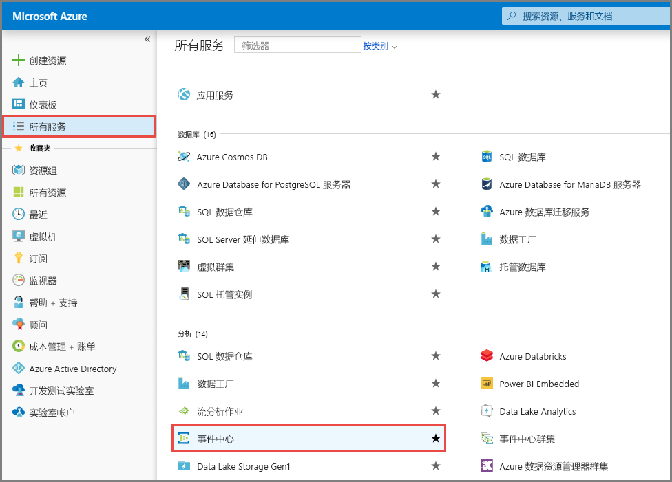
3. 选择左侧导航菜单中“收藏夹”下的“事件中心”，然后选择工具栏上的“添加”。   

   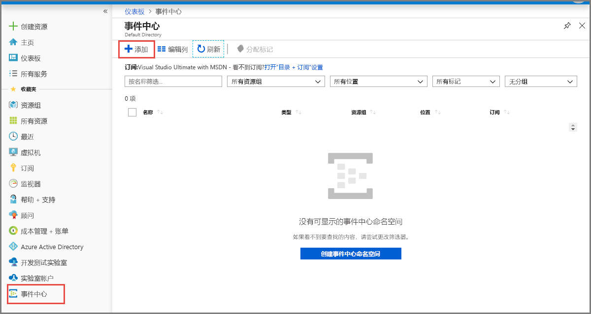
4. 在“创建命名空间”页上执行以下步骤  ：
    1. 选择要在其中创建命名空间的**订阅**。
    2. 选择在上一步创建的  资源组。 
    3. 输入命名空间的**名称**。 系统会立即检查该名称是否可用。
    4. 选择命名空间所在的**位置**。    
    5. 选择**定价层**（基本或标准）。  
    6. 按原样保留“吞吐量单位”  设置。 若要了解吞吐量单位，请参阅[事件中心的可伸缩性](event-hubs-scalability.md#throughput-units)  
    5. 在页面底部选择“查看 + 创建”  。

       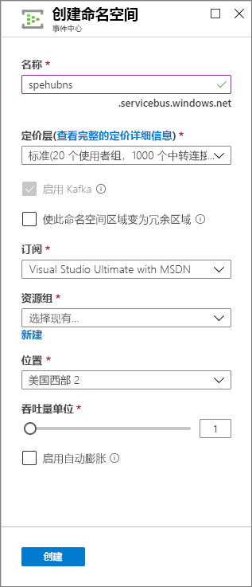
   6. 在“查看 + 创建”页上查看设置，然后选择“创建”。   等待部署完成。 

       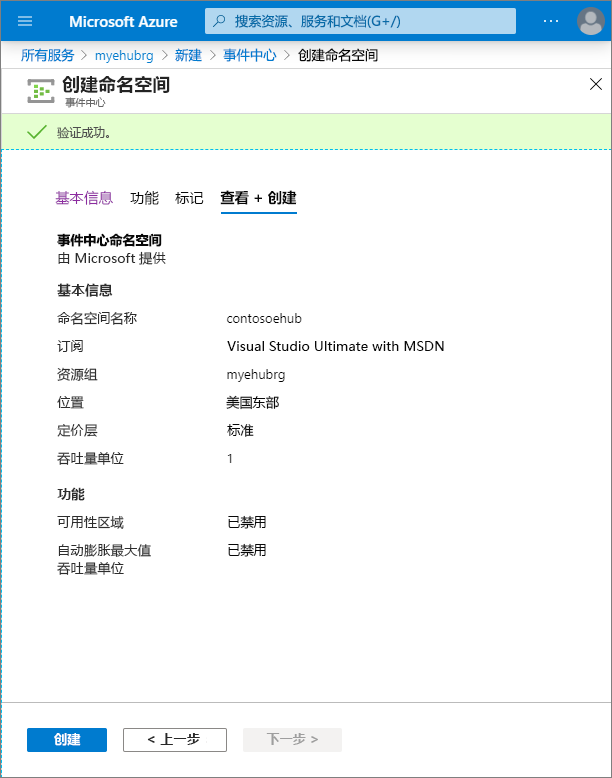
   7. 在“部署”  页上选择“转到资源”  ，以便导航到你的命名空间所对应的页面。 

      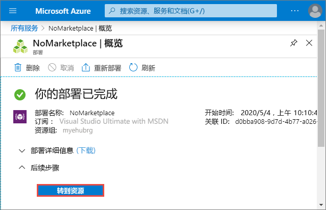
   8. 确认显示的“事件中心命名空间”  页与以下示例类似： 

       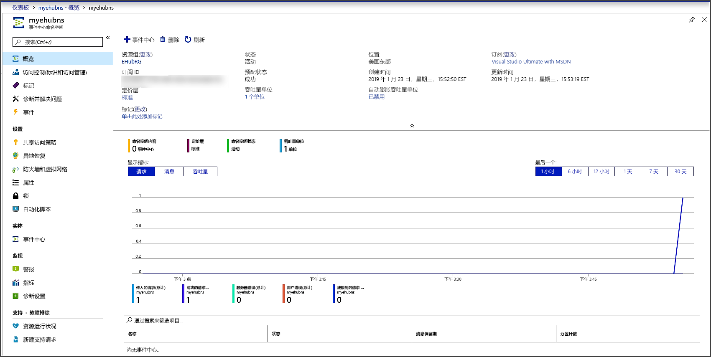       

       > [!NOTE]
       > Azure 事件中心提供了一个 Kafka 终结点。 此终结点允许事件中心命名空间以本机方式了解 [Apache Kafka](https://kafka.apache.org/intro) 消息协议和 API。 使用此功能，可以像与 Kafka 主题通信那样与事件中心通信，而无需更改协议客户端或运行自己的群集。 事件中心支持 [Apache Kafka 版本 1.0](https://kafka.apache.org/10/documentation.html) 及更高版本。 有关详细信息，请参阅[通过 Apache Kafka 应用程序使用事件中心](event-hubs-for-kafka-ecosystem-overview.md)。
    
## 创建事件中心

若要在该命名空间中创建事件中心，请执行以下操作：

1. 在“事件中心命名空间”页上，选择左侧菜单中的“事件中心”。 
1. 在窗口顶部，单击“+ 事件中心”  。
   
    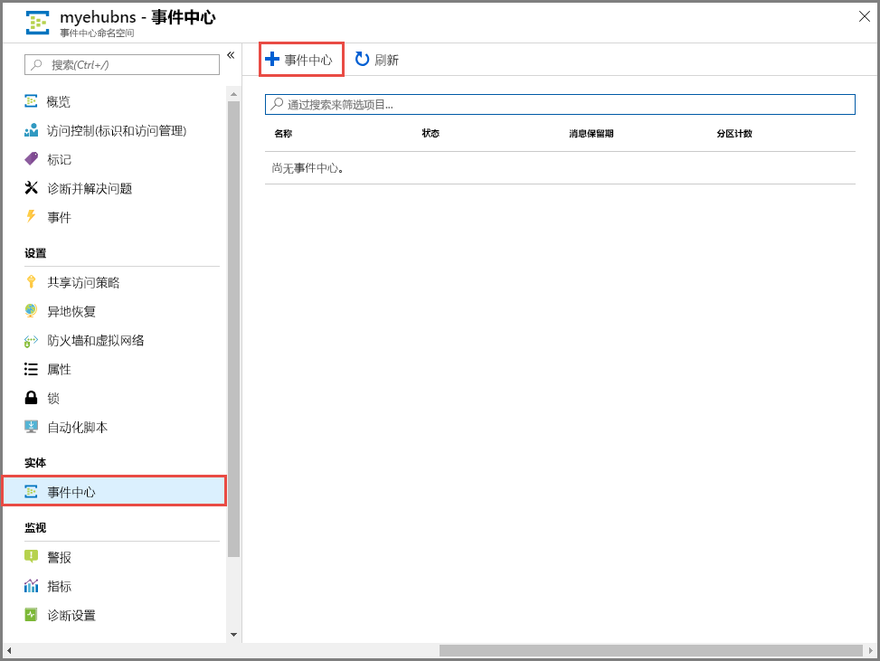
1. 为事件中心键入名称，并单击“创建”  。
   
    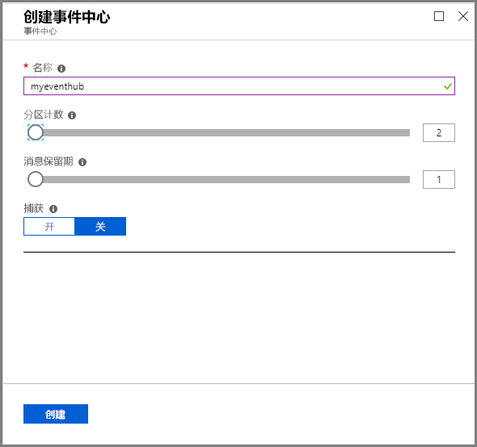
4. 可以在警报中检查事件中心的创建状态。 创建事件中心后，事件中心列表中会显示该事件中心，如下图所示：

    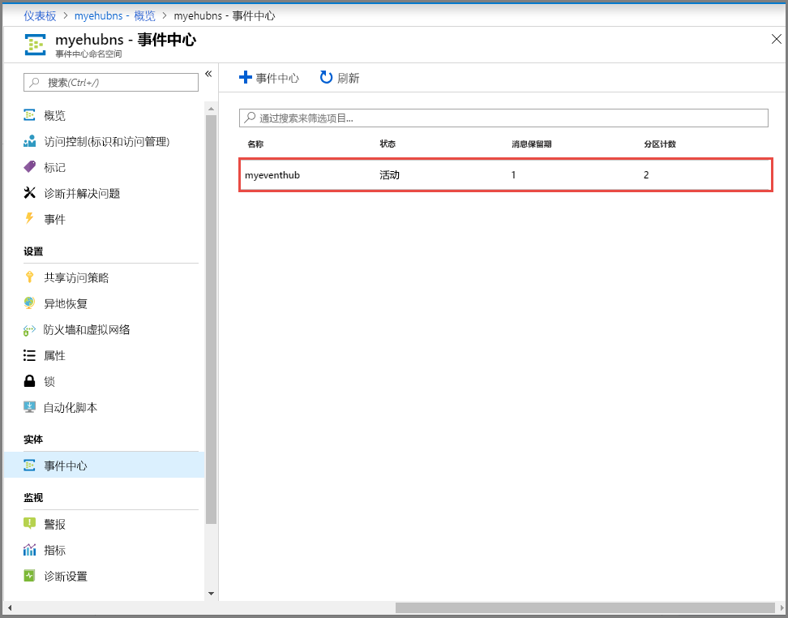

## 后续步骤

在本文中，你已创建一个资源组、一个事件中心命名空间和一个事件中心。 有关如何将事件发送到事件中心（或）从事件中心接收事件的分步说明，请参阅“发送和接收事件”教程  ： 

- [.NET Core](get-started-dotnet-standard-send-v2.md)
- [Java](get-started-java-send-v2.md)
- [Python](get-started-python-send-v2.md)
- [JavaScript](get-started-node-send-v2.md)
- [Go](event-hubs-go-get-started-send.md)
- [C（仅发送）](event-hubs-c-getstarted-send.md)
- [Apache Storm（仅接收）](event-hubs-storm-getstarted-receive.md)

[Azure portal]: https://portal.azure.com/
[3]: ./media/event-hubs-quickstart-portal/sender1.png
[4]: ./media/event-hubs-quickstart-portal/receiver1.png
