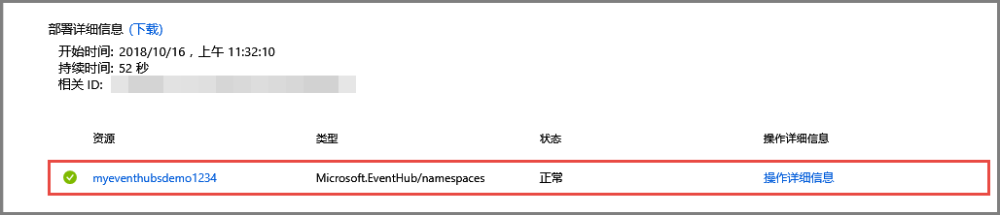

# 快速入门：使用 Azure 门户创建事件中心
Azure 事件中心是一个大数据流式处理平台和事件引入服务，每秒能够接收和处理数百万个事件。 事件中心可以处理和存储分布式软件和设备生成的事件、数据或遥测。 可以使用任何实时分析提供程序或批处理/存储适配器转换和存储发送到数据中心的数据。 有关事件中心的详细概述，请参阅[事件中心概述](event-hubs-about.md)和[事件中心功能](event-hubs-features.md)。

在本快速入门中，请使用 [Azure 门户](https://portal.azure.com)创建事件中心。

## 先决条件

若要完成本快速入门，请确保具备以下项：

- Azure 订阅。 如果没有订阅，请在开始之前[创建一个免费帐户](https://azure.microsoft.com/free/)。
- [Visual Studio 2017 Update 3（版本 15.3 (26730.01)）](https://www.visualstudio.com/vs)或更高版本。
- [.NET Standard SDK](https://www.microsoft.com/net/download/windows) 2.0 或更高版本。

## 创建资源组

资源组是 Azure 资源的逻辑集合。 所有资源在资源组中进行部署和管理。 执行以下操作创建资源组：

1. 登录到 [Azure 门户](https://portal.azure.com)。
2. 在左侧导航栏中，单击“资源组”。 然后单击“添加”。

   

2. 键入资源组的唯一名称。 系统会立即检查该名称是否在当前选定的 Azure 订阅中可用。

3. 在“订阅”中，单击要在其中创建资源组的 Azure 订阅的名称。

4. 选择资源组的地理位置。

5. 单击“创建”。

   

## 创建事件中心命名空间

事件中心命名空间提供唯一的范围容器，可以通过其完全限定的域名进行引用，而在该容器中，可以创建一个或多个事件中心。 若要使用门户在资源组中创建命名空间，请执行以下操作：

1. 在 Azure 门户中，单击屏幕左上角的“创建资源”。

2. 依次单击“物联网”、“事件中心”。

3. 在“创建命名空间”中输入命名空间名称。 系统会立即检查该名称是否可用。

   

4. 在确保命名空间名称可用后，选择定价层（基础版或标准版）。 另外，请选择一个 Azure 订阅、资源组以及要创建该资源的位置。
 
5. 单击“创建”以创建命名空间。 可能需要等待几分钟让系统完全预配资源。
6. 选择“警报”，然后选择“部署”，所用名称为事件中心命名空间的名称。 

   
6. 从部署过程中创建的资源的列表中选择事件中心命名空间。 

   
7. 在“事件中心命名空间”页中选择“共享访问策略”，然后单击“RootManageSharedAccessKey”。
    
8. 单击复制按钮，将 **RootManageSharedAccessKey** 连接字符串复制到剪贴板。 将此连接字符串保存在临时位置（如记事本），供稍后使用。
    
## 创建事件中心

若要在该命名空间中创建事件中心，请执行以下操作：

1. 在“事件中心命名空间”页上，选择单击“事件中心”。
   
    

1. 在窗口顶部，单击“+ 事件中心”。
   
    
1. 为事件中心键入名称，并单击“创建”。
   
    

祝贺你！ 现已使用门户创建了一个事件中心命名空间，并在该命名空间中创建了一个事件中心。 

## 后续步骤

在本文中，你已创建一个资源组、一个事件中心命名空间和一个事件中心。 有关如何将事件发送到事件中心（或）从事件中心接收事件的分步说明，请参阅以下教程：  

- **将事件发送到事件中心**：[.NET Core](event-hubs-dotnet-standard-getstarted-send.md)、[.NET Framework](event-hubs-dotnet-framework-getstarted-send.md)、[Java](event-hubs-java-get-started-send.md)、[Python](event-hubs-python-get-started-send.md)、[Node.js](event-hubs-node-get-started-send.md)、[Go](event-hubs-go-get-started-send.md)、[C](event-hubs-c-getstarted-send.md)
- **接收来自事件中心的事件**：[.NET Core](event-hubs-dotnet-standard-getstarted-receive-eph.md)、[.NET Framework](event-hubs-dotnet-framework-getstarted-receive-eph.md)、[Java](event-hubs-java-get-started-receive-eph.md)、[Python](event-hubs-python-get-started-receive.md)、[Node.js](event-hubs-node-get-started-receive.md)、[Go](event-hubs-go-get-started-receive-eph.md)、[Apache Storm](event-hubs-storm-getstarted-receive.md)

[Azure portal]: https://portal.azure.com/
[3]: ./media/event-hubs-quickstart-portal/sender1.png
[4]: ./media/event-hubs-quickstart-portal/receiver1.png
