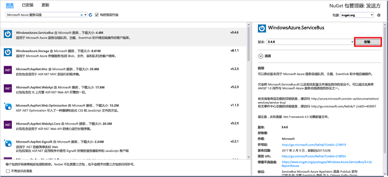
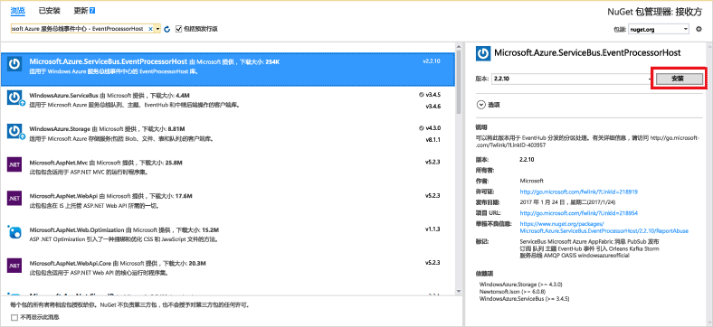

# <a name="send-events-to-or-receive-events-from-azure-event-hubs-using-net-framework"></a>事件发送到或从 Azure 事件中心使用.NET Framework 接收事件
Azure 事件中心是一个大数据流式处理平台和事件引入服务，每秒能够接收和处理数百万个事件。 事件中心可以处理和存储分布式软件和设备生成的事件、数据或遥测。 可以使用任何实时分析提供程序或批处理/存储适配器转换和存储发送到数据中心的数据。 有关事件中心的详细概述，请参阅[事件中心概述](event-hubs-about.md)和[事件中心功能](event-hubs-features.md)。

本教程演示如何创建.NET Framework 中的控制台应用程序C#事件发送到或从事件中心接收事件。 

## <a name="prerequisites"></a>必备组件
若要完成本教程，需要具备以下先决条件：

- [Microsoft Visual Studio 2017 或更高版本](https://visualstudio.com)。
- **创建事件中心命名空间和事件中心**。 第一步是使用 [Azure 门户](https://portal.azure.com)创建事件中心类型的命名空间，并获取应用程序与事件中心进行通信所需的管理凭据。 要创建命名空间和事件中心，请按照[此文](event-hubs-create.md)中的步骤操作。 然后，获取**事件中心命名空间的连接字符串**按照文章中的说明：[获取连接字符串](event-hubs-get-connection-string.md#get-connection-string-from-the-portal)。 本教程后面的步骤将使用此连接字符串。

## <a name="send-events"></a>发送事件 
本部分演示如何创建.NET Framework 控制台应用程序，以将事件发送到事件中心。 

### <a name="create-a-console-application"></a>创建控制台应用程序

在 Visual Studio 中，使用 **控制台应用程序** 项目模板创建一个新的 Visual C# 桌面应用项目。 将该项目命名为 **Sender**。
   


### <a name="add-the-event-hubs-nuget-package"></a>添加事件中心 NuGet 包

1. 在解决方案资源管理器中，右键单击“Sender”项目，并单击“为解决方案管理 NuGet 包”。 
2. 单击“浏览”选项卡，并搜索 `WindowsAzure.ServiceBus`。 单击“安装” 并接受使用条款。 
   
    
   
    Visual Studio 下载、安装 [Azure 服务总线库 NuGet 包](https://www.nuget.org/packages/WindowsAzure.ServiceBus)并添加对它的引用。

### <a name="write-code-to-send-messages-to-the-event-hub"></a>编写代码以将消息发送到事件中心

1. 在 Program.cs 文件顶部添加以下 `using` 语句：
   
    ```csharp
    using System.Threading;
    using Microsoft.ServiceBus.Messaging;
    ```
2. 将以下字段添加到 **Program** 类，并将占位符值分别替换成在上一节中创建的事件中心的名称和前面保存的命名空间级别连接字符串。 可以在 Azure 门户中从“事件中心”页面上的 **RootManageSharedAccessKey** 下的“连接字符串-主要”密钥下复制你的事件中心的连接字符串。 有关详细步骤，请参阅[获取连接字符串](event-hubs-get-connection-string.md#get-connection-string-from-the-portal)。
   
    ```csharp
    static string eventHubName = "Your Event Hub name";
    static string connectionString = "namespace connection string";
    ```
3. 将以下方法添加到 **Program** 类：
   
      ```csharp
      static void SendingRandomMessages()
      {
          var eventHubClient = EventHubClient.CreateFromConnectionString(connectionString, eventHubName);
          while (true)
          {
              try
              {
                  var message = Guid.NewGuid().ToString();
                  Console.WriteLine("{0} > Sending message: {1}", DateTime.Now, message);
                  eventHubClient.Send(new EventData(Encoding.UTF8.GetBytes(message)));
              }
              catch (Exception exception)
              {
                  Console.ForegroundColor = ConsoleColor.Red;
                  Console.WriteLine("{0} > Exception: {1}", DateTime.Now, exception.Message);
                  Console.ResetColor();
              }
       
              Thread.Sleep(200);
          }
      }
      ```
   
      此方法不断将事件发送到事件中心，延迟为 200 毫秒。
4. 最后，在 **Main** 方法中添加以下行：
   
      ```csharp
      Console.WriteLine("Press Ctrl-C to stop the sender process");
      Console.WriteLine("Press Enter to start now");
      Console.ReadLine();
      SendingRandomMessages();
      ```
5. 运行程序，并确保没有任何错误。
  
## <a name="receive-events"></a>接收事件
在本部分中，您编写的.NET Framework 控制台应用程序接收来自事件中心使用的消息[事件处理程序主机](event-hubs-event-processor-host.md)。 [事件处理程序主机](event-hubs-event-processor-host.md)是一个 .NET 类，它通过从事件中心管理持久检查点和并行接收来简化从那些事件中心接收事件的过程。 使用事件处理程序主机，可跨多个接收方拆分事件，即使在不同节点中托管时也是如此。 

[!INCLUDE [event-hubs-create-storage](../../includes/event-hubs-create-storage.md)]

### <a name="create-a-console-application"></a>创建控制台应用程序

在 Visual Studio 中，使用 **控制台应用程序** 项目模板创建一个新的 Visual C# 桌面应用项目。 将该项目命名为 **Receiver**。
   


### <a name="add-the-event-hubs-nuget-package"></a>添加事件中心 NuGet 包

1. 在解决方案资源管理器中，右键单击“Receiver”项目，并单击“为解决方案管理 NuGet 包”。
2. 单击“浏览”选项卡，并搜索 `Microsoft Azure Service Bus Event Hub - EventProcessorHost`。 单击“安装” 并接受使用条款。
   
    
   
    Visual Studio 下载、安装 [Azure 服务总线事件中心 - EventProcessorHost NuGet 包](https://www.nuget.org/packages/Microsoft.Azure.ServiceBus.EventProcessorHost)及其所有依赖项并添加对它们的引用。

### <a name="implement-the-ieventprocessor-interface"></a>实现 IEventProcessor 接口

1. 右键单击 **Receiver** 项目，单击“添加”，并单击“类”。 将新类命名为 **SimpleEventProcessor**，然后单击“添加”以创建该类。
   
    
2. 在 SimpleEventProcessor.cs 文件的顶部添加以下语句：
    
      ```csharp
      using Microsoft.ServiceBus.Messaging;
      using System.Diagnostics;
      ```
    
3. 用以下代码替换该类的正文：
    
      ```csharp
      class SimpleEventProcessor : IEventProcessor
      {
        Stopwatch checkpointStopWatch;
        
        async Task IEventProcessor.CloseAsync(PartitionContext context, CloseReason reason)
        {
            Console.WriteLine("Processor Shutting Down. Partition '{0}', Reason: '{1}'.", context.Lease.PartitionId, reason);
            if (reason == CloseReason.Shutdown)
            {
                await context.CheckpointAsync();
            }
        }
        
        Task IEventProcessor.OpenAsync(PartitionContext context)
        {
            Console.WriteLine("SimpleEventProcessor initialized.  Partition: '{0}', Offset: '{1}'", context.Lease.PartitionId, context.Lease.Offset);
            this.checkpointStopWatch = new Stopwatch();
            this.checkpointStopWatch.Start();
            return Task.FromResult<object>(null);
        }
        
        async Task IEventProcessor.ProcessEventsAsync(PartitionContext context, IEnumerable<EventData> messages)
        {
            foreach (EventData eventData in messages)
            {
                string data = Encoding.UTF8.GetString(eventData.GetBytes());
        
                Console.WriteLine(string.Format("Message received.  Partition: '{0}', Data: '{1}'",
                    context.Lease.PartitionId, data));
            }
        
            //Call checkpoint every 5 minutes, so that worker can resume processing from 5 minutes back if it restarts.
            if (this.checkpointStopWatch.Elapsed > TimeSpan.FromMinutes(5))
            {
                await context.CheckpointAsync();
                this.checkpointStopWatch.Restart();
            }
        }
      }
      ```
    
      此类由 EventProcessorHost 调用，用于处理从事件中心接收的事件。 `SimpleEventProcessor` 类使用秒表定期对 EventProcessorHost 上下文调用检查点方法。 此操作确保接收方重启时，其丢失的处理工作不会超过五分钟。

### <a name="update-the-main-method-to-use-simpleeventprocessor"></a>更新 Main 方法以使用 SimpleEventProcessor

1. 在 **Program** 类中，在文件顶部添加以下 `using` 语句：
    
      ```csharp
      using Microsoft.ServiceBus.Messaging;
      ```
    
2. 将 `Program` 类中的 `Main` 方法替换为以下代码，从而替换为以前保存的事件中心名称和命名空间级别连接字符串，以及在前面部分复制的存储帐户和密钥。 
    
      ```csharp
      static void Main(string[] args)
      {
        string eventHubConnectionString = "{Event Hubs namespace connection string}";
        string eventHubName = "{Event Hub name}";
        string storageAccountName = "{storage account name}";
        string storageAccountKey = "{storage account key}";
        string storageConnectionString = string.Format("DefaultEndpointsProtocol=https;AccountName={0};AccountKey={1}", storageAccountName, storageAccountKey);
        
        string eventProcessorHostName = Guid.NewGuid().ToString();
        EventProcessorHost eventProcessorHost = new EventProcessorHost(eventProcessorHostName, eventHubName, EventHubConsumerGroup.DefaultGroupName, eventHubConnectionString, storageConnectionString);
        Console.WriteLine("Registering EventProcessor...");
        var options = new EventProcessorOptions();
        options.ExceptionReceived += (sender, e) => { Console.WriteLine(e.Exception); };
        eventProcessorHost.RegisterEventProcessorAsync<SimpleEventProcessor>(options).Wait();
        
        Console.WriteLine("Receiving. Press enter key to stop worker.");
        Console.ReadLine();
        eventProcessorHost.UnregisterEventProcessorAsync().Wait();
      }
      ```
    
3. 运行程序，并确保没有任何错误。
  
## <a name="next-steps"></a>后续步骤
请阅读以下文章： 

- [EventProcessorHost](event-hubs-event-processor-host.md)
- [功能和 Azure 事件中心内的术语](event-hubs-features.md)。
- [事件中心常见问题解答](event-hubs-faq.md)


<!-- Links -->
[EventProcessorHost]: /dotnet/api/microsoft.servicebus.messaging.eventprocessorhost
[Event Hubs overview]: event-hubs-about.md
[Event Hubs Programming Guide]: event-hubs-programming-guide.md
[Azure Storage account]:../storage/common/storage-create-storage-account.md
[Event Processor Host]: event-hubs-event-processor-host.md
[Azure portal]: https://portal.azure.com
