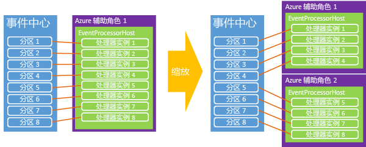

# <a name="event-hubs-programming-guide"></a>事件中心编程指南

本文介绍使用 Azure 事件中心编写代码时的一些常见情况。 它假设你对事件中心已有初步的了解。 有关事件中心的概念概述，请参阅 [事件中心概述](event-hubs-what-is-event-hubs.md)。

## <a name="event-publishers"></a>事件发布者

使用 HTTP POST 或通过 AMQP 1.0 连接将事件发送到事件中心。 何时使用哪种方式的选择取决于要解决的特定方案。 AMQP 1.0 连接计量为服务总线中的中转连接计量，对于经常要以较高的消息量和较低的延迟传送消息的方案，适合选择此方式，因为它们提供持久的消息传递通道。

使用 .NET 托管 API 时，用于将数据发布到事件中心的主要构造是 [EventHubClient][] 和 [EventData][] 类。 [EventHubClient][] 提供 AMQP 信道，事件将通过该信道发送到事件中心。 [EventData][] 类表示一个事件，用于将消息发布到事件中心。 此类包括正文、一些元数据和有关事件的标头信息。 其他属性会在通过事件中心传递时添加到 [EventData][] 对象。

## <a name="get-started"></a>入门

支持事件中心的 .NET 类在 [Microsoft.Azure.EventHubs](https://www.nuget.org/packages/Microsoft.Azure.EventHubs/) NuGet 包中提供。 可以通过 Visual Studio 解决方案资源管理器进行安装，也可以使用 Visual Studio 中的[包管理器控制台](http://docs.nuget.org/docs/start-here/using-the-package-manager-console)来进行。 为此，请在 [“Package Manager Console”](http://docs.nuget.org/docs/start-here/using-the-package-manager-console) 窗口中发出以下命令：

```shell
Install-Package Microsoft.Azure.EventHubs
```

## <a name="create-an-event-hub"></a>创建事件中心

可以使用 Azure 门户、Azure PowerShell 或 Azure CLI 来创建事件中心。 有关详细信息，请参阅[使用 Azure 门户创建事件中心命名空间和事件中心](event-hubs-create.md)。

## <a name="create-an-event-hubs-client"></a>创建事件中心客户端

用来与事件中心交互的主类是 [Microsoft.Azure.EventHubs.EventHubClient][EventHubClient]。 可以使用 [CreateFromConnectionString](/dotnet/api/microsoft.azure.eventhubs.eventhubclient.createfromconnectionstring) 方法实例化此类，如以下示例所示：

```csharp
private const string EventHubConnectionString = "Event Hubs namespace connection string";
private const string EventHubName = "event hub name";

var connectionStringBuilder = new EventHubsConnectionStringBuilder(EventHubConnectionString)
{
    EntityPath = EventHubName

};
eventHubClient = EventHubClient.CreateFromConnectionString(connectionStringBuilder.ToString());
```

## <a name="send-events-to-an-event-hub"></a>将事件发送到事件中心

可通过以下方式将事件发送到事件中心：创建一个 [EventHubClient][] 实例并通过 [SendAsync](/dotnet/api/microsoft.azure.eventhubs.eventhubclient.sendasync) 方法异步发送该实例。 此方法采用单个 [EventData][] 实例参数，并将其同步发送到事件中心。

## <a name="event-serialization"></a>事件序列化

[EventData][] 类具有[两个重载构造函数](/dotnet/api/microsoft.azure.eventhubs.eventdata.-ctor)，这些构造函数采用各种参数、字节或字节数组来表示事件数据有效负载。 将 JSON 与 [EventData][]类结合使用时，可以使用 **Encoding.UTF8.GetBytes()** 来检索 JSON 编码字符串的字节数组。 例如：

```csharp
for (var i = 0; i < numMessagesToSend; i++)
{
    var message = $"Message {i}";
    Console.WriteLine($"Sending message: {message}");
    await eventHubClient.SendAsync(new EventData(Encoding.UTF8.GetBytes(message)));
}
```

## <a name="partition-key"></a>分区键

发送事件数据时，可以指定一个在经哈希处理后生成分区分配的值。 请使用 [PartitionSender.PartitionID](/dotnet/api/microsoft.azure.eventhubs.partitionsender.partitionid) 属性指定分区。 但是，决定使用分区意味着在可用性和一致性之间进行选择。 

### <a name="availability-considerations"></a>可用性注意事项

可以选择使用分区键，应仔细考虑是否使用分区键。 在许多情况下，如果事件排序较为重要，使用分区键将是一个不错的选择。 使用分区键时，这些分区需要单个节点上的可用性，并且可能会随时间推移发生故障；例如，在计算节点重启和修补时。 因此，如果设置了分区 ID，并且由于某种原因该分区变得不可用，则对该分区中的数据的访问尝试会失败。 如果高可用性是最重要的，请不要指定分区键；在这种情况下，将使用前述的轮循机制模型将事件发送到分区。 在这种情况下，需在可用性（无分区 ID）和一致性（将事件固定到分区 ID）之间做出明确选择。

另一个注意事项是处理事件处理中的延迟。 在某些情况下，丢弃数据并重试可能比尝试跟上处理要更好，后者可能会进而导致下游处理延迟。 例如，在拥有股票行情自动收报机的情况下，最好等待接收到完整的最新数据，但在实时聊天或 VOIP 的情况下，则更希望能快速获得数据，即使数据不完整。

考虑到这些可用性需求，在这些情况下，可以选择以下错误处理策略之一：

- 停止（在修复之前停止从事件中心读取）
- 删除（消息不重要，将其删除）
- 重试（根据需要重试消息）

有关详细信息以及可用性与一致性之间权衡的讨论，请参阅[事件中心中的可用性和一致性](event-hubs-availability-and-consistency.md)。 

## <a name="batch-event-send-operations"></a>批处理事件发送操作

分批发送事件可有助于提高吞吐量。 可以使用 [CreateBatch](/dotnet/api/microsoft.azure.eventhubs.eventhubclient.createbatch) API 来创建一个批，以便稍后向其添加数据对象进行 [SendAsync](/dotnet/api/microsoft.azure.eventhubs.eventhubclient.sendasync) 调用。

单个批不能超过事件的 256 KB 限制。 此外，批中的每个消息都要使用相同的发布者标识。 发送者负责确保批不超过最大事件大小。 如果超过该限制，会生成客户端 **Send** 错误。 可以使用帮助器方法 [EventHubClient.CreateBatch](/dotnet/api/microsoft.azure.eventhubs.eventhubclient.createbatch) 来确保批不超过 256 KB。 从 [CreateBatch](/dotnet/api/microsoft.azure.eventhubs.eventhubclient.createbatch) API 获取空的 [EventDataBatch](/dotnet/api/microsoft.azure.eventhubs.eventdatabatch)，然后使用 [TryAdd](/dotnet/api/microsoft.azure.eventhubs.eventdatabatch.tryadd) 添加事件来构造批。 

## <a name="send-asynchronously-and-send-at-scale"></a>异步发送和按比例发送

请通过异步方式将事件发送到事件中心。 以异步方式发送可以增大客户端发送事件的速率。 [SendAsync](/dotnet/api/microsoft.azure.eventhubs.eventhubclient.sendasync) 返回一个 [Task](https://msdn.microsoft.com/library/system.threading.tasks.task.aspx) 对象。 可以在客户端上使用 [RetryPolicy](/dotnet/api/microsoft.servicebus.retrypolicy) 类来控制客户端重试选项。

## <a name="event-consumers"></a>事件使用者

[EventProcessorHost][] 类处理来自事件中心的数据。 在 .NET 平台上构建事件读取者时，应该使用此实现。 [EventProcessorHost][] 为事件处理器实现提供线程安全、多进程安全的运行时环境，该环境还能提供检查点和分区租用管理。

若要使用 [EventProcessorHost][] 类，可以实现 [IEventProcessor](/dotnet/api/microsoft.azure.eventhubs.processor.ieventprocessor)。 此接口包含四个方法：

* [OpenAsync](/dotnet/api/microsoft.azure.eventhubs.processor.ieventprocessor.openasync)
* [CloseAsync](/dotnet/api/microsoft.azure.eventhubs.processor.ieventprocessor.closeasync)
* [ProcessEventsAsync](/dotnet/api/microsoft.azure.eventhubs.processor.ieventprocessor.processeventsasync)
* [ProcessErrorAsync](/dotnet/api/microsoft.azure.eventhubs.processor.ieventprocessor.processerrorasync)

若要开始处理事件，请实例化 [EventProcessorHost][]，为事件中心提供适当的参数。 例如：

```csharp
var eventProcessorHost = new EventProcessorHost(
        EventHubName,
        PartitionReceiver.DefaultConsumerGroupName,
        EventHubConnectionString,
        StorageConnectionString,
        StorageContainerName);
```

然后，调用 [RegisterEventProcessorAsync](/dotnet/api/microsoft.azure.eventhubs.processor.eventprocessorhost.registereventprocessorasync)，将 [IEventProcessor](/dotnet/api/microsoft.azure.eventhubs.processor.ieventprocessor) 实现注册到运行时：

```csharp
await eventProcessorHost.RegisterEventProcessorAsync<SimpleEventProcessor>();
```

此时，主机将尝试使用“贪婪”算法获取事件中心内每个分区上的租约。 这些租用只在指定的时间段内有效，之后必须续订。 当新节点（本例中的工作线程实例）进入联机状态时，它们将保留租约，以后每次尝试获取更多租约时，负载会在节点之间转移。



经过一段时间后，就会建立平衡。 通过这种动态功能，可以向使用者应用基于 CPU 的自动缩放，以实现向上扩展和向下缩减。 由于事件中心没有直接的消息计数概念，平均 CPU 利用率通常是度量后端或使用者规模的最佳机制。 如果发布者开始发布的事件数超过了使用者可以处理的数量，可以使用使用者的 CPU 增大功能来实现工作线程实例数的自动缩放。

[EventProcessorHost][] 类还实现了基于 Azure 存储的检查点机制。 此机制按分区存储偏移量，使每个使用者都能确定前一个使用者的最后一个检查点是什么。 当分区通过租约在节点之间转移时，正是这个同步机制在促进负载转移。

## <a name="publisher-revocation"></a>发布者吊销

除了 [EventProcessorHost][] 的高级运行时功能外，事件中心还支持吊销发布者，以阻止特定发布者向事件中心发送事件。 当发布者令牌已泄露，或者软件更新导致发布者行为不当时，这些功能很有用。 在这些情况下，可以阻止发布者的标识（其 SAS 令牌的一部分）发布事件。

有关发布者吊销以及如何以发布者身份向事件中心发送事件的详细信息，请参阅 [Event Hubs Large Scale Secure Publishing](https://code.msdn.microsoft.com/Service-Bus-Event-Hub-99ce67ab)（事件中心大规模安全发布）示例。

## <a name="next-steps"></a>后续步骤

若要了解有关事件中心方案的详细信息，请访问以下链接：

* [事件中心 API 概述](event-hubs-api-overview.md)
* [什么是事件中心](event-hubs-what-is-event-hubs.md)
* [事件中心中的可用性和一致性](event-hubs-availability-and-consistency.md)
* [事件处理程序主机 API 参考](/dotnet/api/microsoft.servicebus.messaging.eventprocessorhost)

[NamespaceManager]: /dotnet/api/microsoft.servicebus.namespacemanager
[EventHubClient]: /dotnet/api/microsoft.azure.eventhubs.eventhubclient
[EventData]: /dotnet/api/microsoft.azure.eventhubs.eventdata
[CreateEventHubIfNotExists]: /dotnet/api/microsoft.servicebus.namespacemanager.createeventhubifnotexists
[PartitionKey]: /dotnet/api/microsoft.servicebus.messaging.eventdata#Microsoft_ServiceBus_Messaging_EventData_PartitionKey
[EventProcessorHost]: /dotnet/api/microsoft.azure.eventhubs.processor
