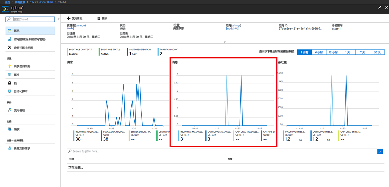

# <a name="quickstart-process-event-streams-using-azure-cli-and-java"></a>快速入门：使用 Azure CLI 和 Java 处理事件流

Azure 事件中心是高度可缩放的数据流平台和引入服务，每秒能够接收和处理数百万个事件。 本快速入门介绍如何使用 Azure CLI 创建事件中心资源，然后使用 Java 代码发送事件流，以及事件中心接收事件流。

若要完成本快速入门，需要一个 Azure 订阅。 如果没有订阅，请在开始之前[创建一个免费帐户][]。

## <a name="prerequisites"></a>先决条件

[!INCLUDE [cloud-shell-try-it.md](../../includes/cloud-shell-try-it.md)]

如果选择在本地安装并使用 Azure CLI，本教程要求运行 Azure CLI 2.0.4 或更高版本。 请运行 `az --version` 检查版本。 如果需要进行安装或升级，请参阅[安装 Azure CLI 2.0]( /cli/azure/install-azure-cli)。

## <a name="log-on-to-azure"></a>登录到 Azure

如果在 Cloud Shell 中运行命令，则不需要执行以下步骤。 如果本地运行 CLI，请执行以下步骤登录到 Azure 并设置当前订阅：

运行以下命令登录到 Azure：

```azurecli-interactive
az login
```

设置当前订阅上下文。 将 `MyAzureSub` 替换为要使用的 Azure 订阅的名称：

```azurecli-interactive
az account set --subscription MyAzureSub
``` 

## <a name="provision-resources"></a>预配资源

发出以下命令来预配事件中心资源。 请务必将占位符 `myResourceGroup`、`namespaceName`、`eventHubName` 和 `storageAccountName` 替换为适当的值：

```azurecli-interactive
# Create a resource group
az group create --name myResourceGroup --location eastus

# Create an Event Hubs namespace
az eventhubs namespace create --name namespaceName --resource-group myResourceGroup -l eastus2

# Create an event hub
az eventhubs eventhub create --name eventHubName --resource-group myResourceGroup --namespace-name namespaceName

# Create a general purpose standard storage account
az storage account create --name storageAccountName --resource-group myResourceGroup --location eastus2 --sku Standard_RAGRS --encryption blob

# List the storage account access keys
az storage account keys list --resource-group myResourceGroup --account-name storageAccountName

# Get namespace connection string
az eventhubs namespace authorization-rule keys list --resource-group myResourceGroup --namespace-name namespaceName --name RootManageSharedAccessKey
```

复制连接字符串并将其粘贴到某个临时位置（例如记事本），供稍后使用。

## <a name="stream-into-event-hubs"></a>流式传输到事件中心

下一步是下载示例代码，用于将事件流式传输到事件中心，以及使用事件处理程序主机接收这些事件。 首先发送消息：

发出以下命令，克隆[事件中心 GitHub 存储库](https://github.com/Azure/azure-event-hubs)：

```bash
git clone https://github.com/Azure/azure-event-hubs.git
```

导航到 **SimpleSend** 文件夹：`\azure-event-hubs\samples\Java\Basic\SimpleSend\src\main\java\com\microsoft\azure\eventhubs\samples\SimpleSend`。 打开 SimpleSend.java 文件，将 `"Your Event Hubs namaspace name"` 字符串替换为在本文的“创建事件中心命名空间”部分获取的事件中心命名空间。

将 `"Your event hub"` 替换为在该命名空间中创建的事件中心的名称，将 `"Your policy name"` 替换为该命名空间的共享访问策略的名称。 除非创建了新策略，否则默认值为 **RootManageSharedAccessKey**。 

最后，将 `"Your primary SAS key"` 替换为上一步骤中所述的策略的 SAS 密钥值。

### <a name="build-the-application"></a>构建应用程序 

导航回到 `\azure-event-hubs\samples\Java\Basic\SimpleSend` 文件夹，并发出以下生成命令：

```shell
mvn clean package -DskipTests
```

### <a name="receive"></a>接收

现在，下载事件处理程序主机示例，用于接收刚刚发送的消息。 导航到 **EventProcessorSample** 文件夹：`\azure-event-hubs\samples\Java\Basic\EventProcessorSample\src\main\java\com\microsoft\azure\eventhubs\samples\eventprocessorsample`。

在 EventProcessorSample.java 文件中，将 `----EventHubsNamespaceName-----` 值替换为在本文的“创建事件中心命名空间”部分获取的事件中心命名空间。 

替换此文件中的其他字符串值：将 `----EventHubName-----` 替换为在该命名空间中创建的事件中心的名称，将 `-----SharedAccessSignatureKeyName-----` 替换为该命名空间的共享访问策略的名称。 除非创建了新策略，否则默认值为 **RootManageSharedAccessKey**。

将 `---SharedAccessSignatureKey----` 替换为上一步骤中所述的策略的 SAS 密钥值，将 `----AzureStorageConnectionString----` 替换为创建的存储帐户的连接字符串，将 `----StorageContainerName----` 替换为创建的存储帐户下的容器名称。 

最后，将 `----HostNamePrefix----` 替换为存储帐户的名称。

### <a name="build-the-receiver"></a>生成接收器 

若要生成接收方应用程序，请导航到 `\azure-event-hubs\samples\Java\Basic\EventProcessorSample` 文件夹，并发出以下命令：

```shell
mvn clean package -DskipTests
```

### <a name="run-the-apps"></a>运行应用

如果生成成功完成，则可以发送和接收事件。 首先，运行 **SimpleSend** 应用程序并观察正在发送的事件。 若要运行该程序，请导航到 `\azure-event-hubs\samples\Java\Basic\SimpleSend` 文件夹并发出以下命令：

```shell
java -jar ./target/simplesend-1.0.0-jar-with-dependencies.jar
```

接下来，运行 **EventProcessorSample** 应用并观察正在接收的事件。 若要运行该程序，请导航到 `\azure-event-hubs\samples\Java\Basic\EventProcessorSample` 文件夹并发出以下命令：
   
```shell
java -jar ./target/eventprocessorsample-1.0.0-jar-with-dependencies.jar
```

在运行这两个程序之后，可以检查事件中心的 Azure 门户概述页，以查看传入和传出的消息计数：



## <a name="clean-up-resources"></a>清理资源

运行以下命令删除资源组、命名空间、存储帐户和所有相关的资源。 将 `myResourceGroup` 替换为创建的资源组的名称：

```azurecli
az group delete --resource-group myResourceGroup
```

## <a name="understand-the-sample-code"></a>了解示例代码

此部分包含有关示例代码功能的更多详细信息。

### <a name="send"></a>发送

在 SimpleSend.java 文件中，大部分工作是在 main() 方法中完成的。 首先，代码使用 `ConnectionStringBuilder` 实例，通过命名空间名称、事件中心名称、SAS 密钥名称和 SAS 密钥本身的用户定义值来构造连接字符串：

```java
final ConnectionStringBuilder connStr = new ConnectionStringBuilder()
        .setNamespaceName("Your Event Hubs namespace name")
        .setEventHubName("Your event hub")
        .setSasKeyName("Your policy name")
        .setSasKey("Your primary SAS key");
```

然后，将包含事件有效负载的 Java 对象转换为 Json：

```java
final Gson gson = new GsonBuilder().create();

final PayloadEvent payload = new PayloadEvent(1);
byte[] payloadBytes = gson.toJson(payload).getBytes(Charset.defaultCharset());
EventData sendEvent = EventData.create(payloadBytes);  
```

事件中心客户端在此代码行中创建：

```java
final EventHubClient ehClient = EventHubClient.createSync(connStr.toString(), executorService);
```

try/finally 块将一个事件轮循机制发送到未指定的分区：

```java
try {
    for (int i = 0; i < 100; i++) {

        String payload = "Message " + Integer.toString(i);
        //PayloadEvent payload = new PayloadEvent(i);
        byte[] payloadBytes = gson.toJson(payload).getBytes(Charset.defaultCharset());
        EventData sendEvent = EventData.create(payloadBytes);

        // Send - not tied to any partition
        // Event Hubs service will round-robin the events across all EventHubs partitions.
        // This is the recommended & most reliable way to send to EventHubs.
        ehClient.sendSync(sendEvent);
    }

    System.out.println(Instant.now() + ": Send Complete...");
    System.in.read();
} finally {
    ehClient.closeSync();
    executorService.shutdown();
}
```

### <a name="receive"></a>接收 

接收操作在 EventProcessorSample.java 文件中发生。 首先，它声明用于保存事件中心命名空间名称和其他凭据的常量：

```java
String consumerGroupName = "$Default";
String namespaceName = "----NamespaceName----";
String eventHubName = "----EventHubName----";
String sasKeyName = "----SharedAccessSignatureKeyName----";
String sasKey = "----SharedAccessSignatureKey----";
String storageConnectionString = "----AzureStorageConnectionString----";
String storageContainerName = "----StorageContainerName----";
String hostNamePrefix = "----HostNamePrefix----";
```

类似于 SimpleSend 程序，该代码随后创建用于构造连接字符串的 ConnectionStringBuilder 实例：

```java
ConnectionStringBuilder eventHubConnectionString = new ConnectionStringBuilder()
    .setNamespaceName(namespaceName)
    .setEventHubName(eventHubName)
    .setSasKeyName(sasKeyName)
    .setSasKey(sasKey);
```

事件处理程序主机是一个类，它通过从事件中心管理持久检查点和并行接收操作，来简化从这些事件中心接收事件的过程。 现在，代码将创建 `EventProcessorHost` 的实例：

```java
EventProcessorHost host = new EventProcessorHost(
    EventProcessorHost.createHostName(hostNamePrefix),
    eventHubName,
    consumerGroupName,
    eventHubConnectionString.toString(),
    storageConnectionString,
    storageContainerName);
```

声明一些错误处理代码之后，应用将会定义 `EventProcessor` 类，即 `IEventProcessor` 接口的实现。 此类处理收到的事件：

```java
public static class EventProcessor implements IEventProcessor
{
    private int checkpointBatchingCount = 0;
    ...
```

在事件中心的此分区上收到事件后，会调用 `onEvents()` 方法：

```java
@Override
public void onEvents(PartitionContext context, Iterable<EventData> events) throws Exception
{
    System.out.println("SAMPLE: Partition " + context.getPartitionId() + " got event batch");
    int eventCount = 0;
    for (EventData data : events)
    {
        try
        {
         System.out.println("SAMPLE (" + context.getPartitionId() + "," + data.getSystemProperties().getOffset() + "," +
                data.getSystemProperties().getSequenceNumber() + "): " + new String(data.getBytes(), "UTF8"));
             eventCount++;
                
         // Checkpointing persists the current position in the event stream for this partition and means that the next
         // time any host opens an event processor on this event hub+consumer group+partition combination, it will start
         // receiving at the event after this one. Checkpointing is usually not a fast operation, so there is a tradeoff
         // between checkpointing frequently (to minimize the number of events that will be reprocessed after a crash, or
         // if the partition lease is stolen) and checkpointing infrequently (to reduce the impact on event processing
         // performance). Checkpointing every five events is an arbitrary choice for this sample.
         this.checkpointBatchingCount++;
         if ((checkpointBatchingCount % 5) == 0)
         {
            System.out.println("SAMPLE: Partition " + context.getPartitionId() + " checkpointing at " +
                    data.getSystemProperties().getOffset() + "," + data.getSystemProperties().getSequenceNumber());
            // Checkpoints are created asynchronously. It is important to wait for the result of checkpointing
            // before exiting onEvents or before creating the next checkpoint, to detect errors and to ensure proper ordering.
            context.checkpoint(data).get();
         }
    }
        catch (Exception e)
        {
            System.out.println("Processing failed for an event: " + e.toString());
        }
    }
    System.out.println("SAMPLE: Partition " + context.getPartitionId() + " batch size was " + eventCount + " for host " + context.getOwner());
}
```

## <a name="next-steps"></a>后续步骤

在本文中，我们已创建用于从事件中心发送和接收事件的事件中心命名空间和其他资源。 有关详细信息，请继续阅读以下教程：

> [!div class="nextstepaction"]
> [将事件中心数据流中的数据异常可视化](event-hubs-tutorial-visualize-anomalies.md)

[创建一个免费帐户]: https://azure.microsoft.com/free/?ref=microsoft.com&utm_source=microsoft.com&utm_medium=docs&utm_campaign=visualstudio
[Install Azure CLI 2.0]: /cli/azure/install-azure-cli
[az group create]: /cli/azure/group#az-group-create
[fully qualified domain name]: https://wikipedia.org/wiki/Fully_qualified_domain_name
