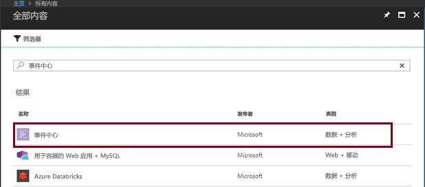
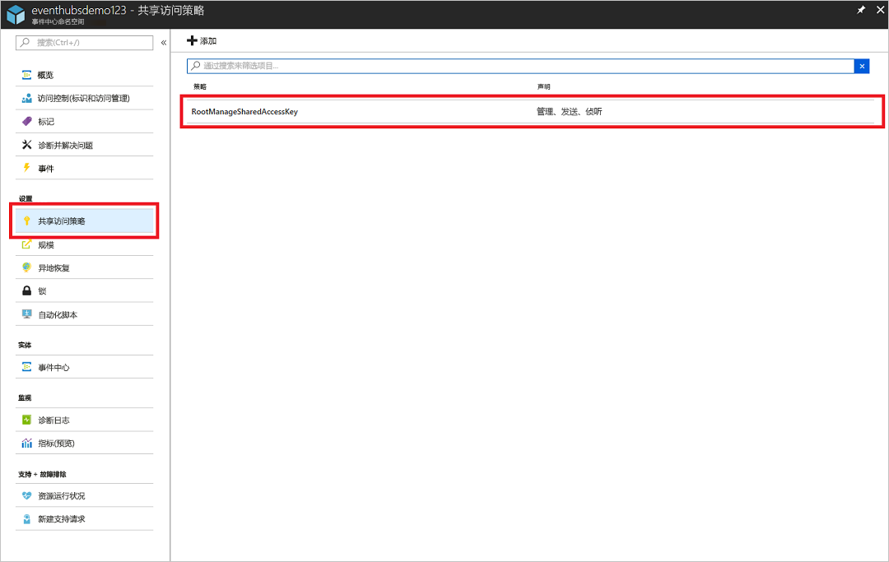
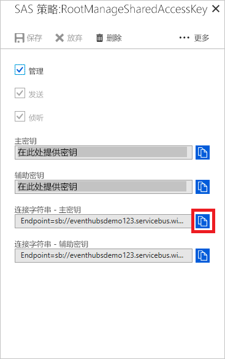

# <a name="stream-into-event-hubs-for-the-apache-kafka"></a>流式传输到用于 Apache Kafka 的事件中心
本快速入门演示如何在不更改协议客户端或运行自己的群集的情况下，流式传输到已启用 Kafka 的事件中心。 你将了解如何只需更改应用程序配置，即可使用生产者和使用者与已启用 Kafka 的事件中心通信。 Azure 事件中心支持 [Apache Kafka 版本 1.0](https://kafka.apache.org/10/documentation.html)。

> [!NOTE]
> [GitHub](https://github.com/Azure/azure-event-hubs) 上提供了此示例

## <a name="prerequisites"></a>先决条件

若要完成本快速入门，请确保符合以下先决条件：

* Azure 订阅。 如果还没有该订阅，可以在开始前创建一个[免费帐户](https://azure.microsoft.com/free/?ref=microsoft.com&utm_source=microsoft.com&utm_medium=docs&utm_campaign=visualstudio)。
* [Java 开发工具包 (JDK) 1.7+](http://www.oracle.com/technetwork/java/javase/downloads/index.html)。
* [下载](http://maven.apache.org/download.cgi)并[安装](http://maven.apache.org/install.html) Maven 二进制存档。
* [Git](https://www.git-scm.com/)
* [已启用 Kafka 的事件中心命名空间](event-hubs-create.md)

## <a name="create-a-kafka-enabled-event-hubs-namespace"></a>创建启用了 Kafka 的事件中心命名空间

1. 登录到 [Azure 门户][Azure 门户]，单击屏幕左上角的“创建资源”。

2. 搜索事件中心并选择此处显示的选项：
    
    
 
3. 提供唯一名称并在命名空间上启用 Kafka。 单击“创建”。
    
    
 
4. 创建命名空间后，在“设置”选项卡上，单击“共享访问策略”来获取连接字符串。

    

5. 你可以选择默认的 RootManageSharedAccessKey，或添加新策略。 单击策略名称，复制连接字符串。 
    
    
 
6. 将此连接字符串添加到 Kafka 应用程序配置中。

现在，可以从使用 Kafka 协议的应用程序，将事件流式传输到事件中心。

## <a name="send-and-receive-messages-with-kafka-in-event-hubs"></a>在事件中心内使用 Kafka 发送和接收消息

1. 克隆 [Azure 事件中心存储库](https://github.com/Azure/azure-event-hubs)。

2. 导航到 `azure-event-hubs/samples/kafka/quickstart/producer`。

3. 在 `src/main/resources/producer.config` 中更新生产者的配置详细信息，如下所示：

    ```xml
    bootstrap.servers={YOUR.EVENTHUBS.FQDN}:9093
    security.protocol=SASL_SSL
    sasl.mechanism=PLAIN
    sasl.jaas.config=org.apache.kafka.common.security.plain.PlainLoginModule required username="$ConnectionString" password="{YOUR.EVENTHUBS.CONNECTION.STRING}";
    ```
4. 运行生产者代码并将其流式传输到已启用 Kafka 的事件中心：
   
    ```shell
    mvn clean package
    mvn exec:java -Dexec.mainClass="TestProducer"                                    
    ```
5. 导航到 `azure-event-hubs/samples/kafka/quickstart/consumer`。

6. 在 `src/main/resources/consumer.config` 中更新使用者的配置详细信息，如下所示：
   
    ```xml
    bootstrap.servers={YOUR.EVENTHUBS.FQDN}:9093
    security.protocol=SASL_SSL
    sasl.mechanism=PLAIN
    sasl.jaas.config=org.apache.kafka.common.security.plain.PlainLoginModule required username="$ConnectionString" password="{YOUR.EVENTHUBS.CONNECTION.STRING}";
    ```

7. 使用 Kafka 客户端运行使用者代码，并通过已启用 Kafka 的事件中心进行处理：

    ```java
    mvn clean package
    mvn exec:java -Dexec.mainClass="TestConsumer"                                    
    ```

如果事件中心 Kafka 群集有事件，则现在开始从使用者接收这些事件。

## <a name="next-steps"></a>后续步骤
本文介绍了如何在不更改协议客户端或运行自己的群集的情况下，流式传输到已启用 Kafka 的事件中心。 有关详细信息，请继续阅读以下教程：

> [!div class="nextstepaction"]
> [将 Kafka MirrorMaker 与事件中心配合使用](event-hubs-kafka-mirror-maker-tutorial.md)
